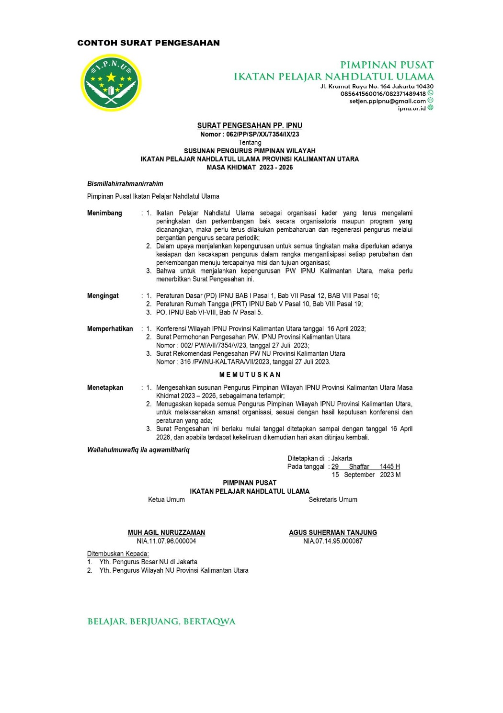
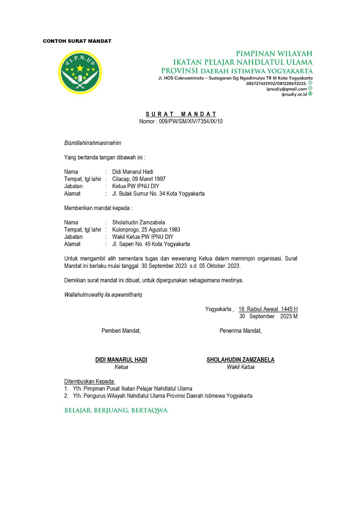

# KONBES & RAKERNAS IPNU 2023

this project is a repository to change a pdf file KONBES to markdown file for personal learning

Taman Candra Wilwatikta,
Pasuruan,Jawa Timur
11-13 Agustus 2023

## Table of Contents

- [KONBES & RAKERNAS IPNU 2023](#konbes--rakernas-ipnu-2023)
  - [Table of Contents](#table-of-contents)
  - [TATA TERTIB](#tata-tertib)
    - [BAB I - KETENTUAN UMUM](#bab-i---ketentuan-umum)
      - [Pasal 1](#pasal-1)
      - [Pasal 2](#pasal-2)
      - [Pasal 3](#pasal-3)
    - [BAB II - PESERTA](#bab-ii---peserta)
      - [Pasal 4](#pasal-4)
      - [Pasal 5](#pasal-5)
      - [Pasal 6](#pasal-6)
      - [Pasal 7](#pasal-7)
      - [Pasal 8](#pasal-8)
    - [BAB III - HAK DAN KEWAJIBAN](#bab-iii---hak-dan-kewajiban)
      - [Pasal 9](#pasal-9)
      - [Pasal 10](#pasal-10)
      - [Pasal 11](#pasal-11)
    - [BAB IV - ACARA](#bab-iv---acara)
      - [Pasal 12](#pasal-12)
    - [BAB V - PERSIDANGAN](#bab-v---persidangan)
      - [Pasal 13 - Sidang Pleno](#pasal-13---sidang-pleno)
      - [Pasal 14 - Sidang Komisi](#pasal-14---sidang-komisi)
      - [Pasal 15](#pasal-15)
    - [BAB VI - KUORUM](#bab-vi---kuorum)
      - [Pasal 16](#pasal-16)
    - [BAB VII - PRESIDIUM SIDANG](#bab-vii---presidium-sidang)
      - [Pasal 17](#pasal-17)
      - [Pasal 18](#pasal-18)
      - [Pasal 19](#pasal-19)
    - [BAB VIII - PENGAMBILAN KEPUTUSAN](#bab-viii---pengambilan-keputusan)
      - [Pasal 20](#pasal-20)
    - [BAB X - SANKSI](#bab-x---sanksi)
      - [Pasal 21](#pasal-21)
      - [Pasal 22](#pasal-22)
    - [BAB XI - PENUTUP](#bab-xi---penutup)
      - [Pasal 23](#pasal-23)
  - [SYARAT MENJADI PENGURUS](#syarat-menjadi-pengurus)
    - [BAB I - KETENTUAN UMUM](#bab-i---ketentuan-umum-1)
      - [Pasal 1 - SYARAT MENJADI PENGURUS](#pasal-1---syarat-menjadi-pengurus)
    - [BAB II - PENGURUS HARIAN IKATAN PELAJAR NAHDLATUL ULAMA](#bab-ii---pengurus-harian-ikatan-pelajar-nahdlatul-ulama)
      - [Pasal 2](#pasal-2-1)
      - [Pasal 3](#pasal-3-1)
    - [BAB III - SYARAT MENJADI PENGURUS HARIAN IPNU](#bab-iii---syarat-menjadi-pengurus-harian-ipnu)
      - [Pasal 4](#pasal-4-1)
      - [Pasal 5](#pasal-5-1)
      - [Pasal 6](#pasal-6-1)
      - [Pasal 7](#pasal-7-1)
      - [Pasal 8](#pasal-8-1)
      - [Pasal 9](#pasal-9-1)
      - [Pasal 10](#pasal-10-1)
    - [BAB IV - KETENTUAN PERALIHAN](#bab-iv---ketentuan-peralihan)
      - [Pasal 11](#pasal-11-1)
    - [BAB V - KETENTUAN PENUTUP](#bab-v---ketentuan-penutup)
      - [Pasal 12](#pasal-12-1)
  - [WEWENANG, TUGAS POKOK DAN FUNGSI PENGURUS](#wewenang-tugas-pokok-dan-fungsi-pengurus)
    - [Muqaddimah](#muqaddimah)
    - [BAB I - WEWENANG, TUGAS POKOK DAN FUNGSI PENGURUS](#bab-i---wewenang-tugas-pokok-dan-fungsi-pengurus)
      - [Pasal 1 - KETENTUAN UMUM](#pasal-1---ketentuan-umum)
    - [BAB II - TUGAS, HAK DAN KEWAJIBAN](#bab-ii---tugas-hak-dan-kewajiban)
      - [Pasal 2 - PIMPINAN PUSAT](#pasal-2---pimpinan-pusat)
      - [Pasal 3 - PIMPINAN WILAYAH](#pasal-3---pimpinan-wilayah)
      - [Pasal 4 - PIMPINAN CABANG](#pasal-4---pimpinan-cabang)
      - [Pasal 5 - PIMPINAN CABANG ISTIMEWA](#pasal-5---pimpinan-cabang-istimewa)
      - [Pasal 6 - PIMPINAN ANAK CABANG](#pasal-6---pimpinan-anak-cabang)
      - [Pasal 7 - PIMPINAN KOMISARIAT](#pasal-7---pimpinan-komisariat)
      - [Pasal 8 - PIMPINAN RANTING](#pasal-8---pimpinan-ranting)
    - [BAB III - TATA KERJA PENGURUS](#bab-iii---tata-kerja-pengurus)
      - [Pasal 9 - KETUA UMUM](#pasal-9---ketua-umum)
      - [Pasal 10 - WAKIL KETUA UMUM](#pasal-10---wakil-ketua-umum)
      - [Pasal 11 - KETUA BIDANG](#pasal-11---ketua-bidang)
      - [Pasal 12 - SEKRETARIS UMUM](#pasal-12---sekretaris-umum)
      - [Pasal 13 - WAKIL – WAKIL SEKRETARIS UMUM](#pasal-13---wakil--wakil-sekretaris-umum)
      - [Pasal 14 - BENDAHARA UMUM](#pasal-14---bendahara-umum)
      - [Pasal 15 - WAKIL–WAKIL BENDAHARA UMUM](#pasal-15---wakilwakil-bendahara-umum)
      - [Pasal 16 - TATA KERJA DEPARTEMEN, LEMBAGA DAN BADAN](#pasal-16---tata-kerja-departemen-lembaga-dan-badan)
      - [Pasal 17 - KOORDINATOR WILAYAH](#pasal-17---koordinator-wilayah)
    - [BAB IV - WEWENANG DAN TUGAS PIMPINAN DIBAWAHNYA](#bab-iv---wewenang-dan-tugas-pimpinan-dibawahnya)
      - [Pasal 18](#pasal-18-1)
    - [BAB V - TUGAS KERJA PENGURUS HARIAN](#bab-v---tugas-kerja-pengurus-harian)
      - [Pasal 19 - KETUA](#pasal-19---ketua)
      - [Pasal 20 - WAKIL-WAKIL KETUA](#pasal-20---wakil-wakil-ketua)
      - [Pasal 21 - SEKRETARIS](#pasal-21---sekretaris)
      - [Pasal 22 - WAKIL-WAKIL SEKRETARIS](#pasal-22---wakil-wakil-sekretaris)
      - [Pasal 23 - BENDAHARA](#pasal-23---bendahara)
      - [Pasal 24 - WAKIL-WAKIL BENDAHARA](#pasal-24---wakil-wakil-bendahara)
      - [Pasal 25 - DEPARTEMEN, LEMBAGA DAN BADAN](#pasal-25---departemen-lembaga-dan-badan)
      - [Pasal 26 - KOORDINATOR DAERAH](#pasal-26---koordinator-daerah)
    - [BAB VI - KETENTUAN PENUTUP](#bab-vi---ketentuan-penutup)
      - [Pasal 27 - PENUTUP](#pasal-27---penutup)
  - [MEKANISME ORGANISASI](#mekanisme-organisasi)
    - [Muqaddimah](#muqaddimah-1)
    - [BAB I - KETENTUAN UMUM](#bab-i---ketentuan-umum-2)
      - [Pasal 1 - PENGERTIAN](#pasal-1---pengertian)
    - [BAB II - MAKSUD DAN TUJUAN](#bab-ii---maksud-dan-tujuan)
      - [Pasal 2 - MAKSUD](#pasal-2---maksud)
      - [Pasal 3 - TUJUAN](#pasal-3---tujuan)
    - [BAB III - RUANG LINGKUP](#bab-iii---ruang-lingkup)
      - [Pasal 4 - CAKUPAN](#pasal-4---cakupan)
    - [BAB IV - PROSEDUR PEMBENTUKAN ORGANISASI](#bab-iv---prosedur-pembentukan-organisasi)
      - [Pasal 5 - PEMBENTUKAN PIMPINAN WILAYAH](#pasal-5---pembentukan-pimpinan-wilayah)
      - [Pasal 6 - PEMBENTUKAN PIMPINAN CABANG](#pasal-6---pembentukan-pimpinan-cabang)
      - [Pasal 7 - PEMBENTUKAN PIMPINAN CABANG ISTIMEWA](#pasal-7---pembentukan-pimpinan-cabang-istimewa)
      - [Pasal 8 - PEMBENTUKAN PIMPINAN ANAK CABANG](#pasal-8---pembentukan-pimpinan-anak-cabang)
      - [Pasal 9 - PEMBENTUKAN PIMPINAN KOMISARIAT](#pasal-9---pembentukan-pimpinan-komisariat)
      - [Pasal 10 - PEMBENTUKAN PIMPINAN RANTING](#pasal-10---pembentukan-pimpinan-ranting)
      - [Pasal 11 - TENTANG MASA KHIDMAT](#pasal-11---tentang-masa-khidmat)
    - [BAB V - RESTRUKTURISASI KEPENGURUSAN](#bab-v---restrukturisasi-kepengurusan)
      - [Pasal 12 - SEBAB KEKOSONGAN PENGURUS](#pasal-12---sebab-kekosongan-pengurus)
      - [Pasal 13 - DEMISIONERISASI RESMI](#pasal-13---demisionerisasi-resmi)
      - [Pasal 14 - DEMISIONERISASI OTOMATIS](#pasal-14---demisionerisasi-otomatis)
      - [Pasal 15 - PEMBEKUAN KEPENGURUSAN](#pasal-15---pembekuan-kepengurusan)
      - [Pasal 16 - _CARETAKER_](#pasal-16---caretaker)
      - [Pasal 17 - PEMBATALAN HASIL KONFERENSI/RAPAT ANGGOTA](#pasal-17---pembatalan-hasil-konferensirapat-anggota)
      - [Pasal 18 - PEMILIHAN ULANG](#pasal-18---pemilihan-ulang)
      - [Pasal 19 - MUTASI ANGGOTA](#pasal-19---mutasi-anggota)
    - [BAB VI - MEKANISME PENGISIAN KEKOSONGAN JABATAN](#bab-vi---mekanisme-pengisian-kekosongan-jabatan)
      - [Pasal 20 - KEKOSONGAN JABATAN KETUA UMUM/KETUA](#pasal-20---kekosongan-jabatan-ketua-umumketua)
      - [Pasal 21 - PEJABAT KETUA UMUM/KETUA](#pasal-21---pejabat-ketua-umumketua)
      - [Pasal 22 - PEJABAT SEMENTARA KETUA UMUM/KETUA](#pasal-22---pejabat-sementara-ketua-umumketua)
      - [Pasal 23 - KEKOSONGAN JABATAN PENGURUS NON-KETUA UMUM/KETUA](#pasal-23---kekosongan-jabatan-pengurus-non-ketua-umumketua)
      - [Pasal 24 - RANGKAP JABATAN](#pasal-24---rangkap-jabatan)
      - [Pasal 25 - RESHUFFLE](#pasal-25---reshuffle)
    - [BAB VII - PELANTIKAN DAN PEMBEKALAN PENGURUS](#bab-vii---pelantikan-dan-pembekalan-pengurus)
      - [Pasal 26 - PELANTIKAN PENGURUS](#pasal-26---pelantikan-pengurus)
      - [Pasal 27 - TATA CARA PELANTIKAN](#pasal-27---tata-cara-pelantikan)
      - [Pasal 28 - PENYELENGGARA DAN PESERTA PELANTIKAN](#pasal-28---penyelenggara-dan-peserta-pelantikan)
      - [Pasal 29 - PENYELENGGARAAN PELANTIKAN](#pasal-29---penyelenggaraan-pelantikan)
      - [Pasal 30 - MANUAL ACARA PELANTIKAN](#pasal-30---manual-acara-pelantikan)
      - [Pasal 31 - LAGU KEBANGSAAN DAN MARS IPNU](#pasal-31---lagu-kebangsaan-dan-mars-ipnu)
      - [Pasal 32 - ACARA INTI PELANTIKAN](#pasal-32---acara-inti-pelantikan)
      - [Pasal 33 - PROSESI SERAH TERIMA JABATAN, PIDATO SAMBUTAN DAN PEMBACAAN DOA](#pasal-33---prosesi-serah-terima-jabatan-pidato-sambutan-dan-pembacaan-doa)
      - [Pasal 34 - IKRAR PENGURUS](#pasal-34---ikrar-pengurus)
      - [Pasal 35 - PEMBEKALAN PENGURUS](#pasal-35---pembekalan-pengurus)
    - [BAB VIII - PERENCANAAN PROGRAM KERJA](#bab-viii---perencanaan-program-kerja)
      - [Pasal 36 - RENCANA PROGRAM](#pasal-36---rencana-program)
      - [Pasal 37 - STRATEGIC PLANNING](#pasal-37---strategic-planning)
      - [Pasal 38 - RAPAT KERJA](#pasal-38---rapat-kerja)
    - [BAB IX - PROSEDUR PELAKSANAAN KONFERENSI / RAPAT ANGGOTA](#bab-ix---prosedur-pelaksanaan-konferensi--rapat-anggota)
      - [Pasal 39 - UJI KELAYAKAN KONFERENSI ATAU RAPAT ANGGOTA](#pasal-39---uji-kelayakan-konferensi-atau-rapat-anggota)
      - [Pasal 40 - MEKANISME UJI KELAYAKAN KONFERENSI ATAU RAPAT ANGGOTA](#pasal-40---mekanisme-uji-kelayakan-konferensi-atau-rapat-anggota)
    - [BAB X - KETENTUAN PENUTUP](#bab-x---ketentuan-penutup)
      - [Pasal 38 - PENUTUP](#pasal-38---penutup)
  - [PERSIDANGAN DAN RAPAT](#persidangan-dan-rapat)
    - [Muqaddimah](#muqaddimah-2)
    - [BAB I - KETENTUAN UMUM](#bab-i---ketentuan-umum-3)
      - [Pasal 1 - PENGERTIAN](#pasal-1---pengertian-1)
    - [BAB II - MAKSUD DAN TUJUAN](#bab-ii---maksud-dan-tujuan-1)
      - [Pasal 2 - MAKSUD](#pasal-2---maksud-1)
      - [Pasal 3 - TUJUAN](#pasal-3---tujuan-1)
    - [BAB III - PERSIDANGAN](#bab-iii---persidangan)
      - [Pasal 4 - PERSIDANGAN PADA KONGRES, KONFERENSI DAN RAPAT ANGGOTA](#pasal-4---persidangan-pada-kongres-konferensi-dan-rapat-anggota)
      - [Pasal 5 - SIDANG PLENO](#pasal-5---sidang-pleno)
      - [Pasal 6 - SIDANG PLENO GABUNGAN](#pasal-6---sidang-pleno-gabungan)
      - [Pasal 7 - SIDANG KOMISI](#pasal-7---sidang-komisi)
    - [BAB IV - RAPAT-RAPAT](#bab-iv---rapat-rapat)
      - [Pasal 8 - JENIS-JENIS RAPAT](#pasal-8---jenis-jenis-rapat)
      - [Pasal 9 - RAPAT HARIAN](#pasal-9---rapat-harian)
      - [Pasal 10 - RAPAT PLENO](#pasal-10---rapat-pleno)
      - [Pasal 11 - RAPAT PLENO PARIPURNA](#pasal-11---rapat-pleno-paripurna)
      - [Pasal 12 - RAPAT PLENO GABUNGAN](#pasal-12---rapat-pleno-gabungan)
      - [Pasal 13 - RAPAT PIMPINAN](#pasal-13---rapat-pimpinan)
      - [Pasal 14 - RAPAT KOORDINASI BIDANG](#pasal-14---rapat-koordinasi-bidang)
      - [Pasal 15 - RAPAT PANITIA](#pasal-15---rapat-panitia)
      - [Pasal 16 - KEABSAHAN KEPUTUSAN RAPAT](#pasal-16---keabsahan-keputusan-rapat)
    - [BAB V - KETENTUAN PENUTUP](#bab-v---ketentuan-penutup-1)
      - [Pasal 17 - PENUTUP](#pasal-17---penutup)
  - [TATA ATURAN ORGANISASI](#tata-aturan-organisasi)
    - [BAB I - KETENTUAN UMUM](#bab-i---ketentuan-umum-4)
      - [Pasal 1 - PENGERTIAN](#pasal-1---pengertian-2)
    - [BAB II - MAKSUD DAN TUJUAN](#bab-ii---maksud-dan-tujuan-2)
      - [Pasal 2 - MAKSUD](#pasal-2---maksud-2)
      - [Pasal 3 - TUJUAN](#pasal-3---tujuan-2)
    - [BAB III - PERATURAN](#bab-iii---peraturan)
      - [Pasal 4 - PENGERTIAN DAN KEDUDUKAN HUKUM](#pasal-4---pengertian-dan-kedudukan-hukum)
      - [Pasal 5 - TATA URUTAN PERATURAN](#pasal-5---tata-urutan-peraturan)
      - [Pasal 6 - PERATURAN DASAR DAN PERATURAN RUMAH TANGGA](#pasal-6---peraturan-dasar-dan-peraturan-rumah-tangga)
      - [Pasal 7 - PERATURAN ORGANISASI](#pasal-7---peraturan-organisasi)
      - [Pasal 8 - PERATURAN PIMPINAN PUSAT](#pasal-8---peraturan-pimpinan-pusat)
      - [Pasal 9 - PERATURAN PIMPINAN WILAYAH](#pasal-9---peraturan-pimpinan-wilayah)
      - [Pasal 10 - PERATURAN PIMPINAN CABANG](#pasal-10---peraturan-pimpinan-cabang)
      - [Pasal 11 - PERATURAN PIMPINAN CABANG ISTIMEWA](#pasal-11---peraturan-pimpinan-cabang-istimewa)
      - [Pasal 12 - PERATURAN PIMPINAN ANAK CABANG](#pasal-12---peraturan-pimpinan-anak-cabang)
      - [Pasal 13 - PERATURAN PIMPINAN RANTING](#pasal-13---peraturan-pimpinan-ranting)
      - [Pasal 14 - PERATURAN PIMPINAN KOMISARIAT](#pasal-14---peraturan-pimpinan-komisariat)
    - [BAB IV - KEPUTUSAN](#bab-iv---keputusan)
      - [Pasal 15 - KEDUDUKAN HUKUM DAN FUNGSI](#pasal-15---kedudukan-hukum-dan-fungsi)
      - [Pasal 16 - JENIS-JENIS KEPUTUSAN](#pasal-16---jenis-jenis-keputusan)
      - [Pasal 17 - KEPUTUSAN KONGRES](#pasal-17---keputusan-kongres)
      - [Pasal 18 - KEPUTUSAN KONFERENSI BESAR](#pasal-18---keputusan-konferensi-besar)
      - [Pasal 19 - KEPUTUSAN PIMPINAN PUSAT](#pasal-19---keputusan-pimpinan-pusat)
      - [Pasal 20 - KEPUTUSAN KONFERWIL](#pasal-20---keputusan-konferwil)
      - [Pasal 21 - KEPUTUSAN RAKERWIL](#pasal-21---keputusan-rakerwil)
      - [Pasal 22 - KEPUTUSAN PIMPINAN WILAYAH](#pasal-22---keputusan-pimpinan-wilayah)
      - [Pasal 23 - KEPUTUSAN KONFERCAB](#pasal-23---keputusan-konfercab)
      - [Pasal 24 - KEPUTUSAN RAKERCAB](#pasal-24---keputusan-rakercab)
      - [Pasal 25 - KEPUTUSAN PIMPINAN CABANG](#pasal-25---keputusan-pimpinan-cabang)
      - [Pasal 26 - KEPUTUSAN KONFERCAB ISTIMEWA](#pasal-26---keputusan-konfercab-istimewa)
      - [Pasal 27 - KEPUTUSAN RAKERCAB ISTIMEWA](#pasal-27---keputusan-rakercab-istimewa)
      - [Pasal 28 - KEPUTUSAN PIMPINAN CABANG ISTIMEWA](#pasal-28---keputusan-pimpinan-cabang-istimewa)
      - [Pasal 29 - KEPUTUSAN KONFERANCAB](#pasal-29---keputusan-konferancab)
      - [Pasal 30 - KEPUTUSAN RAKERANCAB](#pasal-30---keputusan-rakerancab)
      - [Pasal 31 - KEPUTUSAN PIMPINAN ANAK CABANG](#pasal-31---keputusan-pimpinan-anak-cabang)
      - [Pasal 32 - KEPUTUSAN RAPAT ANGGOTA](#pasal-32---keputusan-rapat-anggota)
      - [Pasal 33 - KEPUTUSAN RAPAT KERJA ANGGOTA](#pasal-33---keputusan-rapat-kerja-anggota)
      - [Pasal 34 - KEPUTUSAN PIMPINAN RANTING](#pasal-34---keputusan-pimpinan-ranting)
      - [Pasal 35 - KEPUTUSAN PIMPINAN KOMISARIAT](#pasal-35---keputusan-pimpinan-komisariat)
    - [BAB V - INSTRUKSI](#bab-v---instruksi)
      - [Pasal 36 - INSTRUKSI](#pasal-36---instruksi)
      - [Pasal 37 - INSTRUKSI PIMPINAN PUSAT](#pasal-37---instruksi-pimpinan-pusat)
      - [Pasal 38 - INSTRUKSI PIMPINAN WILAYAH](#pasal-38---instruksi-pimpinan-wilayah)
      - [Pasal 39 - INSTRUKSI PIMPINAN CABANG](#pasal-39---instruksi-pimpinan-cabang)
      - [Pasal 40 - INSTRUKSI PIMPINAN ANAK CABANG](#pasal-40---instruksi-pimpinan-anak-cabang)
    - [BAB VI - SIARAN](#bab-vi---siaran)
      - [Pasal 41 - ISI DAN MACAM SIARAN](#pasal-41---isi-dan-macam-siaran)
      - [Pasal 42 - SIARAN PIMPINAN PUSAT](#pasal-42---siaran-pimpinan-pusat)
      - [Pasal 43 - SIARAN PIMPINAN WILAYAH](#pasal-43---siaran-pimpinan-wilayah)
      - [Pasal 44 - SIARAN PIMPINAN CABANG](#pasal-44---siaran-pimpinan-cabang)
      - [Pasal 45 - SIARAN PIMPINAN CABANG ISTIMEWA](#pasal-45---siaran-pimpinan-cabang-istimewa)
      - [Pasal 46 - SIARAN PIMPINAN ANAK CABANG](#pasal-46---siaran-pimpinan-anak-cabang)
      - [Pasal 47 - SIARAN PIMPINAN RANTING](#pasal-47---siaran-pimpinan-ranting)
      - [Pasal 48 - SIARAN PIMPINAN KOMISARIAT](#pasal-48---siaran-pimpinan-komisariat)
    - [BAB VII - KETENTUAN PENUTUP](#bab-vii---ketentuan-penutup)
      - [Pasal 49 - PENUTUP](#pasal-49---penutup)
  - [IDENTITAS ORGANISASI](#identitas-organisasi)
    - [Muqoddimah](#muqoddimah)
    - [BAB I - KETENTUAN UMUM](#bab-i---ketentuan-umum-5)
      - [Pasal 1 - Pengertian](#pasal-1---pengertian-3)
    - [BAB II - MAKSUD DAN TUJUAN](#bab-ii---maksud-dan-tujuan-3)
      - [Pasal 2 - Maksud](#pasal-2---maksud-3)
      - [Pasal 3 - Tujuan](#pasal-3---tujuan-3)
    - [BAB III - PERLENGKAPAN ORGANISASI](#bab-iii---perlengkapan-organisasi)
      - [Pasal 4 - Lambang Organisasi](#pasal-4---lambang-organisasi)
      - [Pasal 5 - Bendera](#pasal-5---bendera)
      - [Pasal 6 - Pataka](#pasal-6---pataka)
      - [Pasal 7 - Papan Nama](#pasal-7---papan-nama)
      - [Pasal 8 - Panji](#pasal-8---panji)
    - [BAB IV - SEBUTAN RESMI](#bab-iv---sebutan-resmi)
      - [Pasal 9 - Panggilan Resmi](#pasal-9---panggilan-resmi)
    - [BAB V - LAGU ALMAMATER](#bab-v---lagu-almamater)
      - [Pasal 10 - Mars](#pasal-10---mars)
      - [Pasal 11 - Lagu Syubbanul Wathon](#pasal-11---lagu-syubbanul-wathon)
    - [BAB VI - PAKAIAN-PAKAIAN RESMI](#bab-vi---pakaian-pakaian-resmi)
      - [Pasal 12 - Pakaian Resepsi](#pasal-12---pakaian-resepsi)
      - [Pasal 13 - Pakaian Dinas Harian (PDH)](#pasal-13---pakaian-dinas-harian-pdh)
      - [Pasal 14 - Batik](#pasal-14---batik)
      - [Pasal 15 - Mutz](#pasal-15---mutz)
      - [Pasal 16 - Lencana](#pasal-16---lencana)
      - [Pasal 17 - Senat Band](#pasal-17---senat-band)
      - [Pasal 18 - Pakaian Resmi Pelajar](#pasal-18---pakaian-resmi-pelajar)
      - [Pasal 19 - TISKA](#pasal-19---tiska)
    - [BAB VII - KARTU TANDA ANGGOTA](#bab-vii---kartu-tanda-anggota)
      - [Pasal 19 - Kartu Tanda Anggota](#pasal-19---kartu-tanda-anggota)
      - [Pasal 20 - Database Organisasi](#pasal-20---database-organisasi)
    - [BAB VIII - KETENTUAN PENUTUP](#bab-viii---ketentuan-penutup)
      - [Pasal 21 - Penutup](#pasal-21---penutup)
  - [AKREDITASI ORGANISASI](#akreditasi-organisasi)
    - [muqoddimah](#muqoddimah-1)
    - [BAB I - KETENTUAN UMUM](#bab-i---ketentuan-umum-6)
      - [Pasal 1 - Pengertian](#pasal-1---pengertian-4)
    - [BAB II - TUJUAN DAN FUNGSI](#bab-ii---tujuan-dan-fungsi)
      - [Pasal 2](#pasal-2-2)
      - [Pasal 3](#pasal-3-2)
    - [BAB III - PRINSIP-PRINSIP AKREDITASI ORGANISASI](#bab-iii---prinsip-prinsip-akreditasi-organisasi)
      - [Pasal 4](#pasal-4-2)
    - [BAB IV - KARAKTERISTIK AKREDITASI ORGANISASI](#bab-iv---karakteristik-akreditasi-organisasi)
      - [Pasal 5](#pasal-5-2)
    - [BAB V - CAKUPAN AKREDITASI ORGANISASI](#bab-v---cakupan-akreditasi-organisasi)
      - [Pasal 6](#pasal-6-2)
    - [BAB VI - KOMPONEN PENILAIAN AKREDITASI](#bab-vi---komponen-penilaian-akreditasi)
      - [Pasal 7](#pasal-7-2)
    - [BAB VII - KEWAJIBAN DAN TANGGUNG JAWAB PENGURUS](#bab-vii---kewajiban-dan-tanggung-jawab-pengurus)
      - [Pasal 8](#pasal-8-2)
      - [Pasal 9](#pasal-9-2)
      - [Pasal 10](#pasal-10-2)
      - [Pasal 11](#pasal-11-2)
      - [Pasal 12](#pasal-12-2)
      - [Pasal 13](#pasal-13)
    - [BAB VIII - BORANG AKREDITASI](#bab-viii---borang-akreditasi)
      - [Pasal 15](#pasal-15-1)
    - [BAB IX - HAK PENGURUS](#bab-ix---hak-pengurus)
      - [Pasal 16](#pasal-16-1)
    - [BAB X - ORGANISASI PELAKSANA](#bab-x---organisasi-pelaksana)
      - [Pasal 17](#pasal-17-1)
      - [Pasal 18](#pasal-18-2)
      - [Pasal 19](#pasal-19-1)
      - [Pasal 20](#pasal-20-1)
      - [Pasal 21](#pasal-21-1)
      - [Pasal 22](#pasal-22-1)
      - [Pasal 23](#pasal-23-1)
      - [Pasal 24](#pasal-24)
      - [Pasal 25](#pasal-25)
      - [Pasal 26](#pasal-26)
      - [Pasal 27](#pasal-27)
    - [BAB XI - HASIL AKREDITASI](#bab-xi---hasil-akreditasi)
      - [Pasal 28](#pasal-28)
      - [Pasal 29](#pasal-29)
    - [BAB XII - TATA CARA AKREDITASI](#bab-xii---tata-cara-akreditasi)
      - [Pasal 30](#pasal-30)
    - [Bagian Kesatu - Akreditasi Pimpinan Wilayah dan Pimpinan Cabang Istimewa](#bagian-kesatu---akreditasi-pimpinan-wilayah-dan-pimpinan-cabang-istimewa)
      - [Pasal 31](#pasal-31)
      - [Pasal 32](#pasal-32)
    - [Bagian Kedua - Akreditasi Pimpinan Cabang](#bagian-kedua---akreditasi-pimpinan-cabang)
      - [Pasal 33](#pasal-33)
      - [Pasal 34](#pasal-34)
      - [Pasal 35](#pasal-35)
    - [Bagian Ketiga - Akreditasi Pimpinan Anak Cabang](#bagian-ketiga---akreditasi-pimpinan-anak-cabang)
      - [Pasal 36](#pasal-36)
      - [Pasal 37](#pasal-37)
    - [Bagian Keempat - Akreditasi Pimpinan Ranting dan Pimpinan Komisariat](#bagian-keempat---akreditasi-pimpinan-ranting-dan-pimpinan-komisariat)
      - [Pasal 38](#pasal-38)
      - [Pasal 39](#pasal-39)
      - [Pasal 40](#pasal-40)
    - [BAB XIII - KETENTUAN PENUTUP](#bab-xiii---ketentuan-penutup)
      - [Pasal 41](#pasal-41)
  - [KLASTERISASI ORGANISASI](#klasterisasi-organisasi)
    - [Muqaddimah](#muqaddimah-3)
    - [BAB I - KETENTUAN UMUM](#bab-i---ketentuan-umum-7)
      - [Pasal 1 - Pengertian](#pasal-1---pengertian-5)
    - [BAB II - TUJUAN DAN FUNGSI](#bab-ii---tujuan-dan-fungsi-1)
      - [Pasal 2](#pasal-2-3)
      - [Pasal 3](#pasal-3-3)
    - [BAB III - CAKUPAN PEMBAGIAN KLUSTER ORGANISASI](#bab-iii---cakupan-pembagian-kluster-organisasi)
      - [Pasal 4](#pasal-4-3)
    - [BAB IV - KOMPONEN PEMBAGIAN KLUSTER](#bab-iv---komponen-pembagian-kluster)
      - [Pasal 5](#pasal-5-3)
    - [Bagian Kesatu - Parameter Penetapan Kluster Pimpinan Wilayah](#bagian-kesatu---parameter-penetapan-kluster-pimpinan-wilayah)
      - [Pasal 6](#pasal-6-3)
      - [Pasal 7](#pasal-7-3)
    - [Bagian Kedua - Parameter Penetapan Kluster Pimpinan Cabang Istimewa](#bagian-kedua---parameter-penetapan-kluster-pimpinan-cabang-istimewa)
      - [Pasal 8](#pasal-8-3)
      - [Pasal 9](#pasal-9-3)
    - [Bagian Ketiga - Parameter Penetapan Kluster Pimpinan Cabang](#bagian-ketiga---parameter-penetapan-kluster-pimpinan-cabang)
      - [Pasal 10](#pasal-10-3)
      - [Pasal 11](#pasal-11-3)
    - [Bagian Keempat - Parameter Penetapan Kluster Pimpinan Anak Cabang](#bagian-keempat---parameter-penetapan-kluster-pimpinan-anak-cabang)
      - [Pasal 12](#pasal-12-3)
      - [Pasal 13](#pasal-13-1)
    - [Bagian Kelima - Parameter Penetapan Kluster Pimpinan Komisariat di Perguruan Tinggi](#bagian-kelima---parameter-penetapan-kluster-pimpinan-komisariat-di-perguruan-tinggi)
      - [Pasal 14](#pasal-14)
      - [Pasal 15](#pasal-15-2)
    - [Bagian Keenam - Parameter Penetapan Kluster Pimpinan Ranting](#bagian-keenam---parameter-penetapan-kluster-pimpinan-ranting)
      - [Pasal 17](#pasal-17-2)
      - [Pasal 18](#pasal-18-3)
    - [Bagian Ketujuh - Parameter Penetapan Kluster Pimpinan Komisariat](#bagian-ketujuh---parameter-penetapan-kluster-pimpinan-komisariat)
      - [Pasal 19](#pasal-19-2)
      - [Pasal 20](#pasal-20-2)
    - [BAB V - TATA CARA PENETAPAN KLUSTER](#bab-v---tata-cara-penetapan-kluster)
      - [Pasal 21](#pasal-21-2)
    - [Bagian Kesatu - Penetapan Kluster Pimpinan Wilayah](#bagian-kesatu---penetapan-kluster-pimpinan-wilayah)
      - [Pasal 22](#pasal-22-2)
    - [Bagian Kedua - Penetapan Kluster Pimpinan Cabang Istimewa](#bagian-kedua---penetapan-kluster-pimpinan-cabang-istimewa)
      - [Pasal 23](#pasal-23-2)
    - [Bagian Ketiga - Penetapan Kluster Pimpinan Cabang](#bagian-ketiga---penetapan-kluster-pimpinan-cabang)
      - [Pasal 24](#pasal-24-1)
    - [Bagian Keempat - Penetapan Kluster Pimpinan Anak Cabang](#bagian-keempat---penetapan-kluster-pimpinan-anak-cabang)
      - [Pasal 25](#pasal-25-1)
    - [Bagian Kelima - Penetapan Kluster Pimpinan Komisariat di Perguruan Tinggi](#bagian-kelima---penetapan-kluster-pimpinan-komisariat-di-perguruan-tinggi)
      - [Pasal 26](#pasal-26-1)
    - [Bagian Keenam - Penetapan Kluster Pimpinan Ranting](#bagian-keenam---penetapan-kluster-pimpinan-ranting)
      - [Pasal 27](#pasal-27-1)
    - [Bagian Ketujuh - Penetapan Kluster Pimpinan Komisariat](#bagian-ketujuh---penetapan-kluster-pimpinan-komisariat)
      - [Pasal 28](#pasal-28-1)
    - [BAB VI - KETENTUAN PENUTUP](#bab-vi---ketentuan-penutup-1)
      - [Pasal 29](#pasal-29-1)
  - [DATABASE ORGANISASI](#database-organisasi)
    - [Muqaddimah](#muqaddimah-4)
    - [BAB I - KETENTUAN UMUM](#bab-i---ketentuan-umum-8)
      - [Pasal 1 - Pengertian](#pasal-1---pengertian-6)
    - [BAB II - MAKSUD DAN TUJUAN](#bab-ii---maksud-dan-tujuan-4)
      - [Pasal 2 - Maksud](#pasal-2---maksud-4)
      - [Pasal 3 - Tujuan](#pasal-3---tujuan-4)
      - [Pasal 4 - Prinsip-Prinsip Database Organisasi IPNU](#pasal-4---prinsip-prinsip-database-organisasi-ipnu)
    - [BAB III - RUANG LINGKUP](#bab-iii---ruang-lingkup-1)
      - [Pasal 5 - Cakupan](#pasal-5---cakupan)
    - [BAB IV - KELEMBAGAAN](#bab-iv---kelembagaan)
      - [Pasal 6 - Tim Kerja Database](#pasal-6---tim-kerja-database)
      - [Pasal 7 - Tim Database Nasional](#pasal-7---tim-database-nasional)
      - [Pasal 8 - Tim Database Wilayah](#pasal-8---tim-database-wilayah)
      - [Pasal 9 - Tim Database Cabang Istimewa](#pasal-9---tim-database-cabang-istimewa)
      - [Pasal 10 - Tim Database Cabang](#pasal-10---tim-database-cabang)
      - [Pasal 11 - Tim Database Anak Cabang](#pasal-11---tim-database-anak-cabang)
      - [Pasal 12 - Tim Database Komisariat di Perguruan Tinggi](#pasal-12---tim-database-komisariat-di-perguruan-tinggi)
      - [Pasal 13 - Tim Database Komisariat](#pasal-13---tim-database-komisariat)
      - [Pasal 14 - Tim Database Ranting](#pasal-14---tim-database-ranting)
    - [BAB V - JENIS-JENIS DATA](#bab-v---jenis-jenis-data)
      - [Pasal 15 - Data Pengurus](#pasal-15---data-pengurus)
      - [Pasal 16 - Data Potensi Organisasi](#pasal-16---data-potensi-organisasi)
      - [Pasal 17 - Data Statistik Organisasi](#pasal-17---data-statistik-organisasi)
      - [Pasal 18 - Data Anggota](#pasal-18---data-anggota)
      - [Pasal 19 - Data Potensi Kader](#pasal-19---data-potensi-kader)
    - [BAB VI - ALUR PENYUSUNAN](#bab-vi---alur-penyusunan)
      - [Pasal 20 - Alur Distribusi Admin Tim Database](#pasal-20---alur-distribusi-admin-tim-database)
      - [Pasal 21 - Alur Pengumpulan Data](#pasal-21---alur-pengumpulan-data)
    - [BAB VII - PENGELOLAAN, AKSES DAN PENDAYAGUNAAN](#bab-vii---pengelolaan-akses-dan-pendayagunaan)
      - [Pasal 22 - Pengelolaan Umum](#pasal-22---pengelolaan-umum)
      - [Pasal 23 - Pengelolaan Database Nasional](#pasal-23---pengelolaan-database-nasional)
      - [Pasal 24 - Akses](#pasal-24---akses)
      - [Pasal 25 - Pendayagunaan](#pasal-25---pendayagunaan)
    - [BAB XIII - KETENTUAN PENUTUP](#bab-xiii---ketentuan-penutup-1)
      - [Pasal 26 - Penutup](#pasal-26---penutup)
  - [PENGADAAN KTA IPNU](#pengadaan-kta-ipnu)
    - [Muqaddimah](#muqaddimah-5)
    - [BAB I - KETENTUAN UMUM](#bab-i---ketentuan-umum-9)
      - [Pasal 1 - Pengertian](#pasal-1---pengertian-7)
    - [BAB II - KETENTUAN PENGADAAN](#bab-ii---ketentuan-pengadaan)
      - [Pasal 2 - Pengadaan](#pasal-2---pengadaan)
    - [BAB III - KEPEMILIKAN DAN MASA BERLAKU](#bab-iii---kepemilikan-dan-masa-berlaku)
      - [Pasal 3 - Persyaratan Kepemilikan](#pasal-3---persyaratan-kepemilikan)
      - [Pasal 4 - Masa Berlaku](#pasal-4---masa-berlaku)
    - [BAB IV - FORMAT DAN KOMPONEN ISI](#bab-iv---format-dan-komponen-isi)
      - [Pasal 5 - Bentuk dan Bahan](#pasal-5---bentuk-dan-bahan)
      - [Pasal 6 - Komponen Isi](#pasal-6---komponen-isi)
    - [BAB V - PENOMORAN](#bab-v---penomoran)
      - [Pasal 7 - Nomor Induk Angota](#pasal-7---nomor-induk-angota)
      - [Pasal 8 - Kode Wilayah dan Kode Cabang](#pasal-8---kode-wilayah-dan-kode-cabang)
    - [BAB VI - MEKANISME PENGADAAN](#bab-vi---mekanisme-pengadaan)
      - [Pasal 9 - Pendataan Anggota](#pasal-9---pendataan-anggota)
      - [Pasal 10 - Pengumpulan dan Pengelolaan Data Anggota](#pasal-10---pengumpulan-dan-pengelolaan-data-anggota)
      - [Pasal 11 - Pengusulan Pengadaan KTA](#pasal-11---pengusulan-pengadaan-kta)
      - [Pasal 12 - Form Isian Data Anggota](#pasal-12---form-isian-data-anggota)
    - [BAB VII - KETENTUAN PERALIHAN](#bab-vii---ketentuan-peralihan)
      - [Pasal 13 - Ketentuan Peralihan](#pasal-13---ketentuan-peralihan)
    - [BAB VIII - KETENTUAN PENUTUP](#bab-viii---ketentuan-penutup-1)
      - [Pasal 14 - Penutup](#pasal-14---penutup)
  - [PERATURAN ADMINISTRASI](#peraturan-administrasi)
    - [Muqaddimah](#muqaddimah-6)
    - [BAB I - KETENTUAN UMUM](#bab-i---ketentuan-umum-10)
      - [Pasal 1 - PENGERTIAN](#pasal-1---pengertian-8)
    - [BAB II - KATEGORI DAN JENIS SURAT](#bab-ii---kategori-dan-jenis-surat)
      - [Pasal 2](#pasal-2-4)
      - [Pasal 3](#pasal-3-4)
      - [Pasal 4](#pasal-4-4)
      - [Pasal 5 - Surat Keputusan Bersama](#pasal-5---surat-keputusan-bersama)
      - [Pasal 6](#pasal-6-4)
    - [BAB III - PERSURATAN](#bab-iii---persuratan)
      - [Pasal 7 - Format Surat](#pasal-7---format-surat)
      - [Pasal 8 - Kop Surat](#pasal-8---kop-surat)
      - [Pasal 9 - Untuk Lembaga dan Badan Khusus:](#pasal-9---untuk-lembaga-dan-badan-khusus)
      - [Pasal 10 - Sampul Surat](#pasal-10---sampul-surat)
      - [Pasal 11](#pasal-11-4)
    - [BAB IV - FORMAT SURAT](#bab-iv---format-surat)
      - [Pasal 12 - Nomor, Lampiran dan Perihal](#pasal-12---nomor-lampiran-dan-perihal)
    - [BAB V - PENYUSUNAN PERATURAN, INSTRUKSI, DAN SIARAN](#bab-v---penyusunan-peraturan-instruksi-dan-siaran)
      - [Pasal 13 - Komponen Peraturan](#pasal-13---komponen-peraturan)
      - [Pasal 14 - Penomoran Peraturan](#pasal-14---penomoran-peraturan)
      - [Pasal 15 - Komponen Siaran](#pasal-15---komponen-siaran)
      - [Pasal 16 - Penomoran Siaran](#pasal-16---penomoran-siaran)
      - [Pasal 17](#pasal-17-3)
      - [Pasal 18](#pasal-18-4)
      - [Pasal 19 - Tujuan Surat](#pasal-19---tujuan-surat)
      - [Pasal 20 - Isi Surat](#pasal-20---isi-surat)
      - [Pasal 21 - Pembuka dan Penutup Surat](#pasal-21---pembuka-dan-penutup-surat)
      - [Pasal 22 - Tanggal Surat](#pasal-22---tanggal-surat)
      - [Pasal 23 - Pengirim dan Tanda Tangan](#pasal-23---pengirim-dan-tanda-tangan)
      - [Pasal 24 - Tembusan](#pasal-24---tembusan)
      - [Pasal 25 - Arsip](#pasal-25---arsip)
      - [Pasal 26 - Model Penulisan Surat](#pasal-26---model-penulisan-surat)
    - [BAB V - LAPORAN](#bab-v---laporan)
      - [Pasal 27 - Jenis Laporan](#pasal-27---jenis-laporan)
      - [Pasal 28 - Laporan Pertanggungjawaban](#pasal-28---laporan-pertanggungjawaban)
      - [Pasal 29 - Laporan Perjalanan](#pasal-29---laporan-perjalanan)
      - [Pasal 30 - Laporan Kegiatan](#pasal-30---laporan-kegiatan)
      - [Pasal 31 - Laporan Berkala](#pasal-31---laporan-berkala)
      - [Pasal 32 - Laporan Program Kerja](#pasal-32---laporan-program-kerja)
      - [Pasal 33 - Laporan Pelaksanaan Program](#pasal-33---laporan-pelaksanaan-program)
      - [Pasal 34 - Berita Acara](#pasal-34---berita-acara)
    - [BAB VI - KELENGKAPAN ADMINISTRASI](#bab-vi---kelengkapan-administrasi)
      - [Pasal 35](#pasal-35-1)
      - [Pasal 36 - Pengarsipan](#pasal-36---pengarsipan)
      - [Pasal 37 - Disposisi, Reproduksi, dan Godeponserd](#pasal-37---disposisi-reproduksi-dan-godeponserd)
      - [Pasal 38 - Stempel](#pasal-38---stempel)
    - [BAB VII - PERLENGKAPAN SEKRETARIAT](#bab-vii---perlengkapan-sekretariat)
      - [Pasal 39 - Bagan Struktur Organisasi](#pasal-39---bagan-struktur-organisasi)
      - [Pasal 40 - Papan Agenda Kegiatan](#pasal-40---papan-agenda-kegiatan)
      - [Pasal 41 - Papan Pengumuman](#pasal-41---papan-pengumuman)
      - [Pasal 42 - Tabel Program Kerja Tahunan](#pasal-42---tabel-program-kerja-tahunan)
      - [Pasal 43 - Peta Wilayah Kerja](#pasal-43---peta-wilayah-kerja)
      - [Pasal 44 - Pemasangan Simbol Negara dan Identitas Organisasi](#pasal-44---pemasangan-simbol-negara-dan-identitas-organisasi)
    - [BAB VIII - KETENTUAN PENUTUP](#bab-viii---ketentuan-penutup-2)
    - [Lampiran 1 : Kop Surat](#lampiran-1--kop-surat)
    - [Lampiran 2 : Nomor Surat, Stempel](#lampiran-2--nomor-surat-stempel)
    - [Lampiran 3 : Contoh – Contoh Surat](#lampiran-3--contoh--contoh-surat)
    - [Lampiran 4 : KTA IPNU](#lampiran-4--kta-ipnu)
  - [MEKANISME PENGESAHAN KEPENGURUSAN](#mekanisme-pengesahan-kepengurusan)
    - [Muqaddimah](#muqaddimah-7)
    - [BAB I - KETENTUAN UMUM](#bab-i---ketentuan-umum-11)
      - [Pasal 1 - Pengertian](#pasal-1---pengertian-9)
    - [BAB II - MAKSUD DAN TUJUAN](#bab-ii---maksud-dan-tujuan-5)
      - [Pasal 2 - Maksud](#pasal-2---maksud-5)
      - [Pasal 3 - Tujuan](#pasal-3---tujuan-5)
    - [BAB III - KEWENANGAN PENERBITAN](#bab-iii---kewenangan-penerbitan)
      - [Pasal 4 - Tingkat Kepengurusan Penerbit Surat Pengesahan](#pasal-4---tingkat-kepengurusan-penerbit-surat-pengesahan)
    - [BAB IV - PENGESAHAN UNTUK PIMPINAN PUSAT](#bab-iv---pengesahan-untuk-pimpinan-pusat)
      - [Pasal 5 - Permohonan Pengesahan](#pasal-5---permohonan-pengesahan)
      - [Pasal 6 - Pengesahan](#pasal-6---pengesahan)
    - [BAB V - PENGESAHAN UNTUK PIMPINAN WILAYAH](#bab-v---pengesahan-untuk-pimpinan-wilayah)
      - [Pasal 7 - Permohonan Pengesahan](#pasal-7---permohonan-pengesahan)
      - [Pasal 8 - Pengesahan](#pasal-8---pengesahan)
    - [BAB VI - PENGESAHAN UNTUK PIMPINAN CABANG](#bab-vi---pengesahan-untuk-pimpinan-cabang)
      - [Pasal 9 - Permohonan Pengesahan](#pasal-9---permohonan-pengesahan)
      - [Pasal 10 - Rekomendasi Pengesahan](#pasal-10---rekomendasi-pengesahan)
      - [Pasal 11 - Pengesahan](#pasal-11---pengesahan)
    - [BAB VII - PENGESAHAN UNTUK PIMPINAN CABANG ISTIMEWA](#bab-vii---pengesahan-untuk-pimpinan-cabang-istimewa)
      - [Pasal 12 - Permohonan Pengesahan](#pasal-12---permohonan-pengesahan)
      - [Pasal 13 - Pengesahan](#pasal-13---pengesahan)
    - [BAB VIII - PENGESAHAN UNTUK PIMPINAN ANAK CABANG](#bab-viii---pengesahan-untuk-pimpinan-anak-cabang)
      - [Pasal 14 - Permohonan Pengesahan](#pasal-14---permohonan-pengesahan)
      - [Pasal 15 - Pengesahan](#pasal-15---pengesahan)
    - [BAB IX - PENGESAHAN UNTUK PIMPINAN RANTING](#bab-ix---pengesahan-untuk-pimpinan-ranting)
      - [Pasal 16 - Permohonan Pengesahan](#pasal-16---permohonan-pengesahan)
      - [Pasal 17 - Rekomendasi Pengesahan](#pasal-17---rekomendasi-pengesahan)
      - [Pasal 18 - Pengesahan](#pasal-18---pengesahan)
    - [BAB X - PENGESAHAN UNTUK PIMPINAN KOMISARIAT](#bab-x---pengesahan-untuk-pimpinan-komisariat)
      - [Pasal 19 - Permohonan Pengesahan](#pasal-19---permohonan-pengesahan)
      - [Pasal 20 - Rekomendasi Pengesahan](#pasal-20---rekomendasi-pengesahan)
      - [Pasal 21 - Pengesahan](#pasal-21---pengesahan)
    - [BAB XI - PENGESAHAN PEJABAT KETUA DAN HASIL RESHUFFLE](#bab-xi---pengesahan-pejabat-ketua-dan-hasil-reshuffle)
      - [Pasal 22 - Pengesahan Pejabat Ketua](#pasal-22---pengesahan-pejabat-ketua)
      - [Pasal 23 - Pengesahan Hasil Reshuffle](#pasal-23---pengesahan-hasil-reshuffle)
    - [BAB XII - ATURAN PERALIHAN](#bab-xii---aturan-peralihan)
      - [Pasal 24 - Aturan Peralihan](#pasal-24---aturan-peralihan)
    - [BAB XIII - KETENTUAN PENUTUP](#bab-xiii---ketentuan-penutup-2)
      - [Pasal 25 - Penutup](#pasal-25---penutup)
  - [SISTEM KADERISASI](#sistem-kaderisasi)
    - [BAB I - KETENTUAN UMUM](#bab-i---ketentuan-umum-12)
      - [Pasal 1](#pasal-1-1)
    - [BAB II - MAKSUD DAN TUJUAN](#bab-ii---maksud-dan-tujuan-6)
      - [Pasal 2](#pasal-2-5)
      - [Pasal 3](#pasal-3-5)
    - [BAB III - RUANG LINGKUP](#bab-iii---ruang-lingkup-2)
      - [Pasal 4](#pasal-4-5)
      - [Pasal 5](#pasal-5-4)
      - [Pasal 6](#pasal-6-5)
    - [BAB IV - FALSAFAH DAN PARADIGMA KADERISASI](#bab-iv---falsafah-dan-paradigma-kaderisasi)
      - [Pasal 7](#pasal-7-4)
      - [Pasal 8](#pasal-8-4)
    - [BAB V - JENJANG](#bab-v---jenjang)
      - [Pasal 9](#pasal-9-4)
      - [Pasal 10](#pasal-10-4)
      - [Pasal 11](#pasal-11-5)
    - [BAB VI - PENYELENGARAAN](#bab-vi---penyelengaraan)
      - [Pasal 12](#pasal-12-4)
      - [Pasal 13](#pasal-13-2)
    - [BAB VII - PESERTA](#bab-vii---peserta)
      - [Pasal 14](#pasal-14-1)
    - [BAB VIII - INSTRUKTUR](#bab-viii---instruktur)
      - [Pasal 15](#pasal-15-3)
      - [Pasal 16](#pasal-16-2)
      - [Pasal 17](#pasal-17-4)
      - [Pasal 18](#pasal-18-5)
      - [Pasal 19](#pasal-19-3)
      - [Pasal 20](#pasal-20-3)
    - [BAB IX - PELAKSANA](#bab-ix---pelaksana)
      - [Pasal 21](#pasal-21-3)
      - [Pasal 22](#pasal-22-3)
      - [Pasal 23](#pasal-23-3)
    - [BAB X - SERTIFIKASI PENGKADERAN](#bab-x---sertifikasi-pengkaderan)
      - [Pasal 24](#pasal-24-2)
      - [Pasal 25](#pasal-25-2)
      - [Pasal 26](#pasal-26-2)
      - [Pasal 27](#pasal-27-2)
      - [Pasal 28](#pasal-28-2)
      - [Pasal 29](#pasal-29-2)
      - [Pasal 30](#pasal-30-1)
    - [BAB XI - KURIKULUM PENGKADERAN](#bab-xi---kurikulum-pengkaderan)
      - [Pasal 31](#pasal-31-1)
      - [Pasal 32](#pasal-32-1)
      - [Pasal 33](#pasal-33-1)
      - [Pasal 34](#pasal-34-1)
    - [BAB XII - OUTPUT](#bab-xii---output)
      - [Pasal 35](#pasal-35-2)
    - [BAB XIII - KETENTUAN PENUTUP](#bab-xiii---ketentuan-penutup-3)
      - [Pasal 36](#pasal-36-1)

## TATA TERTIB

Bismillahirrohmaanirrohiim

### BAB I - KETENTUAN UMUM

#### Pasal 1

Tata tertib ini adalah Tata tertib pada Konferensi Besar (Konbes) dan Rapat Kerja Nasional (Rakernas) yang diselenggarakan oleh Pimpinan Pusat IPNU (PP IPNU) pada tanggal 24-26 Muharram 1445 H bertepatan dengan tanggal 11-13 Agustus 2023 M, bertempat di Taman Budaya Candra Wilwatikta Pasuruan Jawa Timur.

#### Pasal 2

Yang dimaksud dengan :

1. Panitia adalah Panitia Konbes dan Rakernas IPNU yang dibentuk oleh Pimpinan Pusat IPNU.\
2. Pimpinan Pusat adalah Pimpinan Pusat IPNU.
3. Pimpinan Wilayah adalah Pimpinan Wilayah IPNU.
4. Pimpinan Cabang adalah Pimpinan Cabang IPNU.

#### Pasal 3

1. Konbes dan Rakernas dinyatakan sah apabila dihadiri sekurang-kurangnya 2/3 (dua per tiga) dari Pimpinan Wilayah dan Pimpinan Cabang yang mendaftar dan diverifikasi oleh Panitia.
2. Pimpinan Wilayah dan Pimpinan Cabang yang mendaftar sesuai mekanisme pendaftaranyang diatur oleh Panitia

### BAB II - PESERTA

#### Pasal 4

Peserta Konbes dan Rakernas terdiri atas :

1. Peserta Penuh;
1. Peserta Peninjau;
1. Undangan.

#### Pasal 5

1. Peserta Penuh Konbes dan Rakernas IPNU adalah Pimpinan Wilayah IPNU dan Pimpinan Cabang IPNU yang ditugaskan oleh Pimpinan Wilayah setempat
2. Jumlah utusan Pimpinan Wilayah dan Pimpinan Cabang yang ditugaskan oleh Pimpinan Wilayah dengan jumlah masing-masing </mark>3 (dua)</mark> peserta penuh
3. Pimpinan Pusat iPNU (_Steering Committee_) sebagai pengarah dan pimpinan persidangan.

#### Pasal 6

Peserta peninjau Konbes dan Rakernas adalah Utusan Pimpinan Wilayah IPNU dan Pimpinan Cabang IPNU yang tidak memenuhi mekanisme pendaftaran Konbes dan Rakernas IPNU.

#### Pasal 7

Undangan terdiri dari Pengurus Besar Nahdlatul Ulama, Pimpinan Pusat Lembaga, Badan Khusus dan Badan Otonom di lingkungan Nahdlatul Ulama, Alim Ulama', Pimpinan Pondok Pesantren, kalangan perguruan tinggi, pemerintah, pengamat dan perorangan yang menurut pertimbangan layak menghadiri Konbes dan Rakernas PP IPNU.

#### Pasal 8

Setiap peserta dinyatakan sah apabila memperoleh mandat dari Pimpinan Wilayah serta mendaftarkan diri kepada panitia.

### BAB III - HAK DAN KEWAJIBAN

#### Pasal 9

1. Peserta penuh berhak :
   - Mengajukan pertanyaan
   - Memberikan pendapat atau pun mengajukan usul baik secara lisan ataupun tulilsan yang disampaikan melalui pimpinan sidang.
   - Memiliki hak suara pada saat pengambilan keputusan.
2. Peserta penuh berkewajiban:
   - Menaati tata tertib Konbes dan Rakernas dan ketentuan-ketentuan lain selama Konbes dan Rakernas.
   - Menghadiri sidang-sidang Konbes dan Rakernas tepat pada waktunya.
   - Mengisi daftar hadir.
   - Memelihara ketertiban, kelancaran dan keberhasilan Konbes dan Rakernas.
   - Memakai kartu identitas yang dibuat khusus pantia.

#### Pasal 10

1. setiap peserta penuh berhak mengemukakan usul, saran dan pendapat terhadap masalah yang berkembang dalam sidang dan mempunyai hak suara.
2. setiap peserta peninjau dapat memberikan usul, saran dan pendapat terhadap masalah yang berkembang dalam sidang, dan tidak mempunyai hak suara.
3. Undangan hanya berhak untuk menghadiri acara.

#### Pasal 11

Panitia berhak menolak kehadiran peserta untuk masuk dalam persidangan apabila tidak memakai tanda pengenal sendiri atau tidak jelas identitasnya.

### BAB IV - ACARA

#### Pasal 12

1. Acara Konbes dan Rakernas terdiri dari acara persidangan dan acara non persidangan.
2. Acara persidangan terdiri dari :
   - Sidang Pleno
   - Sidang Komisi
3. Acara non persidangan dapat berupa ceramah, orasi atau diskusi panel dengan narasumber dari PBNU, para ahli atau pemerintah yang diundang untuk maksud tersebut.

### BAB V - PERSIDANGAN

#### Pasal 13 - Sidang Pleno

1. Sidang Pleno dihadiri oleh seluruh peserta Konbes dan Rakernas yang terdiri dari Pimpinan Pusat, Pimpian Wilayah, Pimpinan Cabang yang ditugaskan oleh Pimpinan Wilayah.
2. Sidang Pleno terdiri dari :
   - Sidang Pleno Tata Tertib
   - sidang Pleno Pengesahan Komisi

#### Pasal 14 - Sidang Komisi

1. sidang komisi adalah sidang khusus untuk membahas masalah tertentu dan dihadiri oleh peserta yang terdaftar sebagai pesera sidang komisi tersebut.
2. sidang Komisi Konbes terdiri dari :
   - Komisi Peraturan Organisasi
   - Komisi Peraturan Administrasi
   - Komisi Sistem Kaderisasi
3. Sidang Komisi Rakernas terdiri dari :
   - Komisi Rekomendasi
   - Komisi Rencana Aksi Nasional - Rencana Aksi Wilayah
   - Komisi CBP

#### Pasal 15

Sidang Pleno dan sidang komisi dipimpin oleh presidium sidang.

### BAB VI - KUORUM

#### Pasal 16

1. Persidangan dalam Konbes dan Rakernas dinyatakan Kuorum apabila dihadiri oleh separuh (1/2) dari jumlah peserta Konbes dan Rakernas yang terdaftar, dihitung dari jumlah wilayah yang hadir dalam forum.
2. pada setiap persidangan pleno dan komisi, presidium sidang berkewajiban mengumumkan bahwa kuorum telah terpenuhi.
3. apabila persidangan belum memenuhi kuorum maka presidium sidang dapat menskorsing sidang paling lama 10 (sepuluh) menig. Apabila waktu skorsing telah lewat dan kuorum belum juga terpenuhi, maka presidium sidang dapat meneruskan sidang dengan persetujuan peserta yang hadir dan dinyatakan sah tanpa memperhatikan kuorum.

### BAB VII - PRESIDIUM SIDANG

#### Pasal 17

1. Presidium sidang pleno tata tertib dan pengesahan komisi dipimpin oleh TIM SC
2. presidium sidang komisi di pilih dan ditetapkan oleh SC dari unsur Pengurus Harian PP IPNU.
3. Presidium sidang pleno dan sidang komisi, masing-masing berjumlah 3 (tiga) orang yang terdiri dari :
   - Ketua
   - Sekretaris
   - Anggota

#### Pasal 18

Presidium sidang berkewajiban :

1. Memimpin sidang dan menjaga ketertiban sidang;
2. Menjaga agar tata tertib Konbses dan Rakernas ditaati dengan seksama oleh setiap peserta;
3. memberi ijin berbicara dan menjaga agar pembicara dapat mengemukakan pendapatnya dan tidak menyimpang dari acara yang ditetapkan;
4. Menyimpulkan pembicaraan dan pembahasan serta mengambil keputusan dengan persetujuan peserta.

#### Pasal 19

Presidium sidang berhak :

1. Mengatur urutan pembicara;
2. Mengatur waktu bagi setiap pembicara;
3. Menegur dan memberhentikan pembicara setelah diperingatkan terlebih dahulu.

### BAB VIII - PENGAMBILAN KEPUTUSAN

#### Pasal 20

1. Keputusan-keputusan Konbes dan Rakernas diambil dengan musyawarah untuk mufakat.
2. apabila keputusan atas dasar musyawarah mufakat tidak tercapai, maka sidang diskorsing untuk dilakukan lobi selama 2x2 menit.
3. apabila lobi tidak tercapai sebagaimana ayat 2, maka pengambilan keputusan dilakukan melalui pemungutan suara.
4. pemungutam suara mengenai semua masalah diambil secara terbuka oleh perwakilan satuan Pimpinan Wilayah

### BAB X - SANKSI

#### Pasal 21

Setiap peserta Konbes dan Rakernas apabila melanggar tata tertib peserta, maka mendapatkan sanksi :

1. Diperingatkan sebanyak 3 (tiga) kali
2. Dikeluarkan dari forum
3. dicabut haknya sebagai peserta sidang

#### Pasal 22

Presidium sidang apabila melanggar tata tertib, maka mendapatkan sanksi:

1. Peringatan atau teguran dari separuh (1/2) lebih satu peserta sidang sebanyak 2 (dua) kali
2. Ketika mendapatkan teguran dari peserta sidang, maka persidangan dipimpin presidium sidang sekretaris sidang
3. ketika presidium sidang kedua mendapat teguran dari peserta sidang, maka presidium sidang kedua digantikan anggota presidium
4. ketika presidium sidang mendapat teguran dari peserta sidang, maka dilakukan penunjukan kembali oleh SC.

### BAB XI - PENUTUP

#### Pasal 23

Hal-hal yang belum diatur dalam tata tertib Konbes dan Rakernas ini akan diatur lebih lanjut oleh presidium sidang dengan persetujuan peserta sidang.

<sub>ditetapkan di Pasuruan, 12 Agustus 2023</sub>

Ketua - M. Ghulam Dhofar Mansur  
Sekretaris - Aan Andri Andriansyah  
Anggota - Sulkifli Aziz

## SYARAT MENJADI PENGURUS

```
Nomor : 01/Konbes/IPNU/VIII/2023

PENGESAHAN PERATURAN ORGANISASI
IKATAN PELAJAR NAHDLATUL ULAMA
TENTANG
SYARAT MENJADI PENGURUS

```

_Bismillahirrahmanirrahim_

Konferensi Besar Ikatan Pelajar Nahdlatul Ulama tanggal 11 – 13 Agustus 2023 di Taman Budaya Candra Wilwatikta Pasuruan Jawa Timur, setelah :

Menimbang :

1. Bahwa kelembagaan organisasi yang kuat mutlak memerlukan penyelenggaraan organisasi yang teratur;
2. Bahwa untuk menjamin keteraturan penyelenggaraan organisasi, maka diperlukan Peraturan Organisasi tentang Syarat Menjadi Pengurus
3. Bahwa untuk melaksanakan maksud tersebut, maka perlu ditetapkan Peraturan Organisasi tentang Syarat Menjadi Pengurus Ikatan Pelajar Nahdlatul Ulama;

Mengingat :

1. Peraturan Dasar (PD) IPNU;
2. Peraturan Rumah Tangga (PRT) IPNU

Memperhatikan :

1. Hasil pembahasan sidang komisi dan masukan-masukan peserta Konferensi Besar Ikatan Pelajar Nahdlatul Ulama;
2. Sidang Pleno Konferensi Besar Ikatan Pelajar Nahdlatul Ulama. Dengan senantiasa memohon petunjuk Allah SWT,

M E M U T U S K A N

Menetapkan :

1. Mengesahkan Peraturan Organisasi tentang Syarat Menjadi Pengurus sebagai pedoman penyelenggaraan organisasi IPNU di semua tingkatan, sebagaimana terlampir;
2. Memerintahkan kepada Pimpinan Pusat, Pimpinan Wilayah, Pimpinan Cabang, Pimpinan Cabang Istimewa, Pimpinan Anak Cabang, Pimpinan Komisariat, Pimpinan Ranting serta anggota IPNU untuk mentaati seluruh aturan dalam Peraturan Organisasi IPNU.
3. Keputusan ini sejak tanggal ditetapkan.
   _Wallahul muwafiq ila aqwamith-tharieq_

~ditetapkan di Pasuruan, 12 Agustus 2023~

Ketua - M. Ghulam Dhofar Mansur  
Sekretaris - Aan Andri Andriansyah  
Anggota - Sulkifli Aziz

### BAB I - KETENTUAN UMUM

#### Pasal 1 - SYARAT MENJADI PENGURUS

Dalam Peraturan Organisasi tentang Syarat Menjadi Pengurus Ikatan Pelajar Nahdlatul Ulama ini yang dimaksud dengan :

1. Pengurus Ikatan Pelajar Nahdlatul Ulama adalah perangkat yang menjalankan aktivitas Perkumpulan Organisasi IPNU di suatu wilayah pada masa khidmat tertentu, yang terdiri atas pengurus yang memiliki jabatan, bidang kerja, tugas, wewenang, dan tanggung jawab, serta memperoleh pengesahan dalam bentuk surat keputusan.
2. Anggota Ikatan Pelajar Nahdlatul Ulama adalah setiap warga negara Indonesia dalam segmentasi pelajar, santri dan mahasiswa berusia 13 – 24 tahun yang beragama Islam, berhaluan Ahlus Sunnah wal Jama’ah An-Nahdliyah, dan menyatakan diri setia terhadap Peraturan Dasar dan Peraturan Rumah Tangga IPNU serta terdaftar sebagai anggota.
3. Pimpinan Pusat, selanjutnya disebut <span id='pp'>**PP**</span>, adalah Pimpinan Pusat Ikatan Pelajar Nahdlatul Ulama.
4. Pimpinan Wilayah, selanjutnya disebut <span id='pw'>**PW**</span>, adalah Pimpinan Wilayah Ikatan Pelajar Nahdlatul Ulama di seluruh Indonesia.
5. Pimpinan Cabang, selanjutnya disebut <span id='pc'>**PC**</span>, adalah Pimpinan Cabang Ikatan Pelajar Nahdlatul Ulama di seluruh Indonesia.
6. Pimpinan Cabang Istimewa, selanjutnya disebut <span id='pci'>**PCI**</span>, adalah Pimpinan Cabang Istimewa Ikatan Pelajar Nahdlatul Ulama di semua negara di mana IPNU berada;
7. Pimpinan Anak Cabang, selanjutnya disebut <span id='pac'>**PAC**</span>, adalah Pimpinan Anak Cabang Ikatan Pelajar Nahdlatul Ulama di seluruh Indonesia.
8. Pimpinan Komisariat, selanjutnya disebut <span id='pk'>**PK**</span>, adalah Pimpinan Komisariat Ikatan Pelajar Nahdlatul Ulama di Perguruan Tinggi, Madrasah, Sekolah atau Pondok Pesantren di seluruh Indonesia.
9. Pimpinan Ranting, selanjutnya disebut <span id='pr'>**PR**</span>, adalah Pimpinan Ranting Ikatan Pelajar Nahdlatul Ulama di seluruh Indonesia.
10. Koordinator Wilayah, selanjutnya disingkat <span id='korwil'>**Korwil**</span>, adalah jabatan non-struktural yang ada di Pimpinan Pusat untuk membantu ketua umum dalam mengkoordinasikan Pimpinan Wilayah.
11. Koordinator Daerah, selanjutnya disingkat <span id='korda'>**Korda**</span>, adalah jabatan non-struktural yang ada di Pimpinan Wilayah untuk membantu ketua dalam mengkoordinasikan Pimpinan Cabang.
12. <span id='laknas'>**LAKNAS**</span> adalah singkatan dari Latihan Kader Nasional yang merupakan jenjang pendidikan Tingkat Nasional dalam sistem kaderisasi IPNU.
13. <span id='lakut'>**LAKUT**</span> adalah singkatan dari Latihan Kader Utama yang merupakan jenjang pendidikan tertinggi Tingkat Wilayah dalam sistem kaderisasi IPNU.
14. <span id='lakmud'>**LAKMUD**</span> adalah singkatan dari Latihan Kader Muda yang merupakan jenjang pendidikan tertinggi Tingkat Kecamatan dalam sistem kaderisasi IPNU.
15. <span id='makesta'>**MAKESTA**</span> adalah singkatan dari Masa Kesetiaan Anggota yang merupakan jenjang pendidikan tertinggi Tingkat Ranting dan Komisariat dalam sistem kaderisasi IPNU.

### BAB II - PENGURUS HARIAN IKATAN PELAJAR NAHDLATUL ULAMA

#### Pasal 2

Pengurus harian tingkat nasional terdiri dari:

1. Pengurus Harian IPNU yang terdiri dari Ketua Umum, beberapa Wakil Ketua Umum, beberapa Ketua, Sekretaris Umum, beberapa Wakil Sekretaris Umum, Bendahara Umum dan beberapa Wakil Bendahara Umum.

#### Pasal 3

Pengurus harian tingkat wilayah, cabang, cabang istimewa, pimpinan anak cabang, ranting dan komisariat terdiri dari:

1. Pengurus Harian IPNU yang terdiri dari Ketua, beberapa Wakil Ketua, beberapa Ketua,
   Sekretaris, beberapa Wakil Sekretaris, Bendahara dan beberapa Wakil Bendahara.

### BAB III - SYARAT MENJADI PENGURUS HARIAN IPNU

#### Pasal 4

1. Seorang anggota dapat dipilih menjadi Pengurus Harian Ketua Umum Pimpinan Pusat Ikatan Pelajar Nahdlatul Ulama dengan persyaratan sebagai berikut:
   - Pernah menjadi Pengurus Harian PP. IPNU atau Pengurus PP. IPNU, dan/atau pengurus harian tingkat wilayah sekurang-kurangnya satu masa khidmat kepengurusan, dibuktikan dengan surat keputusan; dan
   - Telah lulus kaderisasi tingkat tinggi Nasional (LAKNAS) dibuktikan dengan sertifikat atau surat keterangan lulus dari Instruktur.
2. Pengurus yang tidak memenuhi syarat sebagaimana diatur dalam ayat (1) dapat dipilih dengan ketentuan sebanyak-banyaknya 10% (sepuluh persen) dari keseluruhan jumlah Pengurus Harian PP. IPNU.
3. Bagi pengurus yang tidak memenuhi syarat sebagaimana dimaksud dalam ayat (1 poin b), wajib mengikuti LAKNAS paling lambat 12 (dua belas) bulan sejak ditetapkan dalam surat keputusan.
4. Kaderisasi sebagaimana dimaksud dalam ayat (1) huruf b mengikuti ketentuan sebagaimana diatur dalam Peraturan Organisasi Ikatan Pelajar Nahdlatul Ulama tentang Sistem Kaderisasi.

#### Pasal 5

1. Seorang anggota dapat dipilih menjadi Pengurus Harian Ketua Pimpinan Wilayah Ikatan Pelajar Nahdlatul Ulama dengan persyaratan sebagai berikut:
   - Pernah menjadi Pengurus Harian PW. IPNU atau Pengurus PW. IPNU, dan/atau pengurus harian tingkat Cabang sekurang-kurangnya satu masa khidmat kepengurusan, dibuktikan dengan surat keputusan; dan
   - Telah lulus kaderisasi tingkat tinggi Wilayah (LAKUT) dibuktikan dengan sertifikat atau surat keterangan lulus dari Instruktur.
2. Pengurus yang tidak memenuhi syarat sebagaimana diatur dalam ayat (1) dapat dipilih dengan ketentuan sebanyak-banyaknya 10 % (sepuluh persen), 20% (dua puluh persen), dan 30% (tiga puluh persen) dari keseluruhan jumlah Pengurus Harian PW IPNU yang termasuk dalam hasil klasterisasi dan Akreditasi A, B, dan C, masing-masing secara berturut-turut.
3. Bagi pengurus yang tidak memenuhi syarat sebagaimana dimaksud dalam ayat (1 poin b), wajib mengikuti LAKUT paling lambat 12 (dua belas) bulan sejak ditetapkan dalam surat keputusan.
4. Kaderisasi sebagaimana dimaksud dalam ayat (1) huruf b mengikuti ketentuan sebagaimana diatur dalam Peraturan Organisasi Ikatan Pelajar Nahdlatul Ulama tentang Sistem Kaderisasi.
5. Klasifikasi sebagaimana dimaksud dalam ayat (2) mengikuti ketentuan sebagaimana diatur dalam Peraturan Organisasi Ikatan Pelajar Nahdlatul Ulama tentang Klasterisasi Organisasi dan Akreditasi Organisasi.

#### Pasal 6

1. Seorang anggota dapat dipilih menjadi Pengurus Harian Ketua Pimpinan Cabang Ikatan Pelajar Nahdlatul Ulama dengan persyaratan sebagai berikut:
   - Pernah menjadi Pengurus Harian PC IPNU atau Pengurus PAC IPNU, dan/atau pengurus harian tingkat Anak Cabang sekurang-kurangnya satu masa khidmat kepengurusan, dibuktikan dengan surat keputusan; dan
   - Telah lulus kaderisasi tingkat tinggi Wilayah (LAKMUD) dibuktikan dengan sertifikat atau surat keterangan lulus dari Instruktur.
2. Pengurus yang tidak memenuhi syarat sebagaimana diatur dalam ayat (1) dapat dipilih dengan ketentuan sebanyak-banyaknya 10 % (sepuluh persen), 20% (dua puluh persen), dan 30% (tiga puluh persen) dari keseluruhan jumlah Pengurus Harian PC. IPNU yang termasuk dalam hasil klasterisasi dan Akreditasi A, B, dan C, masing-masing secara berturut-turut.
3. Bagi pengurus yang tidak memenuhi syarat sebagaimana dimaksud dalam ayat (1 poin b), wajib mengikuti LAKMUD paling lambat 12 (dua belas) bulan sejak ditetapkan dalam surat keputusan.
4. Kaderisasi sebagaimana dimaksud dalam ayat (1) huruf b mengikuti ketentuan sebagaimana diatur dalam Peraturan Organisasi Ikatan Pelajar Nahdlatul Ulama tentang Sistem Kaderisasi.
5. Klasifikasi sebagaimana dimaksud dalam ayat (2) mengikuti ketentuan sebagaimana diatur dalam Peraturan Organisasi Ikatan Pelajar Nahdlatul Ulama tentang Klasterisasi Organisasi dan Akreditasi Organisasi.

#### Pasal 7

Seorang anggota dapat dipilih menjadi Pengurus Harian Ketua PCI. IPNU dengan persyaratan sebagai berikut:

1. Memiliki latar belakang pendidikan pesantren atau sekolah yang terafiliasi dengan Nahdlatul Ulama;
2. Memiliki keluarga yang menjadi pengurus Perkumpulan Nahdlatul Ulama; dan
3. Bagi pengurus yang tidak memenuhi syarat sebagaimana dimaksud dalam huruf a, b, wajib mengikuti kaderisasi di lingkungan Nahdlatul Ulama paling lambat 12 (dua belas) bulan sejak ditetapkan dalam surat keputusan.

#### Pasal 8

1. Seorang anggota dapat dipilih menjadi Pengurus Harian Ketua PAC. IPNU dengan persyaratan pernah menjadi pengurus Pimpinan Anak Cabang IPNU atau Pengurus Harian PR. IPNU dan PK. IPNU sekurang-kurangnya 1 (satu) masa khidmat kepengurusan yang dibuktikan dengan surat keputusan.
2. Setiap Pengurus Harian PAC. IPNU diwajibkan mengikuti kaderisasi MAKESTA.

#### Pasal 9

Seorang anggota dapat dipilih menjadi Pengurus Harian PR. IPNU dan PK. IPNU dengan persyaratan pernah menjadi Pengurus Harian PR. IPNU dan PK. IPNU atau anggota aktif sekurang-kurangnya 2 (dua) tahun.

#### Pasal 10

Apabila seorang pengurus harian belum dapat mengikuti pendidikan kaderisasi dalam waktu yang ditetapkan sebagaimana dimaksud dalam Pasal 4 ayat (3), Pasal 5 ayat (3), Pasal 6 ayat (3), Pasal 7 huruf c, maka dilakukan pergantian pengurus antar waktu terhadap pengurus harian dimaksud.

### BAB IV - KETENTUAN PERALIHAN

#### Pasal 11

Segala peraturan yang bertentangan dengan Peraturan Organisasi Ikatan Pelajar Nahdlatul Ulama ini dinyatakan tidak berlaku lagi.

### BAB V - KETENTUAN PENUTUP

#### Pasal 12

1. Segala sesuatu yang belum diatur dalam Peraturan Organisasi Ikatan Pelajar Nahdlatul Ulama ini akan diatur kemudian oleh Pengurus Pusat Ikatan Pelajar Nahdlatul Ulama;
2. Peraturan Organisasi Ikatan Pelajar Nahdlatul Ulama ini berlaku sejak tanggal ditetapkan.

~ditetapkan di Pasuruan, 12 Agustus 2023~

Ketua - Aan Andri Andriansyah  
Sekretaris - Munawar Cholil

## WEWENANG, TUGAS POKOK DAN FUNGSI PENGURUS

### Muqaddimah

```
Nomor : 02 /Konbes/IPNU/VIII/2023

PENGESAHAN PERATURAN ORGANISASI
IKATAN PELAJAR NAHDLATUL ULAMA
TENTANG
WEWENANG, TUGAS POKOK DAN FUNGSI PENGURUS

```

_Bismillahirrahmanirrahim_
Konferensi Besar Ikatan Pelajar Nahdlatul Ulama tanggal 11 – 13 Agustus 2023 di Taman Budaya Candra Wilwatikta Pasuruan Jawa Timur, setelah :

Menimbang :

1. Bahwa kelembagaan organisasi yang kuat mutlak memerlukan penyelenggaraan organisasi yang teratur;
2. Bahwa untuk menjamin keteraturan penyelenggaraan organisasi, maka diperlukan Peraturan Organisasi tentang Wewenang, Tugas Pokok dan Fungsi Pengurus;
3. Bahwa untuk melaksanakan maksud tersebut, maka perluitetapkan Peraturan Organisasi tentang Wewenang, Tugas Pokok dan Fungsi Pengurus Ikatan Pelajar Nahdlatul Ulama;

Mengingat :

1. Peraturan Dasar (PD) IPNU;
2. Peraturan Rumah Tangga (PRT) IPNU

Memperhatikan :

1. Hasil pembahasan sidang komisi dan masukan-masukan peserta Konferensi Besar Ikatan Pelajar Nahdlatul Ulama;
2. Sidang Pleno Konferensi Besar Ikatan Pelajar Nahdlatul Ulama.

Dengan senantiasa memohon petunjuk Allah SWT,  
M E M U T U S K A N

Menetapkan :

1. Mengesahkan Peraturan Organisasi tentang Wewenang, Tugas Pokok dan Fungsi Pengurus sebagai pedoman penyelenggaraan organisasi IPNU di semua tingkatan, sebagaimana terlampir;
2. Memerintahkan kepada Pimpinan Pusat, Pimpinan Wilayah, Pimpinan Cabang, Pimpinan Cabang Istimewa, Pimpinan Anak Cabang, Pimpinan Komisariat, Pimpinan Ranting serta anggota
   IPNU untuk mentaati seluuh aturan dalam Peraturan Organisasi IPNU.
3. Keputusan ini sejak tanggal ditetapkan.

_Wallahul muwafiq ila aqwamith-tharieq_

~ditetapkan di Pasuruan, 12 Agustus 2023~

Ketua - M. Ghulam Dhofar Mansur  
Sekretaris - Aan Andri Andriansyah  
Anggota - Sulkifli Aziz

### BAB I - WEWENANG, TUGAS POKOK DAN FUNGSI PENGURUS

#### Pasal 1 - KETENTUAN UMUM

Dalam Peraturan Organisasi Ikatan Pelajar Nahdlatul Ulama ini yang dimaksud dengan:

1. Wewenang adalah kekuasaan yang boleh dilakukan dan melekat pada seseorang karena jabatannya.
2. Tugas adalah kewajiban untuk menjalankan fungsi yang diberikan pada seseorang sesuai dengan jabatannya.
3. Fungsi adalah kegunaan atau manfaat seseorang dalam organisasi sesuai dengan jabatannya.

### BAB II - TUGAS, HAK DAN KEWAJIBAN

#### Pasal 2 - PIMPINAN PUSAT

1. Melaksanakan amanat Kongres.
2. Memimpin dan mengkoordinir Pimpinan Wilayah.
3. Menerbitkan Surat Pengesahan kepengurusan PW dan PC setelah mempelajari komposisi personalia kepengurusan lengkap.
4. Membekukan PW dan PC yang tidak mematuhi peraturan yang berlaku.
5. Menghadiri setiap undangan PBNU, PW IPNU dan PC IPNU, yang dianggap penting.
6. Memberikan laporan periodik (tahunan) tentang kegiatan dan perkembangan organisasi kepada PBNU.
7. Pimpinan Pusat dapat membentuk koordinator wilayah sesuai dengan kebutuhan.
8. Bertanggung jawab terhadap dan atas nama organisasi baik ke luar maupun ke dalam di saat konggres.
9. Mensosialisasikan aturan/kebijakan yang diterbitkan PP IPNU kepada pimpinan wilayah.

#### Pasal 3 - PIMPINAN WILAYAH

1. Melaksanakan amanat konferensi wilayah.
2. Memimpin dan mengkoordinir Pimpinan Cabang dan Pimpinan Anak Cabang di daerah kerjanya.
3. Menerbitkan Surat Rekomendasi Pengesahan kepengurusan PC setelah mempelajari komposisi personalia kepengurusan lengkap.
4. Mengusulkan berdirinya Pimpinan Cabang IPNU kepada Pimpinan Pusat.
5. Mengusulkan pembekukan PC yang tidak mematuhi peraturan yang berlaku.
6. Menghadiri setiap undangan PP IPNU, PW NU dan PC IPNU yang berada di daerah kerjanya, yang dianggap penting.
7. Memberikan laporan periodik (tahunan) tentang kegiatan dan perkembangan organisasi secara regional kepada PP IPNU dan PW NU, dengan tembusan PC IPNU.
8. Pimpinan Wilayah dapat membentuk koordinator daerah sesuai dengan kebutuhan.
9. Bertanggung jawab terhadap dan atas nama organisasi baik ke luar maupun ke dalam secara regional kepada konferensi wilayah.
10. Mensosialisasikan aturan/kebijakan yang diterbitkan PP IPNU ke regional wilayahnya

#### Pasal 4 - PIMPINAN CABANG

1.  Melaksanakan amanat Konferensi Cabang.
2.  Memimpin dan mengkoordinir Pimpinan Anak Cabang, Pimpinan Ranting, Pimpinan Anak Ranting dan Pimpinan Komisariat di daerah kerjanya.
3.  Menerbitkan Surat Pengesahan (SP) kepengurusan PAC IPNU setelah mendapatkan rekomendasi MWC NU setempat; menerbitkan SP kepengurusan PR IPNU setelah mendapatkan rekomendasi dari PAC IPNU dan PR NU setempat; menerbitkan Surat Pengesahan (SP) kepengurusan PK IPNU di Perguruan Tinggi setelah mendapatkan rekomendasi dari MWC NU dan/atau civitas akademik Perguruan Tinggi setempat, dan menerbitkan Surat pengesahan PK IPNU di sekolah madrasah, dan pesantren setelah mendapat rekomendasi dari PAC IPNU dan/atau pimpinan lembaga pendidikan dengan terlebih dahulu mempelajari komposisi personalia kepengurusan lengkap.
4.  Mengupayakan berdirinya Pimpinan Anak Cabang, Pimpinan Ranting dan Pimpinan Komisariat, dan melaporkannya kepada Pimpinan Wilayah dan Pimpinan Pusat.
5.  Menghadiri setiap undangan PP IPNU, PW IPNU. PCNU, PAC IPNU, PR IPNU, dan PK IPNU di daerah kerjanya, yang dianggap penting.
6.  Memberikan laporan periodik (tahunan) tentang kegiatan dan perkembangan organisasi secara lokal kepada PCNU dan PP IPNU, dengan tembusan PW IPNU.
7.  Membekukan PR, PK yang tidak mematuhi peraturan yang berlaku, setelah melakukan pendekatan dan atas pertimbangan pengurus NU setempat.
8.  Pimpinan Cabang dapat membentuk koordinator kecamatan sesuai dengan kebutuhan.
9.  Bertanggung jawab terhadap dan atas nama organisasi baik ke luar maupun ke dalam secara regional kepada Konferensi Cabang.
10. Mensosialisasikan aturan/kebijakan yang diterbitkan PP IPNU & PW IPNU ke regional daerahnya.

#### Pasal 5 - PIMPINAN CABANG ISTIMEWA

1. Melaksanakan amanat Konferensi Cabang Istimewa.
2. Memimpin dan mengkoordinir anggota di daerah kerjanya.
3. Menghadiri setiap undangan PP IPNU dan PCI NU yang dianggap penting.
4. Memberikan laporan periodik (tahunan) tentang kegiatan dan perkembangan organisasi kepada PCI NU dan PP IPNU.
5. Bertanggung jawab terhadap dan atas nama organisasi baik ke luar maupun ke dalam kepada Konferensi cabang.

#### Pasal 6 - PIMPINAN ANAK CABANG

1. Melaksanakan amanat konferensi anak cabang.
2. Memimpin dan mengkoordinir Pimpinan Ranting dan Pimpinan Komisariat di daerah kerjanya.
3. Menerbitkan Surat Rekomendasi Pengesahan kepengurusan PR/PK setelah mempelajari komposisi personalia kepengurusan lengkap.
4. Mengusulkan berdirinya Pimpinan Ranting dan Pimpinan Komisariat kepada Pimpinan Cabang.
5. Mengusulkan pembekukan PR/PK yang tidak mematuhi peraturan yang berlaku.

6. Menghadiri setiap undangan PC IPNU, MWC NU setempat, PR IPNU dan PK IPNU di daerah kerjanya.
7. Memberikan laporan periodik (tahunan) tentang kegiatan dan perkembangan organisasi secara lokal kepada PC IPNU dan MWC NU, dengan tembusan PR dan PK IPNU.
8. Pimpinan Anak Cabang dapat membentuk koordinator kawasan sesuai dengan kebutuhan.
9. Bertanggung jawab terhadap dan atas nama organisasi baik keluar maupun kedalam secara lokal kepada Konferensi Anak Cabang.
10. Mensosialisasikan aturan/kebijakan yang diterbitkan PP IPNU, PW. IPNU dan PC IPNU ke lokal daerahnya.

#### Pasal 7 - PIMPINAN KOMISARIAT

1. Melaksanakan amanat rapat anggota.
2. Memimpin dan mengkoordinir anggota di daerah kerjanya.
3. Menghadiri setiap undangan PC dan PAC bagi PK IPNU di sekolah, madrasah dan pondok pesantren
4. Menghadiri setiap undangan PC dan PW bagi PK di Perguruan Tinggi
5. Memberikan laporan periodik (setengahtahunan) tentang kegiatan dan perkembangan organisasi secara lokal kepada PC IPNU dan Pimpinan Lembaga Pendidikan, dengan tembusan PAC IPNU bagi PK IPNU madrasah dan pondok pesantren, sedangkan PK IPNU di Perguruan Tinggi kepada PC IPNU dengan tembusan PW IPNU.
6. Bertanggung jawab terhadap dan atas nama organisasi baik ke luar maupun ke dalam secara lokal kepada Rapat Anggota
7. Mensosialisasikan aturan/kebijakan yang diterbitkan PP IPNU, PW. IPNU, PC IPNU dan keseluruh anggotanya bagi PK. IPNU Perguruan Tinggi dan ke PAC beserta keseluruh anggotanya bagi PK IPNU madrasah dan pondok pesantren.

#### Pasal 8 - PIMPINAN RANTING

1. Melaksanakan amanat Konferensi Ranting.
2. Memimpin dan mengkoordinir anggota di daerah kerjanya.
3. Menghadiri setiap undangan PC. IPNU dan PAC. IPNU dan PRNU setempat yang dianggap penting.
4. Memberikan laporan periodik (setengahtahunan) tentang kegiatan dan perkembangan organisasi secara lokal kepada PC. IPNU dan PRNU, dengan tembusan PAC IPNU.
5. Bertanggung jawab terhadap dan atas nama organisasi baik ke luar maupun ke dalam secara lokal kepada rapat anggota.
6. Mensosialisasikan aturan/kebijakan yang diterbitkan PP. IPNU, PW. IPNU, PC. IPNU dan PAC keseluruh anggotanya.

### BAB III - TATA KERJA PENGURUS

#### Pasal 9 - KETUA UMUM

1. Status dan kedudukan:
   - Mandataris Kongres;
   - Pengurus harian PP;
   - Pemegang kebijakan umum PP;
   - Koorditaror umum program PP;
2. Hak dan wewenang:
   - Menentukan kebijakan organisasi yang bersifat umum dengan tetap mengindahkan ketentuan yang berlaku;
   - Meminta pertanggungjawaban atas segala tindakan dan kebijakan pengurus yang dilakukan atas nama organisasi;
   - Mengatasnamakan organisasi dalam segala kegiatan PP baik ke dalam maupun ke luar;
   - Memberhentikan, mengganti, dan mengangkat personil kepengurusan PP yang dianggap tidak menjalankan tugas organisasi sebagaimana mestinya, dan disahkan melalui rapat harian;
   - Bersama bendahara umum atau wakil bendahara mendisposisi pengeluaran-pengeluaran rutin PP;
   - Menandatangani surat-surat yang bersifat umum, baik ke dalam maupun ke luar atas nama organisasi;
   - Memberikan mandat kepada wakil ketua umum atau pengurus harian dalam hal ketua umum berhalangan tidak tetap, melalui rapat pleno.
3. Tugas dan kewajiban:
   - Memimpin dan mengendalikan organisasi PP secara umum;
   - Mengkoordinir pelaksanaan program secara umum;
   - Mengevaluasi dan mengendalikan pelaksanaan kebijakan PP;
   - Mengevaluasi secara umum program PP dan kegiatan-kegiatan yang telah dan/atausedang dilaksanakan secara berkala selama masa khidmat kepengurusan;
   - Melakukan langkah-langkah proaktif dalam rangka pengembangan organisasi, dengan tetap mengacu kepada hasil-hasil Kongres.
4. Tanggung jawab:
   - Bertanggung jawab atas perjalanan kepengurusan PP dan keberadaan organisasi IPNU secara nasional;
   - Bertanggung jawab terhadap segala tindakan dan kebijakan organisasi secara umum kepada Kongres;
   - Bertanggung jawab atas pelaksanaan program PP secara keseluruhan.

#### Pasal 10 - WAKIL KETUA UMUM

1. Status dan kedudukan;
   - Pengurus harian PP;
   - Koordinator program antar bidang.
2. Hak dan wewenang:
   - Mengkoordinasikan ketua-ketua dalam pelaksanaan fungsi sebagai koordinator bidang;
   - Melaksanakan wewenang tertentu yang dilimpahkan oleh ketua umum;
   - Membangun jaringan dan kerjasama dengan pihak lain untuk mendukung pelaksanaan program PP;
   - Bersama ketua umum merumuskan garis-garis besar kebijakan organisasi secara umum;
   - Bersama-sama pengurus harian lainnya membantu ketua umum dalam memberhentikan, mengganti dan mengangkat personil kepengurusan PP yang dianggap tidak dapat menjalankan tugas organisasi sebagaimana mestinya;
   - Mengkoordinasikan ketua-ketua PP sebagai koordinator bidang.
3. Tugas, kewajiban dan tanggung jawab:
   - Melaksanakan tugas dan kewajiban ketua umum yang dilimpahkan kepadanya;
   - Bersama sekretaris umum mendampingi ketua umum dalam tugas-tugas kepemimpinan organisasi sehari-hari;
   - Bersama Ketua Umum mengkoordinasikan program - program PP;
   - Bersama ketua umum dan sekretaris umum mengevaluasi program PP dan kegiatan-kegiatan yang telah dan/sedang dilaksanakan secara berkala selama masa khidmat kepengurusan;
   - Dalam menjalankan tugasnya, bertanggung jawab kepada ketua umum

#### Pasal 11 - KETUA BIDANG

1. Ketua adalah pengurus harian yang membantu ketua umum dalam melaksanakan kebijakan atau program sesuai dengan bidang yang telah ditetapkan.
2. Ketua membawahi departemen sesuai dengan bidang yang telah ditetapkan.
3. Ketua-ketua sekurang-kurangnya berjumlah 6 (enam) dan sebanyak-banyaknya berjumlah 15 (lima belas).
4. Unsur ketua sekurang-kurangnya terdiri dari ketua bidang organisasi, ketua bidang kaderisasi, ketua bidang jaringan sekolah dan pesantren, ketua bidang hubungan internasional, ketua bidang dakwah, dan ketua bidang olahraga seni dan budaya.

#### Pasal 12 - SEKRETARIS UMUM

1. Status dan kedudukan;
   - Pengurus harian PP;
   - Pemegang kebijakan umum sekretariat umum PP.
2. Hak dan wewenang:

   - Menentukan manajemen sekretariat umum;
   - Merumuskan kebijakan umum administrasi organisasi;
   - Bersama ketua umum merumuskan garis-garis besar kebijakan organisasi secara umum;

   - Bersama-sama pengurus harian lainnya membantu ketua umum dalam memberhentikan, mengganti dan mengangkat personil kepengurusan PP yang dianggap tidak dapat menjalankan tugas organisasi sebagaimana mestinya;
   - Melaksanakan wewenang tertentu yang dilimpahkan oleh ketua umum;
   - Bersama ketua umum menandatangani surat-surat yang bersifat umum, baik ke dalam maupun ke luar atas nama organisasi.

3. Tugas, kewajiban dan tanggung jawab:
   - Memimpin dan mengelola sekretariat umum PP;
   - Mendampingi dan bekerjasama dengan ketua umum dalam melaksanakan tugas- tugas organisasi;
   - Mengkoordinasikan dan menertibkan sistem administrasi organisasi dan sekretariat umum;
   - Melaksanakan dan mengendalikan administrasi sehari-hari dan melaksanakan fungsi kerumahtanggaan kantor;
   - Menggali, mengolah, dan menyajikan data dan informasi;
   - Membantu ketua umum/wakil ketua umum dan ketua-ketua dalam mengelola organisasi dan program-program PP;
   - Bersama ketua umum mengevaluasi semua kegiatan yang telah dan/atau sedang dilaksanakan secara berkala selama masa khidmat kepengurusan;
   - Dalam menjalankan tugasnya, bertanggung jawab kepada ketua umum.

#### Pasal 13 - WAKIL – WAKIL SEKRETARIS UMUM

1. Wakil Sekretaris Umum adalah pengurus harian yang bertugas membantu sekertaris umum dalam melaksanakan kebijakan atau program sesuai dengan dengan bidang yang di tetapkan;
2. Wakil Sekretaris Umum bersama-sama dengan ketua bidang sebagai pelaksana kebijakan khusus sesuai dengan dengan bidang yang telah ditetapkan.
3. Wakil Sekretaris Umum bersama-sama dengan ketua bidang membawahi departemen sesuai dengan bidang yang telah di tetapkan.
4. Dalam kepengurusan PP harus mempunyai wakil sekretaris umum bidang organisasi, bidang kaderisasi, bidang jaringan sekolah dan pesantren, bidang hubungan internasional, bidang dakwah dan bidang olahraga, seni dan budaya.
5. Wakil Sekretaris Umum sekurang-kurangnya berjumlah 6 (enam) dan sebanyak- banyaknya berjumlah 15 (tiga belas).

#### Pasal 14 - BENDAHARA UMUM

1. Status dan kedudukan;
   - Pengurus harian PP;
   - Pemegang kebijakan umum keuangan PP;
2. Hak dan wewenang:

   - Menentukan kebijakan umum keuangan dan sistem pengelolaan keuangan organisasi yang efisien, akuntabel dan transparan;
   - Bersama ketua umum menyusun anggaran pendapatan dan belanja organisasi tahunan dalam satu masa khidmat;
   - Melakukan audit internal terhadap keuangan organisasi;
   - Menandatangani surat-surat berharga milik atau atas nama organisasi, bersama ketua umum;
   - Meminta laporan keuangan dari para wakil bendahara umum dan panitia pelaksana kegiatan yang dibentuk oleh PP;
   - Menandatangani laporan keuangan yang berkenaan dengan biaya pemasukan dan pengeluaran bersama ketua umum;
   - Bersama-sama pengurus harian lainnya membantu ketua umum dalam memberhentikan, mengganti dan mengangkat personil kepengurusan PP yang dianggap tidak dapat menjalankan tugas organisasi sebagaimana mestinya.

3. Tugas, kewajiban dan tanggung jawab:
   - Menggali sumber-sumber dana untuk kepentingan organisasi yang halal dan tidak mengikat, dengan persetujuan ketua umum;
   - Mengembangkan dan mendayagunakan aset-aset PP;
   - Mengatur dan mengendalikan sirkulasi keuangan organisasi dengan sepengetahuan ketua umum;
   - Melaporkan neraca keuangan organisasi secara berkala kepada rapat pleno;
   - Dalam menjalankan tugasnya, bertanggung jawab kepada ketua umum.

#### Pasal 15 - WAKIL–WAKIL BENDAHARA UMUM

1. Tugas, kewajiban dan tanggung jawab:
   - Membantu bendahara umum dalam menjalankan tugas-tugas organisasi yang berkenaan dengan pengelolaan keuangan;
   - Melaksanakan tugas-tugas khusus di bidang kebendaharaan sesuai dengan dengan pembagian tugas yang ditentukan;
   - Dalam menjalankan tugasnya bertanggungjawab kepada ketua umum.

#### Pasal 16 - TATA KERJA DEPARTEMEN, LEMBAGA DAN BADAN

1. Status dan kedudukan:
   - Pengurus pleno PP;
   - Pelaksana program khusus PP;
2. Hak dan wewenang:
   - Menyusun dan merumuskan langkah-langkah operasional program hasil Kongres yang berkaitan dengan departemen dan lembaga yang bersangkutan;
   - Membuat perencanaan teknis pelaksanaan kegiatan PP;
   - Mengajukan rancangan anggaran biaya pelaksanaan program kepada bendahara umum.
3. Tugas, kewajiban dan tanggung jawab:
   - Melaksanakan program kerja PP yang telah ditetapkan sesuai dengan dengan bidangnya masing-masing;
   - Memberikan laporan program yang telah dilaksanakan kepada rapat pleno PP;
   - Dalam menjalankan tugasnya, bertanggung jawab kepada ketua yang membawahi bidang dan lembaga yang bersangkutan.
4. Dalam kepengurusan PP. IPNU harus diadakan departemen, lembaga, dan badan.
5. PP. IPNU diperkenankan menambah departemen, lembaga, dan badan lain sesuai dengan kebutuhan.

#### Pasal 17 - KOORDINATOR WILAYAH

1. Status dan kedudukan:
   - Pengurus harian PP dari jajaran Wakil Ketua Umum atau Ketua;
   - Perangkat Pelaksana kebijakan/keputusan PP
   - Bersifat koordinatif dan konsultatif
2. Hak dan wewenang:
   - Menjalankan tugas ketua umum dalam bidang-bidang tertentu pada wilayah dampingannya;
   - Melakukan koordinasi pada wilayah dampingannya dengan sepengetahuan ketua umum;
   - Mensinergikan program, kebijakan/keputusan PP pada wilayah dampingannya dengan tetap mengacu kepada hasil-hasil Kongres dan konferensi wilayah dampingannya.;
   - berhak memberikan saran atau teguran pada wilayah dampingannya apabila tidak menjalankan tugas organisasi dan atau melanggar peraturan yang ada.
3. Tugas, kewajiban dan tanggung jawab:
   - Melakukan pendampinagn dan monitoring secara intensif terhadap Pimpinan Wilayah yang menjadi wilayah dampingannya;
   - Melaporkan tugas dan perkembangan wilayah dampingannya kepada ketua umum secara berkala dalam masa khidmah kepengurusan
   - Melakukan langkah-langkah pro aktif dalam rangka pengembangan potensi wilayah dampinganya. dengan tetap mengacu kepada hasil-hasil Kongres dan konferensi wilayah dampingannya.
   - Dalam menjalankan tugasnya bertanggung jawab kepada ketua umum.
   - Pembagian wilayah dampingan bisa berdasarkan zona geografis yang disepakati
     dalam rapat harian

### BAB IV - WEWENANG DAN TUGAS PIMPINAN DIBAWAHNYA

#### Pasal 18

Pimpinan Wilayah, Pimpinan Cabang, Pimpinan Cabang Istimewa, Pimpinan Anak Cabang, Pimpinan Ranting, dan Pimpinan Komisariat

1. Susunan Pengurus terdiri dari: pelindung, dewan pembina, ketua, wakil-wakil ketua, sekretaris, wakil-wakil sekretaris, bendahara, wakil-wakil bendahara, beberapa departemen, lembaga dan badan.
2. Pelindung adalah Pengurus Nahdlatul Ulama.
3. Dewan pembina terdiri dari alumni dan orang-orang yang dianggap mampu dan berjasa untuk IPNU (lihat: PRT pasal 18) dan/atau ditentukan menurut kebijakan sepanjang tidak bertentangan dengan PD-PRT.
4. Ketua sebagai mandataris Konferensi, dipilih dan ditetapkan oleh Konferensi.
5. Anggota pengurus harian diangkat oleh ketua terpilih yang dibantu oleh anggota tim formatur Konferensi.
6. Anggota pengurus lengkap diangkat oleh ketua melalui rapat harian
7. Pimpinan Lembaga dan Badan diangkat oleh Ketua melalui rapat harian.

### BAB V - TUGAS KERJA PENGURUS HARIAN

#### Pasal 19 - KETUA

1. Status dan Kedudukan
   - Mandataris Konferensi
   - Pengurus Harian di Wilayah Kerjanya
   - Pemegang Kebijakan Umum di Wilayah Kerjanya
2. Hak dan Wewenang
   - Menentukan kebijakan organisasi yang bersifat umum dengan tetap mengindahkan ketentuan yang berlaku;
   - Meminta pertanggungjawaban atas segala tindakan dan kebijakan pengurus yang dilakukan atas nama organisasi;
   - Mengatasnamakan organisasi dalam segala kegiatan baik ke dalam maupun ke luar;
   - Memberhentikan, mengganti dan mengangkat personil kepengurusan yang dianggap tidak menjalankan tugas organisasi sebagaimana mestinya, dan disahkan melalui rapat harian;
   - Bersama bendahara atau wakil bendahara mendisposisi pengeluaran- pengeluaran rutin;
   - Menandatangani surat-surat yang bersifat umum, baik ke dalam maupun ke luar atas nama organisasi;
   - Memberikan mandat kepada wakil ketua atau pengurus harian dalam hal ketua berhalangan tidak tetap, melalui rapat pleno.
3. Tugas, kewajiban dan tanggung jawab:
   - Memimpin dan mengendalikan organisasi di Wilayah Kerjanya secara umum;
   - Mengkoordinir pelaksanaan program secara umum;
   - Mengevaluasi dan mengendalikan pelaksanaan kebijakan di Wilayah Kerjanya;
   - Mengevaluasi secara umum program dan kegiatan-kegiatan yang telah dan/atau sedang dilaksanakan secara berkala selama masa khidmat kepengurusan;
   - Melakukan langkah-langkah proaktif dalam rangka pengembangan organisasi, dengan tetap mengacu kepada hasil-hasil Kongres dan konferensi;
   - Bertanggungjawab terhadap kelancaran dan keberadaan organisasi secara regional;
   - Bertanggungjawab terhadap segala tindakan dan kebijakan organisasi secara umum kepada konferensi.

#### Pasal 20 - WAKIL-WAKIL KETUA

1. Wakil Ketua adalah pengurus harian yang membantu ketua dalam melaksanakan kebijakan atau program sesuai dengan dengan bidang yang telah ditetapkan.
2. Wakil Ketua membawahi departemen sesuai dengan dengan bidang yang telah ditetapkan.
3. Wakil Ketua ditingkat PW, PC, dan PAC sekurang-kurangnya berjumlah 5 (lima) dan sebanyak-banyaknya berjumlah 7 (tujuh), sedangkan ditingkat PK dan PR sekurang- kurangnya berjumlah 3 (tiga) dan sebanyak-banyaknya berjumlah 5 (lima)
4. Unsur Wakil Ketua ditingkat PW, PC, dan PAC sekurang-kurangnya terdiri dari wakil ketua bidang organisasi, wakil ketua bidang kaderisasi, wakil ketua bidang jaringan sekolah dan pesantren, wakil ketua bidang dakwah dan wakil ketua bidang olahraga seni dan budaya dan unsur wakil ketua ditingkat PR dan PK sekurang-kurangnya terdiri dari wakil ketua bidang organisasi, wakil ketua bidang kaderisasi, dan wakil ketua bidang dakwah.

#### Pasal 21 - SEKRETARIS

1. Status dan kedudukan:
   - Pengurus harian di Wilayah Kerjanya;
   - Pemegang kebijakan umum sekretariat di Wilayah Kerjanya.
2. Hak dan wewenang:
   - Menentukan manajemen sekretariat di Wilayah Kerjanya;
   - Merumuskan kebijakan umum administrasi organisasi;
   - Bersama ketua merumuskan garis-garis besar kebijakan organisasi secara umum;
   - Bersama-sama pengurus harian lainnya membantu ketua dalam memberhentikan, mengganti dan mengangkat personil kepengurusan yang dianggap tidak dapat menjalankan tugas organisasi sebagaimana mestinya;
   - Melaksanakan wewenang tertentu yang dilimpahkan oleh ketua;
   - Bersama ketua menandatangani surat-surat yang bersifat umum, baik ke dalam maupun ke luar atas nama organisasi.
3. Tugas, kewajiban dan tanggung jawab:
   - Memimpin dan mengelola sekretariat di Walayah Kerjanya;
   - Mendampingi dan bekerjasama dengan ketua dalam melaksanakan tugas-tugas organisasi;
   - Mengkoordinasikan dan menertibkan sistem administrasi organisasi dan sekretariat di Wilayah Kerjanya;
   - Melaksanakan dan mengendalikan administrasi sehari-hari dan melaksanakan fungsi kerumahtanggaan kantor;
   - Menggali, mengolah, dan menyajikan data dan informasi;
   - Membantu ketua dan wakil ketua dalam mengelola organisasi dan program-program;
   - Bersama ketua mengevaluasi semua kegiatan yang telah dan/atau sedang dilaksanakan secara berkala selama masa khidmat kepengurusan;
   - Dalam menjalankan tugasnya, bertanggung jawab kepada ketua

#### Pasal 22 - WAKIL-WAKIL SEKRETARIS

1. Wakil Sekretaris adalah pengurus harian yang bertugas membantu sekertaris dalam melaksanakan kebijakan atau program sesuai dengan dengan bidang yang di tetapkan;
2. Wakil Sekretaris bersama-sama dengan ketua bidang sebagai pelaksana kebijakan khusus sesuai dengan dengan bidang yang telah ditetapkan.
3. Wakil Sekretaris bersama-sama dengan ketua bidang membawahi departemen sesuai dengan bidang yang telah di tetapkan.
4. Dalam kepengurusan harus mempunyai wakil sekretaris bidang organisasi, bidang kaderisasi, bidang jaringan sekolah dan pesantren, bidang dakwah dan bidang olahraga, seni dan budaya.
5. Wakil Sekretaris sekurang-kurangnya berjumlah 5 (lima) dan sebanyak-banyaknya berjumlah 7 (tujuh)

#### Pasal 23 - BENDAHARA

1. Status dan kedudukan:
   - Pengurus harian di Wilayah Kerjanya;
   - Pemegang kebijakan umum keuangan di Wilayah Kerjanya;
2. Hak dan wewenang:
   - Menentukan kebijakan umum keuangan dan sistem pengelolaan keuangan organisasi yang efisien, akuntabel dan transparan;
   - Bersama ketua menyusun anggaran pendapatan dan belanja organisasi tahunan dalam satu masa khidmat;
   - Melakukan audit internal terhadap keuangan organisasi;
   - Menandatangani surat-surat berharga milik atau atas nama organisasi, bersama ketua;
   - Meminta laporan keuangan dari para wakil bendahara dan panitia pelaksana kegiatan yang dibentuk di Wilayah Kerjanya;
   - Menandatangani laporan keuangan yang berkenaan dengan biaya pemasukan dan pengeluaran bersama ketua;
   - Bersama-sama pengurus harian lainnya membantu ketua dalam memberhentikan, mengganti dan mengangkat personil kepengurusan yang dianggap tidak dapat menjalankan tugas organisasi sebagaimana mestinya.
3. Tugas, kewajiban dan tanggung jawab:
   - Menggali sumber-sumber dana untuk kepentingan organisasi yang halal dan tidak mengikat, dengan persetujuan ketua;
   - Mengembangkan dan mendayagunakan aset-aset di Wilayah Kerjanya;
   - Mengatur dan mengendalikan sirkulasi keuangan organisasi dengan sepengetahuan ketua;
   - Melaporkan neraca keuangan organisasi secara berkala kepada rapat pleno di Wilayah Kerjanya;
   - Dalam menjalankan tugasnya, bertanggung jawab kepada ketua.

#### Pasal 24 - WAKIL-WAKIL BENDAHARA

1. Status dan kedudukan:
   - Pengurus harian di Wilayah Kerjanya;
   - Pelaksana kebijakan khusus keuangan di Wilayah Kerjanya;
   - Pimpinan disetiap wilayah kerjanya diperkenankan mempunyai wakil bendahara lebih dari satu sesuai dengan dengan kebutuhannya.
2. Hak dan wewenang:
   - Melaksanakan wewenang bendahara dalam hal bendahara berhalangan berdasarkan surat mandat bendahara atau keputusan rapat harian;
   - Membantu bendahara dalam melakukan audit internal terhadap keuangan organisasi;
   - Bersama-sama pengurus harian lainnya membantu ketua dalam memberhentikan, mengganti dan mengangkat personil kepengurusan yang dianggap tidak dapat menjalankan tugas organisasi sebagaimana mestinya.
3. Tugas, kewajiban dan tanggung jawab:

   - Membantu bendahara dalam menjalankan tugas-tugas organisasi yang berkenaan dengan pengelolaan keuangan;
   - Melaksanakan tugas-tugas khusus di bidang kebendaharaan sesuai dengan dengan
     pembagian tugas yang ditentukan;
   - Dalam menjalankan tugasnya bertanggungjawab kepada ketua

#### Pasal 25 - DEPARTEMEN, LEMBAGA DAN BADAN

1. Status dan kedudukan:
   - Pengurus pleno di Wilayah Kerjanya;
   - Pelaksana program khusus di Wilayah Kerjanya;
2. Hak dan wewenang:
   - Menyusun dan merumuskan langkah-langkah operasional program hasil Kongres yang berkaitan dengan departemen dan lembaga yang bersangkutan;
   - Membuat perencanaan teknis pelaksanaan kegiatan di Wilayah Kerjanya;
   - Mengajukan rancangan anggaran biaya pelaksanaan program kepada bendahara umum.
3. Tugas, kewajiban dan tanggung jawab:
   - Melaksanakan program kerja di Wilayah Kerjanya yang telah ditetapkan sesuai dengan dengan bidangnya masing-masing;
   - Memberikan laporan program yang telah dilaksanakan kepada rapat pleno di Wilayah Kerjanya;
   - Dalam menjalankan tugasnya, bertanggung jawab kepada ketua yang membawahi bidang dan lembaga yang bersangkutan.
4. Dalam kepengurusan disetiap pimpinan harus diadakan departemen, lembaga, dan badan.
5. Pimpinan disetiap Wilayah Kerjanya diperkenankan menambah departemen, lembaga, dan badan lain sesuai dengan kebutuhan.

#### Pasal 26 - KOORDINATOR DAERAH

1. Status dan kedudukan:
   - Pengurus harian dari jajaran wakil ketua;
   - Perangkat Pelaksana kebijakan/keputusan di Wilayah Kerjanya
   - Bersifat koordinatif dan konsultatif
2. Hak dan wewenang:
   - Menjalankan tugas ketua dalam bidang-bidang tertentu pada wilayah dampingannya;
   - Melakukan koordinasi pada wilayah dampingannya dengan sepengetahuan ketua;
   - Mensinergikan program, kebijakan/keputusan di wilayah kerjanya pada wilayah dampingannya dengan tetap mengacu kepada hasil-hasil Kongres, konferensi diwilayah dampingannya.;
   - Berhak memberikan saran atau teguran pada wilayah dampingannya apabila tidak menjalankan tugas organisasi dan atau melanggar peraturan yang ada.
3. Tugas, Kewajiban dan Tanggungjawab:

   - Melakukan pendampingan dan monitoring secara intensif terhadap Pimpinan diwilayah kerjanya yang menjadi wilayah dampingannya;
   - Melaporkan tugas dan perkembangan wilayah dampingannya kepada ketua secara berkala dalam masa khidmah kepengurusan;

   - Melakukan langkah-langkah pro aktif dalam rangka pengembangan potensi wilayah dampingannya dengan tetap mengacu kepada hasil-hasil Kongres, Konferensi di Wilayah dampingannya;
   - Dalam menjalankan tugasnya bertanggungjawab kepada ketua.

4. Pembagian wilayah dampingan bisa berdasarkan zona geografis yang disepakati dalam
   rapat harian.

### BAB VI - KETENTUAN PENUTUP

#### Pasal 27 - PENUTUP

1. Peraturan Organisasi ini berlaku sejak tanggal ditetapkan.
2. Hal-hal yang belum diatur dalam Peraturan Organisasi tentang Tata Kerja Organisasi ini, akan diatur dalam Peraturan Pimpinan Pusat.
3. Agar setiap pengurus dan anggota IPNU mengetahui dan memahami Peraturan Organisasi tentang Tata Kerja Organisasi ini, maka setiap tingkat kepengurusan diwajibkan mensosialisasikan Keputusan Konferensi Besar ini.

~ditetapkan di Pasuruan, 12 Agustus 2023~

Ketua - Aan Andri Andriansyah  
Sekretaris - Munawar Cholil

## MEKANISME ORGANISASI

### Muqaddimah

```
Nomor : 03 /Konbes/IPNU/VIII/2023

PENGESAHAN PERATURAN ORGANISASI
IKATAN PELAJAR NAHDLATUL ULAMA
TENTANG
MEKANISME ORGANISASI
```

_Bismillahirrahmanirrahim_

Konferensi Besar Ikatan Pelajar Nahdlatul Ulama tanggal 11 – 13 Agustus 2023 di Taman
Budaya Candra Wilwatikta Pasuruan Jawa Timur, setelah :

Menimbang :

1. Bahwa kelembagaan organisasi yang kuat mutlak memerlukan penyelenggaraan organisasi yang teratur;
2. Bahwa untuk menjamin keteraturan penyelenggaraan organisasi, maka diperlukan Peraturan Organisasi tentang Tata Kerja Organisasi
3. Bahwa untuk melaksanakan maksud tersebut, maka perlu ditetapkan Peraturan Organisasi tentang Tata Kerja Organisasi Ikatan Pelajar Nahdlatul Ulama;

Mengingat :

1. Peraturan Dasar (PD) IPNU;
2. Peraturan Rumah Tangga (PRT) IPNU

Memperhatikan :

1. Hasil pembahasan sidang komisi dan masukan-masukan peserta Konferensi Besar Ikatan Pelajar Nahdlatul Ulama;
2. Sidang Pleno Konferensi Besar Ikatan Pelajar Nahdlatul Ulama.

Dengan senantiasa memohon petunjuk Allah SWT,
M E M U T U S K A N

Menetapkan :

1. Mengesahkan Peraturan Organisasi tentang Mekanisme Keorganisasian sebagai pedoman penyelenggaraan organisasi IPNU di semua tingkatan, sebagaimana terlampir;
2. Memerintahkan kepada Pimpinan Pusat, Pimpinan Wilayah, Pimpinan Cabang, Pimpinan Cabang Istimewa, Pimpinan Anak Cabang, Pimpinan Komisariat, Pimpinan Ranting serta anggota IPNU untuk mentaati seluruh aturan dalam Peraturan Organisasi IPNU.
3. Keputusan ini sejak tanggal ditetapkan.

_Wallahul muwafiq ila aqwamith-tharieq_

~ditetapkan di Pasuruan, 12 Agustus 2023~

Ketua - M. GHULAM DHOFIR MANSUR
Sekretaris - AAN ARDIANSYAH
Anggota - SULKIFLI AZIZ

### BAB I - KETENTUAN UMUM

#### Pasal 1 - PENGERTIAN

Dalam Peraturan Organisasi tentang Mekanisme Keorganisasian Ikatan Pelajar Nahdlatul Ulama ini yang dimaksud dengan:

1. Prosedur Pembentukan Organisasi adalah tahapan langkah yang harus ditempuh dalam proses pembentukan kepengurusan IPNU, baik di tingkat PW, PC, PCI, PAC, PK, PR maupun.
2. <span id='restrukturisasi'>**_Restrukturisasi_**</span> adalah pembaruan kepengurusan setelah terjadinya kekosongan kepengurusan.
3. <span id='kekosongan-jabatan'>**Kekosongan jabatan**</span> adalah kekosongan jabatan ketua umum/ketua atau kekosongan jabatan pengurus selain ketua umum/ketua.
4. <span id='demisionerisasi-resmi'>**Demisionerisasi Resmi**</span> adalah berakhirnya suatu kepengurusan yang dinyatakan secara resmi di hadapan Kongres/Konferensi/Rapat Anggota.
5. <span id='demisionerisasi-otomatis'>**Demisionerisasi Otomatis**</span> adalah berakhirnya suatu kepengurusan karena kepengurusan yang bersangkutan telah melewati masa khidmat yang ditetapkan sesuai dengan Surat Pengesahan (SP).
6. <span id='pembekuan-kepengurusan'>**Pembekuan Kepengurusan**</span> adalah proses penghentian suatu kepengurusan oleh tingkat di atasnya karena sebab-sebab tertentu.
7. <span id='caretaker'>**Caretaker**</span> adalah pelaksana kepengurusan sementara yang dibentuk untuk mengambil alih kepengurusan karena kepengurusan yang bersangkutan mengalami demisionerisasi otomatis, mengalami pembekuan atau karena pembatalan terhadap ketua hasil konferensi/rapat anggota.
8. <span id='pemilihan-ulang'>**Pemilihan Ulang**</span> adalah pemilihan ulang ketua akibat terjadinya pembatalan ketua terpiih hasil Konferensi/Rapat Anggota.
9. Pejabat Ketua Umum/Ketua, selanjutnya disebut <span id='pj'>**Pj.**</span> Ketua Umum/Ketua, adalah pengganti ketua umum/ketua yang ditunjuk melalui rapat pleno untuk mengisi kekosongan jabatan ketua umum/ketua, karena yang bersangkutan berhalangan tetap.
10. Pejabat Sementara ketua umum/ketua, selanjutnya disebut <span id='pjs'>**Pjs.**</span> Ketua Umum/Ketua, adalah pengganti ketua umum/ketua untuk mengisi kekosongan jabatan ketua umum/ketua, karena yang bersangkutan berhalangan tidak tetap.
11. <span id='rangkap-jabatan'>**Rangkap jabatan**</span> adalah merangkap dua atau lebih jabatan kepengurusan harian di lingkungan NU atau IPNU di daerah atau tingkat yang berbeda dan atau merangkap jabatan pada kepengurusan harian partai politik, organisasi _underbow_ dan atau jabatan politik lainnya.
12. <span id='reshuffle'>**_Reshuffle_**</span> adalah penggantian pengurus di tengah berlangsungnya masa khidmat suatu kepengurusan.
13. <span id='pelantikan'>**Pelantikan**</span> adalah upacara pengambilan ikrar jabatan yang menandai pengesahan suatu kepengurusan untuk menjalankan tugas organisasi.
14. <span id='upgrading'>**Up-grading**</span> adalah pelatihan yang khusus ditujukan untuk meningkatkan kesiapan dan kemampuan pengurus untuk mengelola organisasi dan melaksanakan program.
15. <span id='perencanaan-program'>**Perencanaan program**</span> adalah proses merumuskan dan menyusun program kerja, dengan memperhitungkan sumberdaya yang tersedia.
16. <span id='strategic-planning'>**Strategic Planning**</span> , selanjutnya disebut SP, adalah sebuah metode untuk melakukan perencanaan program strategis dengan mendasarkan pada visi, masalah maupun peluang yang ada.
17. <span id='uji-kelayakan'>**Uji Kelayakan**</span> Konferensi atau Rapat Anggota adalah mekanisme yang harus ditempuh oleh PW, PCI, PC, PAC, PR, dan PK sebelum menyelenggarakan Konferensi atau Rapat Anggota.

### BAB II - MAKSUD DAN TUJUAN

#### Pasal 2 - MAKSUD

Peraturan Organisasi tentang Mekanisme Keorganisasian ini dimaksudkan sebagai pedoman penyelenggaraan organisasi IPNU di semua tingkat kepengurusan dan berlaku secara
nasional.

#### Pasal 3 - TUJUAN

Peraturan Organisasi tentang Mekanisme Keorganisasian ini sebagaimana dimaksud dalam Pasal 2 bertujuan untuk:

- Mendukung kinerja organisasi secara umum;
- Menjamin penyelenggaraan organisasi yang teratur dan manajebel;
- Mengoptimalkan potensi organisasi.

### BAB III - RUANG LINGKUP

#### Pasal 4 - CAKUPAN

Peraturan Organisasi tentang Mekanisme Keorganisasian ini mencakup beberapa aspek dalam penyelenggaraan organisasi yang meliputi;

- Prosedur pembentukan organisasi
- Restrukturisasi Kepengurusan
- Mekanisme Kekosongan Jabatan
- Pelantikan dan Pembekalan Pengurus
- Perencanaan Program Kerja

### BAB IV - PROSEDUR PEMBENTUKAN ORGANISASI

#### Pasal 5 - PEMBENTUKAN PIMPINAN WILAYAH

1. Di setiap provinsi dapat dibentuk Pimpinan Wilayah.
2. Permintaan untuk mendirikan Pimpinan Wilayah disampaikan kepada Pimpinan Pusat dengan disertai keterangan tentang daerah yang bersangkutan dan jumlah cabang yang ada di daerah yang bersangkutan.
3. Pimpinan Pusat memberikan mandat kepada Pengurus Wilayah NU setempat untuk membentuk kepengurusan Pimpinan Wilayah IPNU.
4. Dalam keadaan khusus Pimpinan Pusat Ikatan Pelajar Nahdlatul Ulama (PP IPNU) dapat memberikan mandat kepada Pengurus PP IPNU untuk membentuk PW IPNU setempat.
5. Keadaan khusus seperti yang dimaksud pada ayat (4) adalah sebagai berikut:

   - Pengurus Wilayah NU belum terbentuk akibat pemekaran;
   - Pengurus Wilayah NU dalam keadaan vakum;
   - Pengurus Wilayah NU kehilangan hak dan kewenangannya sebagai pengurus NUakibat kadaluarsa atau hal lain sesuai dengan dengan peraturan yang berlaku di NU.

6. Pengurus Wilayah NU, Pengurus Pimpinan Pusat yang mendapat mandat melaporkan pembentukan PW dan memberikan rekomendasi kepada PP IPNU untuk menerbitkan Surat Pengesahan tentang kepengurusan PW IPNU yang bersangkutan.
7. Setelah mempelajari susunan kepengurusan PW yang bersangkutan, Pimpinan Pusat berkewajiban mengesahkan kepengurusan PW dengan menerbitkan Surat Pengesahan.

#### Pasal 6 - PEMBENTUKAN PIMPINAN CABANG

1. Di setiap kabupaten/kotamadya/kota administratif dapat dibentuk Pimpinan Cabang.
2. Permintaan untuk mendirikan Pimpinan Cabang disampaikan kepada Pimpinan Pusat dengan disertai keterangan tentang daerah yang bersangkutan dan jumlah anak cabang yang ada di daerah yang bersangkutan.
3. Pimpinan Pusat memberikan mandat kepada Pimpinan Wilayah IPNU untuk membentuk kepengurusan Pimpinan Cabang IPNU.
4. Apabila Pimpinan Wilayah IPNU di propinsi yang bersangkutan belum terbentuk, maka pembentukan Pimpinan Cabang bisa dilakukan oleh Pengurus Cabang NU setempat.
5. Apabila Pimpinan Wilayah IPNU dan Pengurus Cabang NU setempat belum terbentuk atau vakum atau kehilangan hak dan kewenangannya sebagai pengurus sebagaimana yang diatur dalam peraturan IPNU/NU, maka pembentukan Pimpinan Cabang IPNU bisa dilakukan oleh Pengurus Pimpinan Pusat yang mendapat mandat dari PP. IPNU.
6. Pimpinan Wilayah IPNU atau Pengurus Cabang NU atau Pengurus Pimpinan Pusat yang mendapat mandat melaporkan pembentukan PC. dan memberikan rekomendasi kepada PP. IPNU untuk menerbitkan Surat Pengesahan tentang Kepengurusan PC. IPNU yang bersangkutan.
7. Setelah mempelajari susunan kepengurusan PC. yang bersangkutan, Pimpinan Pusat berkewajiban mengesahkan kepengurusan PC. dengan menerbitkan Surat Pengesahan.

#### Pasal 7 - PEMBENTUKAN PIMPINAN CABANG ISTIMEWA

1. Di setiap negara dapat dibentuk Pimpinan Cabang Istimewa.
2. Permintaan untuk mendirikan Pimpinan Cabang Istimewa disampaikan kepada Pimpinan Pusat dengan disertai keterangan tentang jumlah anggota di negara yang bersangkutan.
3. Pimpinan Pusat memberikan mandat kepada Pengurus Cabang Istimewa NU setempat untuk membentuk kepengurusan Pimpinan Cabang Istimewa IPNU.
4. Pengurus Cabang Istimewa NU melaporkan pembentukan PCI. IPNU dan memberikan rekomendasi kepada PP. IPNU untuk menerbitkan Surat Pengesahan tentang kepengurusan PCI. IPNU yang bersangkutan.
5. Setelah mempelajari susunan kepengurusan PCI. yang bersangkutan, Pimpinan Pusat berkewajiban mengesahkan kepengurusan PCI. dengan menerbitkan Surat Pengesahan.

#### Pasal 8 - PEMBENTUKAN PIMPINAN ANAK CABANG

1. Di setiap kecamatan dapat dibentuk Pimpinan Anak Cabang.
2. Permintaan untuk mendirikan Pimpinan Anak Cabang disampaikan kepada Pimpinan Cabang dengan disertai keterangan tentang daerah yang bersangkutan dan jumlah ranting/komisariat yang ada di daerah yang bersangkutan.
3. Pimpinan Cabang memberikan mandat kepada Pengurus Majelis Wakil Cabang NU setempat untuk membentuk kepengurusan Pimpinan Anak Cabang IPNU.
4. Apabila Pengurus Majelis Wakil Cabang NU belum terbentuk atau vakum atau kehilangan hak dan kewenangannya sebagai pengurus NU sebagaimana yang diatur dalam peraturan NU, maka pembentukan Pimpinan Anak Cabang IPNU bisa dilakukan oleh Pengurus Pimpinan Cabang yang mendapat mandat dari PC. IPNU.
5. Pengurus Majelis Wakil Cabang NU atau Pengurus PC. IPNU yang mendapat mandat melaporkan pembentukan PAC. dan memberikan rekomendasi kepada PC IPNU untuk menerbitkan Surat Pengesahan tentang kepengurusan PAC. IPNU yang bersangkutan.
6. Setelah mempelajari susunan kepengurusan PAC. yang bersangkutan, Pimpinan Cabang berkewajiban mengesahkan kepengurusan PAC. dengan menerbitkan Surat Pengesahan.

#### Pasal 9 - PEMBENTUKAN PIMPINAN KOMISARIAT

1. Setiap lembaga Pendidikan Perguruan Tinggi, Sekolah, Madrasah atau Pondok Pesantren dapat dibentuk Pimpinan Komisariat.
2. Permintaan untuk mendirikan Pimpinan Komisariat disampaikan kepada Pimpinan Cabang dengan disertai keterangan tentang lembaga pendidikan yang bersangkutan dan jumlah anggota yang ada di lembaga yang bersangkutan.
3. Pimpinan Cabang memberikan mandat kepada :
   - Departemen organisasi Pimpinan Cabang untuk membentuk kepengurusan Pimpinan Komisariat IPNU di Perguruan Tinggi,
   - Pimpinan Anak Cabang untuk membentuk kepengurusan Pimpinan Komisariat IPNU di Madrasah dan Pondok Pesantren.
4. Apabila Pimpinan Anak Cabang IPNU di kecamatan yang bersangkutan belum terbentuk, maka pembentukan Pimpinan Komisariat bisa dilakukan oleh pimpinan lembaga pendidikan yang bersangkutan, terutama jika lembaga pendidikan dimaksud berada di bawah naungan Lembaga Pendidikan Ma arif NU, RMI atau lembaga-lembaga NU lainnya.
5. Departemen Organisasi Pimpinan Cabang IPNU dan Pimpinan Anak Cabang IPNU dan/atau pimpinan lembaga yang bersangkutan melaporkan pembentukan PK dan memberikan rekomendasi kepada PC IPNU untuk menerbitkan Surat Pengesahan tentang kepengurusan PK IPNU yang bersangkutan.
6. Setelah mempelajari susunan kepengurusan PK yang bersangkutan, Pimpinan Cabang berkewajiban mengesahkan kepengurusan PK dengan menerbitkan Surat Pengesahan.

#### Pasal 10 - PEMBENTUKAN PIMPINAN RANTING

1. Setiap desa/kelurahan dapat dibentuk Pimpinan Ranting.
2. Permintaan untuk mendirikan Pimpinan Ranting disampaikan kepada Pimpinan Cabang dengan disertai keterangan tentang daerah yang bersangkutan dan jumlah anggota yang ada di daerah yang bersangkutan.
3. Pimpinan Cabang memberikan mandat kepada Pimpinan Anak Cabang untuk membentuk kepengurusan Pimpinan Ranting IPNU.
4. Apabila Pimpinan Anak Cabang IPNU di kecamatan yang bersangkutan belum terbentuk, maka pembentukan Pimpinan Ranting bisa dilakukan oleh Pengurus Ranting NU setempat.
5. Apabila Pimpinan Anak Cabang IPNU dan Pengurus Ranting NU setempat belum terbentuk atau vakum atau kehilangan hak dan kewenangannya sebagai pengurus NU sebagaimana yang diatur dalam peraturan NU, maka pembentukan Pimpinan Ranting IPNU bisa dilakukan oleh Pengurus Pimpinan Cabang IPNU yang mendapat mandat dari PC. IPNU.
6. Pimpinan Anak Cabang IPNU atau Pengurus Ranting NU atau Pengurus Pimpinan Cabang IPNU yang mendapat mandat melaporkan pembentukan PR. Dan
7. memberikan rekomendasi kepada PC. IPNU untuk menerbitkan Surat Pengesahan tentang Kepengurusan PR. IPNU yang bersangkutan.
8. Setelah mempelajari susunan kepengurusan PR. yang bersangkutan, Pimpinan Cabang berkewajiban mengesahkan kepengurusan PR. dengan menerbitkan Surat Pengesahan

#### Pasal 11 - TENTANG MASA KHIDMAT

1. Pengurus yang menduduki jabatan di semua tingkat kepengurusan tidak diperbolehkan menduduki lebih dari 2 (dua) masa khidmah berturut turut pada tingkat kepengurusan yang sama;
2. Dalam keadaan kusus apabila yang bersangkutan terpilih menjadi ketua umum / ketua pada masa khidmah yang ke 3 (tiga) maka hal tersebut di perbolehkan.
3. Ketua umum / ketua yang di pilih pada Kongres/ Kongres luar biasa, konferensi/konferensi luar biasa dan rapat anggota/ rapat anggota luar biasa tidak dapat di pilih kembali pada masa khidmah selanjutnya pada tingkat kepengurusan yang sama.
4. Keadaan khusus sebagaimana ayat (1 dan 2) yaitu apabila dalam semua tingkat kepengurusan ada kekosongan jabatan dan atau kebutuhan yang mendesak, maka dapat menjabat kembali disertai persetujuan pengurus NU pada tingkatan yang bersangkutan, dengan tetap mengacu pada PD-PRT dan atau peraturan organisasi yang berlaku.

### BAB V - RESTRUKTURISASI KEPENGURUSAN

#### Pasal 12 - SEBAB KEKOSONGAN PENGURUS

Kekosongan kepengurusan terjadi karena sebab-sebab berikut:

- Demisionerisasi resmi;
- Demisionerisasi otomatis;
- Pembekuan kepengurusan.

#### Pasal 13 - DEMISIONERISASI RESMI

1. Setiap kepengurusan pada dasarnya mengalami demisionerisasi resmi;
2. Demisionerisasi sebagaimana ayat (1) dinyatakan secara resmi di hadapan Kongres/konferensi/rapat anggota oleh ketua di dampingi oleh semua pengurus yang bersangkutan;
3. Restrukturisasi kepengurusan akibat demisionerisasi resmi ditempuh melalui prosesdur umum berupa Kongres, konferensi maupun rapat anggota.

#### Pasal 14 - DEMISIONERISASI OTOMATIS

1. Kepengurusan yang telah melewati 3 (tiga) bulan dari masa khidmat yang telah ditetapkan sesuai dengan surat pengesahan (SP), secara otomatis mengalami demisionerisasi.
2. Waktu berakhirnya masa khidmat sebagaimana ayat (1) merujuk pada masa berlaku Surat Pengesahan.
3. Tenggang waktu 3 (tiga) bulan seperti yang dimaksud dalam ayat (1), sebelum demisionerisasi otomatis, pengurus hanya bertugas untuk melaksanakan Kongres/konferensi/rapat anggota dan tidak dapat melakukan diluar itu.
4. Kepengurusan yang telah mengalami demisionerisasi otomatis secara otomatis kehilangan hak dan kewenangannya sebagai pengurus.
5. Restrukturisasi kepengurusan karena demisionerisasi otomatis ditempuh dengan mekanisme Caretaker, setelah dilakukan tahapan peringatan oleh tingkat yang mengesahkan kepengurusan yang bersangkutan.

#### Pasal 15 - PEMBEKUAN KEPENGURUSAN

1. Kepengurusan pada tingkat PW, PC, PCI, PAC, PK, dan PR dapat dibekukan karena sebab-sebab tertentu.
2. Sebab pembekuan sebagaimana di maksud pada ayat (1) antara lain adanya pelanggaran terhadap PD-PRT, pembangkangan terhadap keputusan organisasi, dan/atau adanya perilaku organisasi yang bertentangan dengan akhlaq nahdliyah.
3. Sebab pembekuan sebagaimana dimaksud pada ayat (1) apabila dalam satu masa khidmat tidak melaksanakan kegiatan kaderisasi (formal).
4. Pembekuan dilakukan melalui Surat Keputusan Pembekuan atau Surat Keputusan Pencabutan oleh tingkat kepengurusan yang menerbitkan pengesahan kepengurusan yang bersangkutan setelah dilakukan investigasi dan peringatan.
5. Untuk mengatasi kekosongan kepengurusan akibat pembekuan, maka diberlakukan mekanisme _Caretaker_.

#### Pasal 16 - _CARETAKER_

1. Pengurus _Caretaker_ adalah tingkat kepengurusan di atas tingkat yang bersangkutan, yaitu:
   - _Caretaker_ Pimpinan Wilayah adalah Pimpinan Pusat;
   - _Caretaker Pimpinan Cabang, Pimpinan Cabang Istimewa adalah Pimpinan Pusat dan Pimpinan Wilayah;_
   - _Caretaker Pimpinan Anak Cabang dan Pimpinan Komisariat ditingkat perguruan tinggi adalah Pimpinan Cabang;_
   - _Caretaker Pimpinan Komisariat ditingkat madrasah, sekolah dan pondok pesantren/Pimpinan Ranting_ adalah Pimpinan Cabang dan Pimpinan Anak Cabang.
2. Struktur Caretaker sebagaimana ayat (1) terdiri dari ketua, Sekretaris, bendahara, dan 2 (dua) orang anggota.
3. Tugas Caretaker adalah melakukan konsolidasi internal dan menyelenggarakan Konferensi/Rapat Anggota.
4. Masa tugas Caretaker adalah sampai terpilihnya ketua baru dan tim formatur dengan batas waktu maksimal 3 bulan sejak terbentuknya _Caretaker._

#### Pasal 17 - PEMBATALAN HASIL KONFERENSI/RAPAT ANGGOTA

1. Ketua terpilih hasil Konferensi/Rapat Anggota bisa dibatalkan karena sebab-sebab tertentu.
2. Sebab pembatalan sebagaimana dimaksud ayat (1) antara lain adanya pelanggaran terhadap PD-PRT, pemalsuan dokumen, kebohongan publik, dan/atau perilaku- perilaku amoral lain dalam proses pemilihannya.
3. Pembatalan dilakukan oleh tingkat pengurus yang mengeluarkan Surat Pengesahan setelah dilakukan investigasi dan verifikasi berdasarkan laporan.
4. Untuk mengatasi kekosongan kepengurusan akibat pembatalan tersebut, maka diberlakukan mekanisme _Caretaker_ untuk menyelenggarakan pemilihan ulang ketua.

#### Pasal 18 - PEMILIHAN ULANG

1. Pemilihan ulang dilakukan untuk memilih ketua akibat terjadi pembatalan ketua hasil pemilihan pada Konferensi/Rapat Anggota sebagaimana dimaksud pada Pasal 17.
2. Pemilihan ulang dilakukan dalam sebuah forum yang diselenggarakan untuk itu, sebagai kelanjutan dari Konferensi/Rapat Anggota.
3. Pemilihan ulang diselenggarakan oleh pengurus Caretaker dan diikuti oleh peserta Konferensi/Rapat Anggota yang dilaksanakan sebelumnya.
4. Forum pemilihan ulang juga berwewenang untuk memilih tim formatur.
5. Tingkat keabsahan ketua dan tim formatur hasil pemilihan ulang sama dengan hasil permusyawaratan Konferensi/rapat anggota.

#### Pasal 19 - MUTASI ANGGOTA

Mutasi anggota adalah perpindahan status keanggotaan dari PW, PCI, PC, PAC, PR, dan PK ke
pimpinan lain.

1. Dalam keadaan tertentu seorang anggota IPNU dapat memindahkan status keanggotaannya dari satu pimpinan ke pimpinan lain atas persetujuan pimpinan asal
2. Untuk memperoleh persetujuan dari pimpinan asal maka seorang anggota harus mengajukan permohonan mutasi secara tertulis untuk selanjutnya diberikan surat keterangan
3. Mutasi anggota hanya dapat dilakukan jika yang bersangkutan pindah studi dan/atau pindah domisili.

### BAB VI - MEKANISME PENGISIAN KEKOSONGAN JABATAN

#### Pasal 20 - KEKOSONGAN JABATAN KETUA UMUM/KETUA

1. Kekosongan jabatan ketua umum (untuk PP) atau ketua (untuk PW, PC, PCI, PAC, PK/PR) hasil Kongres/Konferensi Luar Biasa/Konferensi/Konferensi Luar Biasa/ Rapat Anggota/Rapat Anggota Luar Biasa, terjadi karena yang bersangkutan berhalangan tetap atau berhalangan tidak tetap.
2. Berhalangan tetap terjadi karena yang bersangkutan meninggal dunia, mengundurkan diri secara suka rela dan beralasan, atau diberhentikan secara tetap karena melanggar PD-PRT dan/atau peraturan organisasi lainnnya, atau didesak untuk mundur oleh separoh lebih satu dari pimpinan setingkat di bawahnya karena yang bersangkutan tidak melaksanakan tugasnya.
3. Berhalangan tidak tetap terjadi karena sakit tidak permanen, menunaikan ibadah haji, menjalankan tugas belajar atau tugas lainnya ke luar negeri atau luar daerah kerjanya, atau permintaan ijin cuti karena sesuatu hal yang dikabulkan.

#### Pasal 21 - PEJABAT KETUA UMUM/KETUA

1. Pengisian kekosongan jabatan ketua umum/ketua sebagaimana Pasal 21 ayat (2) karena berhalangan tetap, maka mekanismenya dengan penunjukkan Pejabat Ketua Umum/Ketua (Pj. Ketua Umum/Ketua) oleh rapat pleno.
1. Setiap selesai penunjukkan Pj.Ketua Umum/Ketua, diharuskan mengajukan permohonan pengesahan kembali guna mendapatkan legalisasi.
1. Pj. Ketua Umum/Ketua bertugas melanjutkan kepemimpinan organisasi sampai berakhirnya masa khidmat kepengurusan tersebut.
1. Pj. Ketua Umum/Ketua mempertanggungjawabkan kepemimpinannya di hadapan Kongres/Konferensi/Rapat Anggota.

#### Pasal 22 - PEJABAT SEMENTARA KETUA UMUM/KETUA

1. Pengisian kekosongan jabatan ketua umum/ketua sebagaimana Pasal 21 ayat (3) karena berhalangan tidak tetap, maka mekanismenya penunjukan Pejabat Sementara Ketua Umum/Ketua (Pjs. Ketua Umum/Ketua).
2. Penunjukkan Pjs. Ketua Umum/Ketua sebagaimana ayat (1) dilakukan dengan melimpahan tugas dan wewenang oleh Ketua Umum/Ketua kepada Wakil Ketua Umum/Ketua/Wakil Ketua.
3. Pjs. Ketua Umum/ Ketua bertugas menjalankan kepemimpinan organisasi sampai berakhirnya halangan tidak tetap dan/atau dicabutnya pelimpahan wewenang.
4. Penanggung jawab organisasi secara umum tetap berada pada Ketua Umum/Ketua hasil Kongres/Konferensi/Rapat Anggota.

#### Pasal 23 - KEKOSONGAN JABATAN PENGURUS NON-KETUA UMUM/KETUA

1. Kekosongan jabatan pengurus non-Ketua Umum/Ketua terjadi karena pengurus yang bersangkutan meninggal dunia, mengundurkan diri secara suka rela dan beralasan, atau diberhentikan secara tetap karena melanggar PD-PRT dan/atau peraturan organisasi lainnnya.
2. Kekosongan jabatan sebagai mana di maksud pada ayat (1) tidak terjadi karena yang bersangkutan berhalangan tidak tetap.
3. Pengisian kekosongan jabatan pengurus dilakukan dengan mekanisme _reshuffle_.

#### Pasal 24 - RANGKAP JABATAN

Rangkap Jabatan yang dimaksud yaitu merangkap dua atau lebih jabatan pada:

- Pengurus Harian dilingkungan Nahdlatul Ulama selevel kepengurusan;
- Pengurus Harian IPNU didaerah atau tingkat yang berbeda;
- Rangkap jabatan seperti yang dimaksud pada poin (a) diharuskan memilih salah satu jabatan dalam kurun waktu selambat-lambatnya 1 (satu) bulan;
- Apabila pemberlakuan poin (c) tidak tercapai, maka jabatannya gugur secara otomatis;
- Rangkap jabatan seperti yang dimaksud pada poin (b), diharuskan memilih salah satu jabatan dalam kurun waktu selambat-lambatnya 1 (satu) bulan;
- Apabila pemberlakuan poin (e) tidak tercapai, maka jabatan dibawahnya gugur secara otomatis.

#### Pasal 25 - RESHUFFLE

1. _Reshuffle_ pengurus di laksanakan bila terjadi hal-hal sebagai berikut:
   - pengurus yang bersangkutan rangkap jabatan;
   - pengurus yang bersangkutan tidak aktif selama 6 bulan;
   - pengurus yang bersangkutan tidak menjalankan amanat organisasi yang menjadi tugas dan kewajibannya;
   - pengurus yang bersangkutan melanggar PD/PRT dan/atau peraturan dan ketentuan organisasi lainnya;
   - terjadi kekosongan jabatan.
2. Reshuffle pengurus dilaksanakan melalui rapat harian dan/atau pleno, pada masing-masing tingkat kepengurusan.
3. Setiap selesai reshuffle, kepengurusan yang bersangkutan diharuskan mengajukan permohonan pengesahan kembali guna mendapatkan legalisasi atas susunan pengurus hasil _reshuffle._
4. _Masa khidmat kepengurusan hasil reshuffle meneruskan masa khidmat kepengurusan_ yang bersangkutan.

### BAB VII - PELANTIKAN DAN PEMBEKALAN PENGURUS

#### Pasal 26 - PELANTIKAN PENGURUS

Pelantikan pengurus IPNU dilakukan dengan mekanisme sebagai berikut:

- Pelantikan Pimpinan Pusat dilakukan oleh Pengurus Besar Nahdlatul Ulama;
- Pelantikan Pimpinan Wilayah dilakukan oleh Pimpinan Pusat;
- Pelantikan Pimpinan Cabang dilakukan oleh Pimpinan Pusat atau Pimpinan Wilayah atas nama Pimpinan Pusat;
- Pelantikan Pimpinan Cabang Istimewa dilakukan oleh Pimpinan Pusat;
- Pelantikan Pimpinan Anak Cabang dilakukan oleh Pimpinan Cabang;
- Pelantikan Pimpinan Komisariat dilembaga Perguruan Tinggi dilakukan oleh Pimpinan Cabang;
- Pelantikan Pimpinan Komisariat Sekolah/Pesantren dilakukan oleh Pimpinan Cabang
  atau Pimpinan Anak Cabang atas nama pimpinan Cabang;
- Pelantikan Pimpinan Ranting dilakukan oleh Pimpinan Cabang atau Pimpinan Anak Cabang atas nama Pimpinan Cabang;
- Jika pimpinan IPNU masing-masing tingkat organisasi yang berwenang atas prosedur pelantikan berhalangan, maka seluruhnya dapat dilaksanakan oleh Pengurus NU setingkat.

#### Pasal 27 - TATA CARA PELANTIKAN

Tata cara pelantikan pengurus dimaksud pada Pasal bertujuan agar:

- pelaksanaan upacara pelantikan lebih tepat, tertib dan teratur;
- kepengurusan memiliki legitimasi kuat karena dilantik dengan ketentuan yang mengikat;
- komitmen pengurus untuk menjalankan tugas dan kewajibannya semakin tinggi karena adanya ikrar pengurus.
- Pengaturan tata cara pelantikan dalam BAB ini menjadi sebab gugurnya Peraturan Pimpinan Pusat nomor: 222/PPP/XIX/7354/XI/19 tentang Tata Cara Pelantikan Pengurus Ikatan Pelajar Nahdlatul Ulama.

#### Pasal 28 - PENYELENGGARA DAN PESERTA PELANTIKAN

1. Semua kepengurusan yang baru terbentuk pada setiap tingkat wajib menyelenggarakan pelantikan sebagai awal dimulainya suatu masa khidmat.
2. Pelantikan sebagaimana Pasal 25 diikuti oleh semua anggota kepengurusan.
3. Pelantikan sebagaimana Pasal 25 dilakukan setelah kepengurusan tersebut mendapat Surat Pengesahan.

#### Pasal 29 - PENYELENGGARAAN PELANTIKAN

1. Upacara pelantikan pada dasarnya diselenggarakan dalam suatu acara formal yang khusus dilakukan untuk itu.
2. Jika ayat (1) tidak terpenuhi, upacara pelantikan bisa digabung dengan acara lainnya, selama tidak mengurangi kehidmatan upacara.

#### Pasal 30 - MANUAL ACARA PELANTIKAN

Upacara pelantikan pada dasarnya terdiri dari beberapa acara berikut:

- pembukaan;
- pembacaan ayat suci al-Qur’an dan sholawat nabi;
- lagu kebangsaan Indonesia Raya, mars IPNU, dan Syubbanul Wathon
- acara inti pelantikan;
- serah terima jabatan;
- pidato sambutan;
- do’a dan penutup.

#### Pasal 31 - LAGU KEBANGSAAN DAN MARS IPNU

1. Lagu kebangsaan Indonesia Raya dan Mars IPNU sebagaimana dimaksud Pasal 28 poin c dinyanyikan oleh semua peserta dan/atau dinyanyikan oleh kelompok paduan suara dengan dipandu oleh seorang dirigen.
2. Pada saat lagu kebangsaan Indonesia Raya dan Mars IPNU dinyanyikan, hadiri diminta untuk berdiri.

#### Pasal 32 - ACARA INTI PELANTIKAN

1. Acara inti pelantikan sebagaimana dimaksud pada Pasal 28 poin d, berisi pembacaan surat pengesahan, pengambilan ikrar pengurus, dan penyataan pelantikan.
2. Seluruh acara inti pelantikan sebagaimana ayat (1) dipimpin oleh pelantik sebagaimana diatur dalam Pasal 25.
3. Pelantik membacakan surat pengesahan tentang kepengurusan yang akan dilantik beserta susunan pengurus lengkap.
4. Pelantik selanjutnya memanggil semua pengurus yang menjadi peserta pelatikan untuk maju ke tempat pelantikan.
5. Proses menuju pembacaan ikrar diringi pembawaan bendera Merah Putih dan bendera IPNU
6. Peserta pelantikan berbaris menghadap kehadirin dengan ketua berada dibarisan paling kanan.
7. Pelantik membacakan ikrar pelantikan yang diikuti oleh segenap peserta pelantikan.
8. Setelah pembacaan ikrar, pelantik selanjutnya mengucapkan pernyataan pelatikan yang berbunyi: ”Dengan ini pimpinan (disebutkan tingkat kepengurusan) Ikatan Pelajar Nahdlatul Ulama (disebutkan nama daerah kerjanya) dinyatakan dilantik dan sah menjadi pengurus”.
9. Pada saat pengambilan ikrar dan pernyataan pelantikan, semua pengurus berdiri.
10. Acara pelantikan sebaiknya diakhiri ucapan selamat dengan jabat tangan dari pelantik dan tamu undangan seperlunya.

#### Pasal 33 - PROSESI SERAH TERIMA JABATAN, PIDATO SAMBUTAN DAN PEMBACAAN DOA

1. Serah terima yang dimaksud pada Pasal 28 poin e, dilakukan dengan penyerahan secara simbolik dan/atau dengan penandatangan berita acara serah terima dari pengurus Demisioner kepada pengurus baru.
2. Penyerahan dan penandatangnan disaksikan oleh pengurus NU setempat, pelantik dan/atau pimpinan di atasnya.
3. Pidato sambutan sebagaimana dimaksud Pasal 28 poin f adalah sambutan oleh ketua terlantik, pengurus NU setempat, pelantik atau pimpinan di atasnya, serta jika diperlukan pejabat pemerintah pada daerah yang bersangkutan.
4. Pembacaan do'a sebagaimana dimaksud Pasal 28 poin g, dipimpin oleh seorang kyai dan sebaiknya berisi doa untuk mendukung pengurus yang bersangkutan agar dapat menjalankan tugas organisasi.

#### Pasal 34 - IKRAR PENGURUS

1. Pada setiap pelantikan, pengurus yang dilantik harus membaca ikrar pengurus.
2. Ikrar sebagaimana ayat (1) berbunyi:

```
Bismillahirahmanirrahim Asyhadu an laa ilaaha illa Allah,
Wa asyhadu anna Muhammadan rasulullah. Rodlitu billahi robbaa wabil Islaami diinaa, Wabi Muhammadi nabiyyan warosuulaa.

Kami sebagai Pengurus (sebutkan tingkatan kepengurusan) Ikatan Pelajar Nahdlatul Ulama ............... (sebutkan nama daerah kerjanya) dengan sadar dan penuh tanggungjawab dengan ini menyatakan :

Satu , menjunjung tinggi martabat dan nama baik agama Islam serta berusaha mewujudkan terlaksananya ajaran Islam yang berpaham ahlussunnah wal jama'ah An-Nahdliah di tengah-tengah masyarakat.
Dua , siap mempertahankan dan mengamalkan Pancasila.
Tiga , siap menyumbangkan tenaga dan pikiran untuk mewujudkan masyarakat adil dan makmur yang diridloi Allah SWT.
Empat , akan melaksanakan tugas dan kewajiban sebagai pengurus untuk kepentingan organisasi dan masyarakat secara keseluruhan.
Lima , taat dan patuh kepada Peraturan Dasar dan Peraturan Rumah Tangga Ikatan Pelajar Nahdlatul Ulama.
_La haula wala quwwata illa billahil aliyil adzim_
```

3. Pembacaan ikrar sebagaimana ayat (2) dipandu oleh pelantik dan diikuti oleh calon pengurus yang akan dilantik.

#### Pasal 35 - PEMBEKALAN PENGURUS

1. Kepengurusan baru pada semua tingkatan diwajibkan mengadakan pembekalan pengurus berupa orientasi dan/atau up-grading.
2. Orientasi Pengurus adalah upaya penyamakan persepsi dan wawasan setiap personil pengurus terhadap persoalan, kebutuhan dan agenda-agenda organisasi.
3. Up-grading adalah upaya untuk meningkatkan kesiapan dan kemampuan setiap personil pengurus agar bisa melaksanakan tugas sesuai dengan dengan posisi dan jabatannya.
4. Orientasi pengurus dan up-grading difasilitasi oleh fasilitator yang berpengalaman dalam organisasi dan gerakan sosial.
5. Orientasi pengurus dan up-grading bisa diisi dengan agenda tambahan berupa ceramah dan kegiatan _outbond._

### BAB VIII - PERENCANAAN PROGRAM KERJA

#### Pasal 36 - RENCANA PROGRAM

1. Setiap tingkat kepengurusan diharuskan menyusun rencana program kerja.
2. Rencana program kerja sebagaimana ayat (1) terdiri dari:
   - Rencana Program Jangka Pendek, yaitu setengah tahunan untuk PR/PK, satu tahunan untuk PAC, PCI, PC, PW dan PP;
   - Rencana Program Jangka Menengah, yaitu rencana program satu masa khidmat sesuai dengan masing-masing tingkat kepengurusan.
3. Rencana Program Jangka Pendek, selanjutnya disebut RPJP, disusun melalui rapat pleno di masing-masing tingkat kepengurusan dengan menjabarkan program jangka menengah.
4. Rencana Program Jangka Menengah, selanjutnya disebut RPJM, disusun melalui rapat kerja di masing-masing tingkatan dengan menjabarkan hasil permusyawaratan pada masing-masing tingkat.
5. Rencana Program Jangka Panjang, selanjutnya disebut RPJPG, adalah program berkelanjutan disusun melalui rapat kerja dimasing-masing tingkatan dengan menjabarkan hasil permusyawaratan pada masing-masing tingkat.
6. Untuk mendukung penyusunan RPJM dan RPJPG sebagaimana ayat (2) dan (3), dilakukan strategic planning (SP) atau perencanaan strategis.
7. Untuk mencapai tujuan organisasi secara nasional, maka semua penyusunan program harus merujuk pada GBPPP hasil kongres.

#### Pasal 37 - STRATEGIC PLANNING

1. _Strategic planning_ (SP) sebagaimana Pasal 170 ayat (4) dilakukan untuk mewujudkan perencanaan program kerja yang tepat sasaran, terencana, terukur, integral dan strategis.
2. _Strategic planning_ (SP) sebagaimana ayat (1) dilaksanakan sebelum pelaksanaan rapat kerja di setiap tingkat kepengurusan (Rakernas/Rakerwil/Rakercab/Rakerancab/Rapat Kerja Ranting, dan Rapat Kerja Komisariat).
3. _Strategic planning_ (SP) setidaknya bisa dilakukan dengan tahapan sebagai berikut:
   - Analisis SWOT dan _stakeholder_ ;
   - Penerjemahan visi dan misi ketua umum/ketua terpilih;
   - Penerjemahan visi dan misi IPNU secara nasional;
   - Identifikasi dan klasifikasi masalah;
   - Perumusan langkah-langkah penyelesaian masalah;
   - Perumusan program;
   - Penentuan kegiatan.
   - Hasil _strategic planning_ (SP) selanjutnya dirumuskan menjadi bahan rapat kerja di masing-masing tingkat kepengurusan.

#### Pasal 38 - RAPAT KERJA

1. Rapat kerja diselenggarakan oleh masing-masing tingkat kepengurusan sebagaimana diatur dalam Paraturan Dasar dan Peraturan Rumah Tangga.
2. Rapat kerja diselenggarakan untuk menerjemahkan keputusan permusyawaratan yang lebih tinggi (Kongres/Konperensi/Rapat Anggota), menjabarkan hasil _strategic planning_ (SP), dan menyerap aspirasi kepengurusan satu tingkat di bawahnya.
3. Hasil-hasil rapat kerja tersebut selanjutnya dirumuskan oleh kepengurusan yang bersangkutan menjadi Rencana Program Jangka Menengah (RPJM).

### BAB IX - PROSEDUR PELAKSANAAN KONFERENSI / RAPAT ANGGOTA

#### Pasal 39 - UJI KELAYAKAN KONFERENSI ATAU RAPAT ANGGOTA

1. PW, PCI, PC, PAC, PR dan PK yang akan melaksanakan Konferensi / Rapat Anggota, wajib mengikuti Uji Kelayakan Konferensi / Rapat Anggota sebagai syarat persetujuan menyelenggarakan Konferensi / Rapat Anggota, dengan ketentuan sebagai berikut:
   - Pimpinan Wilayah diuji oleh Pimpinan Pusat;
   - Pimpinan Cabang Istimewa diuji oleh Pimpinan Pusat;
   - Pimpinan Cabang diuji oleh Pimpinan Pusat dan/atau Pimpinan Wilayah;
   - Pimpinan Anak Cabang diuji oleh Pimpinan Cabang;
   - Pimpinan Komisariat ditingkat Perguruan Tinggi diuji oleh Pimpinan Cabang;
   - Pimpinan Ranting diuji oleh Pimpinan Cabang dan/atau Pimpinan Anak Cabang;
   - Pimpinan Komisariat ditingkat sekolah, madrasah, dan pondok pesantren diuji olehPimpinan Cabang dan/atau Pimpinan Anak Cabang.

#### Pasal 40 - MEKANISME UJI KELAYAKAN KONFERENSI ATAU RAPAT ANGGOTA

1. PW, PCI, PC, PAC, PR dan PK mengajukan Surat Permohonan Uji Kelayakan Konferensi atau Rapat Anggota kepada Pimpinan yang menguji, maksimal 3 minggu sebelum pelaksanaan Konferensi / Rapat Anggota;
2. Uji Kelayakan Konferensi atau Rapat Anggota maksimal dilaksanakan satu minggu setelah surat permohonan diterima;
3. Dalam Uji Kelayakan Konferensi atau Rapat Anggota, PW, PCI, PC, PAC, PR dan PK berkewajiban menyiapkan berkas-berkas sebagai berikut :
   - Draft Materi Persidangan Konferensi / Rapat Anggota (Tata Tertib Konferensi / Rapat Anggota, Komisi-Komisi, Tata Tertib Pemilihan Ketua dan Tim Formatur)
   - Laporan Pertanggungjawaban Pengurus
   - Konsideran Persidangan, Berita Acara Pemilihan Ketua dan Tim Formatur
   - Daftar Peserta Konferensi / Rapat Anggota yang terverifikasi
   - Hasil Konferensi / Rapat Anggota Periode Sebelumnya
   - Hasil Rapat Kerja
   - _Term of Reference_ Konferensi / Rapat Anggota
4. PW, PCI, PC, PAC, PR dan PK yang lolos Uji Kelayakan Konferensi / Rapat Anggota akan menerima Berita Acara Persetujuan Penyelenggaraan Konferensi / Rapat Anggota
5. Apabila ayat 4 telah terpenuhi, selanjutnya PW, PCI, PC, PAC, PR dan PK mengirimkan Surat Undangan dan Surat Permohonan Pimpinan Sidang Konferensi / Rapat Anggota kepada Pimpinan setingkat diatasnya.
6. PW, PCI, PC, PAC, PR dan PK yang tidak lolos uji kelayakan akan menerima berita acara perbaikan dari pimpinan setingkat di atasnya.
7. masa perbaikan berkas uji kelayakan maksimal harus diselesaikan dalam tempo waktu 1 (satu) minggu.
8. Apabila PW, PCI, PC, PAC tidak dapat memenuhi ketentuan dari ayat 7 maka kenferensi ditunda hingga persyaratkan dilengkapi.
9. Apabila PR dan PK tidak dapat memenuhi ketentuan dalam ayat 7 maka Rapat Anggota tetap diselenggarakan dengan mendapatkan pendampingan khusus dari pimpinan yang menguji sebagaimana diatur dalam Pasal 39

### BAB X - KETENTUAN PENUTUP

#### Pasal 38 - PENUTUP

1. Peraturan Organisasi ini berlaku sejak tanggal ditetapkan.
2. Hal-hal yang belum diatur dalam Peraturan Organisasi tentang Mekanisme Keorganisasian ini, akan diatur dalam Peraturan Pimpinan Pusat.
3. Agar setiap pengurus dan anggota IPNU mengetahui dan memahami Peraturan Organisasi tentang Mekanisme Keorganisasian ini, maka setiap tingkat kepengurusan diwajibkan mensosialisasikan Keputusan Konferensi Besar ini.

~Pasuruan, 12 Agustus 2023~

Ketua - AAN ANDRI ARDIYANSAH
Sekretaris - MUNAWAR CHOLIL

## PERSIDANGAN DAN RAPAT

### Muqaddimah

```

Nomor : 04/Konbes/IPNU/VIII/2023

PENGESAHAN PERATURAN ORGANISASI
IKATAN PELAJAR NAHDLATUL ULAMA
TENTANG
PERSIDANGAN DAN RAPAT

```

_Bismillahirrahmanirrahim_

Konferensi Besar Ikatan Pelajar Nahdlatul Ulama tanggal 11 – 13 Agustus 2023 di TamanBudaya Candra Wilwatikta Pasuruan Jawa Timur, setelah :

Menimbang :

1. Bahwa kelembagaan organisasi yang kuat mutlak memerlukan penyelenggaraan organisasi yang teratur;
2. Bahwa untuk menjamin keteraturan penyelenggaraan organisasi, maka diperlukan Peraturan Organisasi tentang Persidangan dan Rapat
3. Bahwa untuk melaksanakan maksud tersebut, maka perlu ditetapkan Peraturan Organisasi tentang Persidangan dan Rapat
   Ikatan Pelajar Nahdlatul Ulama;

Mengingat :

1. Peraturan Dasar (PD) IPNU;
2. Peraturan Rumah Tangga (PRT) IPNU

Memperhatikan :

1. Hasil pembahasan sidang komisi dan masukan-masukan peserta Konferensi Besar Ikatan Pelajar Nahdlatul Ulama;
2. Sidang Pleno Konferensi Besar Ikatan Pelajar Nahdlatul Ulama.

Dengan senantiasa memohon petunjuk Allah SWT,

M E M U T U S K A N

Menetapkan :

1. Mengesahkan Peraturan Organisasi tentang Persidangan dan Rapat sebagai pedoman penyelenggaraan organisasi IPNU di
   semua tingkatan, sebagaimana terlampir;
2. Memerintahkan kepada Pimpinan Pusat, Pimpinan Wilayah, Pimpinan Cabang, Pimpinan Cabang Istimewa, Pimpinan Anak
   Cabang, Pimpinan Komisariat, Pimpinan Ranting serta anggota IPNU untuk mentaati seluruh aturan dalam Peraturan Organisasi IPNU tentang Persidangan dan Rapat IPNU.
3. Keputusan ini sejak tanggal ditetapkan.

_Wallahul muwafiq ila aqwamith-tharieq_

~Pasuruan, 12 Agustus 2023~

Ketua - M. GHULAM DHOFIR MANSUR
Sekretaris - AAN ANDRI ARDIYANSAH
Anggota - SULKIFLI AZIZ

### BAB I - KETENTUAN UMUM

#### Pasal 1 - PENGERTIAN

Dalam Peraturan Organisasi tentang Persidangan dan Rapat Ikatan Pelajar Nahdlatul Ulamaini yang dimaksud dengan:

1. Persidangan adalah persidangan pada Kongres, Konferensi Wilayah, Konferensi Cabang, Konferensi Anak Cabang dan Rapat Anggota.
2. Rapat adalah rapat yang diselenggarakan oleh kepengurusan IPNU di semua tingkatan.

### BAB II - MAKSUD DAN TUJUAN

#### Pasal 2 - MAKSUD

Peraturan Organisasi tentang Persidangan dan Rapat ini dimaksudkan sebagai pedomanpenyelenggaraan organisasi IPNU di semua tingkat kepengurusan dan berlaku secaranasional.

#### Pasal 3 - TUJUAN

Peraturan Organisasi tentang Persidangan dan Rapat ini sebagaimana dimaksud dalam Pasal2 bertujuan untuk:

- mendukung kinerja organisasi secara umum;
- menjamin penyelenggaraan sidang dan rapat yang teratur dan tertib;
- mengoptimalkan potensi organisasi.

### BAB III - PERSIDANGAN

#### Pasal 4 - PERSIDANGAN PADA KONGRES, KONFERENSI DAN RAPAT ANGGOTA

1. Persidangan pada Kongres, Konferensi Wilayah, Konferensi Cabang, Konferensi Anak Cabang dan Rapat Anggota pada intinya terdiri dari sidang pleno, sidang pleno gabungan dan sidang komisi.
2. Pelaksanaan sidang pleno, sidang pleno gabungan dan sidang komisi sebagaimana dimaksud ayat (1) dipimpin oleh satu orang ketua sidang, satu orang Sekretaris dan satu orang anggota.
3. Pimpinan sidang sebagaimana ayat (2) khusus pimpinan sidang pleno tentang Laporan Pertanggungjawaban (Lpj), Tata Tertib Pemihan Ketua dan Pemilihan Ketua di pimpin oleh Pimpinan IPNU satu tingkat diatasnya.
4. Apabila Pimpinan sidang di atas sebagaimana dimaksud ayat (3) tidak tercapai, maka diganti oleh pimpinan IPNU diatasnya lagi dan untuk kongres maka diganti oleh Panitia Pengarah.

#### Pasal 5 - SIDANG PLENO

1. Sidang pleno diikuti oleh semua peserta Kongres/ Konferensi Wilayah/ Konferensi Cabang/ Konferensi Anak Cabang/Rapat Anggota dan bersifat pengambilan suatu keputusan atau untuk penyampaian pengarahan.
2. Sidang-sidang pleno terdiri dari :
   - sidang pleno pembahasan tata tertib
   - sidang pleno pembahasan dan penetapan hasil komisi
   - sidang pleno tentang laporan pertanggung jawaban pengurus
   - sidang pleno pemilihan ketua umum/ketua dan tim formatur.

#### Pasal 6 - SIDANG PLENO GABUNGAN

1. Sidang pleno gabungan merupakan sidang gabungan antara peserta IPNU dan IPPNU (bila acara dilaksanakan secara bersamaan).
2. Sidang pleno gabungan sebagaimana dimaksud pada ayat (1) bisa dilaksanakan sesuai dengan kebutuhan dan kebijakan bersama.
3. Sidang pleno gabungan bisa dilaksanakan dengan agenda sebagaimana agenda sidang pleno pada atau forum yang diadakan untuk seminar atau diskusi.

#### Pasal 7 - SIDANG KOMISI

1. Sidang komisi diikuti oleh sebagian peserta Kongres/Konferensi/Rapat Anggota yang dilaksanakan untuk membahas hal-hal yang bersifat khusus.
2. Sidang-sidang komisi sebagaimana dimaksud pada ayat (1) setidaknya terdiri dari sidang komisi program kerja, sidang komisi keorganisasian, dan sidang komisi rekomendasi.
3. Pada Kongres/Konferensi/Rapat Anggota dapat diadakan sidang-sidang lain sesuai dengan kebutuhan.

### BAB IV - RAPAT-RAPAT

#### Pasal 8 - JENIS-JENIS RAPAT

Rapat-rapat rutin IPNU terdiri dari:

- Rapat Harian;
- Rapat Pleno;
- Rapat Pleno Paripurna;
- Rapat Pleno Gabungan;
- Rapat Pimpinan;
- Rapat Koordinasi Bidang;
- Rapat Panitia

#### Pasal 9 - RAPAT HARIAN

1. Rapat harian diikuti oleh pengurus harian.
2. Rapat harian sebagaimana ayat (1) membahas:
   - hal-hal yang bersifat rutin;
   - hal-hal yang bersifat penting dan mendesak;
   - persiapan materi rapat pleno, rapat pleno paripurna, rapat pimpinan atau rapat pleno gabung.

#### Pasal 10 - RAPAT PLENO

1. Rapat pleno diikuti oleh semua pengurus harian, departemen, lembaga dan badan.
2. Rapat pleno sebagaimana ayat (1) membahas:
   - hal-hal yang bersifat penting dan menyangkut semua unsur organisasi;
   - hal-hal yang bersifat konsultatif dan koordinatif;
   - laporan pelaksanaan program kerja antar- departemen, lembaga dan badan kepada ketua umum/ketua;
   - evaluasi kepengurusan dan/atau penyelenggaraan organisasi secara menyeluruh;
   - laporan keuangan.

#### Pasal 11 - RAPAT PLENO PARIPURNA

1. Rapat pleno paripurna dihadiri oleh semua anggota kepengurusan (harian, departemen, lembaga, tim pelaksana jika ada dan dewan pembina).
2. Rapat pleno paripurna sebagaimana ayat (1) membahas:
   - hal-hal yang bersifat penting dan krusial;
   - sumbang saran dan pendapat dari dewan pembina.

#### Pasal 12 - RAPAT PLENO GABUNGAN

1. Rapat pleno gabungan diselenggarakan bersama organ-organ lain di lingkungan Nahdlatul Ulama yang setingkat.
2. Rapat gabungan sebagaimana ayat (1) membahas:
   - program/kegiatan yang dilaksanakn bersama;
   - sinergi program kerja;
   - hal-hal krusial yang harus dibahas bersama.

#### Pasal 13 - RAPAT PIMPINAN

1. Rapat pimpinan terdiri dari:
   - Rapat Pimpinan Nasional, disingkat Rapimnas, diselenggarakan oleh Pimpinan Pusat dan diikuti oleh Ketua PW dan atau yang mewakili pengurus PW;
   - Rapat Pimpinan Wilayah, disingkat Rapimwil, diselenggarakan oleh Pimpinan Wilayah dan diikuti oleh Ketua PC dan atau yang mewakili pengurus PC;
   - Rapat Pimpinan Cabang, disingkat Rapimcab, diselenggarakan oleh Pimpinan Cabang dan diikuti oleh Ketua PAC dan atau yang mewakili pengurus PAC serta Ketua PK ditingkat Perguruan Tinggi dan atau yang mewakili pengurus PK ditingkat Perguruan Tinggi
   - Rapat Pimpinan Anak Cabang, disingkat Rapimancab, diselenggarakan oleh Pimpinan Anak Cabang dan diikuti oleh Ketua PR dan atau yang mewakili pengurus PR serta Ketua PK ditingkat sekolah, madrasah, dan pesantren dan atau yang mewakili pengurus PK ditingkat sekolah, madrasah, dan pesantren
2. Rapat pimpinan diikuti oleh pimpinan yang setingkat di bawahnya.
3. Rapat pimpinan sebagaimana ayat (1) membahas:
   - hal-hal prinsip organisasi sebagai usulan/rekomendasi pada tingkat kepengurusan yang lebih tinggi;
   - berlakunya aturan baru di tubuh IPNU;
   - hal-hal khusus yang harus disikapi bersama.

#### Pasal 14 - RAPAT KOORDINASI BIDANG

1. Rapat koordinasi bidang diikuti oleh wakil ketua bidang, sekretaris atau bendahara pada kepengurusan setingkat di bawah.
2. Rapat koordinasi bidang sebagaimana ayat (1) membahas:
   - _progress report_ dan evaluasi pelaksanaan program bidang yang bersangkutan;
   - rencana pelaksanaan program pada bidang yang bersangkutan;
   - berlakunya aturan baru dalam bidang yang bersangkutan.
3. Rapat koordinasi bidang terdiri dari:
   - Rapat Koordinasi Nasional, disingkat Rakornas, diselenggarakan oleh PP;
   - Rapat Koordinasi Wilayah, disingkat Rakorwil, diselenggarakan oleh PW;
   - Rapat Koordinasi Cabang, disingkat Rakorcab, diselenggarakan oleh PC;\
   - Rapat Koordinasi Anak Cabang, disingkat Rakorancab, diselenggarakan oleh PAC.

#### Pasal 15 - RAPAT PANITIA

1. Rapat panitia diselenggarakan oleh panitia pelaksana dan/atau panitia khusus (pansus), sesuai dengan dengan penugasan yang diberikan oleh pimpinan.
2. Rapat panitia sebagaimana ayat (1) membahas berbagai hal teknis penyelenggaraan suatu kegiatan.

#### Pasal 16 - KEABSAHAN KEPUTUSAN RAPAT

1. Pengambilan keputusan para seluruh rapat dinyatakan absah apabila memenuhi quorum.
2. Qourum sebagaimana ayat (1) terpenuhi jika rapat yang bersangkutan dihadiri minimal 2/3 dari jumlah anggota pada tingkat kepengurusan yang bersangkutan.
3. Apabila tidak memenuhi quorum, maka rapat-rapat dapat ditunda sampai batas waktu

### BAB V - KETENTUAN PENUTUP

#### Pasal 17 - PENUTUP

1. Peraturan Organisasi ini berlaku sejak tanggal ditetapkan.
2. Hal-hal yang belum diatur dalam Peraturan Organisasi tentang Persidangan dan Rapat ini, akan diatur dalam Peraturan Pimpinan Pusat.
3. Agar setiap pengurus dan anggota IPNU mengetahui dan memahami Peraturan Organisasi tentang Persidangan dan Rapat ini, maka setiap tingkat kepengurusan diwajibkan mensosialisasikan Keputusan Konferensi Besar ini.

~Pasuruan, 12 Agustus 2023~

Ketua - AAN ANDRI ARDIYANSAH
Sekretaris - MUNAWAR CHOLIL

## TATA ATURAN ORGANISASI

```

Nomor : 05/Konbes/IPNU/VIII/2023

PENGESAHAN PERATURAN ORGANISASI
IKATAN PELAJAR NAHDLATUL ULAMA
TENTANG
TATA ATURAN ORGANISASI

```

_Bismillahirrahmanirrahim_

Konferensi Besar Ikatan Pelajar Nahdlatul Ulama tanggal 11 – 13 Agustus 2023 di TamanBudaya Candra Wilwatikta Pasuruan Jawa Timur, setelah :

Menimbang :

1. Bahwa kelembagaan organisasi yang kuat mutlak memerlukan penyelenggaraan organisasi yang teratur;
2. Bahwa untuk menjamin keteraturan penyelenggaraan organisasi, maka diperlukan Peraturan Organisasi tentang Tata Aturan
   Organisasi
3. Bahwa untuk melaksanakan maksud tersebut, maka perlu ditetapkan Peraturan Organisasi tentang Tata Aturan Organisasi Ikatan Pelajar Nahdlatul Ulama;

Mengingat :

1. Peraturan Dasar (PD) IPNU;
2. Peraturan Rumah Tangga (PRT) IPNU

Memperhatikan :

1. Hasil pembahasan sidang komisi dan masukan-masukan peserta Konferensi Besar Ikatan Pelajar Nahdlatul Ulama;
2. Sidang Pleno Konferensi Besar Ikatan Pelajar Nahdlatul Ulama.

Dengan senantiasa memohon petunjuk Allah SWT,
M E M U T U S K A N

Menetapkan :

1. Mengesahkan Peraturan Organisasi tentang Tata Aturan Organisasi sebagai pedoman penyelenggaraan organisasi IPNU
   di semua tingkatan, sebagaimana terlampir;
2. Memerintahkan kepada Pimpinan Pusat, Pimpinan Wilayah, Pimpinan Cabang, Pimpinan Cabang Istimewa, Pimpinan Anak
   Cabang, Pimpinan Komisariat, Pimpinan Ranting serta anggota IPNU untuk mentaati seluruh aturan dalam Peraturan Organisasi IPNU tentang Tata Aturan Organisasi IPNU.
3. Keputusan ini sejak tanggal ditetapkan.

_Wallahul muwafiq ila aqwamith-tharieq_

~ Pasuruan, 12 Agustus 2023 ~

Ketua - M. GHULAM DHOFIR MANSUR
Sekretaris - AAN ANDRI ARDIYANSAH
Anggota - SULKIFLI AZIZ

### BAB I - KETENTUAN UMUM

#### Pasal 1 - PENGERTIAN

Dalam Peraturan Organisasi tentang Tata Kerja Organisasi Ikatan Pelajar Nahdlatul Ulama ini yang dimaksud dengan:

1. Tata aturan adalah urutan peraturan atau berbagai ketentuan organisasi yang diterbitkan oleh IPNU.
2. Peraturan adalah ketentuan konstitusional IPNU yang menjadi landasan pelaksanaan organisasi dan mempunyai kekuatan hukum ke dalam.
3. Keputusan adalah ketentuan organisasi yang berisi hal-hal yang bersifat penetapan dan memiliki kekuatan hukum.
4. Instruksi adalah perintah untuk menjalankan hasil-hasil keputusan/rapat atau kebijakan tertentu dari tingkat kepengurusan IPNU yang lebih tinggi kepada tingkat kepengurusan di bawahnya.
5. Siaran adalah penjelasan tertulis sebagai pernyataan sikap resmi organisasi atas sesuatu hal atau peristiwa tertentu.

### BAB II - MAKSUD DAN TUJUAN

#### Pasal 2 - MAKSUD

Peraturan Organisasi Tata Aturan Organisasi ini dimaksudkan sebagai pedomanpenyelenggaraan organisasi IPNU di semua tingkat kepengurusan dan berlaku secaranasional.

#### Pasal 3 - TUJUAN

Peraturan Organisasi tentang Tata Aturan ini sebagaimana dimaksud dalam Pasal 2 bertujuan untuk:

- mendukung kinerja organisasi secara umum;
- menjamin tertib dan taatnya aturan;
- mengoptimalkan potensi organisasi.

### BAB III - PERATURAN

#### Pasal 4 - PENGERTIAN DAN KEDUDUKAN HUKUM

1. Peraturan menjadi landasan pelaksanaan organisasi dan mempunyai kekuatan hukum ke dalam.
2. Peraturan mengikat sebagai aturan hukum yang wajib ditaati oleh seluruh pimpinan dan anggota IPNU.
3. Peraturan organisasi IPNU ditetapkan melalui permusyawaratan yang legal sesuai dengan dengan tingkatannya masing-masing

#### Pasal 5 - TATA URUTAN PERATURAN

1. Tata urutan peraturan merupakan pedoman dalam pembuatan aturan-aturan di bawahnya.
2. Tata urutan peraturan IPNU adalah sebagai berikut:
   - Peraturan Dasar dan Peraturan Rumah Tangga;
   - Peraturan Organisasi;
   - Peraturan Pimpinan Pusat;
   - Peraturan Pimpinan Wilayah;
   - Peraturan Pimpinan Cabang/ Peraturan Pimpinan Cabang Istimewa;
   - Peraturan Pimpinan Anak Cabang;
   - Peraturan Pimpinan Ranting/ Peraturan Pimpinan Komisariat.

#### Pasal 6 - PERATURAN DASAR DAN PERATURAN RUMAH TANGGA

1. Peraturan Dasar dan Peraturan Rumah, selanjutnya disingkat PD-PRT, memuat ketentuan organisasi yang bersifat mendasar.
2. PD-PRT berkedudukan hukum sebagai dasar organisasi dan peraturan tertinggi di tingkat nasional dan wajib ditaati oleh semua pimpinan dan anggota IPNU di seluruh Indonesia.
3. PD-PRT menjadi pedoman bagi penyusunan aturan-aturan di bawahnya.
4. PD-PRT diputuskan dan ditetapkan oleh Kongres.

#### Pasal 7 - PERATURAN ORGANISASI

1. Peraturan Organisasi, selanjutnya disingkat PO, memuat aturan organisasi yang bersifat operasional dan merupakan penjabaran PD-PRT.
2. PO berkedudukan hukum sebagai peraturan tertinggi organisasi setingkat di bawah PD-PRT dan wajib ditaati oleh semua pengurus dan anggota IPNU secara nasional.
3. PO diputuskan dan ditetapkan melalui Konferensi Besar (Konbes).

#### Pasal 8 - PERATURAN PIMPINAN PUSAT

1. Peraturan Pimpinan Pusat, selanjutnya disingkat PPP, ditetapkan oleh Pimpinan Pusat yang memuat ketentuan-ketentuan organisasi yang bersifat nasional dan belum diaturdalam PD-PRT dan/atau PO.
2. PPP berkedudukan hukum setingkat di bawah PO dan wajib ditaati oleh semua pimpinan dan anggota IPNU di seluruh Indonesia.
3. PPP diputuskan dan ditetapkan melalui rapat pleno PP.

#### Pasal 9 - PERATURAN PIMPINAN WILAYAH

1. Peraturan Pimpinan Wilayah, selanjutnya disingkat PPW, ditetapkan oleh Pimpinan Wilayah yang memuat ketentuan-ketentuan organisasi yang bersifat regional dan belum diatur dalam PD-PRT, PO atau PPP.
2. PPW berkedudukan hukum setingkat di bawah PPP dan wajib ditaati oleh pimpinan dan anggota IPNU di wilayah yang bersangkutan.
3. PPW diputuskan dan ditetapkan melalui rapat pleno PW.

#### Pasal 10 - PERATURAN PIMPINAN CABANG

1. Peraturan Pimpinan Cabang, selanjutnya disingkat PPC, ditetapkan oleh Pimpinan Cabang yang memuat ketentuan-ketentuan organisasi yang bersifat lokal dan belum diatur dalam PD-PRT, PO, PPP atau PPW.
2. PPC berkedudukan hukum setingkat di bawah PPW dan wajib ditaati oleh pimpinan dan anggota IPNU di daerah yang bersangkutan.
3. PPC diputuskan dan ditetapkan melaui rapat pleno PC

#### Pasal 11 - PERATURAN PIMPINAN CABANG ISTIMEWA

1. Peraturan Pimpinan Cabang Istimewa, selanjutnya disingkat PPCI, ditetapkan oleh Pimpinan Cabang Istimewa yang memuat ketentuan-ketentuan organisasi yang bersifat regional dan belum diatur dalam PD-PRT, PO, atau PPP.
2. PPCI berkedudukan hukum setingkat di bawah PPP dan wajib ditaati oleh pimpinan dan anggota IPNU di negara yang bersangkutan.

#### Pasal 12 - PERATURAN PIMPINAN ANAK CABANG

1. Peraturan Pimpinan Anak Cabang, selanjutnya disingkat PPAC, ditetapkan oleh Pimpinan Anak Cabang yang memuat ketentuan-ketentuan organisasi yang bersifat lokal dan belum diatur dalam PD-PRT, PO, PPP, PPW atau PPC.
2. PPAC berkedudukan hukum setingkat di bawah PPC dan wajib ditaati oleh pimpinan dan anggota IPNU di kecamatan yang bersangkutan.
3. PPAC diputuskan dan ditetapkan melalui rapat pleno PAC.

#### Pasal 13 - PERATURAN PIMPINAN RANTING

1. Peraturan Pimpinan Ranting, selanjutnya disingkat PPR, ditetapkan oleh Pimpinan Ranting yang memuat ketentuan-ketentuan organisasi yang bersifat lokal dan belum diatur dalam PD-PRT, PO, PPP, PPW, PPC atau PPAC.
2. PPR berkedudukan hukum setingkat di bawah PPAC dan wajib ditaati oleh pimpinan dan anggota IPNU di desa/kelurahan/ kawasan yang bersangkutan.
3. PPR diputuskan dan ditetapkan melalui rapat pleno PR.

#### Pasal 14 - PERATURAN PIMPINAN KOMISARIAT

1. Peraturan Pimpinan Komisariat, selanjutnya disingkat PPK, ditetapkan oleh Pimpinan Komisariat yang memuat ketentuan-ketentuan organisasi yang bersifat lokal dan belum diatur dalam PD-PRT, PO, PPP, PPW, PPC atau PPAC.
2. PPK berkedudukan hukum setingkat di bawah PPAC dan wajib ditaati oleh pimpinan dan anggota IPNU secara lokal di lembaga pendidikan yang bersangkutan.
3. PPK diputuskan dan ditetapkan melalui rapat pleno PK.

### BAB IV - KEPUTUSAN

#### Pasal 15 - KEDUDUKAN HUKUM DAN FUNGSI

1. Keputusan mengikat sebagai aturan hukum yang wajib ditaati oleh seluruh pimpinan dan anggota IPNU.
2. Keputusan dapat dipergunakan untuk mengesahkan keberadaan kepengurusan setingkat di bawahnya.
3. Bentuk surat keputusan diatur dalam Pedoman Administrasi.

#### Pasal 16 - JENIS-JENIS KEPUTUSAN

Keputusan IPNU terdiri:

- Keputusan Kongres
- Keputusan Konferensi Besar;
- Keputusan Rapat Kerja Nasional;
- Keputusan Pimpinan Pusat;
- Keputusan Konferensi Wilayah;
- Keputusan Rapat Kerja Wilayah;
- Keputusan Pimpinan Wilayah;
- Keputusan Konferensi Cabang;
- Keputusan Rapat Kerja Cabang;
- Keputusan Pimpinan Cabang;
- Keputusan Rapat Kerja Cabang Istimewa;
- Keputusan Pimpinan Cabang Istimewa;
- Keputusan Konferensi Cabang Istimewa;
- Keputusan Konferensi Anak Cabang;
- Keputusan Rapat Kerja Anak Cabang;
- Keputusan Pimpinan Anak Cabang;
- Keputusan Pimpinan Komisariat.
- Keputusan Pimpinan Ranting;
- Keputusan Rapat Anggota;
- Keputusan Rapat Kerja Anggota;

#### Pasal 17 - KEPUTUSAN KONGRES

1. Keputusan Kongres ditetapkan oleh forum Kongres sebagai forum permusyawaratan tertinggi organisasi.
2. Keputusan Kongres berlaku sebagai pedoman dasar pelaksanaan organisasi secara nasional.

#### Pasal 18 - KEPUTUSAN KONFERENSI BESAR

1. Keputusan Konferensi Besar ditetapkan melalui Konferensi Besar (Konbes).
2. Keputusan Konbes berlaku sebagai pedoman pelaksanaan organisasi secara nasional

#### Pasal 19 - KEPUTUSAN PIMPINAN PUSAT

1. Keputusan Pimpinan Pusat ditetapkan oleh Pimpinan Pusat.
2. Keputusan Pimpinan Pusat mengikat secara hukum dan berlaku secara nasional, regional maupun lokal.
3. Keputusan Pimpinan Pusat diputuskan dan ditetapkan melalui rapat harian Pimpinan Pusat

#### Pasal 20 - KEPUTUSAN KONFERWIL

1. Keputusan Konferwil melalui forum Konferensi Wilayah sebagai forum permusyawaratan tertinggi organisasi di tingkat propinsi.
2. Keputusan Konferwil berlaku sebagai pedoman dasar pelaksanaan organisasi secara regional.

#### Pasal 21 - KEPUTUSAN RAKERWIL

1. Keputusan Rakerwil ditetapkan melaui forum Rapat Kerja Wilayah.
2. Keputusan Rakerwil berlaku sebagai pedoman pelaksanaan organisasi secara regional.

#### Pasal 22 - KEPUTUSAN PIMPINAN WILAYAH

1. Keputusan Pimpinan Wilayah ditetapkan oleh Pimpinan Wilayah.
2. Keputusan Pimpinan Wilayah mengikat secara hukum dan berlaku secara regional maupun lokal.
3. Keputusan Pimpinan Wilayah diputuskan dan ditetapkan melalui rapat harian Pimpinan Wilayah.

#### Pasal 23 - KEPUTUSAN KONFERCAB

4. Keputusan Konfercab ditetapkan melalui forum Konferensi Cabang sebagai forum permusyawaratan tertinggi organisasi di tingkat kabupaten/kotamadya.
5. Keputusan Konfercab berlaku sebagai pedoman dasar pelaksanaan organisasi secara lokal

#### Pasal 24 - KEPUTUSAN RAKERCAB

1. Keputusan Rakercab ditetapkan melaui forum Rapat Kerja Cabang.
2. Keputusan Rakercab berlaku sebagai pedoman pelaksanaan organisasi secara lokal.

#### Pasal 25 - KEPUTUSAN PIMPINAN CABANG

1. Keputusan Pimpinan Cabang ditetapkan oleh Pimpinan Cabang.
2. Keputusan Pimpinan Cabang mengikat secara hukum dan berlaku secara lokal.
3. Keputusan Pimpinan Cabang diputuskan dan ditetapkan melalui rapat harian Pimpinan Cabang

#### Pasal 26 - KEPUTUSAN KONFERCAB ISTIMEWA

1. Keputusan Konfercab Istimewa ditetapkan melalui forum Konferensi Cabang Istimewa sebagai forum permusyawaratan tertinggi organisasi di luar negeri.
2. Keputusan Konfercab Istimewa berlaku sebagai pedoman dasar pelaksanaan organisasi secara local di negara yang bersangkutan.

#### Pasal 27 - KEPUTUSAN RAKERCAB ISTIMEWA

1. Keputusan Rakercab Istimewa ditetapkan melaui forum Rapat Kerja Cabang Istimewa.
2. Keputusan Rakercab Istimewa berlaku sebagai pedoman pelaksanaan organisasi secara local di negara yang bersangkutan.

#### Pasal 28 - KEPUTUSAN PIMPINAN CABANG ISTIMEWA

1. Keputusan Pimpinan Cabang Istimewa ditetapkan oleh Pimpinan Cabang Istimewa.
2. Keputusan Pimpinan Cabang Istimewa mengikat secara hukum dan berlaku secara local di negara yang bersangkutan.
3. Keputusan Pimpinan Cabang Istimewa diputuskan dan ditetapkan melalui rapat harian Pimpinan Cabang Istimewa.

#### Pasal 29 - KEPUTUSAN KONFERANCAB

1. Keputusan Konferancab ditetapkan melalui forum Konferensi Anak Cabang sebagai forum permusyawaratan tertinggi organisasi ditingkat kecamatan.
2. Keputusan Konferancab berlaku sebagai pedoman dasar pelaksanaan organisasi secara lokal.

#### Pasal 30 - KEPUTUSAN RAKERANCAB

3. Keputusan Rakerancab ditetapkan melaui forum Rapat Kerja Anak Cabang.
4. Keputusan Rakerancab berlaku sebagai pedoman pelaksanaan organisasi secara lokal.

#### Pasal 31 - KEPUTUSAN PIMPINAN ANAK CABANG

1. Keputusan Pimpinan Anak Cabang ditetapkan oleh Pimpinan Anak Cabang.
2. Keputusan Pimpinan Anak Cabang mengikat secara hukum dan berlaku secara lokal.
3. Keputusan Pimpinan Anak Cabang diputuskan dan ditetapkan melalui rapat harian Pimpinan Anak Cabang.

#### Pasal 32 - KEPUTUSAN RAPAT ANGGOTA

1. Keputusan Rapat Anggota ditetapkan melalui forum Rapat Anggota sebagai forum permusyawaratan tertinggi organisasi di tingkat desa/kelurahan atau lembaga pendidikan.
2. Keputusan Rapat Anggota berlaku sebagai pedoman dasar pelaksanaan organisasi secara lokal.

#### Pasal 33 - KEPUTUSAN RAPAT KERJA ANGGOTA

1. Keputusan Rapat Kerja Anggota ditetapkan melaui forum Rapat Kerja Anggota.
2. Keputusan Rapat Kerja Anggota berlaku sebagai pedoman pelaksanaan organisasi secara lokal.

#### Pasal 34 - KEPUTUSAN PIMPINAN RANTING

3. Keputusan Pimpinan Ranting ditetapkan oleh Pimpinan Ranting.
4. Keputusan Pimpinan Ranting mengikat secara hukum dan berlaku secara lokal.
5. Keputusan Pimpinan Ranting diputuskan dan ditetapkan melalui rapat harian Pimpinan Ranting.

#### Pasal 35 - KEPUTUSAN PIMPINAN KOMISARIAT

1. Keputusan Pimpinan Komisariat ditetapkan oleh Pimpinan Komisariat.
2. Keputusan Pimpinan Komisariat mengikat secara hukum dan berlaku secara lokal.
3. Keputusan Pimpinan Komisariat diputuskan dan ditetapkan melalui rapat harian Pimpinan Komisariat.

### BAB V - INSTRUKSI

#### Pasal 36 - INSTRUKSI

1. Instruksi dimaksudkan sebagai perintah untuk menjalankan hasil-hasil keputusan/rapat atau perintah untuk melaksanakan kebijakan tertentu dari tingkat kepengurusan IPNU yang lebih tinggi kepada tingkat kepengurusan di bawahnya.
2. Surat Instruksi hendaknya disertai juklak (petunjuk pelaksanaan) dan/atau juknis (petunjuk teknis), dengan ketentuan sebagai berikut:
   - Petunjuk pelaksanaan adalah petunjuk yang terperinci tentang tata cara /aturan melaksanakan instruksi yang bersifat mendasar dan global;
   - Petunjuk teknis adalah petunjuk yang terperinci tentang tata cara/aturan melaksanakan instruksi yang bersifat operasional;
   - Format juklak dan juknis harus sistematis, praktis dan mudah difahami.
3. Instruksi IPNU terdiri dari 4 (empat) macam, yaitu:
   - Instruksi Pimpinan Pusat;
   - Instruksi Pimpinan Wilayah;
   - Instruksi Pimpinan Cabang;
   - Instruksi Pimpinan Anak Cabang.

#### Pasal 37 - INSTRUKSI PIMPINAN PUSAT

1. Instruksi Pimpinan Pusat (disingkat IPP) disampaikan oleh Pimpinan Pusat kepada Pimpinan Wilayah dan/atau Pimpinan Cabang.
2. IPP dipergunakan untuk melaksanakan kebijakan-kebijakan tertentu Pimpinan Pusat dan harus dilaksanakan sebagaimana mestinya.
3. IPP dialamatkan kepada Pimpinan Wilayah dan/atau Pimpinan Cabang, dengan tembusan pengurus NU di tingkat yang bersangkutan, serta sesuai dengan dengan kebutuhan/ kepentingan instruksi.
4. IPP yang hanya ditujukan kepada Pimpinan Cabang harus ditembuskan kepada Pimpinan Wilayah.

#### Pasal 38 - INSTRUKSI PIMPINAN WILAYAH

5. Instruksi Pimpinan Wilayah (disingkat IPW) disampaikan oleh Pimpinan Wilayah kepada Pimpinan Cabang.
6. IPW dipergunakan untuk melaksanakan kebijakan-kebijakan tertentu Pimpinan Wilayah dan harus dilaksanakan sebagaimana mestinya.
7. IPW dialamatkan kepada Pimpinan Cabang, dengan tembusan pengurus NU di tingkat yang bersangkutan, serta sesuai dengan dengan kebutuhan/ kepentingan instruksi.

#### Pasal 39 - INSTRUKSI PIMPINAN CABANG

1. Instruksi Pimpinan Cabang (disingkat IPC) disampaikan oleh Pimpinan Cabang kepada Pimpinan Anak Cabang dan/atau Pimpinan Ranting/Komisariat.
2. IPC dipergunakan untuk melaksanakan kebijakan-kebijakan tertentu Pimpinan Pusat dan harus dilaksanakan sebagaimana mestinya.
3. IPC dialamatkan kepada Pimpinan Anak Cabang dan/atau Pimpinan Ranting/Komisariat, dengan tembusan pengurus NU di tingkat yang bersangkutan, serta sesuai dengan dengan kebutuhan/ kepentingan instruksi.
4. Khusus untuk IPC yang ditujukan kepada Pimpinan Komisariat hendaknya ditembuskan kepada pimpinan lembaga pendidikan yang bersangkutan.
5. IPP yang hanya ditujukan kepada Pimpinan Ranting dan/atau Pimpinan Komisariat harus ditembuskan kepada Pimpinan Anak Cabang.

#### Pasal 40 - INSTRUKSI PIMPINAN ANAK CABANG

1. Instruksi Pimpinan Anak Cabang (disingkat IPAC) disampaikan oleh Pimpinan Anak Cabang kepada Pimpinan Ranting dan/atau Pimpinan Komisariat.
2. IPAC dipergunakan untuk melaksanakan kebijakan-kebijakan tertentu Pimpinan Anak Cabang dan harus dilaksanakan sebagaimana mestinya.
3. IPAC dialamatkan kepada Pimpinan Ranting dan/atau Pimpinan Komisariat, dengan tembusan pengurus NU di tingkat yang bersangkutan, serta sesuai dengan dengan kebutuhan/ kepentingan instruksi.
4. Khusus untuk IPAC yang ditujukan kepada Pimpinan Komisariat hendaknya ditembuskan kepada pimpinan lembaga pendidikan yang bersangkutan.

### BAB VI - SIARAN

#### Pasal 41 - ISI DAN MACAM SIARAN

1. Siaran berisi pernyataan sikap resmi organisasi atas sesuatu hal atau peristiwa tertentu.
2. Demi efesiensi dan efektifitas, siaran dapat dipublikasikan melalui media massa.
3. Siaran IPNU terdiri dari 7 (tujuh) macam, yaitu:
   - Siaran Pimpinan Pusat;
   - Siaran Pimpinan Wilayah;
   - Siaran Pimpinan Cabang;
   - Siaran Pimpinan Cabang Istimewa;
   - Siaran Pimpinan Anak Cabang;
   - Siaran Pimpinan Ranting;
   - Siaran Pimpinan Komisariat.

#### Pasal 42 - SIARAN PIMPINAN PUSAT

1. Siaran Pimpinan Pusat (disingkat SPP) dibuat oleh Pimpinan Pusat dan berlaku secara nasional.
2. SPP disampaikan kepada Pimpinan Wilayah dan/atau Pimpinan Cabang, dengan tembusan PBNU, pengurus NU di tingkat yang bersangkutan, serta pihak terkait jika diperlukan.

#### Pasal 43 - SIARAN PIMPINAN WILAYAH

3. Siaran Pimpinan Wilayah (disingkat SPW) dibuat oleh Pimpinan Wilayah dan berlaku secara regional.
4. SPW disampaikan kepada Pimpinan Cabang, dengan tembusan PP IPNU, pengurus NU di tingkat yang bersangkutan, serta pihak terkait jika diperlukan.

#### Pasal 44 - SIARAN PIMPINAN CABANG

1. Siaran Pimpinan Cabang (disingkat SPC) dibuat oleh Pimpinan Cabang dan berlaku secara lokal.
2. SPC disampaikan kepada Pimpinan Cabang, dengan tembusan PW IPNU, pengurus NU di tingkat yang bersangkutan, serta pihak terkait jika diperlukan.

#### Pasal 45 - SIARAN PIMPINAN CABANG ISTIMEWA

1. Siaran Pimpinan Cabang Istimewa (disingkat SPCI) dibuat oleh Pimpinan Cabang Istimewa dan berlaku secara regional di negara yang bersangkutan.
2. SPCI disampaikan kepada anggota IPNU di suatu negara, dengan tembusan PP IPNU, PCINU yang bersangkutan, serta pihak terkait jika diperlukan.

#### Pasal 46 - SIARAN PIMPINAN ANAK CABANG

1. Siaran Pimpinan Anak Cabang (disingkat SPAC) dibuat oleh Pimpinan Anak Cabang dan berlaku secara lokal.
2. SPAC disampaikan kepada Pimpinan Ranting dan/atau Pimpinan Komisariat, dengan tembusan PC IPNU, pengurus NU di tingkat yang bersangkutan atau pimpinan lembaga yang bersangkutan, serta pihak terkait jika diperlukan.

#### Pasal 47 - SIARAN PIMPINAN RANTING

1. Siaran Pimpinan Ranting (disingkat SPR) dibuat oleh Pimpinan Ranting dan berlaku secara lokal.
2. SPR disampaikan kepada anggota IPNU, dengan tembusan PAC IPNU, pengurus NU di tingkat yang bersangkutan, serta pihak terkait jika diperlukan.

#### Pasal 48 - SIARAN PIMPINAN KOMISARIAT

1. Siaran Pimpinan Komisariat (disingkat SPK) dibuat oleh Pimpinan Komisariat dan berlaku secara lokal.
2. SPK disampaikan kepada anggota IPNU, serta pihak terkait jika diperlukan.

### BAB VII - KETENTUAN PENUTUP

#### Pasal 49 - PENUTUP

1. Peraturan Organisasi ini berlaku sejak tanggal ditetapkan.
2. Hal-hal yang belum diatur dalam Peraturan Organisasi tentang Tata Aturan Organisasi ini, akan diatur dalam Peraturan Pimpinan Pusat.
3. Agar setiap pengurus dan anggota IPNU mengetahui dan memahami Peraturan Organisasi tentang Tata Aturan Organisasi ini, maka setiap tingkat kepengurusan diwajibkan mensosialisasikan Keputusan Konferensi Besar ini.

~Pasuruan, 12 Agustus 2023~

Ketua = AAN ANDRI ARDIYANSAH
Sekretaris = MUNAWAR CHOLIL

## IDENTITAS ORGANISASI

### Muqoddimah

```
Nomor : 06 /Konbes/IPNU/VIII/2023
PENGESAHAN PERATURAN ORGANISASI
IKATAN PELAJAR NAHDLATUL ULAMA
TENTANG
IDENTITAS ORGANISASI
```

_Bismillahirrahmanirrahim_

Konferensi Besar Ikatan Pelajar Nahdlatul Ulama tanggal 11 – 13 Agustus 2023 di TamanBudaya Candra Wilwatikta Pasuruan Jawa Timur, setelah :

Menimbang :

1. Bahwa kelembagaan organisasi yang kuat mutlak memerlukan penyelenggaraan organisasi yang teratur;
2. Bahwa untuk menjamin keteraturan penyelenggaraan organisasi, maka diperlukan Peraturan Organisasi tentang Identitas
   Organisasi;
3. Bahwa untuk melaksanakan maksud tersebut, maka perlu ditetapkan Peraturan Organisasi tentang Identitas Organisasi
   Ikatan Pelajar Nahdlatul Ulama;

Mengingat :

1. Peraturan Dasar (PD) IPNU;
2. Peraturan Rumah Tangga (PRT) IPNU

Memperhatikan :

1. Hasil pembahasan sidang komisi dan masukan-masukan peserta Konferensi Besar Ikatan Pelajar Nahdlatul Ulama;
2. Sidang Pleno Konferensi Besar Ikatan Pelajar Nahdlatul Ulama.

Dengan senantiasa memohon petunjuk Allah SWT,
M E M U T U S K A N

Menetapkan :

1. Mengesahkan Peraturan Organisasi tentang Identitas Organisasi sebagai pedoman penyelenggaraan organisasi IPNU di semua tingkatan, sebagaimana terlampir;
2. Memerintahkan kepada Pimpinan Pusat, Pimpinan Wilayah, Pimpinan Cabang, Pimpinan Cabang Istimewa, Pimpinan Anak Cabang, Pimpinan Komisariat, Pimpinan Ranting serta anggota IPNU untuk mentaati seluruh aturan dalam Peraturan Organisasi IPNU tentang Identitas Organisasi IPNU.
3. Keputusan ini sejak tanggal ditetapkan.

_Wallahul muwafiq ila aqwamith-tharieq_

~Pasuruan, : 12 Agustus 2023

Ketua = M. GHULAM DHOFIR MANSUR
Sekretaris = AAN ANDRI ARDIYANSAH
Anggota = SULKIFLI AZIZ

### BAB I - KETENTUAN UMUM

#### Pasal 1 - Pengertian

Dalam Peraturan Organisasi tentang Tata Kerja Organisasi Ikatan Pelajar Nahdlatul Ulama ini yang dimaksud dengan:

1. Identitas organisasi organisasi adalah identitas IPNU yang meliputi perlengkapan organisasi, sebutan resmi, lagu, almamater pakaian resmi, dan kartu tanda anggota.
2. Perlengkapan organisasi organsiasi adalah perlengkapan dan alat peraga organisasi yang digunakan untuk mendukung penyelenggaraan organisasi.
3. Mars adalah lagu resmi yang menjadi identitas organisasi IPNU.
4. Himne adalah lagu resmi yang melengkapi mars IPNU.
5. Pakaian Resmi adalah pakaian almamater IPNU yang digunakan dalam acara- acara tertentu.
6. Pakaian Dinas Harian (PDH) adalah pakaian yang digunakan dalam setiap acara yang bersifat koordinatif.
7. Pakaian Resmi Pelajar adalah pakaian resmi pelajar di sekolah/madrasah yang bernaung di bawah LP. M'a’arif NU dan sekolah/madrasah lain yang berafiliasi kepada Nahdlatul Ulama.
8. Kartu Tanda Anggota, selanjutnya disebut KTA, adalah kartu identitas yang menjadi bukti atau tanda keanggotaan IPNU.
9. _Database_ Organisasi adalah kumpulan data berisikan identitas lengkap anggota dan alumni IPNU.

### BAB II - MAKSUD DAN TUJUAN

#### Pasal 2 - Maksud

Peraturan Organisasi tentang Identitas Organisasi ini dimaksudkan sebagai pedoman penyelenggaraan organisasi IPNU di semua tingkat kepengurusan dan berlaku secara nasional.

#### Pasal 3 - Tujuan

Peraturan Organisasi tentang Identitas Organisasi ini sebagaimana dimaksud dalam Pasal 2 bertujuan untuk:

- mendukung kinerja organisasi secara umum;
- mempertegas identitas diri organisasi
- mengoptimalkan potensi organisasi.

### BAB III - PERLENGKAPAN ORGANISASI

#### Pasal 4 - Lambang Organisasi

1. Lambang organisasi berbentuk bulat, berarti kontinyuitas.
2. Warna dasar hijau tua, berarti subur.
3. Warna kuning melingkar, berarti hikmah dan cita-cita yang tinggi.
4. Warna putih yang mengapit warna kuning, berati suci.
5. Sembilan bintang melambangkan keluarga Nahdlatul Ulama, yaitu:
   - Lima bintang di atas yang satu besar di tengah melambangkan Nabi Muhammad, dan empat lainnya di kanan dan kirinya melambangkan khulafaur rasyidin (Abu Bakar, Umar bin Khotob, Ustman bin Affan dan Ali bin Abi Tholib);
   - Empat bintang berada di bawah melambangkan madzhab empat, yaitu Hanafi, Maliki, Syafi`i dan Hambali.
6. Kata IPNU dicantumkam di bagian atas yang menunjukkan nama organisasi.
7. Tiga titik di antara kata IPNU mewakili slogan Belajar, Berjuang, Bertaqwa.
8. Enam strip pengapit huruf IPNU, berati rukun iman.
9. Dua kitab di bawah bintang berati al-Qur`an dan al-hadits.
10. Dua bulu angsa bersilang di bawah kitab berarti sintesa antara ilmu umum dan ilmu agama.

#### Pasal 5 - Bendera

1. Bendera berbentuk persegi panjang berukuran 90 CM x 60 cm, berlaku untuk semua tingkat organisasi IPNU.
2. Bendera terbuat dari kain warna hijau tua yang disablon.
3. Ukuran lambang garis tengah 35 cm, dengan warna menurut warna lambang.
4. Bendera dikibarkan pada upacara-upacara resmi organisasi.

#### Pasal 6 - Pataka

1. Pataka berbentuk persegi panjang berukuran 140 x 100 cm, dan berlaku untuk semua tingkat organisasi IPNU.
2. Pataka terbuat dari kain warna hijau tua dengan rumbai di semua tepi.
3. Di tengah dipasang bordir lambang IPNU dengan ukuran lambang garis tengah 48 cm, dengan warna menurut warna lambang.
4. Di bawah lambang dibordir tulisan nama tingkatan dan tulisan ”IKATAN PELAJAR NAHDLATUL ULAMA” serta nama daerah dengan huruf kapital.
5. Pataka dipasang di kantor dan dikibarkan pada forum-forum resmi organisasi.

#### Pasal 7 - Papan Nama

1. Papan nama adalah papan nama organisasi yang diperlihatkan secara umum di depan kantor sekretariat atau di suatu tempat yang strategis dan diketahui oleh banyak orang.
2. Papan nama dimaksudkan untuk menunjukkan keberadaan organisasi IPNU sesuai dengan dengan kedudukan dan tingkatan yang bersangkutan.
3. Papan nama berbentuk persegi panjang, dengan ketentuan ukuran sesuai dengan dengan Undang-Undang Nomor 13 Tahun 2013 tentang Organisasi Kemasyarakatan, yaitu sebagai berikut:
   - Untuk Pimpinan Pusat, panjang 200 cm dan lebar 150 cm;
   - Untuk Pimpinan Wilayah, panjang 180 cm dan lebar 135cm;
   - Untuk Pimpinan Cabang, panjang 160 cm dan lebar 120cm;
   - Untuk Pimpinan Anak Cabang, panjang 140 cm dan lebar 105 cm;
   - Untuk Pimpinan Ranting, panjang 120 cm dan lebar 90 cm;
   - Untuk Pimpinan Komisariat, panjang 120 cm dan lebar 90cm.
4. Warna dasar hijau tua, warna huruf putih, garis tepi warna kuning, dan sebelah atas tercantum lambang IPNU menurut warna lambang.
5. Pemakaian papan nama diupayakan didirikan dengan dua tiang penyangga.

#### Pasal 8 - Panji

1. Panji berbentuk perisai, warna hijau tua, lambang IPNU di tengahnya menurut warna lambang, berukuran garis tengah 60 cm.
2. Ukuran Panji 70 x 50 cm dan melingkar benang kuning emas dipinggirnya.
3. Panji dipakai dalam resepsi-resepsi resmi atau pawai.

### BAB IV - SEBUTAN RESMI

#### Pasal 9 - Panggilan Resmi

1. Panggilan resmi bagi warga IPNU adalah “Rekan”.
2. Panggilan ini berlaku dalam surat-menyurat dan forum-forum resmi.

### BAB V - LAGU ALMAMATER

#### Pasal 10 - Mars

1. Mars dinyanyikan dengan tegas dan lantang dalam forum/upacara-upacara resmi organisasi.
2. Mars IPNU berlaku baku secara nasional dengan syair sebagai berikut:

Pencipta lagu : Drs. Moh. Shomuri WS

```
Wahai pelajar Indonesia
Siapkanlah barisanmu
Bertekad bulat bersatu
Di bawah kibaran panji IPNU

Ayo hai pelajar Islam yang setia
Kembangkanlah agamamu
Dalam negara Indonesia
Tanah air yang kucinta

Dengan berpedoman kita belajar
berjuang serta bertaqwa
Kita bina watak nusa dan bangsa
Tuk kejayaan masa depan
Bersatu wahai pelajar Islam jaya
Tunaikanlah kwajiban yang mulia
Ayo maju pantang mundur
Dengan rahmat tuhan Kita perjuangakan
Ayo maju pantang mundur
Pasti tercapai adil makmur
```

#### Pasal 11 - Lagu Syubbanul Wathon

1. Lagu Syubbanul Wathon dinyanyikan dalam forum/upacara-upacara resmi organisasi dan acara-acara lainnya.
2. Lagu Syubbanul Wathon berlaku baku secara nasional dengan syair sebagai berikut:

Cipt: KH. A. Wahab Hasbullah
Dipopulerkan oleh : K.H Maimoen Zubair

```
Ya Lal Wathon Ya Lal Wathon Ya Lal Wathon
Hubbul Wathon minal Iman
Wala Takun minal Hirman
Inhadlu Alal Wathon

Indonesia Biladi
Anta ‘Unwanul Fakhoma
Kullu May Ya’tika Yauma
Thomihay Yalqo Himama

Pusaka Hati Wahai Tanah Airku
Cintaku dalam Imanku
Jangan Halangkan Nasibmu
Bangkitlah Hai Bangsaku

Pusaka Hati Wahai Tanah Airku
Cintaku dalam Imanku
Jangan Halangkan Nasibmu
Bangkitlah Hai Bangsaku

Indonesia Negriku
Engkau Panji Martabatku
Siapa Datang Mengancammu
Kan Binasa di bawah dulimu
```

### BAB VI - PAKAIAN-PAKAIAN RESMI

#### Pasal 12 - Pakaian Resepsi

1. Celana warna hitam.
2. Baju hem warna putih, satu saku.
3. Dasi bebas.
4. Jas lengan panjang warna abu-abu, jenis kain Element No.20, dengan ketentuan:

   - Satu saku terbuka di sebelah kiri atas;
   - dua saku tertutup di bawah (kanan dan kiri);
   - pada saku atas dipasang badge IPNU;
   - di atas saku atas dipasang tingkatan kepengurusan dengan menyebutkan nama daerah;
   - disebelah kanan sejajar dengan nama daerah dipasang nama pemakai.

5. Pakaian resmi dilengkapi dengan mutz dan lencana.
6. Pakaian resmi dipakai dalam setiap acara resmi baik internal maupun eksternal organisasi yang bersifat seremonial.

#### Pasal 13 - Pakaian Dinas Harian (PDH)

1. Celana Bebas rapi.
2. Baju Hem dengan ketentuan:
   - Warna abu-abu jenis kain American Drill no. 276, dan bodi samping warna putih;
   - Pada ujung lengan diberi pelipis warna putih;
   - Bodi depan menutupi saku diberi pelipis warna putih yang membentang;
   - Bodi belakang sejajar dengan pelipis warna putih yang ada didepan;
   - Satu saku atas sebelah kiri masuk kedalam;
   - Pada saku kiri dipasang badge IPNU;
   - Diatas saku kiri dipasang tingkat kepengurusan dengan menyebutkan nama daerah;
   - Disebelah kanan sejajar dengan nama daerah dipasang nama pemakai.
3. Pakaian Dinas Harian dipakai dalam setiap acara resmi baik internal maupun eksternal organisasi yang bersifat koordinatif.

#### Pasal 14 - Batik

1. Batik berbentuk lengan pendek atau panjang.
2. Model batik IPNU secara nasional akan di putuskan melalui Keputusan PP IPNU
3. Batik IPNU di pakai acara resmi baik internal maupun eksternal organisasi

#### Pasal 15 - Mutz

1. Mutz IPNU berbentuk peci hitam, terbuat dari kain laken atau beludru, warna hitam.
2. Di bagian atas dipasang tali strip putih melingkar yang melambangkan tali kesetiaan dan kesucian.
3. Di samping kanan dipasang empat strip (dua warna hijau di depan dan dua warna kuning di belakang).
4. Di samping kiri ditempel lencana IPNU atau dibordir
5. Mutz dipakai dalam upacara-upacara resmi, resepsi, studi banding dan/atau kunjungan.
6. Mutz digunakan untuk kader yang telah lulus Lakmud

#### Pasal 16 - Lencana

1. Lencana berbentuk bundar kecil yang terbuat dari logam, dengan ukuran garis tengah 2,5 cm.
2. Warna lencana sesuai dengan dengan warna lambang.
3. Lencana dipasang pada mutz IPNU sebelah kiri, atau di atas kantong baju baju sebelah kiri.
4. Lencana harus dipakai pada pertemuan-pertemuan dan forum-forum resmi.
5. Lencana digunkan untuk kader yang telah lulus Lakut

#### Pasal 17 - Senat Band

1. Lebar senat band 6 cm dan panjang 50 x 2 cm mengulang.
2. Warna (luar) hitam, kuning dan hijau tua.
3. Pada ujung senat band ada emblem/bandul berupa lencana IPNU di dalam bidang segi lima sama sisi ukuran 5 cm.
4. Warna dasar emblem/bandul hijau tua dengan tepi warna hijau tua selebar 0,5 cm.
5. Senat band dipakai dalam upacara-upacara dan resepsi yang bersifat resmi.
6. Senat Band digunakan untuk kader yang telah lulus Latin

#### Pasal 18 - Pakaian Resmi Pelajar

1. Warna dan jenis pakaian resmi pelajar disesuai dengankan dengan pakaian resmi sekolah masing-masing.
2. Pakaian resmi pelajar harus menempelkan badge IPNU di saku baju kiri (menggantikan bet OSIS).
3. Di sebelah kanan dipasang nama pemakai.
4. Di lengan kiri ditempel nama komisariat yang bersangkutan.

#### Pasal 19 - TISKA

1. Tiska berbentuk lencana IPNU yang diberi pita merah putih
2. Tiska berukuran 5 CM
3. Tiska dipasang pada dada diatas kantong baju sbelah kiri
4. Tiska merupakan tanda bagi kader yang telah lulus Latihan kader Nasional
5. Tiska harus dipakai pada pertemua-pertumuan dan pada forum resmi

### BAB VII - KARTU TANDA ANGGOTA

#### Pasal 19 - Kartu Tanda Anggota

1. Kartu Tanda Anggota (KTA) diseragamkan secara nasional dan diterbitkan oleh Pimpinan Pusat.
2. KTA berlaku selama yang bersangkutan masih memenuhi syarat keanggotaan IPNU
3. Jika yang bersangkutan sudah tidak lagi memenuhi syarat keanggotaan, maka secara otomatis KTA tidak berlaku
4. Ketentuan selanjutnya mengenai pengadaan KTA, diatur dengan Peraturan Organisasi tentang KTA.
5. KTA dapat digunakan sebagai alat pembayaran

#### Pasal 20 - Database Organisasi

1. Basis data ( _Database_ ) kumpulan data yang saling berkaitan dan berhubungan satu dengan yang lainnya.
2. Kumpulan data seperti ayat (1) akan disusun dan diolah dalam bentuk struktur data.
3. _Database_ organisasi merupakan kumpulan data berisikan identitas lengkap anggota IPNU di semua tingkatan.
4. Sistem pengolahan _Database_ seperti yang dimaksud pada ayat (3) akan diolah menjadi sebuah informasi.
5. Dalam pengelolaannya dibentuk tim _Database_.
6. Basis data di kelola secara bertanggung jawab dan dijamin keamananya
7. Ketentuan selanjutnya mengenai _Database_ Organisasi, diatur dengan Peraturan Organisasi tentang _Database_.

### BAB VIII - KETENTUAN PENUTUP

#### Pasal 21 - Penutup

1. Peraturan Organisasi ini berlaku sejak tanggal ditetapkan.
2. Hal-hal yang belum diatur dalam Peraturan Organisasi tentang Identitas Organisasi ini, akan diatur dalam Peraturan Pimpinan Pusat.
3. Agar setiap pengurus dan anggota IPNU mengetahui dan memahami Peraturan Organisasi tentang Identitas Organisasi ini, maka setiap tingkat kepengurusan diwajibkan mensosialisasikan Keputusan Konferensi Besar ini.

~Pasuruan, 12 Agustus 2023~

Ketua = AAN ANDRI ARDIYANSAH
Sekretaris = MUNAWAR CHOLIL

## AKREDITASI ORGANISASI

### muqoddimah

```
Nomor : 07 /Konbes/IPNU/VIII/2023

PENGESAHAN PERATURAN ORGANISASI
IKATAN PELAJAR NAHDLATUL ULAMA
TENTANG
AKREDITASI ORGANISASI IPNU
```

_Bismillahirrahmanirrahim_

Konferensi Besar Ikatan Pelajar Nahdlatul Ulama tanggal 11 – 13 Agustus 2023 di Taman
Budaya Candra Wilwatikta Pasuruan Jawa Timur, setelah :

Menimbang :

1. Bahwa kelembagaan organisasi yang kuat mutlak memerlukan penyelenggaraan organisasi yang teratur;
2. Bahwa untuk Penguatan dan penataan organisasi IPNU pada aspek-aspek dasar yang menjadi tumbuh kembang organisasi di masa sekarang dan masa yang akan dating maka di perlukan Peraturan Organisasi tentang Akreditasi Organisasi;
3. Bahwa untuk melaksanakan maksud tersebut, maka perlu ditetapkan Peraturan Organisasi Ikatan Pelajar Nahdlatul Ulama Tentang Akreditasi Organisasi;

Mengingat :

1. Peraturan Dasar (PD) IPNU;
2. Peraturan Rumah Tangga (PRT) IPNU

Memperhatikan :
Hasil pembahasan sidang komisi organisasi dan masukan-masukan peserta Konferensi Besar Ikatan Pelajar Nahdlatul Ulama;
Maka dengan senantiasa memohon taufiq, hidayah dan ridlo Allah SWT,

M E M U T U S K A N

Menetapkan :

1. Mengesahkan Peraturan Organisasi Tentang Akreditasi Organisasi Ikatan Pelajar Nahdlatul Ulama;
2. Memerintahkan kepada Pimpinan Pusat, Pimpinan Wilayah, Pimpinan Cabang, Pimpinan Cabang Istimewa, Pimpinan Anak Cabang, Pimpinan Ranting dan Pimpinan Komisariat serta anggota IPNU untuk mentaati seluruh aturan dalam Peraturan Organisasi ini.
3. Keputusan ini sejak tanggal ditetapkan.
   _Wallahul muwafiq ila aqwamith-tharieq_

~Pasuruan, 12 Agustus 2023~

Ketua = M. GHULAM DHOFIR MANSUR
Sekretaris = AAN ANDRI ARDIYANSAH
Anggota = SULKIFLI AZIZ

### BAB I - KETENTUAN UMUM

#### Pasal 1 - Pengertian

Dalam Peraturan Organisasi ini yang dimaksud dengan :

1. Lembaga Corps Brigade Pembangunan yang selanjutnya disingkat (CBP) adalah adalah suatu lembaga semi otonom IPNU yang dibentuk dalam satuan koordinasi yang bergerak dalam pengembangan kreativitas di bidang kedisiplinan, sosial kemanusiaan, pengabdian alam dan lingkungan hidup untuk mengawal pembangunan IPNU dan Bangsa
2. Masa Kesetiaan Anggota, selanjutnya disebut MAKESTA, adalah pendidikan kader jenjang awal dalam sistem kaderisasi IPNU yang dimaksudkan untuk mencetak dan menjadi pintu masuk menjadi anggota IPNU.
3. Latihan Kader Muda, selanjutnya disebut LAKMUD, adalah pelatihan kader jenjang menengah dalam sistem kaderisasi IPNU yang dimaksudkan untuk mencetak kader.
4. Latihan Kader Utama, selanjutnya disebut LAKUT, adalah pelatihan kader jenjang lanjut dalam sistem kaderisasi IPNU yang maksudkan untuk mencetak kader pemimpin.
5. Latihan Kepemimpinan Nasional, selanjutnya disebut LAKNAS, adalah pelatihan Kepemimpinan skala Nasional dalam sistem kaderisasi IPNU yang maksudkan untuk mencetak Pemimpin Gerakan.
6. Latihan Instruktur, selanjutnya disebut LATIN, adalah pelatihan bagi instruktur untuk mencetak Instruktur yang bersertifikasi untuk menginstrukturi kaderisasi.
7. Pelatihan khusus adalah pelatihan kader di luar jenjang Pelatihan kader formal yang diorientasikan untuk meningkatkan kapasitas, profesionalisme dan ketrampilan kader pada bidang-bidang tertentu. Pendidikan dan Latihan Dasar selanjutnya disingkat (DITSAR) adalah proses pembelajaran yang bersifat pengenalan, dengan sasaran untuk memperkenalkan bentuk lembaga CBP kepada calon anggota CBP sebelum mengikuti DIKLATAMA
8. Pendidikan dan Latihan Pertama selanjutnya disingkat (DIKLATAMA) adalah jenjang pendidikan dan latihan pertama yang memilki sasaran untuk memperkenalkan IPNU secara umum dan CBP pada khususnya yang menjadi peryaratan untuk menjadi anggota CBP.
9. Pendidikan dan Latihan Madya selanjutnya disingkat (DIKLATMAD) adalah pendidikan dan latihan tingkat menengah yang memiliki sasaran untuk meningkatkan kualitas dan memperkokoh komitmen kader CBP khususnya kepada para anggota yang pernah melaksanakan tugas CBP.
10. Pendidikan dan Latihan Khusus selanjutnya disingkat (DIKLATSUS) adalah pendidikan dan latihan diluar jenjang diklat, yang dilaksanakan dewan koordinasi untuk meningkatkan kapasitas kader pada keahlian khusus
11. Assesor akreditasi adalah seseorang yang berhak melakukan proses evaluasi dan penilaian mutu organisasi yang ditetapkan oleh Bidang Akreditasi.
12. Borang adalah instrumen akreditasi yang berupa formulir yang berisikan data dan informasi yang digunakan untuk mengevaluasi dan menilai mutu organisasi.
13. Hasil Akreditasi adalah penilaian akhir terhadap evaluasi dan penilaian mutu organisasi Ikatan Pelajar Nahdlatul UlamaIkatan Pelajar Nahdlatul Ulama di setiap tingkatan.
14. Kluster adalah pengelompokan Pimpinan Wilayah, Pimpinan Cabang Istimewa, Pimpinan Cabang, Pimpinan Anak Cabang, Pimpinan Ranting dan , Pimpinan Komisariat berdasarkan kriteria tertentu yang ditetapkan oleh Peraturan Organisasi.

### BAB II - TUJUAN DAN FUNGSI

#### Pasal 2

Akreditasi organisasi Ikatan Pelajar Nahdlatul Ulama bertujuan untuk:

- Menentukan tingkat kelayakan organisasi sebelum menyelenggarakan kegiatannya
- Penguatan dan penataan organisasi IPNU pada aspek-aspek dasar yang menjadi tumbuh kembang organisasi di masa sekarang dan masa yang akan datang
- Memperoleh gambaran tentang kinerja organisasi.

#### Pasal 3

Akreditasi organisasi Ikatan Pelajar Nahdlatul Ulama berfungsi untuk :

- Mengetahui kelayakan dan kinerja organisasi dengan mengacu pada indikator- indikatoryang telah ditentukan;
- Mempertanggungjawabkan kegiatan organisasi sesuai dengan visi dan misi Ikatan PelajarNahdlatul Ulama;
- Meningkatkan kualitas atau kinerja organisasi.

### BAB III - PRINSIP-PRINSIP AKREDITASI ORGANISASI

#### Pasal 4

Akreditasi organisasi Ikatan Pelajar Nahdlatul Ulama berdasarkan pada prinsip-prinsip :

- Obyektif, yakni informasi obyektif tentang kelayakan dan kinerja organisasi;
- Efektif, yakni hasil akreditasi organisasi dapat dijadikan dasar dalam pengambilan keputusan;
- Komprehensif, yakni penilaian dilakukan dari berbagai aspek secara menyeluruh;
- Memandirikan, yakni organisasi dapat meningkatkan kualitas berdasarkan kepada evaluasi internal.

### BAB IV - KARAKTERISTIK AKREDITASI ORGANISASI

#### Pasal 5

Akreditasi organisasi Ikatan Pelajar Nahdlatul Ulama memiliki karakteristik:

- Keseimbangan fokus antara kelayakan dan kinerja organisasi;
- Keseimbangan antara penilaian internal dan eksternal;
- Keseimbangan antara penetapan formal peringkat kepengurusan dan umpan balik perbaikan.

### BAB V - CAKUPAN AKREDITASI ORGANISASI

#### Pasal 6

Akreditasi organisasi Ikatan Pelajar Nahdlatul Ulama dilaksanakan mencakup PW, PCI, PC, PAC, PR dan PK.

### BAB VI - KOMPONEN PENILAIAN AKREDITASI

#### Pasal 7

Komponen penilaian akreditasi organisasi Ikatan Pelajar Nahdlatul Ulama didasarkan kepada 5 program pokok, meliputi:

- Penguatan Faham Aswaja/Ke-NU-an
- Kaderisasi dan Pengembangan SDM;
- Penguatan Organisasi dan Kelembagaan
- Pengembangan CBP;
- Kegiatan Sosial Kemasyarakatan, Kepemudaan dan Keterpelajaran danPendidikan.

### BAB VII - KEWAJIBAN DAN TANGGUNG JAWAB PENGURUS

#### Pasal 8

1. Kewajiban dan tanggung jawab PW pada kluster 1 (satu) terdiri dari:

   - Melaksanakan Program penguatan Aswaja/Ke-NU-an sebanyak 6 (enam) kali dalam 1 (satu) tahun;
   - Melaksanakan Lakut, Latin dan Diklatmad dan Diklatpel CBP minimal 2 (dua) kali dalam satu periode kepengurusan;
   - Mengkoordinasikan dan mengirimkan tim instruktur pada kegiatan pengkaderan diPC;
   - Melengkapi struktur kepengurusan PC. di setiap kabupaten/ kota di provinsi dengan 50% (lima puluh persen) dari seluruh PC memperoleh hasil akreditasi A;
   - Melaksanakan kegiatan Sosial Kemasyarakatan, Kepemudaan dan Keterpelajaran dan Pendidikan minimal 5 (lima) kali dalam 1 (satu) tahun.
   - Aktif media sosial minimal 4 platform

2. Kewajiban dan tanggung jawab PW pada kluster 2 (dua) terdiri dari:

   - Melaksanakan Program penguatan Aswaja/Ke-NU-an sebanyak 5 (lima) kali dalam 1 (satu) tahun;
   - Melaksanakan Lakut, Latin dan Diklatmad CBP minimal 1 (dua) kali dalam satu periode kepengurusan;
   - Mengkoordinasikan dan mengirimkan tim instruktur pada kegiatan pengkaderan di PC;
   - Melengkapi struktur kepengurusan PC minimal 75% (tujuh puluh lima persen) dari jumlah kabupaten/kota dengan 50% (lima puluh persen) dari jumlah PC
     memperoleh hasil akreditasi A;
   - Melaksanakan kegiatan Sosial Kemasyarakatan, Kepemudaan dan Keterpelajaran dan Pendidikan minimal 4 (empat) kali dalam 1 (satu) tahun.
   - Aktif media sosial minimal 3 platform

3. Kewajiban dan tanggung jawab PW pada kluster 3 (tiga) terdiri dari:
   - Melaksanakan Program penguatan Aswaja/Ke-NU-an sebanyak 4 (empat) kali dalam 1 (satu) tahun;
   - Melaksanakan Lakmud, dan Diklatama CBP minimal 1 (satu) kali dalam satu periode kepengurusan;
   - Mengkoordinasikan dan mengirimkan tim instruktur pada kegiatan pengkaderan di PC;
   - Melengkapi struktur kepengurusan PC 50 % (lima puluh lima peresen) di setiap kabupaten/ kota di provinsi dengan 50% (lima puluh persen) dari seluruh PC memperoleh hasil akreditasi A;
   - Melaksanakan kegiatan Sosial Kemasyarakatan, Kepemudaan dan Keterpelajaran dan Pendidikanminimal 3 (tiga) kali dalam 1 (satu) tahun.
   - Aktif media sosial minimal 2 platform

#### Pasal 9

1. Kewajiban dan tanggung jawab PCI pada kluster 1 (satu) terdiri dari:
   - Melaksanakan Program penguatan Aswaja/Ke-NU-an sebanyak 6 (enam) kali dalam 1 (satu) tahun;
   - Melaksanakan Makesta, Lakmud dan Diklatama CBP minimal 1 (satu) kali dalam satu periode kepengurusan;
   - Merekrut dan membina 100 (seratus) orang anggota baru berbasis lembaga pendidikan/kampus.
   - Melaksanakan kegiatan Sosial Kemasyarakatan, Kepemudaan dan Keterpelajaran dan Pendidikan minimal 3 (tiga) kali dalam 1 (satu) tahun.
   - Aktif media sosial minimal 3 platform
2. Kewajiban dan tanggung jawab PCI pada kluster 2 (dua) terdiri dari:
   - Melaksanakan Program penguatan Aswaja/Ke-NU-an sebanyak 4 (empat) kali dalam 1 (satu) tahun;
   - Melaksanakan Makesta dan Diklatama CBP minimal 1 (satu) kali dalam satu periode kepengurusan;
   - Merekrut dan membina 70 (tujuh puluh) orang anggota baru berbasis lembaga pendidikan/kampus.
   - Melaksanakan kegiatan Sosial Kemasyarakatan, Kepemudaan dan Keterpelajaran dan Pendidikan minimal 2 (dua) kali dalam 1 (satu) tahun.
   - Aktif media sosial minimal 2 platform
3. Kewajiban dan tanggung jawab PCI pada kluster 3 (tiga) terdiri dari:
   - Melaksanakan Program penguatan Aswaja/Ke-NU-an sebanyak 2 (dua) kali dalam 1 (satu) tahun;
   - Melaksanakan Makesta minimal 1 (satu) kali dalam satu periode kepengurusan;
   - Melaksanakan Program penguatan Aswaja/Ke-NU-an sebanyak 2 (dua) kali dalam 1 (satu) tahun;
   - Melaksanakan Makesta minimal 1 (satu) kali dalam satu periode kepengurusan;
   - Merekrut dan membina 40 (empat puluh) orang anggota baru berbasis lembaga pendidikan/kampus.
   - Melaksanakan kegiatan Sosial Kemasyarakatan, Kepemudaan dan Keterpelajaran dan Pendidikan minimal 1 (satu) kali dalam 1 (satu) tahun.
   - Aktif media sosial minimal 1 platform

#### Pasal 10

1. Kewajiban dan tanggung jawab PC pada kluster 1 (satu) terdiri dari:
   - Melaksanakan Program penguatan Aswaja/Ke-NU-an sebanyak 6 (enam) kali dalam 1 (satu) tahun;
   - Melaksanakan Lakmud, Latin dan Diklatmad CBP minimal 2 (dua) kali dalam satu periode kepengurusan;
   - Mengkoordinasikan dan mengirimkan tim instruktur pada kegiatan pengkaderan di PAC;
   - Merekrut dan membina 100 (seratus) orang pelajar sekolah umum negeri sebagai kader penggerak IPNU.
   - Melengkapi struktur kepengurusan PAC minimal 75% (tujuh puluh lima persen) dari jumlah kecamatan di kabupaten/kota dengan 50% (lima puluh persen) dari jumlah PAC memperoleh hasil akreditasi A;
   - Melaksanakan kegiatan Sosial Kemasyarakatan, Kepemudaan dan Keterpelajaran dan Pendidikan minimal 6 (enam) kali dalam 1 (satu) tahun.
   - Aktif media sosial minimal 4 platform
2. Kewajiban dan tanggung jawab PC pada kluster 2 (dua) terdiri dari:
   - Melaksanakan Program penguatan Aswaja/Ke-NU-an sebanyak 5 (lima) kali dalam 1 (satu) tahun;
   - Melaksanakan Lakmud dan Diklatama CBP minimal 2 (dua) kali dalam satu periode kepengurusan;
   - Mengkoordinasikan dan mengirimkan tim instruktur pada kegiatan pengkaderan di PAC;
   - Merekrut dan membina 75 (tujuh puluh lima) orang pelajar sekolah umum negeri sebagai kader penggerak IPNU.
   - Melengkapi struktur kepengurusan PAC minimal 50% (lima puluh persen) dari jumlah kecamatan di kabupaten/kota dengan 50% (lima puluh persen) dari jumlah PAC memperoleh hasil akreditasi A;
   - Melaksanakan kegiatan Sosial Kemasyarakatan, Kepemudaan dan Keterpelajaran dan Pendidikan minimal 5 (lima) kali dalam 1 (satu) tahun.
   - Aktif media sosial minimal 3 platform
3. Kewajiban dan tanggung jawab PC pada kluster 3 (tiga) terdiri dari:
   - Melaksanakan Program penguatan Aswaja/Ke-NU-an sebanyak 4 (empat) kali dalam 1 (satu) tahun;
   - Melaksanakan Makesta dan Diklatama CBP minimal 1 (satu) kali dalam satu periode kepengurusan;
   - Mengkoordinasikan dan mengirimkan tim instruktur pada kegiatan pengkaderan di PAC;
   - Merekrut dan membina 50 (lima puluh) orang pelajar sekolah umum negeri sebagai kader penggerak IPNU.
   - Melengkapi struktur kepengurusan PAC minimal 25% (tiga puluh persen) dari jumlah kecamatan di kabupaten/kota dengan 50% (lima puluh persen) dari jumlah PAC memperoleh hasil akreditasi A;
   - Melaksanakan kegiatan Sosial Kemasyarakatan, Kepemudaan dan Keterpelajaran dan Pendidikan minimal 4 (empat) kali dalam 1 (satu) tahun.
   - Aktif media sosial minimal 2 platform

#### Pasal 11

1. Kewajiban dan tanggung jawab PAC pada kluster 1 (satu) terdiri dari:
   - Melaksanakan Program penguatan Aswaja/Ke-NU-an sebanyak 1 (satu) kali dalam 1 (satu) bulan;
   - Melaksanakan Makesta, Lakmud dan Diklatama CBP minimal 1 (satu) kali dalam satu periode kepengurusan;
   - Merekrut dan membina 45 (empat puluh lima) orang pelajar sekolah umum negeri sebagai kader penggerak IPNU.
   - Melengkapi struktur kepengurusan PR minimal 75% (tujuh puluh lima persen) dari jumlah Desa/Kelurahan di Kecamatan dengan 50% (lima puluh persen) dari jumlah PAC memperoleh hasil akreditasi A;
   - Melaksanakan kegiatan Sosial Kemasyarakatan, Kepemudaan dan Keterpelajaran dan Pendidikan minimal 4 (empat) kali dalam 1 (satu) tahun.
   - Aktif media sosial minimal 3 platform
2. Kewajiban dan tanggung jawab PAC pada kluster 2 (dua) terdiri dari:
   - Melaksanakan Program penguatan Aswaja/Ke-NU-an sebanyak 1 (satu) kali dalam 1 (satu) bulan;
   - Melaksanakan Makesta dan Diklatama CBP minimal 1 (satu) kali dalam satu periode kepengurusan;
   - Merekrut dan membina 30 (tiga puluh) orang pelajar sekolah umum negeri sebagai kader penggerak IPNU.
   - Melengkapi struktur kepengurusan PR minimal 75% (tujuh puluh lima persen) dari jumlah Desa/Kelurahan di Kecamatan dengan 50% (lima puluh persen) dari jumlah PAC memperoleh hasil akreditasi A;
   - Melaksanakan kegiatan Sosial Kemasyarakatan, Kepemudaan dan Keterpelajaran dan Pendidikan minimal 3 (tiga) kali dalam 1 (satu) tahun.
   - Aktif media sosial minimal 2 platform
3. Kewajiban dan tanggung jawab PAC pada kluster 3 (tiga) terdiri dari:
   - Melaksanakan Program penguatan Aswaja/Ke-NU-an sebanyak 1 (satu) kali dalam 1 (satu) bulan;
   - Merekrut dan membina 15 (lima belas) orang pelajar sekolah umum negeri sebagai kader penggerak IPNU.
   - Melengkapi struktur kepengurusan PR minimal 25 % (dua puluh lima persen) dari jumlah Desa/Kelurahan di Kecamatan dengan 50% (lima puluh persen) dari jumlah PAC memperoleh hasil akreditasi A;
   - Melaksanakan kegiatan Sosial Kemasyarakatan, Kepemudaan dan Keterpelajaran dan Pendidikan minimal 2 (tiga) kali dalam 1 (satu) tahun.
   - Aktif media sosial minimal 1 platform

#### Pasal 12

1. Kewajiban dan tanggung jawab PR pada kluster 1 (satu) terdiri dari:
   a. Melaksanakan Program penguatan Aswaja/Ke-NU-an sebanyak 1 (satu) kali dalam 2 (dua) minggu;
   b. Melaksanakan Makesta minimal 1 (satu) kali dalam satu periode kepengurusan;
   c. Merekrut dan membina 30 (tiga puluh) orang anggota baru berbasis masjid/musholla/lainnya.
   d. Melaksanakan kegiatan Sosial Kemasyarakatan, Kepemudaan dan Keterpelajaran dan Pendidikanminimal 2 (dua) kali dalam 1 (satu) tahun.

2. Kewajiban dan tanggung jawab PR pada kluster 2 (dua) terdiri dari:
   a. Melaksanakan Program penguatan Aswaja/Ke-NU-an sebanyak 1 (satu) kali dalam 1 (satu) bulan;
   b. Merekrut dan membina 20 (dua puluh) orang anggota baru berbasis masjid/musholla/lainnya.
   c. Melaksanakan kegiatan Sosial Kemasyarakatan, Kepemudaan dan Keterpelajaran dan Pendidikan minimal 1(satu) kali dalam 1 (satu) tahun.
3. Kewajiban dan tanggung jawab PR pada kluster 3 (tiga) terdiri dari:
   a. Melaksanakan Program penguatan Aswaja/Ke-NU-an sebanyak 1 (satu) kali dalam 2 (dua) bulan;
   b. Merekrut dan membina 10 (sepuluh) orang anggota baru berbasis masjid/musholla/lainnya.
   c. Melaksanakan kegiatan Sosial Kemasyarakatan, Kepemudaan dan Keterpelajaran dan Pendidikanminimal 1(satu) kali dalam 1 (satu) tahun.

#### Pasal 13

4. Kewajiban dan tanggung jawab PK pada kluster 1 (satu) terdiri dari:
   a. Melaksanakan Program penguatan Aswaja/Ke-NU-an sebanyak 1 (satu) kali dalam 1(satu) minggu;
   b. Melaksanakan Makesta minimal 1 (satu) kali dalam satu periode kepengurusan;
   c. Untuk Komisariat Madrasah atau Pondok Pesantren Melaksanakan MOP (Masa Orientasi Pelajar) dalam setiap tahun pelajaran baru.
   d. Melaksanakan kegiatan Sosial Kemasyarakatan, Kepemudaan dan Keterpelajaran dan Pendidikan minimal 3 (tiga) kali dalam 1 (satu) tahun.
5. Kewajiban dan tanggung jawab PK pada kluster 2 (dua) terdiri dari:
   a. Melaksanakan Program penguatan Aswaja/Ke-NU-an sebanyak 1 (satu) kali dalam 2(dua) minggu;
   b. Untuk Komisariat Madrasah atau Pondok Pesantren Melaksanakan MOP (Masa Orientasi Pelajar) dalam setiap tahun pelajaran baru.
   c. Melaksanakan kegiatan Sosial Kemasyarakatan, Kepemudaan dan Keterpelajaran dan Pendidikan minimal 2(dua) kali dalam 1 (satu) tahun.
6. Kewajiban dan tanggung jawab PK pada kluster 3 (tiga) terdiri dari:
   a. Melaksanakan Program penguatan Aswaja/Ke-NU-an sebanyak 1 (satu) kali dalam 1 (satu) bulan;
   b. Untuk Komisariat Madrasah atau Pondok Pesantren Melaksanakan MOP dalam setiap tahun pelajaran baru.
   c. Melaksanakan kegiatan Sosial Kemasyarakatan, Kepemudaan dan Keterpelajaran dan Pendidikan minimal 1 (satu) kali dalam 1 (satu) tahun.

### BAB VIII - BORANG AKREDITASI

#### Pasal 15

1. Borang akreditasi kegiatan Penguatan Faham Aswaja/Ke-NU-an dalam bentuk tertulis terdiri dari:

   - Tanggal dan waktu kegiatan;
   - Bentuk Kegiatan (Shalawatan, Manaqiban, Barzanji, Diklat Aswaja dan lain- lain);
   - Tempat kegiatan;
   - Jumlah dan absensi peserta;
   - Kyai, Ulama, Habaib yang diundang, jika ada;
   - Deskripsi singkat kegiatan;
   - Foto dan dokumentasi kegiatan.

2. Borang akreditasi kegiatan kaderisasi dan pengembangan SDM dalam bentuk tertulis terdiri dari:
   - Tanggal dan waktu kegiatan;
   - Tempat kegiatan;
   - Jumlah dan absensi peserta;
   - Instruktur dan nara sumber;
   - Deskripsi singkat kegiatan;
   - Foto dan dokumentasi kegiatan.
3. Borang akreditasi struktur kepengurusan/rekrutmen kader penggerak dalam bentuk tertulis terdiri dari:
   - Jumlah struktur/kader kepengurusan baru yang dibentuk;
   - Nama pengurus/kader;
   - Alamat pengurus/kader;
   - Nomor telepon pengurus/kader;
   - Foto pengurus/kader;
   - Data profil pengurus/kader lainnya.
4. Borang akreditasi pengembangan CBP dalam bentuk tertulis terdiri dari:
   - Jumlah anggota CBP;
   - Nama anggota CBP;
   - Alamat anggota CBP;
   - Nomor telepon anggota CBP;
   - Foto anggota CBP;
   - Data profil anggota CBP lainnya.
5. Borang Kegiatan Sosial Kemasyarakatan, Kepemudaan dan Keterpelajaran dan Pendidikan kegiatan sosial kemasyarakatan dan kepemudaan dalam bentuk tertulis terdiri dari:
   - Tanggal dan waktu kegiatan;
   - Tempat kegiatan;
   - Jumlah dan absensi peserta;
   - Narasumber;
   - Deskripsi singkat kegiatan;
   - Foto dan dokumentasi kegiatan.

### BAB IX - HAK PENGURUS

#### Pasal 16

1. PW dan PCI memiliki hak untuk mengajukan permohonan akreditasi ulang kepada PP.
2. PC memiliki hak untuk mengajukan permohonan akreditasi ulang kepada PP melalui PW.
3. PAC memiliki hak untuk mengajukan permohonan akreditasi ulang kepada PC.
4. PK di Perguruan Tinggi memiliki hak untuk mengajukan permohonan akreditasi ulang kepada PC.
5. PR dan PK Madrasah dan Pondok Pesantren memiliki hak untuk mengajukan permohonan akreditasi ulang kepada PC melalui PAC.

### BAB X - ORGANISASI PELAKSANA

#### Pasal 17

1. Akreditasi organisasi Ikatan Pelajar Nahdlatul Ulama dilakukan oleh PP dan dilaksanakan oleh Bidang Akreditasi dan Pengawasan Internal.
2. Dalam melaksanakan akreditasi organisasi, Bidang Akreditasi dan Pengawasan Internal berkoordinasi dengan Koordinator Wilayah PP dan PW.

#### Pasal 18

1. Akreditasi organisasi terhadap PW dan PCI dilaksanakan oleh PP setiap 3 (tiga) tahun sekali.
2. Akreditasi organisasi terhadap PC dilaksanakan oleh PP (melalui PW) setiap 3 (tiga) tahun sekali.
3. Akreditasi organisasi terhadap PAC dilaksanakan oleh PC setiap 2 (dua) tahun sekali.
4. PK di Perguruan Tinggi dilaksanakan oleh PC setiap 2 (dua) tahun sekali.
5. Akreditasi organisasi terhadap PR dan PK Madrasah dan Pondok Pesantren dilaksanakan oleh PC (melalui PAC) setiap 2 (dua) tahun sekali

#### Pasal 19

1. PP menetapkan Tim Assesor Pusat.
2. Tim Assesor Pusat bersifat sementara dan dapat dibentuk setiap waktu.
3. Tim Assesor Pusat sekurang-kurangnya terdiri dari Koordinator Wilayah dan dua orang Pengurus PP.

#### Pasal 20

1. PW menetapkan Tim Assesor Wilayah.
2. Tim Assesor Wilayah bersifat membantu Tim Assesor Pusat dan dapat dibentuk setiap waktu.
3. Tim Assesor Wilayah sekurang-kurangnya terdiri dari Koordinator Wilayah tingkat PW dan dua orang Pengurus PW.

#### Pasal 21

1. PC menetapkan Tim Assesor Cabang.
2. Tim Assesor Cabang bersifat sementara dan dapat dibentuk setiap waktu.
3. Tim Assesor Cabang sekurang-kurangnya terdiri dari Koordinator Wilayah tingkat PC dan dua orang Pengurus PC.

#### Pasal 22

1. PAC menetapkan Tim Assesor Anak Cabang.
2. Tim Assesor Anak Cabang bersifat membantu Tim Assesor Cabang dan dapat dibentuk setiap waktu.
3. Tim Assesor Anak Cabang sekurang-kurangnya terdiri dari Koordinator Wilayah tingkat PAC dan dua orang Pengurus PAC.

#### Pasal 23

1. Tim Assesor Pusat bertugas melakukan evaluasi dan penilaian mutu organisasi PW, PCI dan PC.
2. Tim Assesor Pusat berwenang memberikan rekomendasi hasil akhir dari proses akreditasi organisasi kepada PP.

#### Pasal 24

3. Tim Assesor Wilayah bertugas membantu Tim Assesor Pusat melakukan evaluasi dan penilaian mutu organisasi PC.
4. Tim Assesor Wilayah berwenang memberikan rekomendasi hasil akhir dari proses akreditasi organisasi kepada Tim Assesor Pusat.

#### Pasal 25

1. Tim Assesor Cabang bertugas melakukan evaluasi dan penilaian mutu organisasi PAC, PK dan PR.
2. Tim Assesor Wilayah berwenang memberikan rekomendasi hasil akhir dari proses akreditasi organisasi kepada PC.

#### Pasal 26

1. Tim Assesor Anak Cabang bertugas membantu Tim Assesor Cabang melakukan evaluasi dan penilaian mutu organisasi PK Madrasah dan Pondok Pesantren dan PR.
2. Tim Assesor Anak Cabang berwenang memberikan rekomendasi hasil akhir dari proses akreditasi organisasi kepada Tim Assesor Cabang.

#### Pasal 27

1. PP dengan mempertimbangkan rekomendasi Tim Assesor Pusat berwenang memberikan Surat Keputusan hasil akreditasi organisasi terhadap PW, PCI dan PC.
2. PC dengan mempertimbangkan rekomendasi Tim Assesor Cabang berwenang memberikan Surat Keputusan hasil akreditasi organisasi terhadap PAC, PK, PR.

### BAB XI - HASIL AKREDITASI

#### Pasal 28

Hasil akreditasi organisasi ditetapkan dengan standar kualitas sebagai berikut:

- Hasil Akreditasi A : Mendapat nilai 80- 100
- Hasil Akreditasi B : Mendapat nilai 60- 79
- Hasil Akreditasi C : Mendapat nilai 40 - 59
- Hasil Akreditasi D : Mendapat nilai 0- 39

#### Pasal 29

1. PW, PCI, PC, PAC, PR dan PK yang memperoleh status akreditasi A diberikan Reward kelas 1 pada Kongres, Konferensi Wilayah, Konferensi Cabang, dan Konferensi Anak Cabang.
2. PW, PCI, PC, PAC, PR dan PK yang memperoleh status akreditasi B diberikan Reward kelas 2 pada Konferensi Wilayah, Konferensi Cabang, dan Konferensi Anak Cabang.
3. PW, PCI, PC, PAC, PR dan PK yang memperoleh status akreditasi C tidak mendapat Reward pada Konferensi Wilayah, Konferensi Cabang, dan Konferensi Anak Cabang.
4. PW, PCI, PC, PAC, PR dan PK yang memperoleh status akreditasi D diberikan sanksi berupa penahanan Surat Pengesahan.

### BAB XII - TATA CARA AKREDITASI

#### Pasal 30

1. Pimpinan Pusat menetapkan jadwal akreditasi terhadap Pimpinan Wilayah dan Pimpinan Cabang Istimewa.
2. Pimpinan Pusat melalui Pimpinan Wilayah menetapkan jadwal akreditasi terhadap Pimpinan Cabang.
3. Pimpinan Cabang menetapkan jadwal akreditasi terhadap Pimpinan Anak Cabang dan Pimpinan Komisariat di Perguruan Tinggi.
4. Pimpinan Cabang melalui Pimpinan Anak Cabang menetapkan jadwal akreditasi terhadap Pimpinan Ranting dan Pimpinan Komisariat Madrasah dan Pondok
   Pesantren.

### Bagian Kesatu - Akreditasi Pimpinan Wilayah dan Pimpinan Cabang Istimewa

#### Pasal 31

1. PW. dan PCI. mengajukan permohonan akreditasi kepada PP
2. Pengajuan permohonan akreditasi disertai dengan boring akreditasi.

#### Pasal 32

1. PP. melalui Bidang Akreditasi dan Pengawasan Internal menerima permohonan akreditasi dari PW dan PCI.
2. PP membentuk Tim Assesor Pusat untuk melakukan akreditasi terhadap PW. dan PCI.
3. Tim Assesor Pusat melakukan akreditasi organisasi terhadap PW. berdasarkan borang akreditasi dan fakta di lapangan.
4. Tim Assesor Pusat menyampaikan rekomendasi hasil akreditasi terhadap PW. dan PCI. kepada PP.
5. PP. menerbitkan Surat Keputusan hasil akreditasi selambatlambatnya 2 (dua) bulan sejak permohonan akreditasi diterima.

### Bagian Kedua - Akreditasi Pimpinan Cabang

#### Pasal 33

1. PC mengajukan permohonan akreditasi kepada PP melalui PW.
2. Pengajuan permohonan akreditasi disertai dengan borang akreditasi.

#### Pasal 34

Pengajuan akreditasi PC. kepada PP. dapat dilaksanakan secara kolektif dengan dikoordinasikan oleh PW. terkait.

#### Pasal 35

1. PP. melalui Bidang Akreditasi dan Pengawasan Internal menerima permohonan akreditasi dari PC. melalui PW. terkait.
2. PP. membentuk Tim Assesor Pusat untuk melakukan akreditasi terhadap PC.
3. PW. membentuk Tim Assesor Wilayah untuk membantu kinerja Tim Assesor Pusat.
4. Tim Assesor Pusat dibantu Tim Assesor Wilayah melakukan akreditasi organisasi terhadap PC berdasarkan borang akreditasi dan fakta di lapangan.
5. Tim Assesor Pusat menyampaikan rekomendasi hasil akreditasi terhadap PC. kepada PP.
6. PP. menerbitkan Surat Keputusan hasil akreditasi selambat lambatnya 2 (dua) bulan sejak permohonan akreditasi diterima.

### Bagian Ketiga - Akreditasi Pimpinan Anak Cabang

#### Pasal 36

1. PAC mengajukan permohonan akreditasi kepada PC.
2. Pengajuan permohonan akreditasi disertai dengan boring akreditasi.

#### Pasal 37

1. PC menerima permohonan akreditasi dari PAC.
2. PC membentuk Tim Assesor Cabang untuk melakukan akreditasi terhadap PAC dan.
3. Tim Assesor Cabang melakukan akreditasi organisasi terhadap PAC dan PK di Perguruan Tinggi berdasarkan borang akreditasi dan fakta di lapangan.
4. Tim Assesor Cabang menyampaikan rekomendasi hasil akreditasi terhadap PAC dan PK di Perguruan Tinggi kepada PC.
5. PC menerbitkan Surat Keputusan hasil akreditasi selambat lambatnya2 (dua) bulan sejak permohonan akreditasi diterima.

### Bagian Keempat - Akreditasi Pimpinan Ranting dan Pimpinan Komisariat

#### Pasal 38

1. PR dan PK Madrasah dan Pondok Pesantren mengajukan permohonan akreditasi kepada PC melalui PAC.
2. Pengajuan permohonan akreditasi disertai dengan borang akreditasi.

#### Pasal 39

Pengajuan akreditasi PR dan PK Madrasah dan Pondok Pesantren kepada PC dapat dilaksanakan secara kolektif dengan dikoordinasikan oleh PAC terkait.

#### Pasal 40

1. PC menerima permohonan akreditasi dari PR dan PK Madrasah dan Pondok Pesantren melalui PAC terkait.
2. PC membentuk Tim Assesor Cabang untuk melakukan akreditasi terhadap PR dan PK Madrasah dan Pondok Pesantren.
3. PAC membentuk Tim Assesor Anak Cabang untuk membantu kinerja Tim Assesor Cabang.
4. Tim Assesor Cabang melakukan akreditasi organisasi terhadap PR dan PK Madrasah dan Pondok Pesantren berdasarkan borang akreditasi dan fakta di lapangan.
5. Tim Assesor Cabang menyampaikan rekomendasi hasil akreditasiterhadap PR dan PK Madrasah dan Pondok Pesantren kepada PC.
6. PC menerbitkan Surat Keputusan hasil akreditasi selambatlambatnya2 (dua) bulan sejak permohonan akreditasi diterima.

### BAB XIII - KETENTUAN PENUTUP

#### Pasal 41

1. Segala sesuatu yang belum diatur dalam Peraturan organisasi ini akan diputuskan kemudian oleh Pimpinan Pusat.
2. Peraturan Organisasi ini berlaku mulai tanggal ditetapkan dan apabila terdapat kekeliruan akan diadakan perbaikan sebagaimana mestinya.
3. Untuk pelaksanaan Peraturan Organisasi ini diberlakukan masa persiapan bagi segenap kepengurusan IPNU selama 6 bulan.
4. Agar setiap pengurus IPNU di semua tingksatan mengetahui dan memahami Peraturan Organisasi ini, maka setiap tingkat kepengurusan IPNU diwajibkan
   menyosialisasikan hasil rakernas ini.

~ Pasuruan, 12 Agustus 2023~

Ketua - AAN ANDRI ARDIYANSAH
Sekretaris - MUNAWAR CHOLIL

## KLASTERISASI ORGANISASI

### Muqaddimah

```
Nomor : 08 /Konbes/IPNU/VIII/2023

PENGESAHAN PERATURAN ORGANISASI
IKATAN PELAJAR NAHDLATUL ULAMA
TENTANG
KLASTERISASI ORGANISASI IPNU
```

_Bismillahirrahmanirrahim_
Konferensi Besar Ikatan Pelajar Nahdlatul Ulama tanggal 11 – 13 Agustus 2023 di TamanBudaya Candra Wilwatikta Pasuruan Jawa Timur, setelah :

Menimbang :

1. Bahwa kelembagaan organisasi yang kuat mutlak memerlukan penyelenggaraan organisasi yang teratur;
2. Bahwa untuk Memperoleh gambaran secara proporsional tentang kinerja organisasi maka di perlukan Peraturan Organisasi tentang Tata Cara Penetapan Kluster Kepengurusan Organisasi;
3. Bahwa untuk melaksanakan maksud tersebut, maka perlu ditetapkan Peraturan Organisasi Ikatan Pelajar Nahdlatul Ulama Tentang Tata Cara Penetapan Kluster Kepengurusan Organisasi;

Mengingat :

1. Peraturan Dasar (PD) IPNU;
2. Peraturan Rumah Tangga (PRT) IPNU

Memperhatikan :
Hasil pembahasan sidang komisi organisasi dan masukan- masukan peserta Konferensi Besar Ikatan Pelajar Nahdlatul Ulama;

Maka dengan senantiasa memohon taufiq, hidayah dan ridlo Allah SWT,
M E M U T U S K A N

Menetapkan :

1. Mengesahkan Peraturan Organisasi Tentang Tata Cara Penetapan Kluster Kepengurusan Organisasi sebagai Pedoman untuk menetapkan kluster kepengurusan;
2. Memerintahkan kepada Pimpinan Pusat, Pimpinan Wilayah, Pimpinan Cabang, Pimpinan Cabang Istimewa, Pimpinan Anak Cabang, Pimpinan Ranting dan Pimpinan Komisariat serta anggota IPNU untuk mentaati seluruh aturan dalam Peraturan Organisasi ini.
3. Keputusan ini sejak tanggal ditetapkan.

_Wallahul muwafiq ila aqwamith-tharieq_

~ Pasuruan, 12 Agustus 2023~

Ketua - M. GHULAM DHOFIR MANSUR
Sekretaris - AAN ANDRI ARDIYANSAH
Anggota - SULKIFLI AZIZ

### BAB I - KETENTUAN UMUM

#### Pasal 1 - Pengertian

Dalam Peraturan Organisasi ini yang dimaksud dengan :

1. Kluster adalah pengelompokan Pimpinan Wilayah, Pimpinan Cabang, Pimpinan Cabang Istimewa, Pimpinan Anak Cabang, Pimpinan Komisariat, Pimpinan Ranting
   berdasarkan kriteria tertentu yang ditetapkan oleh Peraturan Organisasi.

### BAB II - TUJUAN DAN FUNGSI

#### Pasal 2

Penetapan kluster organisasi Ikatan Pelajar Nahdlatul Ulama, bertujuan untuk:

- Menentukan tingkat kelayakan organisasi dalam menyelenggarakan kegiatannya;
- Memperoleh gambaran secara proporsional tentang kinerja organisasi.

#### Pasal 3

Penetapan kluster organisasi Ikatan Pelajar Nahdlatul Ulama berfungsi untuk :

- Mengetahui kelayakan dan kinerja organisasi dengan mengacu pada indikator-indikator yang telah ditentukan secara proporsional ;
- Mempertanggungjawabkan kegiatan organisasi sesuai dengan visi dan misi IkatanPelajar Nahdlatul Ulama ;
- Meningkatkan kualitas atau kinerja organisasi.

### BAB III - CAKUPAN PEMBAGIAN KLUSTER ORGANISASI

#### Pasal 4

Pembagian kluster organisasi Ikatan Pelajar Nahdlatul Ulama dilaksanakan mencakup PW,PCI, PC, PAC, PR dan PK.

### BAB IV - KOMPONEN PEMBAGIAN KLUSTER

#### Pasal 5

1. Komponen pembagian kluster organisasi Ikatan Pelajar Nahdlatul Ulama didasarkan kepada kondisi masing-masing daerah dimana PW, PCI, PC, PAC, PR dan PK meliputi:
   - Jumlah penduduk muslim.
   - Jumlah Sekolah, Madrasah, Pesantren dan Perguruan Tinggi NU
   - Dukungan stakeholder dan majlis alumni
   - Kondisi geografis
2. Penetapan kluster organisasi Ikatan Pelajar Nahdlatul Ulama berdasarkan penilaian akumulatif terhadap bobot indikator seluruh paramater.

### Bagian Kesatu - Parameter Penetapan Kluster Pimpinan Wilayah

#### Pasal 6

1. Paramater jumlah penduduk muslim dengan ketentuan sebagai berikut:
   - Penduduk muslim berjumlah 60%-100% dari seluruh jumlah penduduk Propinsi ditetapkan dengan bobot nilai 25 (dua puluh lima)
   - Penduduk muslim berjumlah 20%-59% dari seluruh jumlah penduduk Propinsi ditetapkan dengan bobot nilai 10 (sepuluh)
   - Penduduk muslim berjumlah 0%-19% dari seluruh jumlah penduduk Propinsi ditetapkan dengan bobot nilai 5 (lima)
2. Parameter jumlah pesantren dan lembaga pendidikan NU dengan ketentuan sebagai
   berikut:
   - Sekolah, Madrasah, Pesantren dan Perguruan Tinggi NU berjumlah lebih dari 1.000 (seribu) di Propinsi terkait ditetapkan dengan bobot nilai 25 (dua puluh lima)
   - Sekolah, Madrasah, Pesantren dan Perguruan Tinggi NU berjumlah 500-1.000 di Propinsi terkait ditetapkan dengan bobot nilai 10 (sepuluh)
   - Sekolah, Madrasah, Pesantren dan Perguruan Tinggi NU berjumlah kurang dari 500 (lima ratus) di Propinsi terkait ditetapkan dengan bobot nilai 5 (lima).
3. Parameter dukungan stakeholder dan majlis alumni dengan ketentuan sebagai berikut:
   - Dukungan stakeholder dan majlis alumni kuat ditetapkan dengan bobot nilai 25 (dua puluh lima)
   - Dukungan stakeholder dan majlis alumni sedang ditetapkan dengan bobot nilai 10 (sepuluh)
   - Dukungan stakeholder dan majlis alumni lemah ditetapkan dengan bobot nilai 5 (lima)
4. Parameter kondisi geografis dengan ketentuan sebagai berikut:
   - Kondisi geografis dengan akses mudah ditetapkan dengan bobot nilai 25 (dua puluh lima)
   - Kondisi geografis dengan akses sedang ditetapkan dengan bobot nilai 10 (sepuluh)
   - Kondisi geografis dengan akses sulit ditetapkan dengan bobot nilai 5 (lima)

#### Pasal 7

Penetapan kluster PW berdasarkan akumulasi bobot nilai empat parameter tersebutdengan ketentuan sebagai berikut:

- PW dengan nilai akumulasi 80 - 100 ditetapkan masuk kluster 1 (satu)
- PW dengan nilai akumulasi 40 - 75 ditetapkan masuk kluster 2 (dua)
- PW dengan nilai akumulasi 20 - 35 ditetapkan masuk kluster 3 (tiga)

### Bagian Kedua - Parameter Penetapan Kluster Pimpinan Cabang Istimewa

#### Pasal 8

1. Paramater jumlah penduduk muslim dengan ketentuan sebagai berikut:

   - Penduduk muslim berjumlah 60%-100% dari seluruh jumlah penduduk Negara ditetapkan dengan bobot nilai 25 (dua puluh lima)
   - Penduduk muslim berjumlah 20%-59% dari seluruh jumlah penduduk Negara ditetapkan dengan bobot nilai 10 (sepuluh)
   - Penduduk muslim berjumlah 0%-19% dari seluruh jumlah penduduk Negara ditetapkan dengan bobot nilai 5 (lima)

2. Parameter jumlah lembaga pendidikan dan kampus yang berafeliasi dengan NU
   memiliki ketentuan sebagai berikut:
   - lembaga pendidikan dan kampus yang berafeliasi dengan NU berjumlah lebih dari 50 (lima puluh) di Negara terkait ditetapkan dengan bobot nilai 25 (dua puluh lima)
   - lembaga pendidikan dan kampus yang berafeliasi dengan NU berjumlah 20- 50 di Negara terkait ditetapkan dengan bobot nilai 10 (sepuluh)
   - lembaga pendidikan dan kampus yang berafeliasi dengan NU berjumlah kurang dari 20 (dua puluh) di negara terkait ditetapkan dengan bobot nilai 5 (lima)
3. Parameter dukungan stakeholder dan majlis alumni dengan ketentuan sebagai berikut:
   - Dukungan stakeholder dan majlis alumni kuat ditetapkan dengan bobot nilai 25 (dua puluh lima)
   - Dukungan stakeholder dan majlis alumni sedang ditetapkan dengan bobot nilai 10 (sepuluh)
   - Dukungan stakeholder dan majlis alumni lemah ditetapkan dengan bobot nilai 5 (lima)
4. Parameter kondisi geografis dengan ketentuan sebagai berikut:
   - Kondisi geografis dengan akses mudah ditetapkan dengan bobot nilai 25 (dua puluh lima)
   - Kondisi geografis dengan akses sedang ditetapkan dengan bobot nilai 10 (sepuluh)
   - Kondisi geografis dengan akses sulit ditetapkan dengan bobot nilai 5 (lima)

#### Pasal 9

Penetapan kluster PCI berdasarkan akumulasi bobot nilai empat parameter tersebutdengan ketentuan sebagai berikut:

- PCI dengan nilai akumulasi 80 - 100 ditetapkan masuk kluster 1 (satu)
- PCI dengan nilai akumulasi 40 - 75 ditetapkan masuk kluster 2 (dua)
- PCI dengan nilai akumulasi 20 - 35 ditetapkan masuk kluster 3 (tiga)

### Bagian Ketiga - Parameter Penetapan Kluster Pimpinan Cabang

#### Pasal 10

1. Paramater jumlah penduduk muslim dengan ketentuan sebagaiberikut:
   - Penduduk muslim berjumlah 60%-100% dari seluruh jumlah penduduk Kabupaten/Kota/Wilayah Kerja ditetapkan dengan bobot nilai 25 (dua puluh lima)
   - Penduduk muslim berjumlah 20%-59% dari seluruh jumlah penduduk Kabupaten/Kota/Wilayah Kerja ditetapkan dengan bobot nilai 10 (sepuluh)
   - Penduduk muslim berjumlah 0%-19% dari seluruh jumlah penduduk Kabupaten/Wilayah Kerja ditetapkan dengan bobot nilai 5 (lima)
2. Parameter jumlah pesantren dan lembaga pendidikan NU dengan ketentuan sebagai
   berikut:

   - Sekolah, Madrasah, Pesantren dan Perguruan Tinggi NU berjumlah lebihdari 100 (seratus) di kabupaten/kota/Wilayah Kerja terkait ditetapkandengan bobot nilai 25 (dua puluh lima)
   - Sekolah, Madrasah, Pesantren dan Perguruan Tinggi NU berjumlah 25 - 50 dikabupaten/kota/Wilayah Kerja terkait ditetapkan dengan bobot nilai 10(sepuluh)
   - Sekolah, Madrasah, Pesantren dan Perguruan Tinggi NU berjumlah kurangdari 25 (dua puluh lima) di kabupaten/kota/Wilayah Kerja terkait ditetapkan denganbobot nilai 5 (lima)

3. Parameter dukungan stakeholder dan majlis alumni dengan ketentuan sebagaiberikut:
   - Dukungan stakeholder dan majlis alumni kuat ditetapkan dengan bobot nilai25 (dua puluh lima)
   - Dukungan stakeholder dan majlis alumni sedang ditetapkan dengan bobotnilai 10 (sepuluh)
   - Dukungan stakeholder dan majlis alumni lemah ditetapkan dengan bobotnilai 5 (lima)
4. Parameter kondisi geografis dengan ketentuan sebagai berikut:
   - Kondisi geografis dengan akses mudah ditetapkan denganbobot nilai 25 (dua puluh lima)
   - Kondisi geografis dengan akses sedang ditetapkan denganbobot nilai 10 (sepuluh)
   - Kondisi geografis dengan akses sulit ditetapkan denganbobot nilai 5 (lima)

#### Pasal 11

Penetapan kluster PC berdasarkan akumulasi bobot nilai empat parameter tersebut dengan ketentuan sebagai berikut:

- PC dengan nilai akumulasi 80 - 100 ditetapkan masuk kluster 1 (satu)
- PC dengan nilai akumulasi 40 - 75 ditetapkan masuk kluster 2 (dua)
- PC dengan nilai akumulasi 20 - 35 ditetapkan masuk kluster 3 (tiga)

### Bagian Keempat - Parameter Penetapan Kluster Pimpinan Anak Cabang

#### Pasal 12

1. Paramater jumlah penduduk muslim dengan ketentuan sebagai berikut:
   - Penduduk muslim berjumlah 60%-100% dari seluruh jumlah penduduk Kecamatan ditetapkan dengan bobot nilai 25 (dua puluh lima)
   - Penduduk muslim berjumlah 20%-59% dari seluruh jumlah penduduk Kecamatan ditetapkan dengan bobot nilai 10 (sepuluh)
   - Penduduk muslim berjumlah 0%-19% dari seluruh jumlah penduduk Kecamatan ditetapkan dengan bobot nilai 5 (lima)
2. Parameter jumlah pesantren dan lembaga pendidikan NU dengan ketentuan sebagai berikut:
   - Sekolah, Madrasah, Pesantren dan Perguruan Tinggi NU berjumlah lebih dari 25 (dua puluh lima) di Kecamatan terkait ditetapkan dengan bobot nilai 25 (dua puluh lima)
   - Sekolah, Madrasah, Pesantren dan Perguruan Tinggi NU berjumlah 75 - 25 di Kecamatan terkait ditetapkan dengan bobot nilai 10 (sepuluh)
   - Sekolah, Madrasah, Pesantren dan Perguruan Tinggi NU berjumlah kurang dari 7 (tujuh) di Kecamatan terkait ditetapkan dengan bobot nilai 5 (lima)
3. Parameter dukungan stakeholder dan majlis alumni dengan ketentuan sebagai berikut:

- Dukungan stakeholder dan majlis alumni kuat ditetapkan dengan bobot nilai 25 (dua puluh lima)
- Dukungan stakeholder dan majlis alumni sedang ditetapkan dengan bobot nilai 10(sepuluh)
- Dukungan stakeholder dan majlis alumni lemah ditetapkan dengan bobot nilai 5(lima)

4. Parameter kondisi geografis dengan ketentuan sebagai berikut:
   - Kondisi geografis dengan akses mudah ditetapkan dengan bobot nilai 25 (dua puluh lima)
   - Kondisi geografis dengan akses sedang ditetapkan dengan bobot nilai 10 (sepuluh)
   - Kondisi geografis dengan akses sulit ditetapkan dengan bobot nilai 5 (lima)

#### Pasal 13

Penetapan kluster PAC berdasarkan akumulasi bobot nilai empat parameter tersebut
dengan ketentuan sebagai berikut:

- PAC dengan nilai akumulasi 80 - 100 ditetapkan masuk kluster 1 (satu)
- PAC dengan nilai akumulasi 40 - 75 ditetapkan masuk kluster 2 (dua)
- PAC dengan nilai akumulasi 20 - 35 ditetapkan masuk kluster 3 (tiga)

### Bagian Kelima - Parameter Penetapan Kluster Pimpinan Komisariat di Perguruan Tinggi

#### Pasal 14

1. Paramater jumlah Mahasiswa dengan ketentuan sebagai berikut:
   - Jumlah Mahasiswa di Perguruan Tinggi lebih dari 3.000 (tiga ribu) ditetapkan dengan bobot nilai 35 (tiga puluh lima)
   - Jumlah Mahasiswa di Perguruan sejumlah 1.000-3.000 ditetapkan dengan bobot nilai 25 (dua puluh lima)
   - Jumlah Mahasiswa di Perguruan kurang dari 1.000 (seribu) ditetapkan dengan bobot nilai 10 (sepuluh)
2. Parameter dukungan stakeholder dan majlis alumni dengan ketentuan sebagai berikut:
   - Dukungan stakeholder dan majlis alumni kuat ditetapkan dengan bobot nilai 35 (tiga puluh lima)
   - Dukungan stakeholder dan majlis alumni sedang ditetapkan dengan bobot nilai 25 (dua puluh lima)
   - Dukungan stakeholder dan majlis alumni lemah ditetapkan dengan bobot nilai 10 (sepuluh)
3. Parameter kondisi geografis dengan ketentuan sebagai berikut:
   - Kondisi geografis dengan akses mudah ditetapkan dengan bobot nilai 30 (tiga puluh)
   - Kondisi geografis dengan akses sedang ditetapkan dengan bobot nilai 20 (dua puluh)
   - Kondisi geografis dengan akses sulit ditetapkan dengan bobot nilai 10 (sepuluh)

#### Pasal 15

Penetapan kluster PKPT berdasarkan akumulasi bobot nilai empat parameter tersebutdengan ketentuan sebagai berikut:

- PR dengan nilai akumulasi 80 - 100 ditetapkan masuk kluster 1 (satu)
- PR dengan nilai akumulasi 45 - 75 ditetapkan masuk kluster 2 (dua)
- PR dengan nilai akumulasi 30 - 40 ditetapkan masuk kluster 3 (tiga)

### Bagian Keenam - Parameter Penetapan Kluster Pimpinan Ranting

#### Pasal 17

1. Paramater jumlah penduduk muslim dengan ketentuan sebagai berikut:
   - Penduduk muslim berjumlah 60%-100% dari seluruh jumlah penduduk Desa/Kelurahan ditetapkan dengan bobot nilai 25 (dua puluh lima)
   - Penduduk muslim berjumlah 20%-59% dari seluruh jumlah penduduk Desa/Kelurahan ditetapkan dengan bobot nilai 10 (sepuluh)
   - Penduduk muslim berjumlah 0%-19% dari seluruh jumlah penduduk Desa/Kelurahan ditetapkan dengan bobot nilai 5 (lima)
2. Parameter jumlah pesantren dan lembaga pendidikan NU dengan ketentuan sebagai berikut:
   - Sekolah, Madrasah dan Pesantren NU berjumlah lebih dari 3 (lima) di Desa/Kelurahan terkait ditetapkan dengan bobot nilai 25 (dua puluh lima)
   - Sekolah, Madrasah dan PesantrenNU berjumlah 2 - 3 di Desa/Kelurahan terkait ditetapkan dengan bobot nilai 10 (sepuluh)
   - Sekolah, Madrasah dan Pesantren NU berjumlah kurang dari 2 (dua) di Desa/Kelurahan terkait ditetapkan dengan bobot nilai 5 (lima)
3. Parameter dukungan stakeholder dan majlis alumni dengan ketentuan sebagai berikut:
   - Dukungan stakeholder dan majlis alumni kuat ditetapkan dengan bobot nilai 25 (dua puluh lima)
   - Dukungan stakeholder dan majlis alumni sedang ditetapkan dengan bobot nilai 10 (sepuluh)
   - Dukungan stakeholder dan majlis alumni lemah ditetapkan dengan bobot nilai 5 (lima).
4. Parameter kondisi geografis dengan ketentuan sebagai berikut:
   - Kondisi geografis dengan akses mudah ditetapkan dengan bobot nilai 20 (dua puluh)
   - Kondisi geografis dengan akses sedang ditetapkan dengan bobot nilai 10 (sepuluh)
   - Kondisi geografis dengan akses sulit ditetapkan dengan bobot nilai 5 (lima)

#### Pasal 18

Penetapan kluster PR berdasarkan akumulasi bobot nilai empat parameter tersebutdengan ketentuan sebagai berikut:

- PR dengan nilai akumulasi 80 - 100 ditetapkan masuk kluster 1 (satu)
- PR dengan nilai akumulasi 40 - 75 ditetapkan masuk kluster 2 (dua)
- PR dengan nilai akumulasi 20 - 35 ditetapkan masuk kluster 3 (tiga)

### Bagian Ketujuh - Parameter Penetapan Kluster Pimpinan Komisariat

#### Pasal 19

1. Paramater jumlah Siswa/Mahasiswa/Santri dengan ketentuan sebagai berikut:

   - Jumlah Siswa/Mahasiswa/Santri di Madrasah, Sekolah, Pesantren dan Perguruan Tinggi NU lebih dari 3.000 (tiga ribu) ditetapkan dengan bobot nilai 35 (tiga puluh lima).
   - Jumlah Siswa/Mahasiswa/Santri di Madrasah, Sekolah, Pesantren dan Perguruan Tinggi NU sejumlah 1.000-3.000 ditetapkan dengan bobot nilai 25 (dua puluh lima).
   - Jumlah Siswa/Mahasiswa/Santri di Madrasah, Sekolah, Pesantren dan Perguruan Tinggi NU kurang dari 1.000 (seribu) ditetapkan dengan bobot nilai 10 (sepuluh).

2. Parameter dukungan stakeholder dan majlis alumni dengan ketentuan sebagai berikut:
   - Dukungan stakeholder dan majlis alumni kuat ditetapkan dengan bobot nilai 35 (tiga puluh lima).
   - Dukungan stakeholder dan majlis alumni sedang ditetapkan dengan bobot nilai 25 (dua puluh lima)
   - Dukungan stakeholder dan majlis alumni lemah ditetapkan dengan bobot nilai 10 (sepuluh).
3. Parameter kondisi geografis dengan ketentuan sebagai berikut:
   - Kondisi geografis dengan akses mudah ditetapkan dengan bobot nilai 30 (tiga puluh).
   - Kondisi geografis dengan akses sedang ditetapkan dengan bobot nilai 20 (dua puluh).
   - Kondisi geografis dengan akses sulit ditetapkan dengan bobot nilai 10 (sepuluh).

#### Pasal 20

Penetapan kluster PK berdasarkan akumulasi bobot nilai empat parameter tersebut dengan ketentuan sebagai berikut:

- PR dengan nilai akumulasi 80 - 100 ditetapkan masuk kluster 1 (satu)
- PR dengan nilai akumulasi 45 - 75 ditetapkan masuk kluster 2 (dua)
- PR dengan nilai akumulasi 30 - 40 ditetapkan masuk kluster 3 (tiga)

### BAB V - TATA CARA PENETAPAN KLUSTER

#### Pasal 21

1. Kluster PW. ditetapkan oleh PP.
2. Kluster PCI. ditetapkan oleh PP.
3. Kluster PC. ditetapkan oleh PP.
4. Kluster PAC. ditetapkan oleh PC.
5. Kluster PR. ditetapkan oleh PC.
6. Kluster PK. ditetapkan oleh PC.

### Bagian Kesatu - Penetapan Kluster Pimpinan Wilayah

#### Pasal 22

1. Penetapan kluster PW. diajukan oleh PW. terkait kepada PP.
2. Pengajuan penetapan kluster PW. disertai dengan data pendukung secara tertulis meliputi empat parameter sebagaimana Pasal 6.
3. PP. menerima dan melakukan verifikasi terhadap pengajuan penetapan kluster tersebut.
4. Dalam hal syarat pengajuan penetapan kluster belum lengkap, PP. mengembalikan pengajuan tersebut kepada PW.
5. Dalam hal syarat pengajuan penetapan kluster telah lengkap, PP. menyelenggarakan Rapat Harian penetapan kluster PW.
6. PP mengeluarkan Surat Keputusan Penetapan Kluster PW.

### Bagian Kedua - Penetapan Kluster Pimpinan Cabang Istimewa

#### Pasal 23

1. Penetapan kluster PCI. diajukan oleh PCI. terkait kepada PP.
2. Pengajuan penetapan kluster PCI disertai dengan data pendukung secara tertulis meliputi empat parameter sebagaimana Pasal 8.
3. PP menerima dan melakukan verifikasi terhadap pengajuan penetapan kluster tersebut.
4. Dalam hal syarat pengajuan penetapan kluster belum lengkap, PP mengembalikan pengajuan tersebut kepada PCI.
5. Dalam hal syarat pengajuan penetapan kluster telah lengkap, PP menyelenggarakan Rapat Harian penetapan kluster PCI.
6. PP mengeluarkan Surat Keputusan Penetapan Kluster PCI.

### Bagian Ketiga - Penetapan Kluster Pimpinan Cabang

#### Pasal 24

1. Penetapan kluster PC. diajukan oleh PW. terkait kepada PP.
2. Pengajuan penetapan kluster PC. disertai dengan data pendukung secara tertulis meliputi empat parameter sebagaimana Pasal 10.
3. Pengajuan penetapan kluster PC. dilaksanakan secara kolektif.
4. PP. menerima dan melakukan verifikasi terhadap pengajuan penetapan kluster tersebut.
5. Dalam hal syarat pengajuan penetapan kluster belum lengkap, PP. mengembalikan pengajuan tersebut kepada PW.
6. Dalam hal syarat pengajuan penetapan kluster telah lengkap, PP. menyelenggarakan Rapat Harian penetapan kluster PC.
7. PP mengeluarkan Surat Keputusan Penetapan Kluster PC.

### Bagian Keempat - Penetapan Kluster Pimpinan Anak Cabang

#### Pasal 25

1. Penetapan kluster PAC. diajukan oleh PAC. terkait kepada PC.
2. Pengajuan penetapan kluster PAC. disertai dengan data pendukung secara tertulis meliputi empat parameter sebagaimana Pasal 12.
3. PC menerima dan melakukan verifikasi terhadap pengajuan penetapan kluster tersebut.
4. Dalam hal syarat pengajuan penetapan kluster belum lengkap, PC mengembalikan pengajuan tersebut kepada PAC.
5. Dalam hal syarat pengajuan penetapan kluster telah lengkap, PC. menyelenggarakan Rapat Harian penetapan kluster PAC.
6. PC mengeluarkan Surat Keputusan Penetapan Kluster PAC.

### Bagian Kelima - Penetapan Kluster Pimpinan Komisariat di Perguruan Tinggi

#### Pasal 26

1. Penetapan kluster PK di Perguruan Tinggi. diajukan oleh PK terkait kepada PC.
2. Pengajuan penetapan kluster PK di Perguruan Tinggi disertai dengan data pendukung secara tertulis meliputi empat parameter sebagaimana Pasal 14.
3. PC menerima dan melakukan verifikasi terhadap pengajuan penetapan kluster tersebut.
4. Dalam hal syarat pengajuan penetapan kluster belum lengkap, PC mengembalikan pengajuan tersebut kepada PK.
5. Dalam hal syarat pengajuan penetapan kluster telah lengkap, PC. menyelenggarakan Rapat Harian penetapan kluster PK.
6. PC. mengeluarkan Surat Keputusan Penetapan Kluster PK.

### Bagian Keenam - Penetapan Kluster Pimpinan Ranting

#### Pasal 27

1. Penetapan kluster PR. diajukan oleh PAC. terkait kepada PC.
2. Pengajuan penetapan kluster PR. disertai dengan data pendukung secara tertulis meliputi empat parameter sebagaimana Pasal 16.
3. Pengajuan penetapan kluster PR. dilaksanakan secara kolektif.
4. PC. menerima dan melakukan verifikasi terhadap pengajuan penetapan kluster tersebut.
5. Dalam hal syarat pengajuan penetapan kluster belum lengkap, PC. mengembalikan pengajuan tersebut kepada PAC.
6. Dalam hal syarat pengajuan penetapan kluster telah lengkap, PC. menyelenggarakan Rapat Harian penetapan kluster PR.
7. PC. mengeluarkan Surat Keputusan Penetapan Kluster PR.

### Bagian Ketujuh - Penetapan Kluster Pimpinan Komisariat

#### Pasal 28

1. Penetapan kluster PK. diajukan oleh PAC. terkait kepada PC.
2. Pengajuan penetapan kluster PK disertai dengan data pendukung secara tertulis meliputi empat parameter sebagaimana Pasal 18.
3. Pengajuan penetapan kluster PK. dilaksanakan secara kolektif.
4. PC. menerima dan melakukan verifikasi terhadap pengajuan penetapan kluster tersebut.
5. Dalam hal syarat pengajuan penetapan kluster belum lengkap, PC. mengembalikan pengajuan tersebut kepada PAC.
6. Dalam hal syarat pengajuan penetapan kluster telah lengkap, PC menyelenggarakan Rapat Harian penetapan kluster PK.
7. PC mengeluarkan Surat Keputusan Penetapan Kluster PK.

### BAB VI - KETENTUAN PENUTUP

#### Pasal 29

1. Segala sesuatu yang belum diatur dalam Peraturan organisasi iniakan diputuskan kemudian oleh Pimpinan Pusat.
2. Peraturan Organisasi ini berlaku mulai tanggal ditetapkan danapabila terdapat kekeliruan akan diadakan perbaikansebagaimana mestinya.
3. Untuk pelaksanaan Peraturan Organisasi ini diberlakukan masa persiapan bagi segenap kepengurusan IPNU selama 6 bulan.
4. Agar setiap pengurus IPNU mengetahui dan memahamiPeraturan Organisasi ini, maka setiap tingkat kepengurusan IPNU diwajibkan menyosialisasikan Hasil Rakernas ini.

~ Pasuruan, 12 Agustus 2023~

Ketua - AAN ANDRI ARDIYANSAH
Sekretaris - MUNAWAR CHOLIL

## DATABASE ORGANISASI

### Muqaddimah

```
Nomor : 09 /Konbes/IPNU/VIII/2023

PENGESAHAN PERATURAN ORGANISASI
IKATAN PELAJAR NAHDLATUL ULAMA
TENTANG
DATABASE ORGANISASI IPNU
```

_Bismillahirrahmanirrahim_

Konferensi Besar Ikatan Pelajar Nahdlatul Ulama tanggal 11 – 13 Agustus 2023 di Taman Budaya Candra Wilwatikta Pasuruan Jawa Timur, setelah :

Menimbang :

1. Bahwa kelembagaan organisasi yang kuat mutlak memerlukandatabase yang lengkap dan valid;
2. Bahwa untuk menjamin adanya data base yang lengkap dan valid, diperlukan pedoman panyusunan _database_ ;
3. Bahwa untuk melaksanakan maksud tersebut, maka perlu ditetapkan Peraturan Pimpinan Pusat tentang Pedoman penyusunan _Database_ IPNU;

Mengingat :

1. Peraturan Dasar (PD) IPNU;
2. Peraturan Rumah Tangga (PRT) IPNU

Memperhatikan :
Hasil pembahasan sidang komisi organisasi dan masukan- masukan peserta Konferensi Besar Ikatan Pelajar Nahdlatul Ulama;

Maka dengan senantiasa memohon taufiq, hidayah dan ridlo Allah SWT,
M E M U T U S K A N

Menetapkan :

1. Mengesahkan Peraturan Organisasi Tentang Database Organisasi sebagai Pedoman untuk melakukan pemetaan dan pendataan organisasi;
2. Memerintahkan kepada Pimpinan Pusat, Pimpinan Wilayah, Pimpinan Cabang, Pimpinan Cabang Istimewa, Pimpinan Anak Cabang, Pimpinan Ranting dan Pimpinan Komisariat serta anggota IPNU untuk mentaati seluruh aturan dalam Peraturan Organisasi ini.
3. Keputusan ini sejak tanggal ditetapkan.

_Wallahul muwafiq ila aqwamith-tharieq_

~Pasuruan, 12 Agustus 2023~

Ketua - M. GHULAM DHOFIR MANSUR
Sekretaris - AAN ANDRI ARDIYANSAH
Anggota - SULKIFLI AZIZ

### BAB I - KETENTUAN UMUM

#### Pasal 1 - Pengertian

1. _Database_ adalah kumpulan data organisasi yang tersimpan dan diorganisasikan sehingga data tersebut bisa diambil atau dicari dengan mudah dan efisien.
2. Tim kerja _database_ adalah tim pelaksana seluruh tahapan pada penyusunan dan pengelolaan _database_ yang terdiri dari tim _database_ nasional, tim _database_ wilayah, tim _database_ cabang, tim _database_ anak cabang, tim _database_ ranting, dan tim _database_ komisariat.
3. Sistem pengelolaan dan pengolahan data adalah seperangkat metode, pendekatan dan tata cara teknis pengolahan dan pengelolaan data.
4. Alur formulir adalah alur distribusi formulir dari Pimpinan Pusat hingga Pimpinan Ranting dan Pimpinan Komisariat.
5. Alur data adalah alur perjalanan data yang dibutuhkan dalam penyusunan _database_ mulai dari Pimpinan Ranting/Pimpinan Komisariat hingga Pimpinan Pusat.
6. Sistem akses sistem yang digunakan untuk mengakses data base secara mudah, dan efisien.
7. Data pengurus adalah data yang berisi informasi dan identitas lengkap pengurus IPNU di semua tingkat kepengurusan.
8. Data potensi organisasi adalah data yang menampilkan visualisasi potensi organisasi yang dimiliki pada suatu tingkat kepengurusan.
9. Data statistik organisasi adalah data yang memuat data-data penting organisasi yang setingkat dibawahnya.
10. Data anggota adalah data yang memuat informasi tentang semua anggota IPNU pada semua tingkat kepengurusan.
11. Data potensi kader adalah data yang memuat potensi kader IPNU pada suatu tingkat kepengurusan secara menyeluruh.
12. Data alumni adalah data yang memuat informasi tentang alumni IPNU pada semua tingkat kepengurusan.
13. Data aset organisasi adalah data yang memuat informasi tentang aset organisasi secara lengkap.
14. Data administrasi organisasi adalah data yang memuat perangkat dan peralatan administrasi yang dimiliki olehsuatu tingkat kepengurusan IPNU.
15. Data stakeholder organisasi adalah data yang memuat infomasi tentang para pemangku kepentingan dan jaringan yang dimiliki oleh IPNU di setiap tingkat kepengurusan.

### BAB II - MAKSUD DAN TUJUAN

#### Pasal 2 - Maksud

Pedoman Penyusunan _Database_ dimaksudkan sebagai pedoman bagi semua pengurus IPNU di semua tingkatan untuk menyusun, mengorganisir dan mengelola _database_ organisasisecara teratur, integral, valid dan berdaya guna.

#### Pasal 3 - Tujuan

Pedoman Penyusunan _Database_ sebagaimana dimaksud dalam Pasal 2 bertujuan untuk:

- mendukung kinerja organisasi secara umum;
- menjamin penyediaan data yang lengkap, tepat, valid dan dapat dipertanggungjawabkan;
- mengoptimalkan potensi organisasi.

#### Pasal 4 - Prinsip-Prinsip Database Organisasi IPNU

Pengelolahan database IPNU berdasarkan :

1. Prinsip keterbukaan, database IPNU dapat diakses secara terbuka
2. Prinsip Profesionalitas, database IPNU dikelola secara profesional dan prosedural
3. Prinsip Keamanan, databse IPNU harus dijamin keamanannya
4. Prinsip Kemanfaatan, database IPNU dikelola untuk kemanfaatan dan kemaslahatan

### BAB III - RUANG LINGKUP

#### Pasal 5 - Cakupan

1. Pedoman Penyusunan _Database_ mencakup sistem pengorganisasian dan pengelolaan seluruh data yang tercakup dalam _database_ organisasi
2. _Database_ organisasi sebagaimana yang dimaksud pada ayat (1) meliputi:
   - Data pengurus;
   - Data potensi organisasi;
   - Data statistik organisasi;
   - Data anggota;
   - Data potensi kader;
   - Data aset organisasi;
   - Data administrasi organisasi;
   - Data alumni;
   - Data stakeholder organisasi.

### BAB IV - KELEMBAGAAN

#### Pasal 6 - Tim Kerja Database

1. Setiap tingkat kepengurusan IPNU membentukan tim kerja _database_.
2. Tim kerja _database_ terdiri dari tim _database_ nasional, tim _database_ wilayah, tim _database_ cabang istimewa, tim _database_ cabang, tim _database_ anak cabang, tim _database_ ranting, dan tim _database_ komisariat.
3. Tim Kerja Data base disahkan dengan SK oleh masing-masing tingkat kepengurusan.
4. Tim Kerja _Database_ bertanggung jawab kepada Ketua Umum atau Ketua pada tingkat yang bersangkutan.
5. Tim Kerja Data base menjalankan tugasnya secara berkesinambungan.
6. Masa kerja Tim Kerja _Database_ mengikuti masa khidmat kepengurusan yang bersangkutan.
7. Setiap kepengurusan baru berhak memperbarui tim _database_ sesuai dengan kebutuhan.

#### Pasal 7 - Tim Database Nasional

1. Tim _Database_ Nasional dibentuk oleh Pimpinan Pusat dan disahkan dengan SK PP IPNU.
2. Tim _Database_ Nasional beranggotakan 9 orang dengan komposisi 40% berbasis keilmuan sosial dan 60% berbasis ketrampilan teknologi informasi
3. Tim _Database_ Nasional bertugas:
   - Menyiapkan perangkat aturan teknis penyusunan _database_ nasional;
   - Menyelenggarakan pelatihan untuk meningkatkan kapasitas dan kinerja tim _database_ wilayah;
   - Membuat dan mensosialisasikan _database_ dalam Bentuk digital kepada Pimpinan Wilayah dan Pimpinan Cabang;
   - Memonitoring distribusi formulir ke semua PW dan PC;
   - Mengkoordinir Tim _Database_ Wilayah dalam keseluruhan pelaksanaan penyusunan dan pengelolaan _database_ ;
   - Menyiapkan sofware pengumpulan, pengelolaan dan akses _database_ ;
   - Menyiapkan dan menyusun data PP yang diperlukan dalam penyusunan _database_ ;
   - Mengorganisir _database_ yang dikumpulkan dari tim _database_ wilayah dan tim _database_ cabang menjadi _database_ nasional;
   - Mengelola _database_ nasional dan mendayagunakannya untuk mendukung penyelenggaraan organisasi.
4. Tim _Database_ Nasional bertanggung jawab kepada Ketua Umum PP IPNU.

#### Pasal 8 - Tim Database Wilayah

1. Tim _Database_ Wilayah dibentukoleh Pimpinan Wilayah dandisahkan dengan SK PW IPNU.
2. Tim _Database_ Wilayah beranggotakan minimal 7 orang dengan komposisi 40% berbasis keilmuan sosial dan 60% berbasis ketrampilan teknologi informasi.
3. Tim _Database_ Wilayahbertugas:
   - Menyelenggarakan pelatihan untuk meningkatkan kapasitas dan kinerja tim _database_ cabang;
   - Mengkoordinir tim _database_ cabang dalam penyusunan dan pengumpulan _database_ ;
   - Menyiapkan dan menyusun data PW yang diperlukan dalam penyusunan _database_ dengan mengisi formulir yang telah disediakan;
   - Mengumpulkan dan mengorganisir data-data dari Pimpinan Cabang pada wilayah kerja yang bersangkutan;
   - Mengirimkan data-data secara digital kepada Pimpinan Pusat dengan cara _upload_ melalui _software_ yang telah disiapkan;
   - Mengelola _database_ wilayah dan mendayagunakannya untuk mendukung penyelenggaraan organisasi.
4. Tim _Database_ Wilayah bertanggung jawab kepada Ketua PW IPNU.

#### Pasal 9 - Tim Database Cabang Istimewa

1. Tim _Database_ Cabang Istimewah dibentuk oleh Pimpinan Cabang Istimewah dan disahkan dengan SK PW IPNU.
2. Tim _Database_ Cabang Istimewa beranggotakan minimal 5 orang dengan komposisi 40% berbasis keilmuan sosial dan 60% berbasis ketrampilan teknologi informasi.
3. Tim _Database_ Wilayah bertugas:
   - Melakukan pendataan terhadap aspek-aspek yang diperlukan dalam penyusunan _database_ ;
   - Menyusun data-data tersebut dengan mengisi form online yang telah disediakan;
   - Melaporkan proses penginputan kepada Pimpinan Pusat.
   - Mengelola _database_ cabang istimewa dan mendayagunakannya untuk mendukung penyelenggaraan organisasi.
4. Tim _Database_ Cabang Istimewa bertanggungjawab kepada Ketua PCI IPNU.

#### Pasal 10 - Tim Database Cabang

1. Tim _Database_ Cabang dibentuk oleh Pimpinan Cabang dan disahkan dengan SK PC IPNU.
2. Tim _Database_ Cabang beranggotakan minimal 5 orang dengan komposisi 40% berbasis keilmuan sosial dan 60% berbasis ketrampilan teknologi informasi.
3. Tim _Database_ Wilayah bertugas:
   - Menyelenggarakan pelatihan untuk meningkatkan kapasitas dan kinerja tim _database_ anak cabang;
   - Mensosialisasikan aplikasi (software) dan bembagikan kode akses admin kepada semua PAC, PR dan PK.
   - Memonitoring distribusi kode akses Admin ke semua PAC, PR dan PK;
   - Mengkoordinir tim _database_ anak cabang dalam penyusunan dan penginputan _database_ ;
   - Menyiapkan dan menginput data PC yang diperlukan dalam penyusunan _database_ dengan mengisi formulir yang telah disediakan;
   - Mengoreksi data-data dari PAC dan PKPT pada wilayah kerja yang bersangkutan;
   - Melaporkan proses penginputan kepada Pimpinan Wilayah;
   - Mengelola _database_ cabang dan mendayagunakannya untuk mendukung penyelenggaraan organisasi.
4. Tim _Database_ Cabang bertanggung jawab kepada Ketua PC IPNU.

#### Pasal 11 - Tim Database Anak Cabang

1. Tim _Database_ Anak Cabang dibentuk oleh Pimpinan Anak Cabang dan disahkan dengan SK PAC IPNU.
2. Tim _Database_ Anak Cabang beranggotakan minimal 3 orang.
3. Tim _Database_ Anak Cabang bertugas:
   - Menyelenggarakan pelatihan untuk meningkatkan kapasitas dan kinerja tim _database_ anak cabang;
   - Mensosialisasikan aplikasi (software) dan bembagikan kode akses admin kepada semua PR dan PK.
   - Memonitoring distribusi kode akses Admin ke semua PR dan PK;
   - Mengkoordinir tim database PR dan PK dalam penyusunan dan penginputan database ;
   - Menyiapkan dan menginput data PAC yang diperlukan dalam penyusunan database dengan mengisi formulir yang telah disediakan;
   - Mengoreksi data-data dari PR dan PK pada wilayah kerja yang bersangkutan;
   - Melaporkan proses penginputan kepada Pimpinan Cabang;
   - Mengelola database cabang dan mendayagunakannya untuk mendukung penyelenggaraan organisasi.
4. Tim _Database_ Anak Cabang bertanggungjawab kepada Ketua PAC IPNU.

#### Pasal 12 - Tim Database Komisariat di Perguruan Tinggi

1. Tim _Database_ Komisariat Perguruan Tinggi dibentuk oleh Pimpinan Komisariat di Perguruan Tinggi dan jika perlu disahkan dengan SK PK IPNU.
2. Tim _Database_ Komisariat di Perguruan Tinggi beranggotakan minimal 2 orang.
3. Tim _Database_ Komisariat di Perguruan Tinggi bertugas:
   - Melakukan pendataan terhadap aspek-aspek yang diperlukan dalam penyusunan _database_ ;
   - Menyusun data-data tersebut dengan mengisi form online yang telah disediakan;
   - Melaporkan proses penginputan kepada Pimpinan Cabang.
   - Mengelola _database_ komisariat dan mendayagunakannya untuk mendukung penyelenggaraan organisasi.
4. Tim _Database_ Komisariat di Perguruan Tinggi bertanggung jawab kepada Ketua PK IPNU di Perguruan Tinggi.

#### Pasal 13 - Tim Database Komisariat

1. Tim _Database_ Komisariat dibentuk oleh Pimpinan Komisariat dan jika perlu disahkan dengan SK PK IPNU.
2. Tim _Database_ Komisariat beranggotakan minimal 2 orang.
3. Tim _Database_ Komisariatbertugas:
   - Melakukan pendataan terhadap aspek-aspek yang diperlukan dalam penyusunan _database_ ;
   - Menyusun data-data tersebut dengan mengisi form online yang telah disediakan;
   - Melaporkan proses penginputan kepada Pimpinan Anak Cabang.
   - Mengelola _database_ komisariat dan mendayagunakannya untuk mendukung penyelenggaraan organisasi.
4. Tim _Database_ Komisariat bertanggung jawab kepada Ketua PK IPNU.

#### Pasal 14 - Tim Database Ranting

1. Tim _Database_ Ranting dibentuk oleh Pimpinan Ranting dan jika perlu disahkan dengan SK PR IPNU.
2. Tim _Database_ Ranting beranggotakan minimal 2 orang.
3. Tim _Database_ Ranting bertugas:
   - Melakukan pendataan terhadap aspek-aspek yang diperlukan dalam penyusunan _database_ ;
   - Menyusundata-data tersebutdengan mengisiform online yang telah disediakan;
   - Melaporkan proses penginputan kepada Pimpinan Anak Cabang.
   - Mengelola database komisariat dan mendayagunakannya untuk mendukung penyelenggaraan organisasi.
4. Tim _Database_ Ranting bertanggung jawab kepada Ketua PR IPNU.

### BAB V - JENIS-JENIS DATA

#### Pasal 15 - Data Pengurus

1. Data pengurus dibuat dalam bentuk kolom sebagai berikut:
   - Nomor urut;
   - Nomor induk;
   - Nama pengurus;
   - Tempat/tanggal lahir;
   - Pendidikan terakhir;
   - Jabatan;
   - Alamat/tempat tinggal;
   - Tahun mulai masuk IPNU;
   - Nomor kontak;
   - Keterangan.
2. Pada bagian atas daftar susunan pengurus, dicantumkan juga nomor surat pengesahan yang merupakan ketetapan tingkat kepengurusan yang lebih atas, tanggal Kongres/konferensi/rapat anggota dan masa khidmat kepengurusan yang sedang berjalan.

#### Pasal 16 - Data Potensi Organisasi

1. Data potensi organisasi dibuat dalam bentuk tabel yang memuat kolom-kolom, sebagai berikut:
   - Nomor urut;
   - Nomor/huruf kode wilayah kerja;
   - Nama daerah (yang berada satu tingkat dibawahnya);
   - Jumlah daerah (yang berada dua tingkat dibawahnya);
   - Jumlah daerah (yang berada tiga tingkat tingkat di bawahnya);
   - Jumlah tingkatan organisasi yang berada duatingkat dibawahnya;
   - Jumlah anggota;
   - Jumlah kader;
   - Jumlah alumni;
   - Keterangan.
2. Data potensi organisasi Pimpinan Ranting dan Pimpinan Komisariat dibuat dengan lebih sederhana, dengan mengurangi kolom nama daerah dan jumlah daerah kerja.

#### Pasal 17 - Data Statistik Organisasi

1. Data statistik organisasi memuat kolom-kolom, sebagai berikut:
   - Nomor urut;
   - Nama daerah yang berada satu tingkat di bawahnya;
   - Alamat sekretariat daerah yang berada satu tingkat dibawahnya;
   - Nomor surat pengesahan dari struktur kepengurusan yang setingkat diatasnya;
   - Tanggal konferensi/rapat anggota;
   - Nama ketua, Sekretaris dan bendahara organisasi yang berada satu tingkat di bawahnya;
   - Keterangan.
2. Data statistik hanya diperlukan pada tingkat PP, PW, PC dan PAC.

#### Pasal 18 - Data Anggota

Buku daftar anggota dibuat dalam bentuk tabel yang memuat kolom-kolom sebagai berikut:

- Nomor urut;
- Nomor induk anggota;
- Nama lengkap anggota;
- Tempat dan tanggallahir;
- Pendidikan terakhir;
- Alamat/tempat tinggal; jenjang pelatihan yang pernahdiikuti;
- Tanggal masuk;
- Tanggal keluar;
- Keterangan: misal kapan diberi tanda anggota.

#### Pasal 19 - Data Potensi Kader

Data Potensi Kader dibuat dalam Bentuk table yang memuat kolom-kolom sebagai berikut:

- Nomor urut;
- Nama daerah yang berada satu tingkat di bawahnya;
- Jumlah alumni Latihan Kader Utama;
- Jumlah alumni Latihan Kader Muda;
- Jumlah kader instruktur (instruktur pelatihan);
- Jumlah alumni pelatihan profesi;
- Keterangan.

### BAB VI - ALUR PENYUSUNAN

#### Pasal 20 - Alur Distribusi Admin Tim Database

1. Pimpinan Pusat mensosialisasikan aturan dan tatacara penggunaan aplikasi (software) dibutuhkan dalam penyusunan _database_ nasional.
2. Pimpinan Pusat membagikan kode akses Admin kepada semua Pimpinan Wilayah, Pimpinan Cabang Istimewa dan Pimpinan Cabang melalui Pimpinan Wilayah.
3. Pimpinan Wilayah berkewajiban mensosialisasikan aplikasi (software) serta membagikan kode akses Admin kepada semua Pimpinan Cabang pada wilayah
   kerjanya.
4. Pimpinan Cabang berkewajiban mensosialisasikan aplikasi (software) serta membagikan kode akses Admin kepada seluruh Pimpinan Anak Cabang, dan Pimpinan Ranting, Pimpinan Komisariat melalui Pimpinan Anak Cabang pada wilayah kerjanya.
5. Pimpinan Cabang berkewajiban memantau proses pendistribusian kode Admin dari Pimpinan Anak Cabang kepada Pimpinan Ranting dan Pimpinan Komisariat pada wilayah.
6. Pimpinan Anak Cabang berkewajiban mensosialisasikan aplikasi (software) serta membagikan kode akses Admin kepada semua Pimpinan Ranting dan Pimpinan Komisariat pada wilayah kerjanya.
7. Pimpinan Cabang Istimewah, Pimpinan Ranting dan Pimpinan Komisariat menerima aplikasi (software) serta kode akses Admin untuk selanjutnya mengisinya.

#### Pasal 21 - Alur Pengumpulan Data

8. Pimpinan Ranting dan Komisariat mengisi form digital yang telah disediakan dalam Aplikasi (software) dan melaporkan kepada Pimpinan Cabang melalui Pimpinan Anak Cabang.
9. Pimpinan Cabang Istimewah form digital yang telah disediakan dalam Aplikasi (software) dan melaporkan kepada Pimpinan Pusat.
10. Pimpinan Anak Cabang menerima data melalui admin kemudian melaporkan kepada Pimpinan Cabang
11. Pimpinan Cabang menerima data melalui admin kemudian melaporkan kepada Pimpinan Wilayah
12. Pimpinan Wilayah menerima data melalui admin kemudian melaporkan kepada Pimpinan Pusat
13. Pimpinan Pusat mengumpulkan dan mengorganisir data yang telah di-up-load untuk selanjutnya diolah menjadi _database_ nasional.

### BAB VII - PENGELOLAAN, AKSES DAN PENDAYAGUNAAN

#### Pasal 22 - Pengelolaan Umum

1. Setiap tingkat kepengurusan harus mengelola _database_ pada daerah kerja yang bersangkutan.
2. Pengelolaan sebagaimana ayat (1) dilakukan oleh tim _database_ pada setiap tingkat kepengurusan masing-masing.

#### Pasal 23 - Pengelolaan Database Nasional

1. Pengelolaan _Database_ Nasional dilakukan secara profesional oleh Tim _Database_ Nasional.
2. Pengelolaan sebagaimana ayat (1) dilakukan menggunakan sistem information technology (IT).
3. Sistem IT sebagaimana dimaksud dalam ayat (2) dibuat menggunakan software (perangkat lunak) online yang terpusat pada satu server sehingga bisa diakses secara nasional.

#### Pasal 24 - Akses

1. Pada dasarnya _database_ harus bisa diakses oleh semua anggota dan pengurus IPNU serta pihak lain yang berkepentingan.
2. Untuk Kerahasiaan data dan menjaga kepentingan organisasi, data dibagi menjadi dua jenis, yaitu:
3. data publik;
4. data internal organisasi.
5. Data publik adalah data-data yang boleh diakses oleh pihak eksternal dan masyarakat umum.
6. Data internal organisasi adalah data-data yang secara khusus diperuntukkan hanya untuk kepentingan kader dan pengurus organisasi.
7. Pemilahan data seb### BAB IX - HAK PENGURUS

#### Pasal 25 - Pendayagunaan

1. _Database_ harus didayagunakan sepenuhnya untuk kepentingan organisasi.
2. Pendayagunaan sebagaimana ayat (1) disesuaikan dengan kebutuhan tingkat kepengurusan yang bersangkutan.
3. Untuk menjamin pendayagunaan sebagaimana ayat (1), maka tim kerja _database_ harus menyediakan perangkat akses yang mudah dan memadai.

### BAB XIII - KETENTUAN PENUTUP

#### Pasal 26 - Penutup

1. Peraturan Organisasi ini berlaku sejak tanggal ditetapkan.
2. Agar setiap pengurus dan anggota IPNU mengetahui dan memahami Pedoman Penyusunan _Database_ , maka setiap tingkat kepengurusan IPNU diwajibkan
   menyosialisasikan Peraturan organisasi ini.

~ Pasuruan, 12 Agustus 2023~

Ketua - AAN ANDRI ARDIYANSAH
Sekretaris - MUNAWAR CHOLIL

## PENGADAAN KTA IPNU

### Muqaddimah

```
Nomor : 10 /Konbes/IPNU/VIII/2023

PENGESAHAN PERATURAN ORGANISASI
IKATAN PELAJAR NAHDLATUL ULAMA
TENTANG
PENGADAAN KTA IPNU
```

_Bismillahirrahmanirrahim_

Konferensi Besar Ikatan Pelajar Nahdlatul Ulama tanggal 11 – 13 Agustus 2023 di TamanBudaya Candra Wilwatikta Pasuruan Jawa Timur, setelah :

Menimbang :

1. Bahwa kelembagaan organisasi yang kuat mutlak memerlukan identitas organisasi yang jelas;
2. Bahwa untuk mewujudkan identitas keanggotaan, diperlukan Kartu Tanda Anggota;
3. Bahwa untuk melaksanakan maksud tersebut, maka perlu ditetapkan Peraturan Organisasi tentang Pengadaan Kartu Anggota IPNU;

Mengingat :

1. Peraturan Dasar (PD) IPNU;
2. Peraturan Rumah Tangga (PRT) IPNU

Memperhatikan :
Hasil pembahasan sidang komisi organisasi dan masukan- masukan peserta Konferensi Besar Ikatan Pelajar Nahdlatul Ulama;
Maka dengan senantiasa memohon taufiq, hidayah dan ridlo Allah SWT,

M E M U T U S K A N

Menetapkan :

1. Mengesahkan Peraturan Organisasi Tentang Pengadaan Kartu Anggota sebagai Pedoman untuk melakukan pengadaan identitasanggota organisasi;
2. Memerintahkan kepada Pimpinan Pusat, Pimpinan Wilayah, Pimpinan Cabang, Pimpinan Cabang Istimewa, Pimpinan Anak Cabang, Pimpinan Ranting dan Pimpinan Komisariat serta anggota IPNU untuk mentaati seluruh aturan dalam Peraturan Organisasi ini.
3. Keputusan ini sejak tanggal ditetapkan.

_Wallahul muwafiq ila aqwamith-tharieq_

~ Pasuruan, 12 Agustus 2023~

Ketua - M. GHULAM DHOFIR MANSUR
Sekretaris - AAN ANDRI ARDIYANSAH
Anggota - SULKIFLI AZIZ

### BAB I - KETENTUAN UMUM

#### Pasal 1 - Pengertian

Dalam Peraturan Organisasi ini yang dimaksud dengan

1. Anggota adalah anggota Ikatan Pelajar Nahdlatul Ulama diseluruh Dunia.
2. Kartu Tanda Anggota, selanjutnya disebut KTA, adalah kartu identitas yang menjadi bukti atau tanda keanggotaan.
3. Format KTA adalah bentuk, ukuran dan desain fisik kartu tanda anggota.
4. Nomor Induk Anggota adalah nomor khusus yang dimiliki oleh setiap anggota IPNU.
5. Mekanisme pengadaan adalah alur yang ditempuh dalam proses pengadaan KTA.
6. Form Isian data anggota adalah formulir untuk data identitas sebagai bahan pembuatan KTA, yang minimal meliputi nama lengkap, tempat dan tanggal lahir serta alamat anggota.

### BAB II - KETENTUAN PENGADAAN

#### Pasal 2 - Pengadaan

1. KTA diadakan secara seragam dan berlaku secara internasional.
2. Pengadaan KTA sebagaimana ayat (1) dilakukan oleh Pimpinan Cabang dengan mengikuti ketentuan nasional yang ditetapkan oleh Pimpinan Pusat.
3. Jika Pimpinan Cabang tidak mampu sebagaimana ayat (2), maka pengadaan KTA dilakukan oleh Pimpinan Wilayah
4. Sebagai bagian dari program pendataan secara nasional, semua Pimpinan Cabang wajib mengadakan KTA untuk semua anggota di daerah kerjanya masing-masing.
5. Setiap Pimpinan Cabang diwajiban melaporkan program pengadaan KTA di daerah kerjanya kepada Pimipinan Pusat melalui Pimpinan Wilayah.
6. Pengadan KTA dapat dilakukan kerjasama dengan pihak terkait lainnya selama menunjang dan memberikan manfaat lebih guna tercapainya pendataan anggota yang akurat.
7. Pelaksanaan pendataan KTA terdaftar di _database._

### BAB III - KEPEMILIKAN DAN MASA BERLAKU

#### Pasal 3 - Persyaratan Kepemilikan

1. Pada dasarnya setiap anggota yang memenuhi persyaratan dapat memiliki kartu tanda anggota.
2. Persyaratan sebagaimana dimasud pada ayat (1) adalah sebagaimana diatur dalam Pasal 3 Peraturan Rumah Tangga.
3. Persyaratan sebagaimana ayat (2) ditambah dengan persyaratan administratif yang telah ditentukan oleh masing-masing Pimpinan Cabang atau Pimpinan Wilayah.

#### Pasal 4 - Masa Berlaku

1. Kartu tanda anggota berlaku selama bersangkutan masih memenuhi syarat keanggotaan IPNU.
2. Jika yang bersangkutan sudah tidak lagi memenuhi syarat keanggotaan, maka secara otomatis Kartu Tanda Anggota tidak berlaku.

### BAB IV - FORMAT DAN KOMPONEN ISI

#### Pasal 5 - Bentuk dan Bahan

1. Bentuk KTA adalah persegi panjang dengan ukuran 5 x 8,5 cm.
2. KTA bisa dibuat dari berbagai pilihan bahan sesuai dengan kebutuhan, kemampuan dan ketersediaan di setiap daerah.

#### Pasal 6 - Komponen Isi

1. KTA sebagaimana Pasal 5 terdiri dari 2 muka, yaitu muka depan dan muka belakang.
2. Muka depan memuat informasi:
   - Lambang IPNU;
   - Tulisan KARTU TANDA ANGGOTA IKATAN PELAJAR NAHDLATUL ULAMA;
   - Tujuan IPNU;
   - Tanda tangan Pimpinan Pusat.
   - Logo pihak yang berkerja sama (jika ada).
3. Muka belakang memuat identitas pemegang yang meliputi :
   - Nomor Induk Anggota;
   - Nama;
   - Tempat dan Tanggal lahir;
   - Alamat/tempat tinggal;
   - Tanda tangan Pimpinan Cabang;
   - Foto Pemegang;
   - _Barcode_.
4. Format detail KTA menjadi lampiran tak terpisahkan dari peraturan Organisasi ini.

### BAB V - PENOMORAN

#### Pasal 7 - Nomor Induk Angota

1. Nomor Induk Anggota terdiri dari 4 (empat) komponen yang masing-masing dipisah dengan titik seperti berikut: a.b.c.d (13.31.91.00003)
2. Komponen-komponen sebagaimana Pasal ayat (1) adalah sebagai berikut:
   a : Kode wilayah yang ditulis dengan angka numerik
   b : Kode cabang yang dtulis dengan angka numerik
   c : Dua angka akhir Tahun Lahir Anggota
   d : Lima digit Nomor Induk anggota pada data anggota (yang diatur oleh PC atau PW masing-masing)

#### Pasal 8 - Kode Wilayah dan Kode Cabang

1. Kode wilayah sebagaimana Pasal 7 ayat (2) poin a, ditentukan oleh PP.
2. Kode cabang sebagaimana Pasal 7 ayat (2) poin b, ditentukan oleh PP.
3. Kode wilayah dan kode cabang menjadi lampiran tak terpisahkan dari Peraturan Organisasi ini.

### BAB VI - MEKANISME PENGADAAN

#### Pasal 9 - Pendataan Anggota

1. Sebelum pengadaan KTA dilakukan, terlebih dahulu dilakukan pendataan anggota.
2. Pendataan anggota sebagaimana ayat (1) dilakukan secara integral dengan program penyusunan _database_.
3. Data anggota yang diperlukan untuk penerbitan KTA adalah:
   - Nama lengkap;
   - Tempat dan tanggal lahir;
   - Alamat/tempat tinggal;
   - Kontak Person;
4. Data anggota sebagaimana ayat (3) diambil dari data potensi anggota dalam _database_ yang telah tersusun dengan ditambah pas foto.

#### Pasal 10 - Pengumpulan dan Pengelolaan Data Anggota

1. Pengumpulan Data anggota sebagaimana Pasal 9 ayat (3) dan ayat (4) dilakukan oleh, PR, PK yang bersangkutan.
2. Pengumpulan data anggota sebagaimana ayat satu (1) diatas, selanjutnya direkap oleh pimpinan cabang menjadi bahan KTA
3. Bahan Data bahan KTA sebagaimana ayat (2) selanjutnya diolah dan diklasifikasikan sesuai dengan daerah oleh pimpinan cabang.
4. Pencetakan KTA bisa dilakukan oleh Pimpinan Cabang.

#### Pasal 11 - Pengusulan Pengadaan KTA

1. Dalam hal adanya anggota baru, maka dapat diusulkan pengadaan KTA.
2. Pengusulan sebagaimana ayat (1) diajukan oleh anggota dan/atau,PR, PK, PAC kepada Pimpinan Cabang untuk anggota di daerah kerja yang bersangkutan.
3. Pimpinan Cabang atau Pimpinan Wilayah wajib menerbitkan KTA setelah adanya pengajuan.

#### Pasal 12 - Form Isian Data Anggota

1. Dalam hal sebagaimana Pasal 11 ayat (1), Pimpinan Cabang menyediakan formulir isian data anggota.
2. Formulir isian data anggota sebagaimana ayat (1) memuat data sebagaimana Pasal 9 ayat (3).
3. Formulir isian selanjutnya diisi oleh pengusul.

### BAB VII - KETENTUAN PERALIHAN

#### Pasal 13 - Ketentuan Peralihan

1. Dalam hal _database_ belum tersusun dan/atau tidak adanya pengusulan, maka pengadaan KTA diinisiasi oleh Pimpinan Cabang.
2. Dalam hal sebagaimana ayat (1), Pimpinan Cabang menyediakan formulir isian sebagaimana #### Pasal 12.
3. Formulir tersebut selanjutnya dikirim kepada Pimpinan Ranting dan Pimpinan Komisariat melalui Pimpinan Anak Cabang.
4. Pimpinan Cabang mengumpulkan kembali formulir yang sudah diisi untuk selanjutnya dijadikan sebagai data bahan KTA.

### BAB VIII - KETENTUAN PENUTUP

#### Pasal 14 - Penutup

1. Hal-hal yang menyangkut teknis pengadaan akan diatur lebih lanjut oleh Sekretariat Jenderal Pimpinan Pusat.
2. Peraturan Organisasi ini berlaku sejak tanggal ditetapkan.

~Pasuruan, 12 Agustus 2023~

Ketua - AAN ANDRI ARDIYANSAH
Sekretaris - MUNAWAR CHOLIL

## PERATURAN ADMINISTRASI

### Muqaddimah

```
Nomor : 11 /Konbes/IPNU/VIII/2023

TENTANG
PENGESAHAN PERATURAN ADMINISTRASI UMUM
IKATAN PELAJAR NAHDLATUL ULAMA
```

_Bismillahirrahmanirrahim_

Konferensi Besar Ikatan Pelajar Nahdlatul Ulama tanggal 11 – 13 Agustus 2023 di Taman Budaya Candra Wilwatikta Pasuruan Jawa Timur, setelah :

Menimbang :

1. Bahwa kelembagaan organisasi yang kuat mutlak memerlukan penyelenggaraan administrasi organisasi yang teratur;
2. Bahwa untuk menjamin keteraturan penyelenggaraan administrasi, maka diperlukan Peraturan Administrasi Umum;
3. Bahwa untuk melaksanakan maksud tersebut, maka perlu ditetapkan Peraturan Administrasi Umum Ikatan Pelajar Nahdlatul Ulama;

Mengingat :

1. Peraturan Dasar (PD) IPNU;
2. Peraturan Rumah Tangga (PRT) IPNU

Memperhatikan :

1. Hasil pembahasan sidang komisi dan masukan-masukan peserta Konferensi Besar Ikatan Pelajar Nahdlatul Ulama;
2. Sidang Pleno Konferensi Besar Ikatan Pelajar Nahdlatul Ulama.

Dengan senantiasa memohon petunjuk Allah SWT,
M E M U T U S K A N

Menetapkan :

1. Mengesahkan Peraturan Administrasi Umum sebagai pedoman penyelenggaraan administrasi IPNU di semua tingkatan, sebagaimana terlampir;
2. Memerintahkan kepada Pimpinan Pusat, Pimpinan Wilayah, Pimpinan Cabang, Pimpinan Cabang Istimewa, Pimpinan Anak Cabang, Pimpinan Komisariat, Pimpinan Ranting serta anggota IPNU untuk mentaati seluruh aturan dalam Peraturan Administrasi Umum IPNU.
3. Keputusan ini sejak tanggal ditetapkan.

_Wallahul muwafiq ila aqwamith-tharieq_

~ Pasuruan, 12 Agustus 2023~

Ketua - M. GHULAM DHOFIR MANSUR
Sekretaris - AAN ANDRI ARDIYANSAH
Anggota - SULKIFLI AZIZ

### BAB I - KETENTUAN UMUM

#### Pasal 1 - PENGERTIAN

Dalam Peraturan Administrasi Umum ini yang dimaksud dengan:

1. Peraturan administrasi adalah aturan-aturan administrasi di lingkungan Ikatan Pelajar Nahdlatul Ulama sebagai pijakan kerja pengurus di bidang kesekretariatan.
2. Surat adalah bentuk korespondensi tertulis yang menggunakan kop dan stempel sesuai dengan ketentuan serta dibubuhi dengan tanda tangan yang sah.
3. Distribusi surat adalah proses pengiriman surat baik secara konvensional melalui jasa pengiriman maupun secara elektronik melalui email dan sarana lainnya.

### BAB II - KATEGORI DAN JENIS SURAT

#### Pasal 2

Jenis surat yang dikeluarkan oleh Ikatan Pelajar Nahdlatul Ulama adalah :

1. Surat biasa;
2. Surat khusus; dan
3. Surat keputusan bersama.

#### Pasal 3

Surat biasa adalah jenis surat yang dikeluarkan oleh Ikatan Pelajar Nahdlatul Ulama tanpa kekhususan tertentu, yaitu:

1. Surat rutin adalah surat biasa yang ditandatangani oleh Ketua Umum/Wakil Ketua Umum/Ketua dan Sekretaris Umum/Wakil Sekretaris Umum/Sekretaris Ikatan
   Pelajar Nahdlatul Ulama;
2. Surat pengantar adalah surat yang berfungsi sebagai pengantar pengiriman, ditandatangani oleh Ketua Umum/Wakil Ketua Umum/Ketua dan Sekretaris Umum/Wakil Sekretaris Umum/Sekretaris Ikatan Pelajar Nahdlatul Ulama;
3. Surat keterangan adalah surat yang berisi keperluan organisasi tentang keberadaan perorangan, program dan lain-lain, ditandatangani oleh Ketua Umum/Wakil Ketua Umum/Ketua dan Sekretaris Umum/Wakil Sekretaris Umum/ Sekretaris Ikatan Pelajar Nahdlatul Ulama.

#### Pasal 4

Surat khusus adalah jenis surat dikeluarkan oleh Ikatan Pelajar Nahdlatul Ulama untuk keperluan khusus, yaitu:

1. Surat keputusan adalah surat yang dikeluarkan oleh Ikatan Pelajar Nahdlatul Ulama berdasarkan keputusan rapat atau konferensi yang berkaitan dengan kebijakan organisasi, ditandatangani oleh Ketua Umum dan Sekretaris Umum Ikatan Pelajar Nahdlatul Ulama;
2. Surat pengesahan adalah surat yang mempunyai kekuatan hukum untuk mengesahkan susunan pengurus atau perangkat organisasi, ditandatangani oleh Ketua Umum, Sekretaris Umum atau Ketua, Sekretaris untuk tingkat wilayah dan cabang Ikatan Pelajar Nahdlatul Ulama;
3. Surat rekomendasi pengesahan adalah surat bersifat keputusan untuk memberikan rekomendasi kepada tingkat di atasnya untuk menerbitkan Surat Pengesahan tentang susunan kepengurusan IPNU yang bersangkutan;
4. Surat rekomendasi adalah surat yang memberikan persetujuan terhadap suatu kepentingan, ditandatangani oleh Ketua Umum/Wakil Ketua Umum/Ketua dan Sekretaris Umum/Wakil Sekretaris Umum/Sekretaris Ikatan Pelajar Nahdlatul Ulama;
5. Surat mandat adalah surat yang memberikan kuasa kepada pihak lain atau perorangan atas nama organisasi untuk melaksanakan tugas-tugas tertentu dengan batas waktu, ditandatangani oleh Ketua Umum / Wakil Ketua Umum / Ketua dan Sekretaris Umum / Wakil Sekretaris Umum / Sekretaris Ikatan Pelajar Nahdlatul Ulama;
6. Surat tugas adalah surat yang berisi penugasan untuk keperluan tertentu dalam melaksanakan fungsi organisasi, ditandatangani oleh Ketua Umum/Wakil Ketua Umum/Ketua dan Sekretaris Umum/Wakil Sekretaris Umum/Sekretaris Ikatan Pelajar Nahdlatul Ulama.
7. Surat pernyataan adalah surat yang berisi pernyataan sikap organisasi terhadap suatu masalah, ditandatangani oleh Ketua Umum/Wakil Ketua Umum/Ketua dan Sekretaris Umum/Wakil Sekretaris Umum/Sekretaris Ikatan Pelajar Nahdlatul Ulama;
8. Surat instruksi adalah surat perintah tentang kebijakan organisasi yang harus dilaksanakan, ditandatangani oleh Ketua Umum/Ketua dan Sekretaris Umum/Sekretaris Ikatan Pelajar Nahdlatul Ulama;
9. Surat peringatan adalah surat teguran kepada kepengurusan atau personalia pengurus yang harus ditindaklanjuti atau dilaksanakan, ditandatangani oleh Ketua Umum dan Sekretaris Umum atau Ketua/Wakil Ketua Umum/Ketua dan Sekretaris Umum/Wakil Sekretaris Umum/Sekretaris Ikatan Pelajar Nahdlatul Ulama;
10. Surat edaran adalah surat yang berisi kebijakan perkumpulan yang digunakan sebagai himbauan, ditandatangani oleh Ketua Umum/Wakil Ketua Umum/Ketua dan Sekretaris Umum/Wakil Sekretaris/Sekretaris Ikatan Pelajar Nahdlatul Ulama; dan
11. Surat kuasa adalah surat pernyataan pelimpahan wewenang kepada orang lain atau pihak lain untuk melakukan suatu kegiatan atau perbuatan hukum yang tertera pada pernyataan tersebut atas nama Ikatan Pelajar Nahdlatul Ulama, ditandatangani oleh Ketua Umum dan Sekretaris Umum.

#### Pasal 5 - Surat Keputusan Bersama

1. Dalam hal-hal tertentu dimungkinkan adanya penerbitan Surat Keputusan Bersama (SKB) IPNU dan organisasi lain.
2. SKB memuat hal-hal penting yang harus diputuskan secara bersama-sama.
3. SKB ditandatangani oleh Ketua Umum/Ketua organisasi yang terlibat.
4. Penomoran SKB mengikuti kesepakatan bersama.

#### Pasal 6

Ketentuan mengenai jenis surat sebagaimana dimaksud Pasal 3 dan 4 berlaku secara mutatis mutandis (dengan sendirinya) untuk seluruh tingkat kepengurusan.

### BAB III - PERSURATAN

#### Pasal 7 - Format Surat

1. Ukuran surat yang dipakai dalam surat-menyurat IPNU adalah F4 atau A4, dengan ketentuan sebagai berikut:
   - F4 untuk surat yang menggunakan konsederan;
   - A4 untuk surat yang tidak menggunakan konsederan.
2. Warna kertas putih.
3. Jenis kertas HVS antara 60-80 gram.
4. Surat ditulis dengan font Arial Narrow.
5. Surat elektronik (surel) berformat PDF atau JPG.

#### Pasal 8 - Kop Surat

Kop surat terdiri dari:

1. Lambang Ikatan Pelajar Nahdlatul Ulama yang tercetak sesuai dengan ketentuan warna dalam peraturan organisasi di bagian atas sebelah kiri;
2. Tulisan pimpinan Ikatan Pelajar Nahdlatul Ulama sesuai dengan tingkatannya terletak sejajar dengan lambang Ikatan Pelajar Nahdlatul Ulama menggunakan font Trajan Pro ukuran 14;
3. Tulisan alamat kantor/sekretariat, kontak person, email dan website di bagian atas kanan menggunakan font Averta semi bold ukuran 9.

#### Pasal 9 - Untuk Lembaga dan Badan Khusus:

1. Kop surat tetap menggunakan lambang Ikatan Pelajar Nahdlatul Ulama;
2. Tulisan pengurus Lembaga dan Badan Khusus diawali dengan tulisan tingkat kepengurusan Ikatan Pelajar Nahdlatul Ulama;

#### Pasal 10 - Sampul Surat

1. Sampul surat adalah amplop kertas yang digunakan untuk membungkus surat.
2. Sampul surat berwarna putih dan berat jenis kertas antara 60-80 gram.
3. Ukuran sampul surat disesuaikan dengan keperluan.
4. Kepala surat pada sampul surat disamakan dengan ketentuan sebagaimana diatur pada BAB III Pasal 8 ayat 2.
5. Penulisan tujuan surat (institusi/pihak yang hendak dituju) ditulis di bagian kanan bawah sampul dengan lengkap dan jelas.

#### Pasal 11

1. Khusus untuk kop surat, lambang Ikatan Pelajar Nahdlatul Ulama dapat dicetak berwarna dengan latar belakang berwarna putih sesuai dengan warna kertas.
2. Contoh kop surat dan amplop surat adalah sebagaimana termaktub pada lampiran peraturan ini.

### BAB IV - FORMAT SURAT

#### Pasal 12 - Nomor, Lampiran dan Perihal

1. Nomor surat adalah nomor urut pada buku agenda surat keluar beserta kode-kode yang telah ditetapkan.
2. Nomor surat terdiri dari 7 (tujuh) komponen yang dipisah dengan garis miring, yaitu:
   - Kolom 1 (satu) nomor surat yang dimulai dari pergantian pengurus;
   - Kolom 2 (dua) singkatan dari tingkatan kepengurusan yang mengirim surat;
     b.1. PP untuk Pimpinan Pusat
     b.2. PW untuk pimpinan Wilayah
     b.3. PC untuk pimpinan Cabang
     b.4. PCI untuk Pimpinan Cabang Istimewa
     b.5. PAC untuk Pimpinan Anak Cabang
     b.6. PK untuk Pimpinan Komisariat
     b.7. PR untuk Pimpinan Ranting
   - Kolom 3 (tiga) kode indeks surat dengan ketentuan sebagai berikut;
     c.1. Kode index biasa, yaitu:
     - A : Surat untuk lingkungan internal IPNU
     - B : Surat untuk lingkungan eksternal IPNU
     - C : Surat untuk NU, Banom lain, lembaga di lingkungan NU
       c.2. Kode indeks khusus, yaitu:
     - SK : Surat Keputusan
     - SP : Surat Pengesahan
     - SPk : Surat Pengangkatan
     - SPh : Surat Pemberhentian
     - SRP : Surat Rekomendasi Pengesahan
     - SM : Surat Mandat
     - ST : Surat Tugas
     - SPt : Surat Pengantar
     - SKt : Surat Keterangan
     - SPi : Surat Peringatan
     - SR : Surat Rekomendasi
     - SI : Surat Instruksi
     - SPy : Surat Pernyataan
     - SE : Surat Edaran
     - SKu : Surat Kuasa
   - Kolom 4 (empat) periodisasi kepengurusan berjalan yang ditulis dengan angka romawi;
   - Kolom 5 (lima) dua angka terakhir tahun kelahiran IPNU :73 (1373h) dan 54 (1954 m);
   - Kolom 6 (enam) bulan pembuatan surat yang ditulis dengan angka romawi; dan
   - Dua angka terakhir tahun pembuatan surat.

### BAB V - PENYUSUNAN PERATURAN, INSTRUKSI, DAN SIARAN

#### Pasal 13 - Komponen Peraturan

1. Peraturan memuat enam komponen yaitu:
   - Lambang IPNU;
   - Judul;
   - Nomor peraturan;
   - Nama peraturan;
   - Konsideran;
   - Isi peraturan.
2. Lambang IPNU terletak di tengah atas.
3. Nama peraturan ditulis dengan huruf kapital dan bergaris bawah, contoh: **<u>PERATURAN PIMPINAN PUSAT</u>**.
4. Setiap peraturan harus diberi nomor yang ditulis di bawah nama peraturan.
5. Judul peraturan ditulis dengan huruf kapital, contoh: **<u>TENTANG SISTEM KADERISASI</u>**.
6. Konsideran terdiri dari:
7. Diktum berisi rumusan-rumusan pernyataan penetapan peraturan.
8. Isi peraturan adalah materi peraturan yang disusun berdasarkan BAB, Pasal, dan ayat.
9. Setiap BAB terdiri dari beberapa Pasal dan setiap Pasal terdiri dari beberapa ayat.

#### Pasal 14 - Penomoran Peraturan

1. Nomor peraturan terdiri dari 6 (enam) komponen yaitu nomor, kode indeks peraturan, periodisasi kepengurusan, tahun kelahiran IPNU, bulan penerbitan
   peraturan, dan tahun penerbitan peraturan.
2. Setiap komponen dipisah dengan garis miring seperti berikut: a/b/c/d/e/f.
3. Nomor adalah nomor urut penerbitan peraturan.
4. Kode indeks peraturan mengikuti ketentuan sebagai berikut:
   - PPP untuk Pimpinan Pusat;
   - PPW untuk Pimpinan Wilayah;
   - PPC untuk Pimpinan Cabang;
   - PPCI untuk Pimpinan Cabang Istimewa;
   - PPAC untuk Pimpinan Anak Cabang;
   - PPK untuk Pimpinan Komisariat.
   - PPR untuk Pimpinan Ranting.
5. Periodesasi kepengurusan berjalan yang ditulis dengan angka romawi.
6. Tahun kelahiran IPNU ditulis dengan mencantumkan dua angka terakhir tahun kelahiran IPNU, yaitu: 73 (1373 H) dan 54 (1954 M).
7. Bulan penerbitan peraturan ditulis dengan angka romawi.
8. Tahun penerbitan peraturan ditulis dengan mencantumkan dua angka terakhir.

#### Pasal 15 - Komponen Siaran

1. Siaran memuat lima komponen yaitu:
   - Judul;
   - Nomor siaran;
   - Pembuka;
   - Isi;
   - Penutup.
2. Judul berisi ringkasan isi siaran.
3. Setiap siaran harus diberi nomor.
4. Pembuka berisi satu atau lebih alenia pengantar.
5. Isi adalah narasi pokok materi yang disiarkan.
6. Penutup berisi kesimpulan dan / atau saran.

#### Pasal 16 - Penomoran Siaran

1. Nomor siaran terdiri dari 6 (enam) komponen yaitu nomor, kode indeks siaran, periodisasi kepengurusan, tahun kelahiran IPNU, bulan penerbitan siaram, dan tahun penerbitan siaran.
2. Setiap komponen dipisah dengan garis miring seperti berikut: a/b/c/d/e/f/.
3. Nomor adalah nomor urut penerbitan siaran.
4. Kode indeks siaran mengikuti ketentuan sebagai berikut:
   - SPP untuk Pimpinan Pusat;
   - SPW untuk Pimpinan Wilayah;
   - SPC untuk Pimpinan Cabang;
   - SPCI untuk Pimpinan Cabang Istimewa;
   - SPAC untuk Pimpinan Anak Cabang;
   - SPK untuk Pimpinan Komisariat.
   - SPR untuk Pimpinan Ranting.
5. Periodesasi kepengurusan berjalan yang ditulis dengan angka romawi.
6. Tahun kelahiran IPNU ditulis dengan mencantumkan dua angka terakhir tahun kelahiran IPNU, yaitu: 73 (1373 H) dan 54 (1954 M).
7. Bulan penerbitan siaran ditulis dengan angka romawi.
8. Tahun penerbitan siaran ditulis dengan mencantumkan dua angka terakhir.

#### Pasal 17

Perihal surat atau disingkat Hal. diisi dengan inti isi atau pokok surat secara singkat dan mudah dimengerti. Perihal surat ditulis dengan huruf besar (kapital) tanpa garis bawah dan tidak diakhiri dengan titik.

#### Pasal 18

1. Lampiran atau disingkat Lamp. diisi apabila pada surat itu disertakan surat-surat lain.
   - Jumlah lampiran dengan angka berapa banyaknya;
   - Angka tersebut menunjukkan jumlah jenis/macam berkas, bukan jumlah halaman;
   - Bila jumlah halaman disebutkan, maka ditambah dengan angka di dalam kurung. Misalnya Lamp. : 1 (6), berarti jumlah lampiran 1 berkas sebanyak 6 halaman
2. Untuk nomor surat kepanitiaan tertentu yang dibuat oleh tingkat kepengurusan, pengaturannya diserahkan sepenuhnya kepada masing-masing tingkat kepengurusan
3. Penomoran surat lembaga dan badan IPNU diatur dalam aturan lembaga dan badan yang bersangkutan dengan tetap mengacu pada ketentuan diatas.

#### Pasal 19 - Tujuan Surat

1. Alamat tujuan surat ditulis secara lengkap dan diletakkan sebelah kiri di bawah perihal.
2. Tujuan surat yang bersifat massal, jika diperlukan, dapat disebutkan pada lampiran berikutnya.
3. Penulisan tujuan diawali dengan kata "Kepada Yang Terhormat" atau disingkat "Yth.".
4. Tujuan surat ditulis dua spasi di bawah perihal surat

#### Pasal 20 - Isi Surat

1. Isi surat adalah uraian isi/pokok surat.
2. Isi surat ditulis dengan kata-kata sopan dan harus menjunjung tinggi rasa hormat.
3. Isi surat ditulis secara sistematis, menggunakan bahasa Indonesia yang baik dan benar sesuai dengan EYD (Ejaan Yang Disempurnakan) serta jelas dan mudah dimengerti.
4. Bila memakai singkatan atau kata-kata serapan, hendaknya yang lazim dipakai umum.
5. Adapun untuk surat khusus (Surat Pengesahan, Surat Rekomendasi Pengesahan, dan surat keputusan, surat keputusan bersama) memuat enam komponen yaitu:
   - Kepala surat;
   - Judul;
   - Nomor surat;
   - Konsideran;
   - Diktum;
   - Pembuka dan penutup.
6. Judul adalah tulisan jenis surat yang ditulis dengan hurup kapital tebal bergaris bawah.
7. Konsideran terdiri dari:
   - Menimbang: berisi beberapa pertimbangan diterbitkannya surat khusus (Surat Pengesahan, Surat Rekomendasi Pengesahan, dan surat keputusan, surat keputusan bersama);
   - Mengingat: berisi landasan konstitusional IPNU yang menjadi dasar hukum diterbitkannya keputusan (PD, PRT dan PO IPNU);
   - Memperhatikan: berisi Peristiwa konferensi / rapat anggota, surat Permohonan pengesahan dan rekomendasi NU serta Rekomendasi untuk surat pengesahan, sedangkan untuk surat rekomendasi pengesahan, dengan permohonan rekomendasi pengesahan, untuk surat keputusan dan suratkeputusan bersama berisi peristiwa, kondisi, saran atau pendapat yang merupakan bahan pembuatan keputusan/keputusan bersama.
8. Untuk Diktum Pengesahan, berisi rumusan-rumusan pernyataan pengesahan kepengurusan, penugasan kepada kepengurusan yang bersangkutan dan tanggal
   pemberlakuan pengesahan tersebut
9. Untuk Diktum Rekomendasi Pengesahan berisi rumusan-rumusan pernyataan rekomendasi dan tanggal pemberlakuan rekomendasi tersebut
10. Untuk Diktum Surat Keputusan dan Surat Keputusan Bersama, berisi rumusan- rumusan pernyataan atau keputusan yang merupakan bagian pokok surat keputusan/keputusan bersama.
11. Kalimat pembuka surat adalah _Bismillahirrahmanirrahim,_ dan kalimat penutup surat adalah _Wallahulmuwaffiq Ilaa Aqwamiththariq_ , dengan huruf kecil miring tanpa garis serta tidak diakhiri dengan titik.
12. Untuk Surat pengesahan, ditembuskan kepada tingkat di atasnya, pengurus NU setingkat dan untuk pengesahan pimpinan komisariat ditembuskan juga kepada pimpinan lembaga pendidkkan yang bersangkutan
13. Untuk Rekomendasi Pengesahan, Ditembuskan kepada pengurus NU setingkat dan pengurus NU pada tingkat kepengurusan yang direkomendasikan.
14. Surat Pengesahan dan surat rekomendasi pengesahan dilampiri dengan susunan kepengurusan yang bersangkutan
15. Tingkat kepengurusan IPNU yang berwenang menerbitkan Surat Pengesahan adalah Pimpinan Pusat (PP) dan Pimpinan Cabang (PC).
16. Tingkat kepengursan IPNU yang berhak rekomendasi pengesahan adalah Pimpinan Wilayah, Pimpinan Cabang dan Pimpinan Anak Cabang.

#### Pasal 21 - Pembuka dan Penutup Surat

1. Surat dibuka dengan _Assalamu`alaikum warahmatullahi wabarokatuh_ , dan di bawahnya _Bismillahirrahmanirrahim_ dengan garis bawah di antara kedua kalimat tersebut dengan tulisan miring (italic).
2. Surat ditutup dengan _Wallahulmuwaffiq Ilaa aqwamiththariq_ , dan di bawahnya _Wassalamu`alaikum warohmatullahi wabarokatuh_ dengan garis bawah di antara kedua kalimat tersebut dengan tulisan miring ( _italic_ ).
3. Pada surat-surat khusus (surat keputusan, surat pengesahan, surat tugas dll.) hanya digunakan pembuka _Bismillahirrahmanirrahim_ , dan penutup _Wallahulmuwaffiq ila_ _aqwamithariq_ dengan tulisan miring ( _italic_ ).

#### Pasal 22 - Tanggal Surat

1. Di bagian bawah surat sebelah kanan dicantumkan tanggal pembuatan surat.
2. Tanggal surat didahului dengan nama kota/tempat pembuatan surat.
3. Tanggal pembuatan surat terdiri dari tanggal, bulan dan tahun hijriyah dan masehi.
4. Letak tanggal hijriyah di bagian atas, sedang di bagian bawahnya kelender masehi, dengan dipisah garis.

#### Pasal 23 - Pengirim dan Tanda Tangan

1. Setiap surat harus menyebut dengan jelas organisasi pengirim dan penanggungjawab surat.
2. Tulisan organisasi pengirim dan penanggung jawab diketik secara simetris dan tidak boleh disingkat.
3. Nama tingkat kepengurusan dan nama daerah ditulis Huruf Capital keseluruhan.
4. Penanggung jawab surat adalah ketua umum/ketua dan sekretaris umum/ Sekretaris.
5. Pada saat-saat tertentu dimana ketua umum/ketua dan/atau sekretaris umum/ sekretaris berhalangan, penanggung jawab bisa dilimpahkan kepada ketua bidang/wakil ketua dan wakil sekretaris umum/wakil sekretaris.
6. Khusus surat yang bersifat keputusan, penanggung jawab adalah ketua umum/ketua dan sekretaris umum/ sekretaris.
7. Jabatan ketua umum/ketua ditulis di sebelah kiri, sedangkan jabatan sekretaris umum/sekretaris ditulis di sebelah kanan ditulis title case.
8. Nama ketua umum/ketua ditulis di atas jabatan ketua umum/ketua dan nama sekretaris umum/sekretaris dengan huruf kapital bergaris bawah.
9. Pada nama jabatan ketua umum / ketua dan sekretaris umum/sekretaris, diberi jarak 2-3 spasi untuk tanda tangan.
10. Setiap surat IPNU harus ditanda tangani oleh ketua umum/ketua dan sekretaris umum/sekretaris, kecuali jika sudah ada pelimpahan atau berhalangan.
11. Di bawah nama ketua umum/ketua dan sekretaris umum/ sekretaris dicantumkan Nomor Induk Anggota (NIA) yang bersangkutan.
12. Jika ketua umum/ketua dan sekretaris umum/sekretaris belum memiliki NIA, maka jabatan ketua umum/ketua dan sekretaris umum/sekretaris ditulis di bawah nama ketua umum/ketua dan sekretaris umum/sekretaris.
13. Pada ruang antara nama dan tanda tangan ketua umum/ketua dan sekretaris umum/sekretaris dibubuhkan stempel IPNU dengan menutup sebagian tanda tangan sekretaris umum/sekretaris.
14. Surat Elektronik (surel) dilengkapi dengan scan tandatangan ketua umum/ ketua dan sekertaris umum/ sekretaris dan scan stempel IPNU dengan berformat PDF atau JPG.

#### Pasal 24 - Tembusan

1. Setiap surat yang isinya perlu/harus diketahui oleh pihak/institusi lain, harus ditembuskan kepada pihak/institusi yang bersangkutan.
2. Pihak/institusi yang akan ditembusi surat, dituliskan di bawah penanggung jawab surat, yang diawali dengan tulisan "Tembusan kepada:" dengan bergaris bawah.
3. Tulisan yang dimaksud pada ayat (2) diketik pada margin yang sama dengan nomor, lampiran dan hal surat.
4. Urutan tembusan, dimulai dengan yang lebih tinggi, dan diawali kata "Yth.".
5. Setiap surat IPNU yang mempunyai hubungan internal dan struktural organisasi harus memberikan tembusan kepada pengurus setingkat dan/atau bawahnya maupun instansi/lembaga yang terkait.
6. Khusus surat yang bersifat keputusan, harus ditembuskan kepada pengurus NU pada tingkat yang bersangkutan.

#### Pasal 25 - Arsip

1. Arsip surat yang diketik bersama aslinya untuk dijadikan simpanan.
2. Arsip surat berguna untuk dokumentasi dan bukti administrasi.
3. Setiap surat harus diketik ganda untuk kepentingan pengarsipan.
4. Apabila pada ayat (3) tidak dapat terpenuhi maka surat dapat difoto copy sebagai arsip.
5. Tidak diperlukan penulisan kata "Arsip" pada tembusan.

#### Pasal 26 - Model Penulisan Surat

1. Surat umum disusun dengan model blockstyle, yaitu rata kanan menjorok ke dalam 6 spasi, kecuali nomor, lampiran dan hal surat.
2. Khusus surat khusus (keputusan/ pengesahan/mandat/tugas pengantar/ rekomendasi dan lain- lain) ditulis dengan _full block style_ dengan judul center.
3. Penyusunan/penulisan surat diusahakan agar selalu dalam susunan yang harmonis.
4. Jika isi surat sangat singkat, maka dipergunakan spasi yang lebih lebar.

### BAB V - LAPORAN

#### Pasal 27 - Jenis Laporan

Laporan terdiri dari 6 jenis berikut:

1. Laporan pertanggungjawaban;
2. Laporan perjalanan;
3. Laporan kegiatan;
4. Laporan berkala;
5. Laporan program kerja
6. Laporan pelaksanaan program.

#### Pasal 28 - Laporan Pertanggungjawaban

1. Laporan pertanggungjawaban adalah laporan yang disampaikan oleh ketua umum/ketua di hadapan Kongres/Konferensi/Rapat Anggota sebagai pertanggung jawaban kepemimpinan organisasi selama masa khidmat tertentu.
2. Laporan pertanggungjawaban disusun sebagai berikut:
   - Pendahuluan;
   - Kondisi obyektif organisasi;
   - Program hasil kongres/konferensi/ rapat anggota;
   - Pelaksanaan program;
   - Administrasi, surat-menyurat inventarisasi;
   - Laporan keuangan;
   - Hambatan-hambatan;
   - Kesimpulan;
   - Rekomendasi;
   - Penutup.

#### Pasal 29 - Laporan Perjalanan

1. Laporan perjalanan adalah laporan yang disampaikan oleh pengurus atas keikutsertaannya dalam suatu kegiatan yang dilaksanakan baik oleh IPNU maupun institusi lain.
2. Laporan perjalanan terdiri atas beberapa bagian berikut:
   - Pendahuluan;
   - Nama, waktu dan tempat pelaksanaan kegiatan;
   - Ringkasan umum hasil kegiatan;
   - Hambatan-hambatan;
   - Kesimpulan;
   - Rekomendasi;
   - Penutup.

#### Pasal 30 - Laporan Kegiatan

1. Laporan kegiatan adalah laporan pelaksanaan suatu kegiatan, yang disampaikan oleh panitia dan/atau ketua koordinator pelaksana program / kegiatan kepada organisasi melalui ketua/wakil ketua yang membidangi yang bersangkutan.
2. Laporan kegiatan terdiri dari beberapa bagian berikut:
   - Pendahuluan;
   - Nama kegiatan;
   - Waktu dan tempat pelaksanaan kegiatan;
   - Peserta kegiatan;
   - Uraian umum hasil kegiatan;
   - Laporan penggunaan anggaran;
   - Hambatan-hambatan;
   - Kesimpulan;
   - Rekomendasi;
   - Penutup.

#### Pasal 31 - Laporan Berkala

1. Laporan berkala adalah laporan yang disampaikan oleh tingkat kepengurusan tertentu kepada tingkat kepengurusan di atasnya secara bertahap/berkala.
2. Laporan berkala terdiri dari beberapa bagian berikut:
   - Pendahuluan;
   - Program-program yang telah direncanakan;
   - Kegiatan-kegiatan yang telah terlaksana;
   - Grafik capaian program;
   - Laporan penggunaan anggaran;
   - Hambatan-hambatan;
   - Kesimpulan;
   - Rekomendasi;
   - Lampiran daftar kegiatan yang akan segera dilaksanakan;
   - Penutup
3. Pimpinan Pusat memberikan laporan berkala kepada Pengurus Besar Nahdlatul Ulama, dengan tembusan Pimpinan Wilayah, pada setiap tahun.
4. Pimpinan Wilayah memberikan laporan berkala kepada Pimpinan Pusat dengan tembusan Pimpinan Cabang dan Pengurus Wilayah NU yang bersangkutan pada setiap tahun.
5. Pimpinan Cabang memberikan laporan berkala kepada Pimpinan Pusat, dengan tembusan Pimpinan Wilayah, Pimpinan Anak Cabang, Pimpinan Ranting/Komisariat dan Pengurus Cabang NU yang bersangkutan pada setiap tahun.
6. Pimpinan Cabang Istimewa memberikan berkala laporan kepada Pimpinan Pusat, dengan tembusan Pengurus Cabang NU Istimewa yang bersangkutan, pada setiap tahun.
7. Pimpinan Anak Cabang memberikan laporan berkala kepada Pimpinan Cabang dengan tembusan Pimpinan Ranting, Pimpinan Komisariat dan pengurus MWCNU yang bersangkutan pada setiap setiap tahun.
8. Pimpinan Ranting memberikan laporan berkala kepada Pimpinan Cabang dengan tembusan Pimpinan Anak Cabang dan Pengurus Ranting NU yang bersangkutan pada setiap enam bulan.
9. Pimpinan Komisariat memberikan laporan berkala kepada Pimpinan Cabang dengan tembusan Pimpinan Anak Cabang dan pimpinan lembaga Pendidikan yang bersangkutan setiap enam bulan.

#### Pasal 32 - Laporan Program Kerja

1. Laporan program kerja adalah laporan menyeluruh mengenai program kerja yang telah dilaksanakan oleh bidang/departemen tertentu.
2. Laporan program kerja disampaikan oleh sekretaris umum/sekretaris kepada ketua umum/ketua, bendahara umum/bendahara kepada ketua/ketua umum, ketua/wakil ketua kepada ketua umum/ketua, atau koordinator departemen kepada ketua dan/atau wakil ketua selaku koordinator program.
3. Laporan program kerja selanjutnya dilaporkan kepada rapat pleno.
4. Laporan program kerja dibuat dalam bentuk tabel yang memuat kolom-kolom sebagai berikut:
   - Nomor urut;
   - Program kerja tahunan atau enam bulanan;
   - Bentuk kegiatan;
   - Pelaksanaan (waktu dan tempat);
   - Penggunaan anggaran;
   - Hambatan-hambatan;.Keterangan.
5. Di atas tabel bertuliskan "Laporan Program Kerja" dan di bawahnya dicantumkan nama dan tanda tangan penanggung jawab.

#### Pasal 33 - Laporan Pelaksanaan Program

1. Laporan pelaksanaan program adalah laporan lengkap tentang suatu program yang telah dilaksanakan.
2. Laporan pelaksanaan program disampaikan oleh organisasi kepada pihak lain yang mendanai program atau yang memberikan kepercayaan untuk melaksanakan program.
3. Laporan pelaksanaan program memuat memuat beberapa bagian berikut:
   - Pendahuluan;
   - Nama program;
   - Waktu dan tempat pelaksanaan program;
   - Rangkaian kegiatan;
   - Peserta pada setiap kegiatan;
   - Uraian umum out-put program;
   - Laporan penggunaan anggaran;
   - Hambatan-hambatan;
   - Kesimpulan;
   - Rekomendasi;
   - Penutup.
4. Laporan pelaksaaan program ditandatangai oleh ketua umum/ketua dan sekretaris umum/sekretaris, serta berstempel.

#### Pasal 34 - Berita Acara

1. Berita acara adalah suatu bentuk laporan yang menyatakan secara utuh sebuah peristiwa formal yang telah berlangsung.
2. Berita acara memuat informasi berikut:
   - Hari/tanggal/bulan/tahun;
   - Waktu/jam saat kejadian;
   - Tempat kejadian/peristiwa;
   - Alamat, tempat kejadian/peristiwa;
   - Isi berita yang dilaporkan;
   - Nama dan jabatan yang membuat berita acara (disertai tanda tangan);
   - Stempel organisasi.
3. Berita acara sebaiknya juga diketahui oleh pihak-pihak yang berkepetingan (Bila mungkin distempel, jika yang berkepentingan tersebut mewakili organisasi).

### BAB VI - KELENGKAPAN ADMINISTRASI

#### Pasal 35

1. Buku agenda adalah buku untuk mencatat keluar masuk surat dapat berupa manual dan/atau digital.
2. Buku notulen adalah buku untuk mencatat jalannya setiap rapat, yang memuat kolom-kolom hari tanggal dan waktu rapat, tempat rapat, peserta yang hadir, acara rapat, pendapat dan usulan peserta rapat serta keputusan rapat.
3. Buku ekspedisi adalah buku untuk mencatat setiap pengiriman surat, terdapat dua macam ekspedisi;
   - Bentuk buku, dengan kolom: tanggal pengiriman surat, tanggal dan nomor surat, isi pokok surat, tujuan surat, tanda tangan penerima; dan/atau
   - Bentuk lembar tanda terima, dibuat dengan ukuran kertas A5 dengan kolom asal surat, nomor dan tanggal surat, tujuan perihal, tanda tangan, nama jelas dan nomor kontak penerima dan tanggal terima.
4. Buku tamu adalah buku untuk mencatat setiap tamu dengan ketentuan kolom sebagai berikut;
   - Tanggal kedatangan;
   - Nomor urut;
   - Nama tamu;
   - Jabatan/pekerjaan;
   - Maksud kunjungan;
   - Diterima oleh;
   - Catatan; dan/atau;
   - Tanda tangan.
5. Buku daftar inventaris adalah buku untuk mencatat semua barang kekayaan yang dimiliki oleh organisasi, dengan kolom-kolom sebagai berikut:

   - Nomor urut;
   - Tanggal pembukuan;
   - Kode barang;
   - Keterangan barang;
   - Kuantitas atau jumlah;
   - Tahun pembuatan;
   - Asal barang;
   - Dokumen dan tanggal penyerahan/perolehan barang;
   - Keadaan barang; dan/atau
   - Harga.

6. Buku kas adalah buku untuk mencatat keluar masuk uang organisasi, dengan kolom-kolom sebagai berikut:
   - Tanggal penerimaan/pengeluaran uang;
   - Uraian;
   - Kode mata anggaran; dan/atau
   - Jumlah uang.
7. Buku kegiatan harian adalah buku untuk mencatat segala kegiatan yang dilakukan oleh pengurus/organisasi, dengan kolom-kolom sebagai berikut:
   - Waktu dan tempat kegiatan;
   - Nama kegiatan;
   - Pelaksanaan kegiatan; dan/atau
   - Keterangan.
8. Buku induk anggota adalah buku untuk mencatat nama anggota, dengan kolom- kolom sebagai berikut;
   - Nomor induk anggota;
   - Nama anggota;
   - Umur/tanggal lahir;
   - Alamat;
   - Pendidikan;
   - Nikah/belum;
   - Mulai menjadi anggota;
   - Jenis keanggotaan; dan/atau
   - Keterangan.

#### Pasal 36 - Pengarsipan

1. Pengarsipan adalah dokumentasi surat-surat simpanan keluar dan surat masuk.
2. Pengarsipan dimaksudkan sebagai suatu sistem administrasi yang berguna untuk mengevaluasi dan menentukan tindakan-tindakan selanjutnya.
3. Kegunaan arsip antara lain:
   - Pembuktian / pembukuan;
   - Korespondensi;
   - Penyusunan sejarah;
   - Penyusunan data statistik;
   - Dokumentasi.
4. Pengarsipan dilakukan dengan _brief odner_ atau map untuk menyimpan seluruh arsip-arsip surat sesuai dengan kode indeks.
5. Surat-surat yang diarsipkan harus disusun rapi sesuai dengan nomor urut keluar atau diterimanya surat masuk.
6. Dalam mengarsipkan surat-surat yang terjadi karena perubahan susunan kepengurusan, harus dipisahkan antar-periode.
7. Pengarsipan juga berlaku untuk dokumen-dokumen organisasi selain surat, seperti peraturan, siaran dan lain sebagainya.
8. Pengarsipan surat-surat keluar dilakukan dengan mengkategori-sasikannya sesuai jenis-jenis surat sebagai berikut:

   - Pimpinan Pusat  
     a.1. Surat pengesahan.  
     a.2. Surat keputusan dan surat instruksi, surat mandat, surat tugas, dll.  
     a.3. Surat intern organisasi (umum).  
     a.4. Surat yang ditujukan kepada NU dan banom, lajnah dan lembaga NU.  
     a.5. Surat kepada institusi dan ormas lain.  
     a.6. Peraturan dan siaran.  
     a.7. Laporan kegiatan.
   - Pimpinan Wilayah  
     b.1. Surat rekomendasi pengesahan.  
     b.2. Surat keputusan dan surat instruksi, surat mandat, surat tugas, dll.  
     b.3. Surat intern organisasi (umum).  
     b.4. Surat yang ditujukan kepada NU dan banom, lajnah dan lembaga NU.  
     b.5. Surat kepada institusi dan ormas lain.  
     b.6. Peraturan dan siaran.  
     b.7. Laporan kegiatan.
   - Pimpinan Cabang  
     c.1. Surat pengesahan  
     c.2. Surat keputusan, surat instruksi, surat mandat, surat tugas, dll.  
     c.3. Surat intern organisasi (umum).  
     c.4. Surat yang ditujukan kepada NU dan banom, lajnah dan lembaga NU.  
     c.5. Surat kepada institusi dan ormas lain.  
     c.6. Peraturan dan siaran.  
     c.7. Laporan kegiatan.
   - Pimpinan Anak Cabang  
     d.1. Surat rekomendasi pengesahan.  
     d.2. Surat keputusan dan surat instruksi, surat mandat, surat tugas, dll.  
     d.3. Surat intern organisasi (umum).  
     d.4. Surat yang ditujukan kepada NU dan banom, lajnah dan lembaga NU.  
     d.5. Surat kepada institusi dan ormas lain.  
     d.6. Peraturan dan siaran.  
     d.7. Laporan kegiatan.
   - Pimpinan Komisariat  
     e.1. Surat keputusan dan surat instruksi, surat mandat, surat tugas, dll.  
     e.2. Surat intern organisasi (umum).  
     e.3. Surat yang ditujukan kepada NU dan banom, lajnah dan lembaga NU.  
     e.4. Surat kepada institusi dan ormas lain.  
     e.5. Peraturan dan siaran.  
     e.6. Laporan kegiatan.
   - Pimpinan Ranting
     f.1. Surat keputusan dan surat instruksi, surat mandat, surat tugas, dll.  
     f.2. Surat intern organisasi (umum).  
     f.3. Surat yang ditujukan kepada NU dan banom, lajnah dan lembaga NU.  
     f.4. Surat kepada institusi dan ormas lain.  
     f.5. Peraturan dan siaran.  
     f.6. Laporan kegiatan.

9. Pengarsipan surat-surat masuk dilakukan dengan mengategorisasikannya sesuai jenis-jenis surat sebagai berikut:
   - Pimpinan Pusat:
     a.1. Surat pengajuan permohonan pengesahan Pimpinan Wilayah dan Pimpinan Cabang.  
     a.2. Surat rekomendasi Pimpinan Wilayah untuk pengesahan Pimpinan Cabang.  
     a.3. Tembusan surat keputusan dan instruksi Pimpinan Wilayah dan Pimpinan Cabang.  
     a.4. Tembusan Surat Pengesahan dari Pimpinan Cabang.  
     a.5. Surat bersifat umum/tenbusan dari Pimpinan Wilayah.  
     a.6. Surat bersifat umum/tenbusan dari Pimpinan Cabang.  
     a.7. Surat dari NU, Badan Otonom, Lembaga dan Lajnah NU.  
     a.8. Surat dari Institusi atau Ormas Lain.  
     a.9. Tembusan peraturan dan siaran PW dan PC.  
     a.10. Laporan Kegiatan PW dan PC.
   - Pimpinan Wilayah:
     b.1. Surat pengajuan rekomendasi pengesahan dan tembusan permohonan pengesahan dari Pimpinan Cabang.  
     b.2. Tembusan surat pengesahan Pimpinan Cabang dari Pimpinan Pusat.  
     b.3. Surat keputusan dan instruksi dari Pimpinan Pusat.  
     b.4. Tembusan surat keputusan, dan instruksi Pimpinan Cabang.  
     b.5. Tembusan surat pengesahan dari Pimpinan Cabang.  
     b.6. Surat bersifat umum/tembusan dari Pimpinan Pusat.  
     b.7. Surat bersifat umum/tembusan dari Pimpinan Cabang dan Pimpinan Anak Cabang.  
     b.8. Surat dari NU, badan otonom, lembaga dan lajnah NU.  
     b.9. Surat dari institusi dan ormas lain.  
     b.10. Peraturan dan siaran PP  
     b.11. Laporan kegiatan Pimpinan Pusat dan Pimpinan Cabang.
   - Pimpinan Cabang:  
      c.1. Surat pengesahan Pimpinan Pusat dan rekomendasi pengesahan dari Pimpinan Wilayah  
      c.2. Surat keputusan dan instruksi dari Pimpinan Pusat dan Pimpinan Wilayah  
      c.3. Surat pengajuan permohonan pengesahan Pimpinan Anak Cabang dan Pimpinan Ranting/Pimpinan Komisariat.  
      c.4. Surat rekomendasi Pimpinan Anak Cabang untuk pengesahan Pimpinan Ranting /Pimpinan Komisariat.  
      c.5. Tembusan surat keputusan Pimpinan Anak Cabang, Pimpinan Ranting / Pimpinan Komisariat.  
      c.6. Surat bersifat umum/tembusan dari Pimpinan Pusat dan Pimpinan Wilayah.  
      c.7. Surat bersifat umum / tembusan dari Pimpinan Anak Cabang PimpinanRanting / Pimpinan Komisariat.  
      c.8. Surat dari NU, badan otonom, lembaga dan lajnah NU.  
     c.9. Surat dari institusi dan ormas lain.  
     c.10. Peraturan dan siaran PP dan PW.  
     c.11. Tembusan peraturan dan siaran PAC, PR dan PK.  
     c.12. Laporan kegiatan Pimpinan Pusat dan Pimpinan Wilayah.  
     c.13. Laporan kegiatan Pimpinan Anak Cabang dan Pimpinan Ranting /Pimpinan Komisariat.
   - Pimpinan Anak Cabang:
     d.1. Surat pengesahan Pimpinan Cabang dan tembusan pengesahan dari Pimpinan Ranting/Pimpinan Komisariat.
     d.2. Surat keputusan dan instruksi dari Pimpinan Cabang.  
     d.3. Surat permohonan rekomendasi pengesahan Pimpinan Ranting / Pimpinan Komisariat dan tembusan permohonan pengesahan Pimpinan Ranting / Pimpinan Komisariat.  
     d.4. Surat bersifat umum/tembusan dari Pimpinan Cabang.  
     d.5. Surat bersifat umum/tembusan dari Pimpinan Ranting dan Pimpinan Komisariat.  
     d.6. Surat dari NU, badan otonom, lajnah dan lembaga NU.  
     d.7. Surat dari institusi dan ormas lain.  
     d.8. Tembusan surat keputusan Pimpinan Ranting / Komisariat.  
     d.9. Peraturan dan siaran PP, PW, dan PC.  
     d.10. Tembusan peraturan PR dan PK.  
     d.11. Laporan kegiatan Pimpinan Cabang dan Pimpinan Ranting / Pimpinan Komisariat.
   - Pimpinan Komisariat:
     e.1. Surat pengesahan dan rekomendasi pengesahan Pimpinan Anak Cabang.  
     e.2. Surat keputusan dan instruksi Pimpinan Cabang.  
     e.3. Surat bersifat umum/tembusan dari Pimpinan Cabang dan Pimpinan Anak Cabang.  
     e.4. Surat dari NU, badan otonom, lajnah dan lembaga NU.  
     e.5. Surat dari institusi dan ormas lain.  
     e.6. Peraturan dan siaran PP, PW, PC dan PAC.  
     e.7. Laporan kegiatan Pimpinan Cabang dan Pimpinan Anak Cabang
   - Pimpinan Ranting:
     f.1. Surat pengesahan dan rekomendasi pengesahan Pimpinan Anak Cabang.  
     f.2. Surat keputusan dan instruksi Pimpinan Cabang.  
     f.3. Surat bersifat umum/tembusan dari Pimpinan Cabang dan Pimpinan Anak Cabang.  
     f.4. Surat dari NU, badan otonom, lajnah dan lembaga NU.  
     f.5. Surat dari institusi dan ormas lain.  
     f.6. Peraturan dan siaran PP, PW, PC dan PAC.  
     f.7. Laporan kegiatan Pimpinan Cabang dan Pimpinan Anak Cabang

#### Pasal 37 - Disposisi, Reproduksi, dan Godeponserd

1. Disposisi adalah catatan dari ketua umum/ketua dan/atau Sekretaris umum/sekretaris tentang tindak lanjut sebuah surat.
2. Disposisi hendaknya dibuat secara singkat dan jelas.
3. Disposisi ditulis pada halaman surat sebelah kiri yang telah dikosongkan seperempat bagiannya.
4. Disposisi diberi paraf dan tanggal pembuatan.
5. Jika memerlukan kalimat yang panjang, maka dapat dibuat lembar disposisi yang selanjutnya ditempel pada surat tersebut.
6. Reproduksi (disingkat Rep.) adalah suatu tanda untuk surat-surat yang perlu dijawab tetapi belum dikerjakan segera (ditangguhkan).
7. _Godeponserd_ (disingkal Dep.), adalah suatu tanda untuk surat-surat yang tidak perlu lagi dijawab atau tindaklanjuti.
8. Rep. dan Dep. Dibubuhkan di bagian atas kiri surat.

#### Pasal 38 - Stempel

1. Stempel adalah cap atau simbol organisasi untuk melegitimasi surat-surat atau barang-barang tertentu secara resmi dan harus dipakai sebagaimana mestinya.
2. Bentuk stempel IPNU bulat telur atau oval, dengan ukuran panjang 5 cm dan ukuran lebar 3 cm.
3. Tepat di tengahnya terdapat lambang IPNU dengan ukuran diameter 1,8 cm.
4. Di lingkaran atas bertuliskan IKATAN PELAJAR NAHDLATUL ULAMA yang ditulis dengan huruf.
5. Di lingkaran bawah bertuliskan nama tingkat kepengurusan organisasi yang juga di tulis dengan huruf capital
6. Warna tinta stempel hijau muda.
7. Ketentuan ini berlaku untuk semua tingkat kepengurusan IPNU.

### BAB VII - PERLENGKAPAN SEKRETARIAT

#### Pasal 39 - Bagan Struktur Organisasi

1. Bagan struktur organisasi adalah susunan pengurus yang dibuat dalam bentuk bagan.
2. Bagan struktur organisasi menjelaskan pembagian tugas pengurus dalam menjalankan tugas-tugas organisasi.
3. Dalam pembuatan bagan struktur organisasi pada setiap jalur komando atau koordinasi dicantumkan nama, jabatan beserta foto yang bersangkutan.
4. Struktur organisasi dipasang di dinding kantor/sekretariat.

#### Pasal 40 - Papan Agenda Kegiatan

1. Papan agenda kegiatan adalah catatan kegiatan yang hendak dilaksanakan, baik internal maupun eksternal.
2. Papan agenda kegiatan berbentuk empat persegi panjang sebagaimana papan pengumuman.
3. Papan daftar kegiatan dibuat dalam bentuk tabel yang memuat kolom-kolom sebagai berikut:
   - Nomor urut;
   - Nama/jenis kegiatan;
   - Pelaksana kegiatan;
   - Hari/tanggal pelaksanaan kegiatan;
   - Waktu (jam) pelaksanaan;
   - Tempat pelaksanaan;
   - Keterangan: mencatat hal-hal yang penting, seperti adanya penyampaian makalah dll.

#### Pasal 41 - Papan Pengumuman

1. Papan pengumuman adalah papan media komunikasi dan informasi antara organisasi, pengurus dan anggotanya, maupun antara organisasi dan pihak lain.
2. Papan pengumuman dipergunakan untuk menyiarkan hal-hal penting yang perlu diumumkan kepada segenap pengurus dan pihak lain.
3. Papan pengumuman berbentuk empat persegi panjang, dengan bertuliskan "Pengumuman" di bagian atas tengah.

#### Pasal 42 - Tabel Program Kerja Tahunan

1. Tabel program kerja tahunan adalah tabel yang memuat rencana kalender kerja dan/atau kegiatan tahunan, untuk mempermudah evaluasi waktu dan persiapan kegiatan.
2. Tabel program kerja tahunan ini dibuat berdasarkan hasil rapat kerja Tabel program kerja tahunan memuat kolom-kolom, sebagai berikut:
   - Nomor urut;
   - Jenis kegiatan;
   - Waktu pelaksanaan;
   - Bulan/minggu keberapa program itu dilaksanakan;
   - Pelaksana;
   - Penanggung jawab;
   - Keterangan.

#### Pasal 43 - Peta Wilayah Kerja

1. Peta wilayah kerja berfungsi untuk mengetahui potensi, situasi dan kondisi daerah kerja yang dipimpinnya.
2. Peta wilayah kerja berbentuk peta daerah dengan lokasi organisasi di tingkat bawahannya dengan memakai (benang jahit) yang ditarik lurus dan tersentralkan, untuk jalur komando dan koordinasi.
3. Peta wilayah kerja mutlak dimiliki oleh semua tingkat kepengurusan organisasi, kecuali Pimpinan Ranting dan/atau Pimpinan Komisariat.

#### Pasal 44 - Pemasangan Simbol Negara dan Identitas Organisasi

1. Simbol Negara (Foto Presiden dan Wakil Presiden Serta Lambang Burung Garuda).
2. Identitas Organisasi (Gambar KH. Hasyim Asyari, KH, Tolhah Mansoer, Bendera NU dan Bendera IPNU).
3. Dianjurkan pemasangan foto ketua-ketua demisioner

### BAB VIII - KETENTUAN PENUTUP

1. Peraturan Adminstrasi Umum ini berlaku sejak tanggal ditetapkan.
2. Agar setiap pengurus dan anggota IPNU mengetahui dan memahami Pedoman Administrasi Umum, maka setiap tingkat kepengurusan IPNU diwajibkan menyosialisasikan Peraturan Administrasi Umum ini.

~Pasuruan, 12 Agustus 2023~

Ketua - Birrul Alim
Sekretaris - Iqbal Hamdan Habibi

### Lampiran 1 : Kop Surat


### Lampiran 2 : Nomor Surat, Stempel


### Lampiran 3 : Contoh – Contoh Surat








### Lampiran 4 : KTA IPNU

## MEKANISME PENGESAHAN KEPENGURUSAN

### Muqaddimah

```
Nomor : 12 /Konbes/IPNU/VIII/2023

TENTANG
MEKANISME PENGESAHAN KEPENGURUSAN
IKATAN PELAJAR NAHDLATUL ULAMA
```

_Bismillahirrahmanirrahim_
Konferensi Besar Ikatan Pelajar Nahdlatul Ulama tanggal 11 – 13 Agustus 2023 di TamanBudaya Candra Wilwatikta Pasuruan Jawa Timur, setelah :

Menimbang :

1. Bahwa kelembagaan organisasi yang kuat mutlak memerlukan penyelenggaraan administrasi organisasi yang teratur;
2. Bahwa untuk mewujudkan tanggungjawab IPNU kepada bangsa dan negara, dibutuhkan sikap organisasi;
3. Bahwa untuk melaksanakan maksud tersebut, maka perlu ditetapkan Mekanisme Pengesahan Kepengurusan Ikatan Pelajar Nahdlatul Ulama;

Mengingat :

1. Peraturan Dasar (PD) IPNU;
2. Peraturan Rumah Tangga (PRT) IPNU

Memperhatikan :

1. Hasil pembahasan sidang komisi dan masukan-masukan peserta Konferensi Besar Ikatan Pelajar Nahdlatul Ulama;
2. Sidang Pleno Konferensi Besar Ikatan Pelajar Nahdlatul Ulama.

Dengan senantiasa memohon petunjuk Allah SWT,
M E M U T U S K A N

Menetapkan :

1. Mengesahkan keputusan sidang komisi tentang Pembahasan Mekanisme Pengesahan Kepengurusan IPNU sebagaimana terlampir;
2. Memerintahkan kepada Pimpinan diseluruh tingkat kepengurusan IPNU untuk mentaati seluruh aturan dalam Peraturan Administrasi tentang Mekanisme Pengesahan IPNU.
3. Keputusan ini sejak tanggal ditetapkan.

_Wallahul muwafiq ila aqwamith-tharieq_

~Pasuruan, 13 Agustus 2023~

Ketua - M. Ghulam Dhofir Mansur
Sekretaris - Aan Andri Ardiansyah
Anggota - Sulkifli

### BAB I - KETENTUAN UMUM

#### Pasal 1 - Pengertian

Dalam Peraturan Administrasi tentang Mekanisme Pengesahan Kepengurusan ini yang dimaksud dengan:

1. Pimpinan Pusat, selanjutnya disebut PP, adalah Pimpinan Pusat Ikatan Pelajar Nahdlatul Ulama.
2. Pimpinan Wilayah, selanjutnya disebut PW, adalah Pimpinan Wilayah Ikatan Pelajar Nahdlatul Ulama di seluruh Indonesia.
3. Pimpinan Cabang, selanjutnya disebut PC, adalah Pimpinan Cabang Ikatan Pelajar Nahdlatul Ulama di seluruh Indonesia.
4. Pimpinan Cabang Istimewa, selanjutnya disebut PCI, adalah Pimpinan Cabang Istimewa Ikatan Pelajar Nahdlatul Ulama di semua negara di mana IPNU berada.
5. Pimpinan Anak Cabang, selanjutnya disebut PAC, adalah Pimpinan Anak Cabang Ikatan Pelajar Nahdlatul Ulama di seluruh Indonesia.
6. Pimpinan Komisariat, selanjutnya disebut PK, adalah Pimpinan Komisariat Ikatan Pelajar Nahdlatul Ulama di seluruh Indonesia.
7. Pimpinan Ranting, selanjutnya disebut PR, adalah Pimpinan Ranting Ikatan Pelajar Nahdlatul Ulama di seluruh Indonesia.
8. Mekanisme Pengesahan adalah alur dan prosedur yang harus ditempuh untuk mendapatkan pengesahan kepengurusan.
9. Tim formatur pusat adalah tim yang dibentuk oleh Kongres/Kongres Luar Biasa untuk membantu ketua umum terpilih dalam menyusun pengurus harian Pimpinan Pusat.
10. Tim formatur wilayah adalah tim yang dibentuk oleh Konferensi Wilayah/Konferensi Wilayah Luar Biasa untuk membantu ketua terpilih dalam menyusun pengurus harian Pimpinan Wilayah.
11. Tim formatur cabang adalah tim yang dibentuk oleh Konferensi Cabang/Konferensi Cabang Luar Biasa untuk membantu ketua terpilih dalam menyusun pengurus harian Pimpinan Cabang.
12. Tim formatur cabang istimewa adalah tim yang dibentuk oleh Konferensi Cabang Istimewa/ Konferensi Cabang Istimewa Luar Biasa untuk membantu ketua terpilih dalam menyusun pengurus harian Pimpinan Cabang.
13. Tim formatur anak cabang adalah tim yang dibentuk oleh Konferensi Anak Cabang/Konferensi Anak Cabang Luar Biasa untuk membantu ketua terpilih dalam menyusun pengurus harian Pimpinan Anak Cabang.
14. Tim formatur ranting adalah tim yang dibentuk oleh Rapat Anggota/ Rapat Anggota Luar Biasa untuk membantu ketua terpilih dalam menyusun pengurus harian Pimpinan Ranting.
15. Tim formatur komisariat adalah tim yang dibentuk oleh Rapat Anggota/ Rapat Anggota Luar Biasa untuk membantu ketua terpilih dalam menyusun pengurus harian Pimpinan Komisariat.
16. Surat pengesahan adalah surat keputusan yang secara khusus digunakan untuk mengesahkan seuatu kepengurusan.
17. Surat Permohonan Pengesahan adalah surat yang dibuat untuk mengajukan permohonan Surat Pengesahan.
18. Surat Rekomendasi Pengesahan adalah surat keputusan pengesahan sementara secara formal, yang dikeluarkan oleh pimpinan yang mempunyai wewenang, terhadap berdirinya dan/atau susunan Pimpinan Cabang, dan Pimpinan Ranting/Pimpinan Komisariat, sampai dengan turunnya surat pengesahan dari PP dan/atau PC.
19. Pejabat ketua, selanjutnya disebut Pj. Ketua, adalah pengganti ketua yang ditunjuk melalui rapat pleno untuk mengisi kekosongan jabatan ketua, karena yang bersangkutan berhalangan tetap.
20. _Reshuffle_ adalah penggantian pengurus di tengah berlangsungnya masa khidmat suatu kepengurusan.

### BAB II - MAKSUD DAN TUJUAN

#### Pasal 2 - Maksud

Mekanisme Pengesahan Kepengurusan dimaksudkan sebagai pedoman alur dan tatacara untuk mengesahkan kepengurusan IPNU di semua tingkat dan berlaku secara nasional.

#### Pasal 3 - Tujuan

Mekanisme Pengesahan Kepengurusan sebagaimana dimaksud dalam Pasal 2 bertujuan untuk:

1. Mewujudkan kelembagaan organisasi yang kuat secara hukum;
2. Menjamin ketertiban dan keteraturan pengesahan kepengurusan organisasi;
3. Mengoptimalkan struktur organisasi.

### BAB III - KEWENANGAN PENERBITAN

#### Pasal 4 - Tingkat Kepengurusan Penerbit Surat Pengesahan

1. Dalam struktur IPNU, tingkat kepengurusan yang berwenang menerbitkan SP adalah Pimpinan Pusat dan Pimpinan Cabang;
2. Pimpinan Pusat menerbitkan Surat Pengesahan untuk Pimpinan Wilayah dan Pimpinan Cabang;
3. Pimpinan Cabang menerbitkan Surat Pengesahan untuk Pimpinan Anak Cabang, Pimpinan Ranting dan Pimpinan Komisariat.

### BAB IV - PENGESAHAN UNTUK PIMPINAN PUSAT

#### Pasal 5 - Permohonan Pengesahan

1. Setelah selesainya Kongres, pengurus PP yang terbentuk mengajukan permohonan pengesahan tentang kepengurusan Pimpinan Pusat kepada Pengurus Besar Nahdlatul Ulama.
2. Surat permohonan pengesahan sebagaimana ayat (2) harus disertakan lampiran:

   - Berita acara dan/atau surat keputusan Kongres tentang pemilihan ketua umum Pimpinan Pusat;
   - Berita acara penyusunan kepengurusan oleh tim formatur;
   - Susunan pengurus Pimpinan Pusat lengkap.

3. Surat permohonan pengesahan sebagaimana ayat (2) ditandatangani oleh Ketua Umum terpilih hasil Kongres dan Sekretaris Umum yang dipilih melalui rapat tim formatur.

#### Pasal 6 - Pengesahan

1. Setelah menerima pengajuan pengesahan, serta mempelajari sungguh-sungguh susunan kepengurusan, Pengurus Besar Nahdlatul Ulama menerbitkan surat pengesahan tentang Pimpinan Pusat yang bersangkutan.
2. Surat pengesahan sebagaimana ayat (1) dikirim kepada Pimpinan Pusat yang bersangkutan.
3. Surat Pengesahan sebagaimana ayat (1) harus ditandatangani oleh Ketua Umum dan Sekretaris Jenderal Pengurus Besar Nahdlatul Ulama dengan tanda tangan dan stempel basah.
4. Dalam hal kepengurusan Pimpinan Pusat yang besangkutan bermasalah dan/atau persyaratan pengajuan belum lengkap, Pengurus Besar Nahdlatul Ulama berhak tidak menerbitkan surat pengesahan sampai masalah selesai dan/atau semua syarat-syarat pengajuan dipenuhi.

### BAB V - PENGESAHAN UNTUK PIMPINAN WILAYAH

#### Pasal 7 - Permohonan Pengesahan

1. Setelah selesainya Konferensi Wilayah, pengurus PW yang terbentuk mengajukan permohonan rekomendasi tentang susunan pengurus Pimpinan Wilayah yang bersangkutan kepada Pengurus Wilayah Nahdlatul Ulama setempat.
2. Pengurus PW yang terbentuk selanjutnya mengajukan surat permohonan pengesahan tentang kepengurusan Pimpinan Wilayah yang bersangkutan kepada Pimpinan Pusat.
3. Surat permohonan pengesahan sebagaimana ayat (2) harus disertakan lampiran:
   - Berita acara dan/atau surat keputusan Konferensi Wilayah tentang pemilihan ketua Pimpinan Wilayah;
   - Berita acara penyusunan kepengurusan oleh tim formatur;
   - Susunan pengurus Pimpinan Wilayah lengkap;
   - Surat rekomendasi Pengurus Wilayah Nahdlatul Ulama setempat;
   - Fotocopy KTP, _Curiculume Vitae_ , Pas Foto, Fotocopy Sertifikat Kaderisasi LAKUT, (Ketua, Sekretaris, Bendahara);
   - Biodata Pengurus Pimpinan Wilayah Lengkap;
   - Surat Pernyataan Kesediaan Menjadi Pengurus oleh Pengurus Harian dilampiri KTP atau KTA IPNU atau Kartu Identitas lainnya;
   - Hasil Konferwil & Laporan Pertanggung Jawaban Pengurus Demisioner;
   - Dokumentasi Konferwil;
   - Profil Pimpinan Wilayah
4. Surat permohonan pengesahan sebagaimana ayat (2) ditandatangani oleh Ketua Wilayah terpilih hasil Konferensi Wilayah dan Sekretaris yang dipilih melalui rapat tim formatur.
5. Surat permohonan pengesahan sebagaimana ayat (2) ditembuskan kepada Pengurus Wilayah Nahdlatul Ulama setempat.
6. Bentuk dan format surat permohonan pengesahan sebagaimana surat umum yang telah diatur dalam Peraturan Administrasi Umum IPNU.
7. Pengajuan surat permohonan pengesahan maksimal 3 (tiga) bulan dari pelaksanaan Konferensi Wilayah.
8. Jika point 7 (tujuh) tidak terpenuhi, Maka Ketua Wilayah terpilih mengajukan Surat Pemberitahuan terkait kendala yang terjadi kepada Pimpinan Pusat.

#### Pasal 8 - Pengesahan

1. Setelah menerima pengajuan pengesahan dan surat rekomendasi, serta mempelajari sungguh-sungguh susunan kepengurusan, Pimpinan Pusat menerbitkan surat pengesahan tentang Pimpinan Wilayah yang bersangkutan dalam durasi 2 minggu setelah berkas diterima Pimpinan Pusat.
2. Surat pengesahan sebagaimana ayat (1) dikirim kepada Pimpinan Wilayah yang bersangkutan.
3. Surat pengesahan sebagaimana ayat (1) ditembuskan kepada Pengurus Besar Nahdlatul Ulama, dan Pengurus Wilayah Nahdlatul Ulama yang bersangkutan.
4. Surat Pengesahan sebagaimana ayat (1) harus ditandatangani oleh Ketua Umum dan Sekretaris Umum Pimpinan Pusat dengan tanda tangan dan stempel basah.
5. Bentuk dan format surat pengesahan diatur dalam Peraturan Administrasi Umum IPNU.
6. Jika semua persyaratan pengajuan telah terpenuhi, Pimpinan Pusat wajib menerbitkan surat pengesahan.
7. Dalam hal kepengurusan Pimpinan Wilayah yang besangkutan bermasalah dan/atau persyaratan pengajuan belum lengkap, Pimpinan Pusat berhak tidak menerbitkan surat pengesahan sampai masalah selesai dan/atau semua syarat- syarat pengajuan dipenuhi.

### BAB VI - PENGESAHAN UNTUK PIMPINAN CABANG

#### Pasal 9 - Permohonan Pengesahan

1. Setelah selesainya Konferensi Cabang, pengurus PC yang terbentuk mengajukan permohonan rekomendasi tentang pengesahan susunan pengurus Pimpinan Cabang yang bersangkutan kepada Pimpinan Wilayah dan Pengurus Cabang Nahdlatul Ulama setempat.
2. Pengurus PC yang terbentuk selanjutnya mengajukan surat permohonan pengesahan tentang kepengurusan Pimpinan Cabang yang bersangkutan kepada Pimpinan Pusat.
3. Surat permohonan pengesahan sebagaimana ayat (2) harus disertakan lampiran:

   - Berita acara dan/atau surat keputusan Konferensi Cabang tentang pemilihan ketua Pimpinan Cabang;
   - Berita acara penyusunan kepengurusan oleh tim formatur cabang;
   - Susunan pengurus Pimpinan Cabang lengkap;
   - Surat rekomendasi Pengurus Cabang Nahdlatul Ulama setempat;
   - Surat Rekomendasi Pengesahan Pimpinan Wilayah IPNU setempat
   - Fotocopy KTP, Curiculume Vitae , Pas Foto, Fotocopy Sertifikat Kaderisasi LAKMUD, (Ketua, Sekretaris, Bendahara);
   - Biodata Pengurus Pimpinan Cabang Lengkap;
   - Surat Pernyataan Kesediaan Menjadi Pengurus oleh Pengurus Harian dilampiri KTP atau KTA IPNU atau Kartu Identitas lainnya;
   - Hasil Konfercab & Laporan Pertanggung Jawaban Pengurus Demisioner;
   - Dokumentasi Konfercab;
   - Profil Pimpinan Cabang.

4. Surat permohonan pengesahan sebagaimana ayat (2) ditandatangani oleh Ketua Cabang terpilih hasil Konferensi Cabang dan Sekretaris yang dipilih melalui rapat tim formatur.
5. Surat permohonan pengesahan sebagaimana ayat (2) ditembuskan kepada Pimpinan Wilayah.
6. Bentuk dan format surat permohonan pengesahan sebagaimana surat umum yang telah diatur dalam Peraturan Administrasi Umum IPNU. Pengajuan surat permohonan pengesahan maksimal 3 (tiga) bulan dari pelaksanaan Konferensi Cabang.
7. Jika point 6 (enam) tidak terpenuhi, Maka Ketua Cabang terpilih mengajukan Surat Pemberitahuan terkait kendala yang terjadi kepada Pimpinan Pusat.

#### Pasal 10 - Rekomendasi Pengesahan

1. Setelah menerima pengajuan rekomendasi pengesahan dan mempelajari seperlunya susunan kepengurusan, Pimpinan Wilayah menerbitkan surat rekomendasi pengesahan tentang kepengurusan Pimpinan Cabang yang bersangkutan dalam durasi maksimal 2 minggu.
2. Surat rekomendasi pengesahan sebagaimana ayat (1) dikirimkan kepada Pimpinan Pusat.
3. Surat rekomendasi pengesahan sebagaimana ayat (1) ditembuskan kepada Pengurus Wilayah Nahdlatul Ulama setempat, Pimpinan Cabang yang bersangkutan, dan Pengurus Cabang Nahdlatul Ulama yang bersangkutan.
4. Bentuk dan format surat rekomendasi pengesahan diatur dalam Peraturan Administrasi Umum IPNU.

#### Pasal 11 - Pengesahan

1. Setelah menerima pengajuan pengesahan dan surat rekomendasi pengesahan, serta mempelajari sungguh-sungguh susunan kepengurusan, Pimpinan Pusat menerbitkan surat pengesahan tentang Pimpinan Cabang yang bersangkutan dalam durasi 2 minggu.
2. Surat pengesahan sebagaimana ayat (1) dikirim kepada Pimpinan Cabang yang bersangkutan.
3. Surat pengesahan sebagaimana ayat (1) ditembuskan kepada Pengurus Besar Nahdlatul Ulama, Pimpinan Wilayah yang bersangkutan, dan Pengurus Cabang Nahdlatul Ulama yang bersangkutan.
4. Surat pengesahan sebagaimana ayat (1) harus ditandatangani oleh Ketua Umum dan Sekretaris Umum Pimpinan Pusat dengan tanda tangan dan stempel basah.
5. Bentuk dan format surat pengesahan diatur dalam Peraturan Administrasi Umum IPNU.
6. Jika semua persyaratan pengajuan telah terpenuhi, Pimpinan Pusat wajib menerbitkan surat pengesahan.
7. Dalam hal kepengurusan Pimpinan Cabang yang besangkutan bermasalah dan/atau persyaratan pengajuan belum lengkap, Pimpinan Pusat berhak tidak menerbitkan surat pengesahan sampai masalah selesai dan/atau semua syarat- syarat pengajuan dipenuhi.

### BAB VII - PENGESAHAN UNTUK PIMPINAN CABANG ISTIMEWA

#### Pasal 12 - Permohonan Pengesahan

1. Setelah selesainya Konferensi Cabang Istimewa, pengurus PCI yang terbentuk mengajukan permohonan rekomendasi tentang pengesahan susunan pengurus Pimpinan Cabang Istimewa yang bersangkutan kepada Pengurus Cabang Istimewa Nahdlatul Ulama setempat.
2. Pengurus PCI yang terbentuk selanjutnya mengajukan surat permohonan pengesahan tentang kepengurusan Pimpinan Cabang Istimewa yang bersangkutan kepada Pimpinan Pusat.
3. Surat permohonan pengesahan sebagaimana ayat (2) harus disertakan lampiran:
   - Berita acara dan/atau surat keputusan Konferensi Cabang Istimewa tentang pemilihan ketua Pimpinan Cabang Istimewa;
   - Berita acara penyusunan kepengurusan oleh tim formatur cabang istimewa;
   - Susunan pengurus Pimpinan Cabang Istimewa lengkap;
   - Surat rekomendasi Pengurus Cabang Istimewa Nahdlatul Ulama setempat.
   - Fotocopy KTP, Curiculume Vitae, Pas Foto, (Ketua, Sekretaris, Bendahara);
   - Biodata Pengurus Pimpinan Cabang Istimewa Lengkap;
   - Surat Pernyataan Kesediaan Menjadi Pengurus oleh Pengurus Harian dilampiri KTP atau KTA IPNU atau Kartu Identitas lainnya;
   - Hasil Konfercab & Laporan Pertanggung Jawaban Pengurus Demisioner;
   - Dokumentasi Konfercab;
   - Profil Pimpinan Cabang Istimewa.
4. Surat permohonan pengesahan sebagaimana ayat (2) ditandatangani oleh Ketua Cabang Istimewa terpilih hasil Konferensi Cabang Istimewa dan Sekretaris yang dipilih melalui rapat tim formatur.
5. Bentuk dan format surat permohonan pengesahan diatur dalam Peraturan Administrasi Umum IPNU,
6. Pengajuan surat permohonan pengesahan maksimal 3 (tiga) bulan dari pelaksanaan Konferensi Cabang Istimewa.
7. Jika point 6 (enam) tidak terpenuhi, Maka Ketua Cabang Istimewa terpilih mengajukan Surat Pemberitahuan terkait kendala yang terjadi kepada Pimpinan Pusat.

#### Pasal 13 - Pengesahan

1. Setelah menerima pengajuan pengesahan dan surat rekomendasi pengesahan, serta mempelajari sungguh-sungguh susunan kepengurusan, Pimpinan Pusat menerbitkan surat pengesahan tentang Pimpinan Cabang Istimewa yang bersangkutan.
2. Surat pengesahan sebagaimana ayat (1) dikirim kepada Pimpinan Cabang Istimewa yang bersangkutan.
3. Surat pengesahan sebagaimana ayat (1) ditembuskan kepada Pengurus Besar Nahdlatul Ulama, dan Pengurus Cabang Istimewa Nahdlatul Ulama yang bersangkutan.
4. Surat pengesahan sebagaimana ayat (1) harus ditandatangani oleh Ketua Umum dan Sekretaris Umum Pimpinan Pusat dengan tanda tangan dan stempel basah.
5. Bentuk dan format surat pengesahan diatur dalam Peraturan Administrasi Umum IPNU.
6. Jika semua persyaratan pengajuan telah terpenuhi, Pimpinan Pusat wajib menerbitkan surat pengesahan.
7. Dalam hal kepengurusan Pimpinan Cabang Istimewa yang besangkutan bermasalah dan/atau persyaratan pengajuan belum lengkap, Pimpinan Pusat berhak tidak menerbitkan surat pengesahan sampai masalah selesai dan/atau semua syarat-syarat pengajuan dipenuhi.

### BAB VIII - PENGESAHAN UNTUK PIMPINAN ANAK CABANG

#### Pasal 14 - Permohonan Pengesahan

1. Setelah selesainya Konferensi Anak Cabang, pengurus PAC yang terbentuk mengajukan permohonan rekomendasi tentang susunan pengurus Pimpinan Anak Cabang yang bersangkutan kepada Majelis Wakil Cabang Nahdlatul Ulama setempat
2. Pengurus PAC yang terbentuk selanjutnya mengajukan surat permohonan pengesahan tentang kepengurusan Pimpinan Anak Cabang yang bersangkutan kepada Pimpinan Cabang.
3. Surat permohonan pengesahan sebagaimana ayat (2) harus disertakan lampiran:
   - Berita acara dan/atau surat keputusan Konferensi Anak Cabang tentang pemilihan ketua Pimpinan Anak Cabang;
   - Berita acara penyusunan kepengurusan oleh tim formatur anak cabang;
   - Susunan pengurus Pimpinan Anak Cabang lengkap;
   - Surat rekomendasi Majelis Wakil Cabang Nahdlatul Ulama setempat;
   - Fotocopy KTP, _Curiculume Vitae_ , Pas Foto, Fotocopy Sertifikat Kaderisasi MAKESTA, (Ketua, Sekretaris, Bendahara);
   - Biodata Pengurus Pimpinan Anak Cabang Lengkap;
   - Surat Pernyataan Kesediaan Menjadi Pengurus oleh Pengurus Harian dilampiri KTP atau KTA IPNU atau Kartu Identitas lainnya;
   - Hasil Konferancab & Laporan Pertanggung Jawaban Pengurus Demisioner;
   - Dokumentasi Konferancab;
   - Profil Pimpinan Anak Cabang.
4. Surat permohonan pengesahan sebagaimana ayat (2) ditandatangani oleh Ketua PAC terpilih hasil Konferensi Anak Cabang dan Sekretaris yang dipilih melalui rapat tim formatur.
5. Bentuk dan format surat permohonan pengesahan diatur dalam Peraturan Administrasi Umum IPNU,
6. Pengajuan surat permohonan pengesahan maksimal 3 (tiga) bulan dari pelaksanaan Konferensi Anak Cabang.
7. Jika point 6 (enam) tidak terpenuhi, Maka Ketua Anak Cabang terpilih mengajukan
   Surat Pemberitahuan terkait kendala yang terjadi kepada Pimpinan Cabang.

#### Pasal 15 - Pengesahan

1. Setelah menerima pengajuan pengesahan dan surat rekomendasi, serta mempelajari sungguh-sungguh susunan kepengurusan, Pimpinan Cabang menerbitkan surat pengesahan tentang Pimpinan Anak Cabang yang bersangkutan maksimal durasi 2 minggu.
2. Surat pengesahan sebagaimana ayat (1) dikirim kepada Pimpinan Anak Cabang yang bersangkutan.
3. Surat pengesahan sebagaimana ayat (1) ditembuskan kepada Pimpinan Wilayah, Pengurus Cabang Nahdlatul Ulama setempat, dan Pengurus Majelis Wakil Cabang Nahdlatul Ulama yang bersangkutan.
4. Surat Pengesahan sebagaimana ayat (1) harus ditandatangani oleh Ketua dan Sekretaris Pimpinan Cabang dengan tanda tangan dan stempel basah.
5. Bentuk dan format surat pengesahan diatur dalam Peraturan Administrasi Umum IPNU.
6. Jika semua persyaratan pengajuan telah terpenuhi Pimpinan Cabang wajib menerbitkan surat pengesahan.
7. Dalam hal kepengurusan Pimpinan Anak Cabang yang bersangkutan bermasalah dan/atau persyaratan pengajuan belum lengkap, Pimpinan Cabang berhak tidak menerbitkan surat pengesahan sampai masalah selesai dan/atau semua syarat- syarat pengajuan dipenuhi.

### BAB IX - PENGESAHAN UNTUK PIMPINAN RANTING

#### Pasal 16 - Permohonan Pengesahan

1. Setelah selesainya Rapat Anggota, Pengurus PR yang terbentuk mengajukan permohonan rekomendasi tentang pengesahan susunan pengurus Pimpinan Ranting yang bersangkutan kepada Pimpinan Anak Cabang dan Pengurus Ranting Nahdlatul Ulama setempat.
2. Pengurus PR yang terbentuk selanjutnya mengajukan surat permohonan pengesahan tentang kepengurusan Pimpinan Ranting yang bersangkutan kepada Pimpinan Cabang.
3. Surat permohonan pengesahan sebagaimana ayat (2) harus disertakan lampiran:

   - Berita acara dan/atau surat keputusan Rapat Anggota tentang pemilihan ketua Pimpinan Ranting.
   - Berita acara penyusunan kepengurusan oleh tim formatur Ranting;
   - Susunan pengurus Pimpinan Ranting lengkap;
   - Surat rekomendasi Pengurus Ranting Nahdlatul Ulama setempat;
   - Surat Rekomendasi Pengesahan Pimpinan Anak Cabang IPNU setempat
   - Fotocopy Kartu Identitas, _Curiculume Vitae_ , Pas Foto, Fotocopy Sertifikat Kaderisasi MAKESTA, (Ketua, Sekretaris, Bendahara);
   - Biodata Pengurus Pimpinan Ranting Lengkap;
   - Surat Pernyataan Kesediaan Menjadi Pengurus oleh Pengurus Harian dilampiri KTP atau KTA IPNU atau Kartu Identitas lainnya;
   - Hasil Rapat Anggota & Laporan Pertanggung Jawaban Pengurus Demisioner;
   - Dokumentasi Rapat Anggota;
   - Profil Pimpinan Ranting.

4. Surat permohonan pengesahan sebagaimana ayat (2) ditandatangani oleh Ketua Ranting terpilih hasil Rapat Anggota dan sekretaris yang dipilih melalui rapat tim formatur.
5. Surat permohonan pengesahan sebagaimana ayat (2) ditembuskan kepada Pimpinan Anak Cabang.
6. Bentuk dan format surat permohonan pengesahan diatur dalam Peraturan Administrasi Umum IPNU.
7. Pengajuan surat permohonan pengesahan maksimal 3 (tiga) bulan dari pelaksanaan Rapat Anggota.
8. Jika point 7 (tujuh) tidak terpenuhi, Maka Ketua Ranting terpilih mengajukan Surat Pemberitahuan terkait kendala yang terjadi kepada Pimpinan Cabang.

#### Pasal 17 - Rekomendasi Pengesahan

1. Setelah menerima pengajukan rekomendasi pengesahan dan mempelajari seperlunya susunan kepengurusan, Pimpinan Anak Cabang menerbitkan surat rekomendasi pengesahan tentang kepengurusan Pimpinan Ranting yang bersangkutan.
2. Surat rekomendasi pengesahan sebagaimana ayat (1) dikirimkan kepada Pimpinan Cabang.
3. Surat rekomendasi pengesahan sebagaimana ayat (1) ditembuskan kepada Pimpinan Ranting yang bersangkutan, Majelis Wakil Cabang Nahdlatul Ulama setempat, dan Pengurus Ranting Nahdlatul Ulama yang bersangkutan.
4. Bentuk dan format surat rekomendasi pengesahan diatur dalam Peraturan Administrasi IPNU.

#### Pasal 18 - Pengesahan

1. Setelah menerima pengajuan pengesahan dan surat rekomendasi pengesahan, serta mempelajari sungguh-sungguh susunan kepengurusan, Pimpinan Cabang menerbitkan surat pengesahan tentang Pimpinan Ranting yang bersangkutan.
2. Surat pengesahan sebagaimana ayat (1) dikirim kepada Pimpinan Ranting yang bersangkutan.
3. Surat pengesahan sebagaimana ayat (1) ditembuskan kepada Pimpinan Wilayah, Pengurus Cabang Nahdlatul Ulama setempat, Pimpinan Anak Cabang setempat, dan Pengurus Ranting Nahdlatul Ulama yang bersangkutan.
4. Surat pengesahan sebagaimana ayat (1) harus ditandatangani oleh Ketua dan Sekretaris Pimpinan Cabang dengan tanda tangan dan stempel basah.
5. Bentuk dan format surat pengesahan diatur dalam Peraturan Administrasi Umum IPNU.
6. Jika semua persyaratan pengajuan terlah terpenuhi Pimpinan Cabang wajib menerbitkan surat pengesahan.
7. Dalam hal kepengurusan Pimpinan Ranting yang besangkutan bermasalah dan/atau persyaratan pengajuan belum lengkap, Pimpinan Cabang berhak tidak menerbitkan surat pengesahan sampai masalah selesai dan/atau semua syarat- syarat pengajuan dipenuhi.

### BAB X - PENGESAHAN UNTUK PIMPINAN KOMISARIAT

#### Pasal 19 - Permohonan Pengesahan

1. Setelah selesainya Rapat Anggota maka:
   - Pengurus PK ditingkat Perguruan Tinggi yang terbentuk mengajukan permohonan rekomendasi tentang pengesahan susunan pengurus Pimpinan Komisariat ditingkat yang bersangkutan kepada Majelis Wakil Cabang Nahdlatul Ulama setempat.
   - Pengurus PK ditingkat Sekolah dan Pesantren yang terbentuk megajukan permohonan rekomendasi tentang pengesahan susunan pengurus Pimpinan Komisariat yang bersangkutan kepada Pimpinan Anak Cabang.
2. Pengurus PK yang terbentuk selanjutnya mengajukan surat permohonan pengesahan tentang kepengurusan Pimpinan Komisariat yang bersangkutan kepada Pimpinan Cabang.
3. Surat permohonan pengesahan sebagaimana ayat (2) harus disertakan lampiran:
   - Berita acara dan/atau surat keputusan Rapat Anggota tentang pemilihan ketua Pimpinan Komisariat;
   - Berita acara penyusunan kepengurusan oleh tim formatur komisariat;
   - Susunan kepengurusan Pimpinan Komisariat lengkap;
   - Surat rekomendasi dari Majelis Wakil Cabang Nahdlatul Ulama untuk PK ditingkat Perguruan Tinggi dan surat rekomendasi pengesahan Pimpinan Anak Cabang untuk PK ditingkat sekolah dan pesantren;
   - Surat rekomendasi dari pimpinan lembaga pendidikan yang bersangkutan (jika diperlukan).
   - Fotocopy Kartu Identitas, _Curiculume Vitae_ , Pas Foto, Fotocopy Sertifikat Kaderisasi MAKESTA, (Ketua, Sekretaris, Bendahara);
   - Biodata Pengurus Pimpinan Komisariat Lengkap;
   - Surat Pernyataan Kesediaan Menjadi Pengurus oleh Pengurus Harian dilampiri KTP atau KTA IPNU atau Kartu Identitas lainnya;
   - Hasil Rapat Anggota & Laporan Pertanggung Jawaban Pengurus Demisioner;
   - Dokumentasi Rapat Anggota;
   - Profil Pimpinan Komisariat.
4. Surat permohonan pengesahan sebagaimana ayat (2) ditandatangni oleh Ketua Komisariat terpilih hasil Rapat Anggota dan Sekretaris yang dipilih melalui rapat tim formatur.
5. Surat permohonan pengesahan sebagaimana ayat (2) ditembuskan kepada Pimpinan Lembaga Pendidikan Setempat dan/atau Majelis Wakil Cabang Nahdlatul Ulama untuk PK ditingkat Perguruan Tinggi dan kepada Pimpinan Anak Cabang untuk PK ditingkat Sekolah dan Pesantren.
6. Bentuk dan format surat permohonan pengesahan diatur dalam Peraturan Administrasi Umum IPNU.
7. Pengajuan surat permohonan pengesahan maksimal 2 (dua) bulan dari pelaksanaan Rapat Anggota Komisariat.
8. Jika point 7 (tujuh) tidak terpenuhi, Maka Ketua Komisariat terpilih mengajukan Surat Pemberitahuan terkait kendala yang terjadi kepada Pimpinan Cabang.

#### Pasal 20 - Rekomendasi Pengesahan

1. Setelah menerima pengajukan rekomendasi pengesahan dan mempelajari seperlunya susunan kepengurusan, Pimpinan Anak Cabang menerbitkan surat rekomendasi pengesahan tentang kepengurusan Pimpinan Komisariat ditingkat sekolah dan Pesantren yang bersangkutan.
2. Surat rekomendasi pengesahan sebagaimana ayat (2) dikirimkan kepada Pimpinan Cabang.
3. Surat rekomendasi pengesahan sebagaimana ayat (2) ditembuskan kepada Pimpinan Komisariat ditingkat sekolah dan pesantren yang bersangkutan, Majelis
   Wakil Cabang Nahdlatul Ulama setempat, dan pimpinan lembaga pendidikan yang bersangkutan.
4. Bentuk dan format surat rekomendasi pengesahan diatur dalam Peraturan Administrasi Umum IPNU.

#### Pasal 21 - Pengesahan

1. Setelah menerima pengajuan pengesahan dan surat rekomendasi pengesahan, serta mempelajari sungguh-sungguh susunan kepengurusan, Pimpinan Cabang menerbitkan surat pengesahan tentang Pimpinan Komisariat yang bersangkutan maksimal durasi 2 minggu.
2. Surat pengesahan sebagaimana ayat (1) dikirim kepada Pimpinan Komisariat yang bersangkutan.
3. Surat pengesahan sebagaimana ayat (1) ditembuskan kepada Pimpinan Wilayah, Pimpinan Anak Cabang setempat dan/atau Pimpinan Lembaga Pendidikan setempat dan/atau Pengurus Majelis Wakil Cabang Nahdlatul Ulama yang bersangkutan.
4. Surat Pengesahan sebagaimana ayat (1) harus ditandatangani oleh Ketua dan Sekretaris Pimpinan Cabang dengan tanda tangan dan stempel basah.
5. Bentuk dan format surat pengesahan diatur dalam Peraturan Administrasi Umum IPNU.
6. Jika semua persyaratan pengajuan telah terpenuhi Pimpinan Cabang wajib menerbitkan surat pengesahan.
7. Dalam hal kepengurusan Pimpinan Komisariat yang bersangkutan bermasalah dan/atau persyaratan pengajuan belum lengkap, Pimpinan Cabang berhak tidak menerbitkan surat pengesahan sampai masalah selesai dan/atau semua syarat- syarat pengajuan dipenuhi.

### BAB XI - PENGESAHAN PEJABAT KETUA DAN HASIL RESHUFFLE

#### Pasal 22 - Pengesahan Pejabat Ketua

1. Setelah selesai penunjukkan pejabat ketua (Pj. Ketua) sebagaimana diatur dalam Peraturan Organisasi, maka kepengurusan yang bersangkutan harus mengajukan permohonan pengesahan tentang kepengurusan baru.
2. Mekanisme dan persyaratan pengajuan permohonan pengesahan sebagaimana ayat (1) mengikuti ketentuan sebagaimana diatur dalam Pasal 5, Pasal 7, Pasal 9, Pasal 12, Pasal 14, Pasal 16, dan Pasal 19..
3. Surat permohonan pengesahan pejabat ketua harus disertai lampiran susunan pengurus lama dan susunan pengurus baru.
4. Jika semua persyaratan telah dipenuhi, maka pimpinan yang berwenang wajib menerbitkan surat pengesahan tentang susunan pengurus yang bersangkutan.

#### Pasal 23 - Pengesahan Hasil Reshuffle

1. Setelah selesai _Reshuffle_ pengurus sebagaimana diatur dalam Peraturan Organisasi, maka kepengurusan yang bersangkutan harus mengajukan permohonan pengesahan tentang kepengurusan baru.
2. Mekanisme dan persyaratan pengajuan permohonan pengesahan sebagaimana ayat (1) mengikuti ketentuan sebagaimana diatur dalam Pasal 5, Pasal 7, Pasal 9, Pasal 12, Pasal 14, Pasal 16, dan Pasal 19.
3. Surat permohonan pengesahan hasil reshuffle harus disertai lampiran susunan pengurus lama (sebelum _Reshuffle_ ) dan susunan pengurus baru (setelah _Reshuffle_ ).
4. Jika semua persyaratan telah dipenuhi, maka pimpinan yang berwenang wajib menerbitkan surat pengesahan tentang susunan pengurus yang bersangkutan.

### BAB XII - ATURAN PERALIHAN

#### Pasal 24 - Aturan Peralihan

1. Dalam hal pimpinan di atasnya belum terbentuk, vakum dan/atau sedang mengalami demisionerisasi otomatis, maka pengajuan pengesahan cukup dengan rekomendasi pengurus NU setempat dengan fasilitasi oleh Pimpinan diatasnya yang sah.
2. Pengajuan pengesahan kepengurusan pada pimpinan yang baru dibentuk, dilakukan oleh tingkat di atasnya, dan/atau pengurus Nahdlatul Ulama setempat.
3. Khusus untuk Pimpinan Komisariat ditingkat sekolah dan pesantren yang baru dibentuk, pengajuan pengesahan dilakukan oleh Pimpinan Anak Cabang dengan rekomendasi pimpinan lembaga pendidikan yang bersangkutan.
4. Khusus untuk komisariat di tingkat Perguruan Tinggi dan sekolah/madrasah umum non-Ma’arif, tidak diperlukan rekomendasi dari pimpinan lembaga pendidikan.

### BAB XIII - KETENTUAN PENUTUP

#### Pasal 25 - Penutup

1. Peraturan Administrasi tentang Mekanisme Pengesahan Kepengurusan ini berlaku sejak tanggal ditetapkan.
2. Agar setiap pengurus dan anggota IPNU mengetahui dan memahami aturan ini, maka Setiap tingkat kepengurusan IPNU diwajibkan menyosialisasikan Peraturan ini.

~Pasuruan, 12 Agustus 2023~

Ketua - Birrul Alim
Sekretaris - Iqbal Hamdan Habibi

## SISTEM KADERISASI

```
Nomor : 13 /Konbes/IPNU/VIII/2023

TENTANG
SISTEM KADERISASI
IKATAN PELAJAR NAHDLATUL ULAMA
```

_Bismillahirrahmanirrahim_

Konferensi Besar Ikatan Pelajar Nahdlatul Ulama tanggal 11 – 13 Agustus 2023 di TamanBudaya Candra Wilwatikta Pasuruan Jawa Timur, setelah :

Menimbang :

1. Bahwa kelembagaan organisasi yang kuat mutlak memerlukanpenyelenggaraan kaderisasi organisasi yang teratur;
2. Bahwa untuk mewujudkan tanggungjawab IPNU kepada bangsa dan negara, dibutuhkan sikap organisasi;
3. Bahwa untuk melaksanakan maksud tersebut, maka perlu ditetapkan Sistem Kaderisasi Ikatan Pelajar Nahdlatul Ulama;

Mengingat :

1. Peraturan Dasar (PD) IPNU;
2. Peraturan Rumah Tangga (PRT) IPNU

Memperhatikan :

1. Hasil pembahasan sidang komisi dan masukan-masukan peserta Konferensi Besar Ikatan Pelajar Nahdlatul Ulama;
2. Sidang Pleno Konferensi Besar Ikatan Pelajar Nahdlatul Ulama. Dengan senantiasa memohon petunjuk Allah SWT,

M E M U T U S K A N
Menetapkan :

1. Mengesahkan keputusan sidang komisi tentang PembahasanSistem Kaderisasi IPNU sebagaimana terlampir;
2. Sistem Kaderisasi IPNU merupakan aksi dan program prioritas IPNU yang selanjutnya dilaksanakn oleh setiap pimpinan kepengurusan di IPNU.
3. Keputusan ini sejak tanggal ditetapkan.

_Wallahul muwafiq ila aqwamith-tharieq_

~Pasuruan, 13 Agustus 2023~

Ketua - M. Ghulam Dhofir Mansur
Sekretaris - Aan Andri Ardiansyah
Anggota - Sulkifli

### BAB I - KETENTUAN UMUM

#### Pasal 1

Dalam Peraturan Organisasi Ikatan Pelajar Nahdlatul Ulama ini yang dimaksud dengan:

1. Peraturan Organisasi adalah bagian-bagian atau unit kerja di dalam Ikatan Pelajar Nahdlatul Ulama.
2. Struktur kepengurusan adalah tingkat kepengurusan Pimpinan Ikatan Pelajaran Nahdlatul Ulama berjenjang dari Pimpinan Pusat sampai dengan Pimpinan Ranting.
3. PP IPNU adalah Pimpinan Pusat Ikatan Pelajar Nahdlatul Ulama.
4. PW IPNU adalah Pimpinan Wilayah Ikatan Pelajar Nahdlatul Ulama.
5. PC IPNU adalah Pimpinan Cabang Ikatan Pelajar Nahdlatul Ulama.
6. PCI IPNU adalah Pimpinan Cabang Istimewa Ikatan Pelajar Nahdlatul Ulama.
7. PAC IPNU adalah Pimpinan Anak Cabang Ikatan Pelajar Nahdlatul Ulama.
8. PK IPNU adalah Pimpinan Komisariat Ikatan Pelajar Nahdlatul Ulama.
9. PR IPNU adalah Pimpinan Ranting Ikatan Pelajar Nahdlatul Ulama.
10. Sertifikasi kader dimaksudkan sebagai seperangkat aturan yang menjadi pedoman sertifikat bagi semua kader IPNU di semua tingkatan seluruh Indonesia dan Luar Negeri.
11. Sertifikat adalah sertifikat kelulusan yang berkaitan dengan sistem kaderisasi di lingkungan Ikatan Pelajar Nahdlatul Ulama.
12. Kaderisasi adalah suatu proses kegiatan baik fisik maupun nonfisik yang dilakukan secara berjenjang dan berkelanjutan dan melibatkan anggota, calon pengurus, dan pengurus Ikatan Pelajar Nahdlatul Ulama dalam waktu tertentu, dengan tujuan memastikan terjadinya proses pergantian kepemimpinan agar sesuai arah dan tujuan yang telah ditentukan Ikatan Pelajar Nahdlatul Ulama melalui proses rekrutmen, pendidikan, pelatihan, pembinaan, pendampingan, pengembangan, dan distribusi kader.
13. Paradigma transformatif adalah paradigma pendidikan dan pelatihan yang berlaku dalam kaderisasi Ikatan Pelajar Nahdlatul Ulama yang berorientasi pada peningkatan kapasitas sumber daya manusia dan perubahan personal di satu sisi dan penguatan daya kritis dan perubahan sosial di sisi yang lain.
14. Kaderisasi formal adalah kaderisasi yang dilaksanakan secara baku, rutin, dan mengikat dalam Ikatan Pelajar Nahdlatul Ulama.
15. Kaderisasi nonformal adalah kaderisasi yang dilaksanakan secara khusus, pendampingan, dan atau praktek lapangan yang bersifat potensi dan keberminatan.
16. Kaderisasi informal adalah kaderisasi yang dilaksanakan secara insidental, tidak mengikat dan sesuai dengan kebutuhan.
17. Subjek pengkaderan (pelatihan) adalah aktor-aktor yang akan terlibat secara bersama dalam proses pengkaderan, meliputi: peserta, instruktur, dan panitia penyelenggara.
18. Peserta pengkaderan (pelatihan) adalah individu IPNU yang mempunyai cita-cita dan keinginan menjadi insan pengabdi dan pengurus di lingkungan Ikatan Pelajar Nahdlatul Ulama di semua tingkatan.
19. Instruktur adalah individu kader IPNU yang memiliki kriteria dan persyaratan tertentu yang bertugas dan bertanggung jawab menjalankan dan mengisi jalannya proses pelaksanaan pengkaderan (pelatihan) di lingkungan Ikatan Pelajar Nahdlatul Ulama. Instruktur akan dibagi sesuai dengan kompetensi dan jenjang yang sesuai.
20. MOP adalah singkatan dari Masa Orientasi Pelajar.
21. MAKESTA adalah singkatan dari Masa Kesetiaan Anggota.
22. LAKMUD adalah singkatan dari Latihan Kader Muda.
23. LAKUT adalah singkatan dari Latihan Kader Utama.
24. LAKNAS adalah singkatan dari Latihan Kepemimpinan Nasional.
25. LATIN I adalah singkatan dari Latihan Instruktur Satu.
26. LATIN II adalah singkatan dari Latihan Instruktur Dua.
27. LATINNAS adalah singkatan dari Latihan Instruktur Nasional.
28. Departemen Kaderisasi merupakan perangkat organisasi yang bertugas melaksanakan kebijakan Ikatan Pelajar Nahdlatul Ulama di bidang kaderisasi.
29. Kurikulum Pengkaderan adalah ketentuan mengenai materi pengkaderan (pelatihan)
30. Materi wajib adalah materi-materi utama yang harus ada dalam pelatihan sesuai jenjang yang ditentukan.
31. Materi tambahan dan atau Muatan lokal adalah materi pelatihan di luar materi wajib pelatihan yang disesuaikan dengan kebutuhan dan potensi daerah, serta kompetensi dan realitas lokal pada masing-masing daerah atas sepertujuan Tim Instruktur Kaderisasi.
32. Sertifikat adalah tanda bukti keikutsertaan dan kelulusan yang berkaitan dengan sistem kaderisasi di lingkungan Ikatan Pelajar Nahdlatul Ulama.
33. Pedoman Kaderisasi adalah serangkaian pedoman teknis dan tata cara dalam melaksanakan proses dan fasilitas pelatihan kader.

### BAB II - MAKSUD DAN TUJUAN

#### Pasal 2

Sistem kaderisasi dimaksudkan sebagai seperangkat aturan, pedoman, dan rujukan untukmerencanakan, mengorganisasikan, melaksanakan, dan mengevaluasi seluruh proseskaderisasi secara terukur, efektif, masif dan berkualitas.

#### Pasal 3

Sistem kaderisasi bertujuan:

1. Menjamin penyelenggaraan program kaderisasi yang efektif, efisien dan berkualitas di semua tingkat kepengurusan;
2. Melahirkan kader organisasi Ikatan Pelajar Nahdlatul Ulama yang memiliki kompetensi, komitmen, militan dan bertanggung jawab terhadap jalannya perkumpulan, baik dari sisi fikrah, amaliyah dan harakah.

### BAB III - RUANG LINGKUP

#### Pasal 4

1. Sistem kaderisasi mencakup keseluruhan proses kaderisasi yang dimulai dari penerimaan dan atau rekrutmen, pendidikan, pelatihan, pendampingan, serta pengembangan, dan distrubusi kader.
2. Sistem kaderisasi sebagaimana dimaksud pada ayat (1) meliputi:
   - Falsafah dan Paradigma Kaderisasi;
   - Bentuk-bentuk kaderisasi;
   - Kurikulum kaderisasi;
   - Pelaksana kaderisasi;
   - Instruktur dan narasumber;
   - Jenjang kaderisasi;
   - Materi Pendidikan-Pelatihan Kader;
   - Monitoring, evaluasi dan pengembangan;
   - Sertifikasi Kader.

#### Pasal 5

Sasaran kaderisasi Ikatan Pelajar Nahdlatul Ulama ditujukan kepada:

1. Pelajar, santri, mahasiswa, pengurus dan atau calon pengurus dengan batas maksimal usia keanggotaan IPNU yang belum pernah mengikuti kaderisasi IPNU dan berkeinginan menjadi anggota, kader, dan atau pengurus Ikatan Pelajar Nahdlatul Ulama;
2. Anggota, kader, dan atau pengurus yang pernah mengikuti kaderisasi IPNU dan berkeinginan meningkatkan kapasitas;
3. Anggota, kader, dan atau individu profesional, fungsional, atau potensial;
4. Sasaran lain sesuai kebutuhan.

#### Pasal 6

Kaderisasi Ikatan Pelajar Nahdlatul Ulama, terdiri dari:

1. Kaderisasi formal, yaitu kaderisasi yang dilaksanakan secara baku, rutin, dan mengikat pada peraturan organisasi serta pedoman kaderisasi IPNU;
2. Kaderisasi nonformal, yaitu kaderisasi yang dilaksanakan secara khusus, pendampingan, dan atau praktek lapangan yang bersifat potensi dan keberminatan;
3. Kaderisasi informal, yaitu kaderisasi yang dilaksanakan secara insidental, tidak mengikat, dan sesuai dengan kebutuhan.

### BAB IV - FALSAFAH DAN PARADIGMA KADERISASI

#### Pasal 7

Falsafah kaderisasi Ikatan Pelajar Nahdlatul Ulama:

1. Berpijak pada paham ideologis Ahlussunnah wal Jama’ah an-Nahdliyyah sebagaimana yang dikembangkan oleh Nahdlatul Ulama khususnya dalam kaitan konsep pendidikan, pengembangan sumberdaya manusia dan perubahan sosial yang dikembangkan dan dijabarkan sedemikian rupa menjadi basis ontologis kerja kaderisasi;
2. Mempersiapkan anggota, kader, dan atau calon pengurus yang siap melanjutkan tongkat estafet perjuangan organisasi;
3. Merawat, mengembangkan, dan mewariskan nilai-nilai organisasi untuk menjamin keberlangsungan organisasi.

#### Pasal 8

1. Paradigma kaderisasi yang dikembangkan oleh IPNU adalah paradigma transformatif, yakni mengupayakan peningkatan profesionalisme dan kapasitas kader di satu sisi, dan pengembangan daya kritis dan militansi kader di sisi yang lain.
2. Visi kaderisasi IPNU adalah melahirkan kader yang militan, bertanggung jawab, dan loyal terhadap organisasi baik dari aspek fikrah, amaliyah, dan harakah.

### BAB V - JENJANG

#### Pasal 9

Kaderisasi formal Ikatan Pelajar Nahdlatul Ulama dilakukan melalui pendidikan-pelatihan secara berjenjang sebagai berikut:

1. Masa Kesetiaan Anggota (MAKESTA) sebagai kaderisasi tingkat dasar;
2. Latihan Kader Muda (LAKMUD) sebagai kaderisasi tingkat menengah;
3. Latihan Kader Utama (LAKUT) sebagai kaderisasi tingkat tinggi;
4. Latihan Kepemimpinan Nasional (LAKNAS) sebagai kaderisasi tingkat nasional;
5. Latihan Instruktur Satu (LATIN I) sebagai kaderisasi khusus instruktur tingkat dasar;
6. Latihan Instruktur Dua (LATIN II) sebagai kaderisasi khusus instruktur tingkat menengah;
7. Latihan Instruktur Nasional (LATINNAS) sebagai kaderisasi khusus instruktur tingkat tinggi dan nasional.

#### Pasal 10

Adapun keterangan daripada kaderisasi nonformal sebagai berikut:

1. Kaderisasi nonformal dan atau kaderisasi profesi dapat dilakukan melalui pelatihan- pelatihan khusus pendampingan dan praktek lapangan yang bersifat potensi dan keberminatan;
2. Kaderisasi nonformal sebagaimana Pasal (10) ayat (1) pada dasarnya dapat diselenggarakan oleh semua tingkat kepengurusan, dan dapat diikuti oleh semua anggota IPNU;
3. Kaderisasi nonformal dapat berupa pelatihan atau pendidikan yang diarahkan untuk membangun kapasitas, spesialisasi, dan profesionalisme kader pada bidang tertentu. Contoh Kaderisasi nonformal dan atau kaderisasi profesi yaitu:
   - Pelatihan Administrasi;
   - Pelatihan Kepemimpinan;
   - Pelatihan Riset;
   - Pelatihan Desain Grafis;
   - Pelatihan Marketing dan Entrepreneur, dsb;
4. Kaderisasi nonformal dapat dilaksanakan oleh setiap departemen lembaga dan badan di lingkungan IPNU.

#### Pasal 11

Kaderisasi informal dapat dilakukan melalui proses nonpelatihan secara insidental, tidakmengikat dan sesuai dengan kebutuhan. Contoh Kaderisasi informal yaitu:

1. Keterlibatan anggota, kader, dan atau pengurus dalam kepanitiaan;
2. Keterlibatan anggota, kader, dan atau pengurus dalam kegiatan keorganisasian;
3. Keterlibatan anggota, kader, dan atau pengurus dalam kegiatan nonorganisasi.

### BAB VI - PENYELENGARAAN

#### Pasal 12

Semua tingkat kepengurusan IPNU wajib menyelenggarakan kaderisasi dalam berbagai bentuk sebagaimana Pasal (9—11) sesuai dengan tugas dan kewenangannya.

#### Pasal 13

Setiap tingkat kepengurusan IPNU wajib menyelenggarakan kaderisasi formal dengan ketentuan sebagai berikut:

1. MAKESTA diselenggarakan minimal 1 (satu) kali dalam satu periode oleh PR dan PK;
2. LAKMUD diselenggarakan minimal 1 (satu) kali dalam satu periode oleh PAC;
3. LAKUT diselenggarakan minimal 1 (satu) kali dalam satu periode oleh PC dan atau PW dengan persetujuan PP;
4. LATIN I diselenggarakan minimal 1 (satu) kali dalam satu periode oleh PC dengan persetujuan PW;
5. LATIN II diselenggarakan minimal 1 (satu) kali dalam satu periode oleh PW dengan persetujuan PP;
6. LAKNAS dan LATINNAS diselenggarakan minimal 1 (satu) kali dalam satu periode oleh PP;
7. Jika tingkat kepengurusan IPNU belum mampu menyelenggarakan kaderisasi sesuai dengan bentuk, jenjang, dan kewenangannya, maka kaderisasi dapat dilakukan oleh tingkat kepengurusan IPNU di atasnya baik secara kolektif (contoh: _LAKUT Korda A_ atau _LAKMUD Korcam A_ ) maupun nonkolektif.

### BAB VII - PESERTA

#### Pasal 14

1. Peserta kaderisasi (pelatihan) adalah semua anggota, kader, calon pengurus dan atau pengurus Ikatan Pelajar Nahdlatul Ulama di semua tingkatan organisasi;
2. Pelaksana kaderisasi (pelatihan) dapat menetapkan ketentuan dan persyaratan administratif lain yang harus dipenuhi oleh calon peserta dengan catatan tidak menyimpang dari Pedoman Kaderisasi.

### BAB VIII - INSTRUKTUR

#### Pasal 15

Untuk mendukung penyelenggaraan program kaderisasi, tingkat kepengurusan IPNU diwajibkan membentuk Tim Instruktur Kaderisasi sesuai dengan Jenjang dan Kewenangannya.

#### Pasal 16

Tim Instruktur Kaderisasi terdiri dari:

1. Tim Instruktur Nasional diketuai oleh Ketua Umum PP IPNU dengan pelaksana harian Ketua Bidang Kaderisasi;
2. Tim Instruktur Wilayah diketuai oleh Ketua PW IPNU dengan pelaksana harian Wakil Ketua Bidang Kaderisasi;
3. Tim Instruktur Cabang diketuai oleh Ketua PC IPNU dengan pelaksana harian Wakil Ketua Bidang Kaderisasi, atau yang ditunjuk, dan atau;
4. Dalam keadaan tertentu, dapat dibentuk Tim Instruktur Anak Cabang dengan kebijakan PC (Pimpinan Cabang).

#### Pasal 17

Instruktur sebagaimana disebutkan dalam Pasal (16), terdiri dari:

1. Instruktur MAKESTA, LAKMUD, LAKUT, LAKNAS, LATIN I, LATIN II, dan LATINNAS;
2. Keanggotaan Tim Instruktur disahkan oleh tingkat kepengurusan IPNU yang berwenang.
3. Instruktur bekerja secara profesional yang terikat dengan kode etik dan masa kerjanya tidak terikat dengan masa khidmat kepengurusan;
4. Kode etik disusun oleh Tim Instruktur Kaderisasi.

#### Pasal 18

1. Tim Instruktur Nasional dibentuk dan disahkan oleh PP IPNU;
2. Tim Instruktur Wilayah dibentuk dan disahkan oleh PW IPNU dan dilaporkan kepada PP IPNU _casu quo_ Bidang Kaderisasi;
3. Tim Instruktur Cabang dibentuk dan disahkan oleh PC IPNU dan dilaporkan kepada PW IPNU _casu quo_ Bidang Kaderisasi;
4. Dalam keadaan tertentu Tim Instruktur Anak Cabang dapat dibentuk dan disahkan oleh PC IPNU.

#### Pasal 19

Persyaratan untuk menjadi Instruktur:

1. Syarat Instruktur adalah alumni pengkaderan (pelatihan) di lingkungan Ikatan Pelajar Nahdlatul Ulama yang sudah mengikuti dan dinyatakan lulus pelatihan khusus di bidang keinstrukturan dan mendapatkan tugas serta mandat khusus dari Tim Instruktur Kaderisasi.
2. Instruktur MAKESTA dan LAKMUD minimal harus mengikuti dan lulus MAKESTA dan LAKMUD, diutamakan bagi kader yang telah mendapatkan pelatihan khusus keinstrukturan _casu quo_ LATIN I;
3. Instruktur LAKUT minimal harus mengikuti dan lulus LATIN II;
4. Instruktur LAKNAS dan LATINNAS adalah kader, pengurus, dan atau tokoh-tokoh yang mendapatkan tugas dan mandat khusus dari Tim Instruktur Nasional.

#### Pasal 20

1. Jika Tim Instruktur Kaderisasi pada suatu daerah belum terbentuk, maka tugas- tugasnya dilaksanakan oleh Tim Instruktur Kaderisasi pada tingkat di atasnya atau Tim Instruktur Kaderisasi dari daerah terdekat;
2. Dalam kondisi tertentu dapat dibentuk Tim Instruktur Kaderisasi gabungan dari dua atau lebih kepengurusan setingkat pada zona tertentu.

### BAB IX - PELAKSANA

#### Pasal 21

Kaderisasi formal Ikatan Pelajar Nahdlatul Ulama dilaksanakan dengan ketentuan sebagaiberikut:

1. Pelaksanaan kaderisasi hanya boleh dilaksanakan oleh kepengurusan IPNU di semua tingkatan, baik PP IPNU, PW IPNU, PC IPNU, PCI IPNU, PAC IPNU, PK IPNU, dan PR IPNU;
2. MAKESTA dapat dilaksanakan oleh minimal tingkat kepengurusan IPNU, PR IPNU, dan PK IPNU;
3. LAKMUD dapat dilaksanakan oleh minimal tingkat kepengurusan PAC, PC, dan PCI;
4. LAKUT dapat dilaksanakan oleh minimal tingkat kepengurusan PC dan PW;
5. LATIN I dapat dilaksanakan oleh minimal tingkat kepengurusan PC dan PW;
6. LATIN II dapat dilaksanakan oleh minimal tingkat kepengurusan PW;
7. LAKNAS dan LATINNAS dilaksanakan oleh PP IPNU;
8. Semua pelaksaan kaderisasi di semua tingkatan wajib diberitahukan kepada Pimpinan organisasi setingkat di atasnya.

#### Pasal 22

Alur administrasi pengajuan pelaksanaan pengkaderan (pelatihan) adalah sebagai berikut:

1. Berkas pengajuan pelaksaaan pengkaderan (pelatihan) oleh PR dan PK kepada PAC dan atau PC, sebagai berikut:
   - Surat Pemberitahuan Kegiatan;
   - Surat Rekomendasi Kegiatan dari PAC; ( _khusus pengkaderan dari PR / PK_ _kepada PC_ )
   - Surat Permohonan Izin Kegiatan;
   - Surat Permohonan Instruktur;
   - _Term of Reference_ (TOR) Kegiatan.
2. Berkas pengajuan pelaksanaan pengkaderan (pelatihan) oleh PAC kepada PC, sebagai berikut:
   - Surat Pemberitahuan Kegiatan;
   - Surat Permohonan Izin Kegiatan;
   - Surat Permohonan Instruktur;
   - _Term of Reference_ (TOR).
3. Berkas pengajuan pelaksanaan pengkaderan (pelatihan) oleh PC dan PCI kepada PP, sebagai berikut:
   - Surat Pemberitahuan Kegiatan;
   - Surat Permohonan Izin Kegiatan;
   - Surat Rekomendasi Kegiatan dari PW; ( _khusus pengkaderan dari PC kepada PP_ )
   - Surat Permohonan Instruktur;
   - _Term of Reference_ (TOR).
4. Berkas pengajuan pelaksanaan pengkaderan (pelatihan) oleh PW kepada PP, sebagai berikut:
   - Surat Pemberitahuan Kegiatan;
   - Surat Permohonan Izin Kegiatan;
   - Surat Permohonan Instruktur;
   - _Term of Reference_ (TOR).

#### Pasal 23

1. Masa Orientasi Pelajar (MOP) dapat dilaksanakan di Sekolah atau Pesantren untuk mengenalkan IPNU kepada komunitas pelajar dan santri;
2. MOP diselenggarakan di Sekolah/Madrasah baik di tingkat SMP sederajat maupun SMA sederajat;
3. MOP diselenggarakan oleh PK bekerjasama dengan Sekolah/Madrasah yang bersangkutan dan difasilitasi minimal Tim Instruktur Anak Cabang yang bersangkutan;
4. Apabila PK di Sekolah/Madrasah yang bersangkutan belum berdiri, maka MOP diselenggarakan oleh PAC atau PC bekerjasama dengan pihak Sekolah/Madrasah;
5. Materi MOP terdiri dari:
   - Ke-NU-an
   - Ke-IPNU-an
   - Wawasan Kebangsaan
   - Kepribadian Pelajar
   - Tehnik Belajar yang Baik
   - Pengenalan Lingkungan Sekolah

### BAB X - SERTIFIKASI PENGKADERAN

#### Pasal 24

1. Sertifikasi kader dimaksudkan sebagai seperangkat aturan yang menjadi pedoman sertifikat bagi semua kader IPNU di semua tingkatan seluruh Indonesia dan Luar Negeri.
2. Pengaturan sertifikasi pengkaderan dalam BAB ini menjadi sebab gugurnya Peraturan Pimpinan Pusat nomor: 234/PPP/XIX/7354/XI/19 tentang Sertifikasi Pengkaderan Ikatan Pelajar Nahdlatul Ulama.

#### Pasal 25

Sertifikat kelulusan kaderisasi diatur sesuai ketentuan sebagai berikut:

1. Sertifikat kelulusan MAKESTA diterbitkan PC dan ditandatangani oleh PC serta PAC;
2. Sertifikat kelulusan LAKMUD diterbitkan dan ditandatangani oleh PC;
3. Sertifikat kelulusan LAKUT diterbitkan oleh PP dan ditandatangani oleh PP serta PW
4. Sertifikat kelulusan LATIN I diterbitkan oleh PC dan ditandatangai oleh PC dan PW;
5. Sertifikat kelulusan LATIN II diterbitkan oleh PW dan ditandatanagi oleh PW dan PP;
6. Sertifikat kelulusan LAKNAS dan LATINNAS diterbitkan dan ditandatangani oleh PP IPNU.
7. Desain dan ketentuan teknis lain ditentukan oleh PP IPNU.

#### Pasal 26

Bentuk dan ukuran sertifikat pengkaderan memiliki ketentuan sebagai berikut:

1. Bentuk sertifikat _Landscape_ ;
2. Ukuran sertifikat adalah kertas A4;
3. Warna Kop sertifikat kader ditentukan sebagai berikut;
   - MAKESTA : Kop Merah
   - LAKMUD : Kop Hijau
   - LAKUT : Kop Kuning
   - LATIN I : Kop Biru
   - LATIN II : Kop Jingga
   - LATINNAS : Kop Abu-abu Tua
   - LAKNAS : Kop Abu-abu Tua

#### Pasal 27

Komponen isi sertifikat pengkaderan memiliki ketentuan sebagai berikut:

1. Sertifikat sebagaimana Pasal (25) terdiri dari 2 (dua) muka halaman, yaitu muka halaman depan dan muka halaman belakang;
2. Muka halaman depan memuat informasi:
   - KOP Penerbit Sertifikat
   - Tulisan “Sertifikat Anggota” untuk MAKESTA; “Sertifikat Kader” untuk LAKMUD, LAKUT, LAKNAS; “Sertifikat Instruktur” untuk LATIN I, LATIN II, LATINNAS;
   - Nomor sertifikat;
   - Nama;
   - Tempat dan Tanggal lahir;
   - Foto ukuran 3x4;
   - Tanggal penerbitan;
   - Tanda tangan penerbit.
3. Muka halaman belakang meliputi:
   - Tempat dan tanggal pelatihan;
   - Materi pelatihan;
   - Nilai transkrip;
   - Tanda tangan penerbit dan atau penyerta penerbit.
4. Format detail sertifikat dijelaskan dalam Pedoman Kaderisasi.

#### Pasal 28

Nomor sertifikat memiliki ketentuan sebagai berikut:

1. Nomor sertifikat terdiri dari 6 (enam) komponen yang masing-masing dipisah dengan garis miring, seperti berikut: a/b/c/d/e/f ;
2. Keterangan 6 (enam) komponen sebagai berikut:
   - Nomor sertifikat;
   - Kode wilayah dan cabang;
   - Kode jenjang pelatihan;
   - Kode tahun lahir IPNU (7354);
   - Bulan penerbitan (angka romawi);
   - Tahun penerbitan.

#### Pasal 29

1. Kode wilayah dan cabang sebagaimana #### Pasal (27) Ayat (2) Poin (b) ditentukan oleh PP IPNU;
2. Kode jenjang kaderisasi sebagaimana #### Pasal (27) Ayat (2) Poin (c) adalah sebagaimana berikut:
   - MKA untuk MAKESTA;
   - LKM untuk LAKMUD;
   - LKT untuk LAKUT;
   - LT1 untuk LATIN I;
   - LT2 untuk LATIN II;
   - LTN untuk LATINNAS;
   - LKN untuk LAKNAS;
3. Ketentuan Kode Wilayah dan Cabang mengikuti Peraturan Organisasi tentang Pengadaan KTA.

#### Pasal 30

Mekanisme penerbitan sertifikat pengkaderan adalah sebagai berikut:

1. Pengajuan Sertifikat oleh PR dan PK kepada PC, meliputi beberapa berkas antara lain:
   - Permohonan tentang Penerbitan Sertifikat;
   - Surat pengantar (Rekomendasi) dari PAC;
   - LPJ Kegiatan Pelatihan;
   - Rekapitulasi Data Identitas Peserta;
   - Rekapitulasi Nilai Peserta;
   - Rekapitulasi Laporan RTL Peserta.
2. Pengajuan Sertifikat oleh PAC kepada PC, meliputi beberapa berkas antara lain:
   - Permohonan tentang Penerbitan Sertifikat;
   - LPJ Kegiatan Pelatihan;
   - Rekapitulasi Data Identitas Peserta;
   - Rekapitulasi Nilai Peserta;
   - Rekapitulasi Laporan RTL Peserta;
3. Pengajuan Sertifikat oleh PC dan PCI kepada PP, meliputi beberapa berkas antara lain:
   - Permohonan tentang Penerbitan Sertifikat;
   - Surat pengantar (Rekomendasi) dari PW (khusus pengajuan dari PC);
   - LPJ Kegiatan Pelatihan;
   - Rekapitulasi Data Identitas Peserta;
   - Rekapitulasi Nilai Peserta;
   - Rekapitulasi Laporan RTL Peserta;
4. Pengajuan Sertifikat oleh PW kepada PP, meliputi beberapa berkas antara lain:
   - Permohonan tentang Penerbitan Sertifikat;
   - LPJ Kegiatan Pelatihan;
   - Rekapitulasi Data Identitas Peserta;
   - Rekapitulasi Nilai Peserta;
   - Rekapitulasi Laporan RTL Peserta;

### BAB XI - KURIKULUM PENGKADERAN

#### Pasal 31

Pengkaderan (pelatihan) sebagaimana dimaksud Pasal (9) dilaksanakan dengan menggabungkan beberapa pendekatan antara lain; andragogi, pedagogi, _full-partisipatorytraining_ , aspek kognitif, aspek afektif, aspek psikomotorik, serta spiritual, rihlah atau observasi sosial dengan penyesuaian jenjang pelatihan.

#### Pasal 32

1. Kurikulum kaderisasi disusun oleh PP IPNU;
2. PP IPNU dapat menyempurnakan kurikulum sesuai kebutuhan.

#### Pasal 33

1. Materi pengkaderan (pelatihan) terdiri dari:
   - Penguatan ideologi, visi dan misi organisasi;
   - Pengembangan kemampuan keorganisasian;
   - Penguatan kapasitas gerakan;
   - Keinstrukturan, dan;
   - Materi lain yang sesuai dengan kebutuhan;
2. Materi-materi sebagaimana ayat (1) disusun dalam silabus untuk setiap jenjang kaderisasi.

#### Pasal 34

1. Materi wajib MAKESTA adalah:
   - Ahlussunnah wal Jamaah I;
   - Ke-NU-an I;
   - Ke-IPNU-an I;
   - Ke-Indonesia-an I;
   - Kepemimpinan I;
   - Keorganisian I;
2. Materi wajib LAKMUD adalah:
   - Ahlussunnah wal Jamaah II;
   - Ke-NU-an II;
   - Ke-IPNU-an II;
   - Ke-Indonesia-an II;
   - Kepemimpinan II;
   - Manajemen Organisasi;
   - Komunikasi dan Kerjasama;
   - Manajemen Konflik;
   - _Scientific Problem Solving_ (SPS);
   - _Networking_ dan _Lobiyying_ ;
   - Teknik Diskusi, Rapat, dan Persidangan;
3. Materi wajib LAKUT adalah:
   - Ahlussunnah wal Jamaah III;
   - Ke-NU-an III;
   - Ke-IPNU-an III;
   - Ke-Indonesia-an III;
   - Studi Ideologi Dunia;
   - Peta Gerakan Islam di Indonesia;
   - Demokrasi dan _Civil Society_ ;
   - Analisis dan Gerakan Sosial;
   - Advokasi Kebijakan Publik;
   - Analisis _Strategic Planning_ ;
   - Metode Pengorganisasian Pelajar;
4. Materi wajib LATIN I adalah:

   - Sistem Kaderisasi I;
   - Falsafah dan Pendekatan Pelatihan I;
   - Keinstrukturan I;
   - Psikologi Pelatihan I;
   - Metode dan Media Pelatihan I;
   - Manajemen dan Desain Pelatihan I;
   - Bermain dan Belajar I;
   - Metodologi Evaluasi Pelatihan I;

5. Materi wajib LATIN II adalah:
   - Sistem Kaderisasi IPNU II;
   - Falsafah dan Pendekatan Pelatihan II;
   - Keinstrukturan II;
   - Psikologi Pelatihan II;
   - Metode dan Media Pelatihan II;
   - Manajemen dan Desain Pelatihan II;
   - Bermain dan Belajar II;
   - Psikologi Perkembangan Remaja;
   - Metodologi Evaluasi Pelatihan II;
6. Kurikulum LATINNAS dan LAKNAS disusun oleh PP IPNU casu quo Bidang Kaderisasi;
7. Penyelenggara dapat menambahkan materi tambahan berupa muatan lokal atau sesuai kebutuhan tanpa menggeser dan atau mengganti materi wajib pelatihan;
8. Penambahan materi sebagaimana Pasal (7) harus berdasarkan atas persetujuan Tim Instruktur Kaderisasi;
9. Apabila pelatihan dilakukan bersama dengan IPPNU maka struktur materi dan model pendampingan menyesuaikan dengan kesepakatan antara Tim Instruktur Kaderisasi IPNU dan Tim Pelatih Kaderisasi IPPNU yang berwenang;
10. Khusus penyelenggaraan LAKUT wajib melalui uji kelayakan dari Tim Instruktur Nasional;
11. Tim Instruktur Nasional memiliki wewenang untuk mengevaluasi persiapan penyelenggaraan LAKUT berdasarkan hasil uji kelayakan;
12. Isi setiap materi harus disampaikan secara utuh, tepat dan terfokus sesuai dengan pedoman materi pendidikan dan pelatihan;
13. Ketentuan lainnya tentang pokok-pokok bahasan materi dan detail pelatihan pada setiap klasifikasi pendidikan-pelatihan diatur dalam Pedoman Kaderisasi.

### BAB XII - OUTPUT

#### Pasal 35

Output kaderisasi adalah:

1. Lahirnya anggota, kader, dan pengurus yang memahami perubahan sosial
2. Lahirnya kader penggerak gerakan sosial
3. Lahirnya kader intelektual, profesional, dan sesuai dengan visi misi Ikatan Pelajar Nahdlatul Ulama.

### BAB XIII - KETENTUAN PENUTUP

#### Pasal 36

1. Pedoman teknis penyelenggaraan kaderisasi selengkapnya diatur dalam Pedoman Kaderisasi yang merupakan bagian tak terpisahkan dari Sistem Kaderisasi IPNU.
2. Hal-hal yang belum diatur dalam peraturan organisasi ini akan diatur kemudian oleh Pimpinan Pusat Ikatan Pelajar Nahdlatul Ulama;
3. Peraturan organisasi ini berlaku sejak tanggal ditetapkan.

~ditetapkan di Pasuruan, 12 Agustus 2023~

Ketua - Iqbal Hamdan Habibi
Sekretaris - Zainal Muttaqin


<!-- ## DAFTAR ISTILAH -->

|                                     |                                           |                                                 |                                                       |                                                   |
| :---------------------------------: | :---------------------------------------: | :---------------------------------------------: | :---------------------------------------------------: | :-----------------------------------------------: |
|              [PP](#pp)              |                 [PW](#pw)                 |                    [PC](#pc)                    |                      [PCI](#pci)                      |                    [PAC](#pac)                    |
|              [PK](#pk)              |                 [PR](#pr)                 |                [Korwil](#korwil)                |                    [Korda](#korda)                    |                 [LAKNAS](#laknas)                 |
|           [LAKUT](#lakut)           |             [LAKMUD](#lakmud)             |               [MAKESTA](#makesta)               |
| [Restrukturisasi](#restrukturisasi) | [Kekosongan Jabatan](#kekosongan-jabatan) | [Demisionerisasi Resmi](#demisionerisasi-resmi) | [Demisionerisasi Otomatis](#demisionerisasi-otomatis) | [Pembekuan Kepengurusan](#pembekuan-kepengurusan) |
|       [Caretaker](#caretaker)       |    [Pemilihan Ulang](#pemilihan-ulang)    |                   [Pj.](#pj)                    |                      [Pjs](#pjs)                      |        [Rangkap Jabatan](#rangkap-jabatan)        |
|       [Reshuffle](#reshuffle)       |         [Pelantikan](#pelantikan)         |            [Pembekalan](#pembekalan)            |      [Perencanaan Program](#perencanaan-program)      |     [Strategic Planning](#strategic-planning)     |
|   [Uji Kelayakan](#uji-kelayakan)   |                                           |                                                 |                                                       |                                                   |
